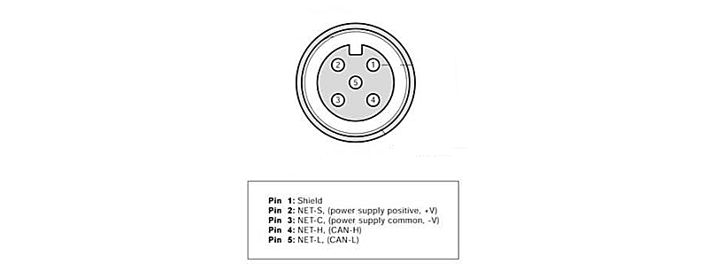
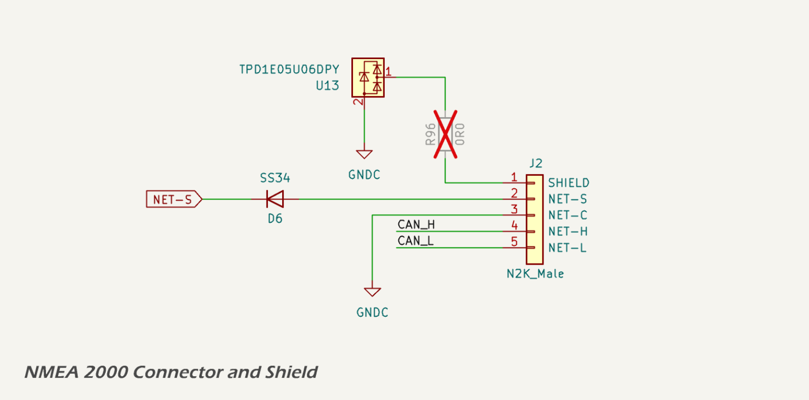

# CAN Bus Interface

All versions of the MDD400 are equipped with an industry-standard CANBUS interface that is fully compatible with [NMEA 2000](https://www.nmea.org/nmea-2000.html) and RV-C backbones. The interface uses a standard 5-pin A-coded DeviceNet connector and is galvanically isolated for improved EMC performance and system reliability.

Key features:

* Galvanically isolated CAN transceiver (ISO1042)
* ESD and surge protection compliant with CISPR 25 and ISO 11452-2
* Fully compliant with NMEA 2000 physical layer specification
* Shielding and filtering designed to eliminate ground loops and radiated noise

For full technical details, see the [CAN Bus](./can_bus.md) section.

---

## Connector

The MDD400 connects to the NMEA 2000 network via a [standard 5-pin A-coded male DeviceNet connector](https://www.maretron.com/wp-content/phpkbv95/article.php?id=443), following the physical layer defined by the NMEA 2000 micro connector specification.

The five pins are assigned as follows:

* **Pin 1 – Shield**: Connected to the cable shield (drain wire). This pin is *not* connected internally on the MDD400 device; it is left unconnected (floating) to comply with NMEA 2000 and CANBUS best practices, which require the shield to be bonded to vessel ground at a single point—typically where power is injected into the backbone.
* **Pin 2 – NET-S**: Power supply positive (+12 V nominal), typically fused and supplied by the NMEA 2000 backbone.
* **Pin 3 – NET-C**: Power supply common (0 V), forming the ground reference for the CAN transceiver and device power input.
* **Pin 4 – NET-H**: CAN high (CAN\_H), the dominant high-level differential signal on the CANBUS.
* **Pin 5 – NET-L**: CAN low (CAN\_L), the dominant low-level differential signal on the CANBUS.

The connector is sealed and keyed to ensure correct mating orientation and environmental protection. The MDD400 device incorporates onboard ESD protection, surge suppression, and filtering for all connector lines, as described in subsequent sections. The ESD protection diode used is the [TPD1E05U06](https://www.ti.com/lit/ds/symlink/tpd1e05u06.pdf).

The cable shield is routed directly to pin 1 of the connector but is *not connected* to the MDD400 ground plane. A test pad and DNP (do not populate) 0 Ω resistor are provided for bench testing or alternate grounding schemes, but are left open in production units. This ensures immunity to ground loops and preserves compliance with the NMEA 2000 recommendation of single-point shield grounding.

The circuit schematic below shows the shield and connector arrangement.

---

## Signal Conditioning

The CAN interface is galvanically isolated and filtered to reduce both emissions and susceptibility to EMI. The filtering stage is shown below.

The CAN\_H and CAN\_L signals pass through the following components prior to reaching the transceiver:

* 15 pF capacitors to local CAN ground (NET-C), providing high-frequency common-mode filtering;
* a 100 pF differential capacitor across CAN\_H and CAN\_L, attenuating differential-mode noise;
* a [Murata ACT45B-510-2P-TL003](https://www.murata.com/en-us/products/productdata/8807038415390/QTN0099C.pdf) common-mode choke, used to suppress high-frequency common-mode interference;
* a [NUP2105LT1G](https://www.onsemi.com/pdf/datasheet/nup2105l-d.pdf) dual transient voltage suppression (TVS) array, providing protection against differential and common-mode voltage transients;
* and a [Texas Instruments ISO1042 CAN transceiver](https://www.ti.com/lit/ds/symlink/iso1042.pdf), which includes integrated galvanic isolation and failsafe features.

This signal conditioning network is designed following guidance from [Texas Instruments](https://www.ti.com/lit/ab/snoaaa1/snoaaa1.pdf) and [Monolithic Power Systems](https://www.monolithicpower.com/en/blog/post/from-cold-crank-to-load-dump-a-primer-on-automotive-transients), and is intended to minimise emissions and maximise immunity to electrical noise.

The CAN\_H and CAN\_L signals are routed as a tightly coupled differential pair with controlled impedance. Routing is kept short and direct between the connector, filtering components, and transceiver to minimise parasitic inductance and reduce discontinuities. Layout techniques avoid unnecessary vias or stubs and prioritise symmetry to preserve signal integrity.

These design measures support compliance with EMC standards such as [CISPR 25](https://www.diodes.com/design/support/cispr-25) and [ISO 11452-2](https://www.iso.org/standard/68557.html), which are applicable to automotive and marine CAN networks.

To maintain galvanic isolation, the CAN transceiver's isolated ground (NET-C) is physically separated from the system ground (GNDREF) using a dedicated ground plane region. A minimum clearance of 2.5–4.0 mm is maintained between the isolated and logic ground planes, consistent with IPC-2221 and marine EMC best practices. This clearance helps ensure the isolation barrier is not compromised by parasitic coupling or leakage currents, and supports the reinforced isolation rating of the ISO1042 transceiver.

---

## Power Supply

The ISO1042 CAN transceiver operates from an isolated 5 V supply on the CAN-side domain (VCAN), referenced to the isolated ground (GND\_C). The schematic is shown below.

Galvanic isolation between the CAN-side and logic-side domains is **recommended** by both the NMEA 2000 and ISO 11898 standards to improve EMC performance, prevent ground loops, and enhance system protection in electrically noisy environments.

* [NMEA 2000 Appendix A - Physical Layer](https://www.nmea.org/Assets/20230331%20nmea%202000%20appendix%20a%20-%20physical%20layer.pdf)
* [ISO 11898-2:2016 - High-speed CAN](https://www.iso.org/standard/66340.html)

The power supply architecture and component selection—including the transformer driver, rectifier, linear regulator, bypass capacitors, and ferrite bead—are fully detailed in the [power supply](../power/vcan.md) section of this design report. Please refer to that page for a complete description of the isolated power generation circuit used to supply VCAN.

All isolated-side filtering components are referenced to GND\_C, while the logic-side domain (3.3 V / GNDREF) remains electrically separated to preserve the transceiver's reinforced isolation.

---

## TTL I/O

The [Texas Instruments ISO1042 CAN transceiver](https://www.ti.com/lit/ds/symlink/iso1042.pdf) is powered on its logic side from the 3.3 V digital supply rail shared with the ESP32. 

Galvanic isolation of the CAN physical layer is achieved using the [ISO1042](https://www.ti.com/lit/ds/symlink/iso1042.pdf) isolated transceiver IC. This device provides 5 kVrms isolation between the controller side and the CAN side. A dedicated 5 V isolated supply, VCAN, is used to power the CAN side.

Logic-level CAN communication is implemented through the TX and RX pins:

* CAN\_TX connects to the transceiver’s TXD pin. A 10 kΩ pull-up resistor ensures a defined idle state and reduces noise susceptibility when the MCU pin is high-Z.
* CAN\_RX is connected to the transceiver’s RXD pin via a 390 Ω series resistor, which limits inrush current, dampens reflections, and protects the ESP32 input from voltage overshoot.

Neither CAN\_TX nor CAN\_RX are strapping pins on the ESP32-S3, ensuring reliable CAN bus behaviour during flashing, reset, and power-up.
