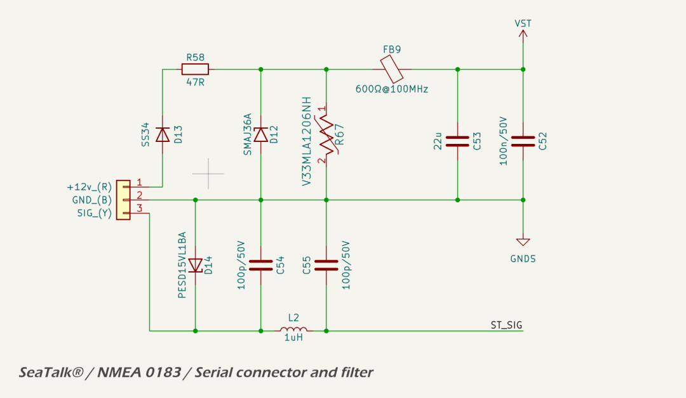
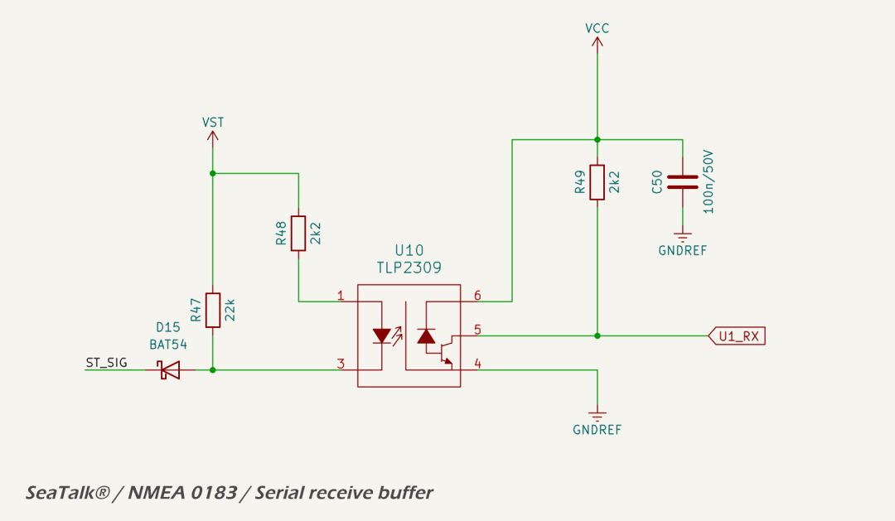
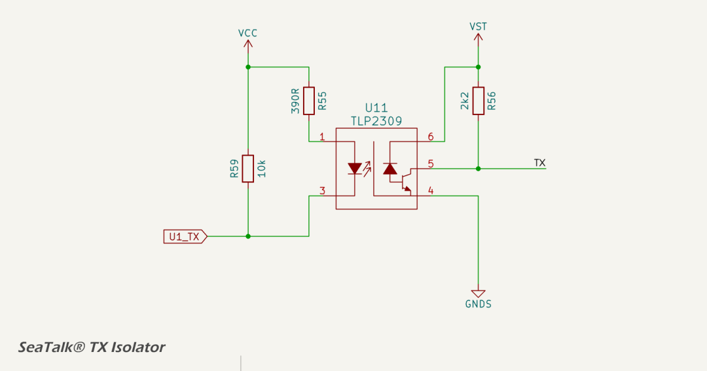
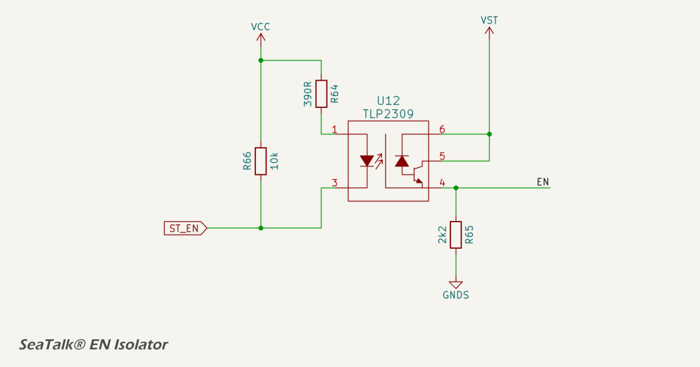
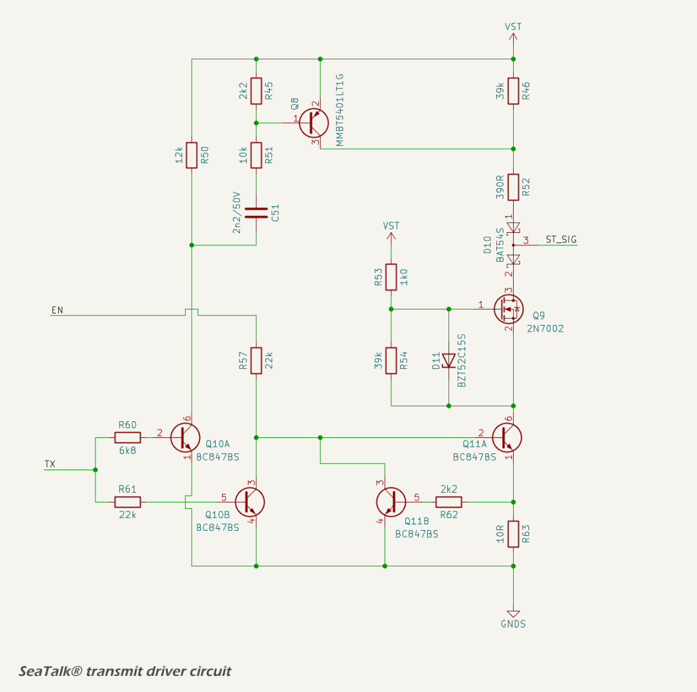

# Legacy Serial Interface

On selected models, the MDD400 includes a plug-and-play serial interface that supports legacy marine protocols such as NMEA 0183 and SeaTalk® I. The interface is designed to be fault-tolerant and electrically safe in the face of reversed wiring, high-voltage transients, and EMI.

Highlights include:

* receive-only support for NMEA 0183 and RS422 talkers;
* half-duplex, single-wire support for SeaTalk® I;
* multi-stage input filtering and protection;
* optional transmission capability with controlled driver gating; and
* EMC-compliant design with safe operation under all 3-pin wiring permutations.

Given the 12 V signaling levels and the lack of galvanic isolation in typical legacy marine installations, the interface is engineered to maintain signal integrity and electromagnetic compatibility (EMC) through robust input filtering, carefully managed ground domains, and multi-stage protection. The entire legacy serial interface is galvanically isolated using opto-isolators for both the receive and transmit paths. This ensures safe operation even in the presence of wiring faults, ground loops, or installation errors, and improves immunity to conducted and radiated EMI.


The legacy interface accepts a single bidirectional signal line (ST\_SIG), which is filtered and protected before being interfaced with the internal logic domain. SeaTalk® operation uses a half-duplex scheme, sharing the line for both transmission and reception. NMEA 0183 operation is receive-only.

## Operation

The interface can operate either as a half-duplex, single-wire SeaTalk® I node (RX/TX), or in NMEA 0183 listener-only mode. The mode and protocol is selected in firmware.

### SeaTalk® I Mode (Single Wire, RX/TX)

SeaTalk® I is a single-wire bus using 12 V signaling, where idle = 12 V, logic 0 = pulled to 0 V. It requires careful coordination between transmit and receive functions. The MDD400 handles this using a half-duplex scheme:

- when not transmitting, the ST_TX line is tri-stated, and the receiver monitors incoming traffic on ST_SIG;
- to transmit, ST_EN is asserted to activate the driver circuitry, pulling ST_SIG low as needed;
- an MCU-controlled TX driver sinks current during transmission and releases the line for receive or idle;
- after transmission, the output drivers are immediately disabled to avoid contention with other devices on the bus; and
- The RX stage remains active continuously and is tolerant of slow signal edges typical of long cable runs.

Timing and contention avoidance are handled in firmware. The circuit allows for reliable operation, even on long or noisy SeaTalk® I networks.

### NMEA 0183 Mode (RX-only)

For NMEA 0183 sources, the MDD400 operates in receive-only mode. The external talker is typically a GPS, depth sounder, or wind instrument.

Although the NMEA standard allows for differential signaling (RS-422), most talkers in the marine environment operate in single-ended mode. This circuit, using an opto-isolator, is compatible with both differential and single-ended talkers. In RS422 and NMEA 0183 differential signaling, the "B" line is typically the inverting signal. When operating in single-ended mode, as used by this interface, ST_SIG should be connected to the "B" line to preserve correct logic polarity. This ensures that a logic 0 on the bus — corresponding to "B" being more positive than "A" — results in an active-low level at the receiver, aligning with the expected behavior of the non-inverting opto-isolated input stage.

Only the receiver of the interface is used in NMEA 0183 mode. The isolated, level-shifted signal is passed to \[U1_RX\] via an opto-isolator. No transmission is attempted, and the ST_EN signal remains low to ensure the transmitter remains disabled.

The [opto-isolated receiver circuit](#receiver) draws approximately 4.5 mA from the signal line when active, equivalent to an input impedance of ~2.7 kΩ. This is within the NMEA 0183 listener specification (≥2 kΩ) and allows multiple such receivers to be paralleled on the same talker output. In RS422 single-ended applications, the loading remains well within the drive capability of standard drivers, supporting multi-listener configurations without signal degradation.

---

## Interface Conditioning and Power

The SeaTalk® / NMEA 0183 interface is conditioned and protected by a front-end circuit that implements electrical filtering, transient suppression, and galvanic isolation from the system logic.



### Isolation

The SeaTalk® / NMEA 0183 domain is referenced to an isolated ground plane (GNDS). This domain is electrically isolated from the main digital ground (GNDREF), with no DC or capacitive coupling on the PCB. This isolation prevents ground loop current and improves immunity to common-mode noise.

The SeaTalk® +12 V power is galvanically isolated from the MDD400 internal power supply. This avoids introducing a second power source and the associated risks of conflicting voltage domains or ground loops. As a result, the MDD400 must be powered exclusively from the NMEA 2000 backbone, and any SeaTalk® devices must receive power independently from the SeaTalk® bus.

There are three connections to the MDD400 microcontroller GPIO pins: UART RX, UART TX and ST_EN (transmit enable). All three connections are galvanically isolated using [TLP2309](https://toshiba.semicon-storage.com/ap-en/semiconductor/product/isolators-solid-state-relays/detail.TLP2309.html) high-speed logic gate opto-isolators.

### ESD, Transient Protection and EMC

Incoming 12 V power from the interface connector is filtered and protected through a power entry stage:

* a Schottky diode provides reverse polarity protection;
* a series resistor limits inrush and surge currents;
* a TVS diode suppresses conducted overvoltage transients, clamping at 58 V;
* a varistor (75 V clamp) provides protection diversity across different transient profiles and enhanced robustness under repeated stress;
* a ferrite bead attenuates high-frequency conducted EMI; and
* local bypassing is provided by bulk and decoupling capacitors.

The signal line from the connector passes through multiple protection and filtering stages:

* an ESD diode (TVS) clamps voltage spikes to the isolated signal ground;
* a capacitor provides RF bypassing close to the connector;
* a low-pass filter formed by a capacitor and inductor attenuates high-frequency noise; and
* a second RF bypass capacitor shunts remaining interference to the local isolated ground.

The signal filter has a calculated cutoff frequency of approximately 700 kHz, providing attenuation of RF noise while preserving the signal integrity of serial communication. The low-pass filter introduces negligible rise-time delay relative to bit durations at standard baud rates. SeaTalk® I and NMEA 0183 operate at 4800 or 9600 baud, well below the cutoff frequency. This filtering approach is compatible with multi-device SeaTalk® I bus configurations, where noise coupling and reflections may otherwise degrade signal quality.

### Physical Connector

The physical interface for legacy serial signals is provided via a 3-pin header:

- Pin 1 (RED): 12 V (power);
- Pin 2 (BLACK): GND; and
- Pin 3 (YELLOW): SIG (SeaTalk® I / NMEA 0183 signal line).

This layout allows for simple three-wire connectivity using a standard SeaTalk® I connector.

In total, there are six possible wiring permutations of the three legacy interface pins (12V, GND, SIG). These are evaluated in the the table below:

*Legacy Connector Wiring Permutations*
<table border="1" cellpadding="6" cellspacing="0">
  <thead>
    <tr>
      <th>Wiring Order</th>
      <th>ST_SIG</th>
      <th>12V_IN</th>
      <th>GND</th>
      <th>Outcome</th>
      <th>Protected?</th>
    </tr>
  </thead>
  <tbody>
    <tr>
      <td>SIG, 12V, GND</td>
      <td>ST_SIG</td>
      <td>12 V</td>
      <td>GND</td>
      <td>✅ Correct connection — normal operation</td>
      <td>✅</td>
    </tr>
    <tr>
      <td>12V, SIG, GND</td>
      <td>12 V</td>
      <td>ST_SIG</td>
      <td>GND</td>
      <td>ST_SIG pulled high — D6A blocks current, input already expects 12 V</td>
      <td>✅</td>
    </tr>
    <tr>
      <td>SIG, GND, 12V</td>
      <td>ST_SIG</td>
      <td>GND</td>
      <td>12 V</td>
      <td>GND applied to 12V_IN — D8 blocks reverse current</td>
      <td>✅</td>
    </tr>
    <tr>
      <td>GND, 12V, SIG</td>
      <td>GND</td>
      <td>12 V</td>
      <td>ST_SIG</td>
      <td>GND on ST_SIG — valid electrical state (LOW), no damage</td>
      <td>✅</td>
    </tr>
    <tr>
      <td>12V, GND, SIG</td>
      <td>12 V</td>
      <td>GND</td>
      <td>ST_SIG</td>
      <td>Same as #2 — signal input sees 12 V, safely blocked by D6A</td>
      <td>✅</td>
    </tr>
    <tr>
      <td>GND, SIG, 12V</td>
      <td>GND</td>
      <td>ST_SIG</td>
      <td>12 V</td>
      <td>GND to ST_SIG — logic LOW input, 12 V on GND blocked by D8</td>
      <td>✅</td>
    </tr>
  </tbody>
</table>

All six possible wiring permutations are electrically safe. There are no failure modes resulting from any pin swap of the 3-pin legacy connector. While incorrect wiring may prevent the interface from functioning (e.g., no data received), no permanent damage will occur to the MDD400 or connected devices. This level of fault tolerance is particularly valuable for field installations and testing scenarios where connector orientation or labeling may not always be foolproof.

---

## Receiver

The receiver is a non-inverting, opto-isolated buffer compatible with SeaTalk® I, NMEA 0183 and RS232/RS422 protocols, as shown in the schematic below.



The receive circuit uses a high-speed logic gate opto-isolator ([TLP2309](https://toshiba.semicon-storage.com/ap-en/semiconductor/product/isolators-solid-state-relays/detail.TLP2309.html)) to provide galvanic isolation between the legacy serial input and the digital logic domain. The signal from the ST\_SIG line passes through a Schottky diode in series with the input, which blocks the local pull-up resistor from loading the shared bus. The line is pulled up to the local rail (VST) via a 22 kΩ resistor. When the external line is driven low, current flows through a 2.2 kΩ current-limiting resistor into the LED side of the opto-isolator. The output stage is non-inverting, preserving the polarity of the incoming signal for direct interpretation by the MCU.

The Toshiba TLP2309 is selected for its low input threshold current and fast switching performance. With VST nominally at 12 V and a worst-case forward drop of 0.45 V across the Schottky diode, the input current through the opto LED is approximately:

```
If = (12 V - 0.45 V - 1.2 V) / 2.2 kΩ ≈ 4.5 mA
```

This is sufficient to ensure reliable turn-on of the TLP2309 LED even with moderate forward voltage variation. The opto is operated well into saturation, ensuring a strong output pull-down on the open-collector transistor.

The output of the opto-isolator is pulled up to VCC (3.3 V) via a 2.2 kΩ resistor and filtered with a 100 nF capacitor. This produces a logic-compatible signal on the MCU receive pin (U1\_RX).

Power domain isolation is maintained by supplying the input side of the opto from VST (legacy side), and the output side from VCC (logic side), with completely isolated grounds. The opto-isolator withstands up to 5000 Vrms isolation voltage and features high common-mode transient immunity.

The input resistor and diode combination ensures that the circuit can tolerate power transients and communication line voltages up to the clamp threshold of the upstream TVS diode, specified at 58 V. The worst-case current into the LED during such transients is limited to:

```
If(max) = (58 V - 1.2 V) / 2.2 kΩ ≈ 25.8 mA
```

This remains well below the absolute maximum continuous forward current rating of the opto LED (30 mA), and is transient in nature. The opto-isolator can safely absorb these short-duration surges without damage.

## Transmitter

For SeaTalk® I, which uses a single bi-directional wire, the MDD400 must also drive the ST_SIG line during transmission. The transmitter consists of three discrete stages: 

* UART TX isolator;
* enable (EN) isolator ; and
* NMOS TX line driver. 

The UART isolator transfers the TX signal from the MCU across the isolation barrier. The EN isolator provides independent gating control, allowing the transmitter to be tri-stated when inactive. These two control signals drive the gate and source of a discrete NMOS transistor, which forms the final line driver. The transistor pulls the signal line low to transmit a logic '0', and is otherwise high-impedance, allowing shared-bus operation with legacy SeaTalk® devices. Slew rate control is implemented via gate resistance and capacitance. 

The TX circuit is disabled by default on startup (ST_EN is HIGH), and must be explicitly enabled by firmware.

### TX Isolator

The TX isolator transfers the UART output signal across the isolation barrier using a TLP2309 opto-isolator, as shown in the schematic below.



The input to the opto-isolator is driven by the MCU TX line through a 10 kΩ pull-up and a 390 Ω series resistor. The 10 kΩ pull-up ensures that the opto is off by default, avoiding spurious transmissions during startup. The 390 Ω resistor limits the forward current through the internal LED when driven low. The V<sub>CC</sub> rail on the logic side is 3.3 V, resulting in approximately 6.7 mA of forward current, well within the saturation range for the device.

On the output side, the phototransistor pulls down the TX node through its open collector when active. A 2.2 kΩ pull-up to the V<sub>ST</sub> supply ensures the line is held high when the opto is off. The output stage operates in saturation for logic '0' and cut-off for logic '1', providing non-inverting buffering. The resulting signal is then passed to the line driver stage.

The use of opto-isolation ensures galvanic separation between the MCU and the external interface, preventing ground loop currents and allowing robust operation in marine environments with potentially noisy or poorly referenced grounds.

### EN Isolator

The EN isolator uses a TLP2309 opto-isolator to buffer the ST\_EN signal across the isolation barrier. This allows the microcontroller to enable or disable the line driver while maintaining galvanic isolation.

The EN Isolator is an inverting buffer with default-disable logic. The line driver is disabled unless the microcontroller explicitly enables it by pulling ST\_EN low. This configuration ensures predictable startup behavior and avoids unintended transmissions during boot.



The input side of the isolator is biased by a 10 kΩ pull-up to VCC and driven low by the microcontroller to activate the internal LED. A 390 Ω current-limiting resistor sets the forward current through the LED. This configuration ensures that the opto-isolator remains off by default, unless actively driven by firmware.

The output stage is an open-collector phototransistor with a 2.2 kΩ pull-down resistor. When the isolator is off, the EN line is pulled low, disabling the line driver. When the LED is forward biased, the phototransistor conducts, pulling the EN line high toward VST.

### NMOS TX Driver

The TX driver circuit implements an isolated, open-drain interface compatible with the SeaTalk® I single-wire serial protocols. It consists of three functional elements:

* a low-side NMOS transistor (Q9) driven by a two-stage buffer (Q10B and Q11A);
* a high-side rise-time assist stage using a PNP transistor (Q8) and timing network; and
* a current-limiting feedback loop using Q11B to protect the gate driver stage.



The TX driver is enabled by a logic-high level on the EN line. When enabled, the output state is controlled by the TX signal (received from the opto-isolated UART TX line).

*Low-Side Gate Driver*

The low-side driver consists of two NPN transistors. Q10B acts as a level shifter and logic inverter driving Q11A, which sinks the gate of the NMOS transistor (Q9) when active. When the TX signal is high (idle), current flows into the base of Q10B via a 24.2 kΩ path, turning it on. This pulls the base of Q11A low, switching it off. With Q11A off, Q9's gate is not pulled low and Q9 remains off. As a result, ST\_SIG floats to VST through a high-value pull-up resistor.

When the TX signal goes low, Q10B turns off, allowing Q11A's base to rise via its own bias network. Q11A turns on, pulling Q9's gate high as current flows through R54, enabling the NMOS to conduct. Q11A also provides a return path from Q9's source to ground, completing the conduction path and pulling ST\_SIG low.

*High-Side Assist Stage*

To accelerate the rising edge of ST\_SIG during low-to-high transitions, the circuit includes a high-side pulse driver consisting of Q10A and Q8. When TX goes high, Q10A turns on and its collector is pulled low. This initiates two current paths:

* a DC path through R50 provides sustained current flow and discharges R51 between transitions; and
* an AC-coupled path through R45, R51, and C51 briefly turns on Q8 as C51 charges.

Q8 sources current from VST through R52 into the ST\_SIG line, providing a sharp rising edge to quickly restore the bus to idle. Once C51 charges, Q8 turns off and the line remains passively pulled up.

The 1 nF capacitor C51 and 12 kΩ discharge path via R50 has a time constant of approximately 12 µs. This ensures the capacitor fully discharges between transitions at baud rates up to around 36 kbps, comfortably supporting SeaTalk® I (4800 bps).

*Feedback Current Limiting*

When Q11A conducts, current flows through R63 to ground. As the voltage across R63 rises, Q11B turns on and sinks current from Q11A's base, reducing its drive and limiting the collector current. This feedback loop prevents excessive current through Q11A and Q9 during active-low output states.

The combined effect of these stages is a robust, actively driven open-drain TX interface with controlled transition edges, power-up fail-safe behavior, and compatibility with legacy single-wire serial protocols.

---

