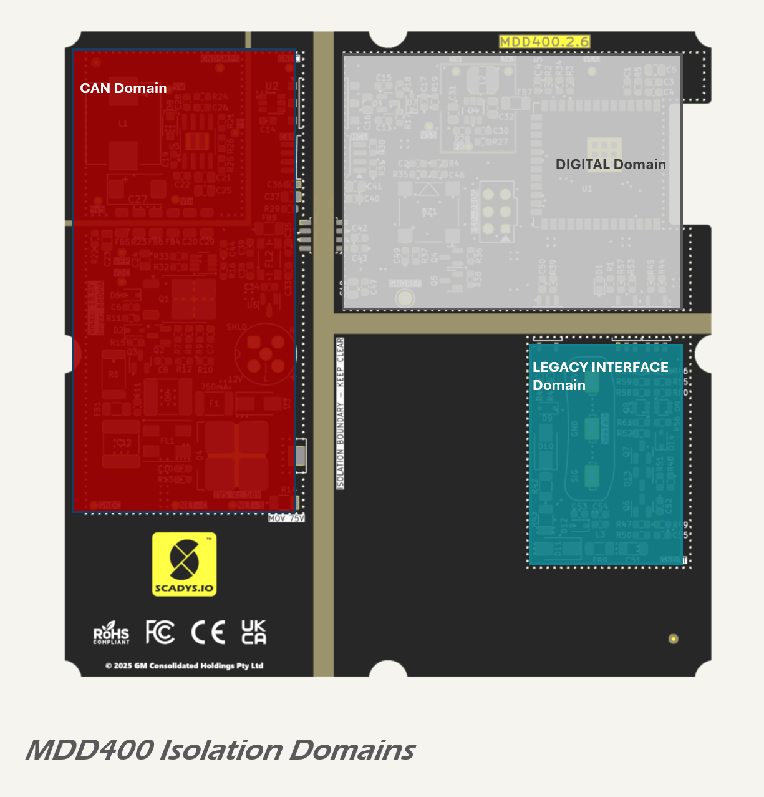

# Galvanic Isolation

The board implements galvanic isolation between the following domains:

* CAN and DIGITAL domains: via a 5 V push-pull transformer driver and coupled transformer and isolated CAN transceiver;
* LEGACY INTERFACE and DIGITAL domains: opto-isolated RX, TX and EN signals.

These interfaces are electrically and physically separated, ensuring that faults or transients on external wiring do not couple into sensitive control circuitry.

The CAN side includes a local 5.5 V isolated DC-DC converter, which powers the CAN side (VCC1) of the ISO1042 transceiver. A separate transformer-isolated supply, implemented using the [SN6505B](https://www.ti.com/lit/ds/symlink/sn6505a.pdf) transformer driver and [Würth 760390012](https://www.we-online.com/components/products/datasheet/760390012.pdf) coupled inductor, transfers 5 V power across the isolation barrier to the DIGITAL domain. On the secondary side, the 5 V rail (VSS) supplies the LCD display, buzzer, and a 3.3 V DC-DC converter that powers the logic side (VCC2) of the CAN transceiver and the main digital system. The transformer output is rectified by a [PMEG4005CT Schottky diode](https://lcsc.com/datasheet/lcsc_datasheet_2410010202_Nexperia-PMEG4005CT-215_C552889.pdf), filtered using a combination of RF bypass capacitors and resistive damping, and protected by an output clamp diode (PESD5V0L1BA) to suppress transients.

Data lines cross the isolation boundary via an ISO1042 galvanically isolated CAN transceiver.

The LEGACY INTERFACE domain is also isolated from the DIGITAL domain by three [TLP2309](https://lcsc.com/datasheet/lcsc_datasheet_2410010231_TOSHIBA-TLP2309-TPL-E_C85066.pdf) opto-isolators—used for RX, TX, and TX enable signalling. The opto-isolators are powered according to their respective signal direction: the RX path requires no external power on the legacy side, with the LED side of the opto driven directly by the ST\_SIG line, while the digital side is powered from the 3.3 V (VCC) rail; the TX and EN paths are used only for SeaTalk® transmission and are powered from the 12 V supply provided by the SeaTalk® I connector.

Further details on the legacy interface circuitry, including receiver and transmitter stages, are provided in the [Serial Interface](../communications/serial.md) section.

## Isolation Barriers and Spacing

Clearance between copper pours on opposing domains is maintained at >6 mm, and the isolation gap between polygons is free of any signal routing, via stitching, or solder mask. This spacing exceeds the clearance and creepage requirements for 500 V RMS isolation under [IEC 62368-1](https://webstore.iec.ch/en/publication/69308), assuming Pollution Degree 2 and Material Group III (FR4). The absence of solder mask within the barrier gap prevents surface tracking and improves long-term reliability when combined with post-reflow cleaning or conformal coating.

Creepage across the bare FR4 surface also measures approximately 6 mm, supporting functional isolation up to 250–300 V RMS in typical industrial or marine environments. For additional robustness, a conformal coating may be applied during production to enhance surface insulation and protect against moisture or ionic contamination.

While the product does not include an exposed metal chassis, PCB layout assumes a sealed enclosure and no accessible conductive surfaces. As such, isolation is implemented between circuits but not to user-accessible touch limits.

The layout strategy ensures:

* that energy from transients or EMC injection on external interfaces cannot propagate to the digital domain;
* that external grounds cannot couple noise into sensitive logic circuitry; and
* that the design meets safety and EMC best practices for floating bus systems.

<!-- # Galvanic Isolation

The board implements galvanic isolation between the following domains:

* CAN and DIGITAL domains: via a 5 V push-pull transformer driver and coupled transformer and isolated CAN transceiver;
* LEGACY INTERFACE and DIGITAL domains: opto-isolated RX, TX and EN signals.

These interfaces are electrically and physically separated, ensuring that faults or transients on external wiring do not couple into sensitive control circuitry.

The CAN side includes a local 5.5 V isolated DC-DC converter, which powers the CAN side (VCC1) of the ISO1042 transceiver. A separate transformer-isolated supply, implemented using the [SN6505B](https://www.ti.com/lit/ds/symlink/sn6505a.pdf) transformer driver and [Würth 760390012](https://www.we-online.com/components/products/datasheet/760390012.pdf) coupled inductor, transfers 5 V power across the isolation barrier to the DIGITAL domain. On the secondary side, the 5 V rail (VSS) supplies the LCD display, buzzer, and a 3.3 V DC-DC converter that powers the logic side (VCC2) of the CAN transceiver and the main digital system. The transformer output is rectified by a [PMEG4005CT Schottky diode](https://lcsc.com/datasheet/lcsc_datasheet_2410010202_Nexperia-PMEG4005CT-215_C552889.pdf), filtered using a combination of RF bypass capacitors and resistive damping, and protected by an output clamp diode (PESD5V0L1BA) to suppress transients.

Data lines cross the isolation boundary via an ISO1042 galvanically isolated CAN transceiver.

The LEGACY INTERFACE domain is also isolated from the DIGITAL domain by three [TLP2309](https://lcsc.com/datasheet/lcsc_datasheet_2410010231_TOSHIBA-TLP2309-TPL-E_C85066.pdf) opto-isolators—used for RX, TX, and TX enable signalling. These devices are powered from a separate 8 V supply (VST), derived from the same 5.3 V rail via a dedicated linear regulator and with its own isolated ground (GNDST).

Further details on the legacy interface circuitry, including receiver and transmitter stages, are provided in the [Serial Interface](../communications/serial.md) section.

## Isolation Barriers and Spacing

Clearance between copper pours on opposing domains is maintained at >6 mm, and the isolation gap between polygons is free of any signal routing, via stitching, or solder mask. This spacing exceeds the clearance and creepage requirements for 500 V RMS isolation under [IEC 62368-1](https://webstore.iec.ch/en/publication/69308), assuming Pollution Degree 2 and Material Group III (FR4). The absence of solder mask within the barrier gap prevents surface tracking and improves long-term reliability when combined with post-reflow cleaning or conformal coating.

Creepage across the bare FR4 surface also measures approximately 6 mm, supporting functional isolation up to 250–300 V RMS in typical industrial or marine environments. For additional robustness, a conformal coating may be applied during production to enhance surface insulation and protect against moisture or ionic contamination.

While the product does not include an exposed metal chassis, PCB layout assumes a sealed enclosure and no accessible conductive surfaces. As such, isolation is implemented between circuits but not to user-accessible touch limits.

The layout strategy ensures:

* that energy from transients or EMC injection on external interfaces cannot propagate to the digital domain;
* that external grounds cannot couple noise into sensitive logic circuitry; and
* that the design meets safety and EMC best practices for floating bus systems.

 -->
