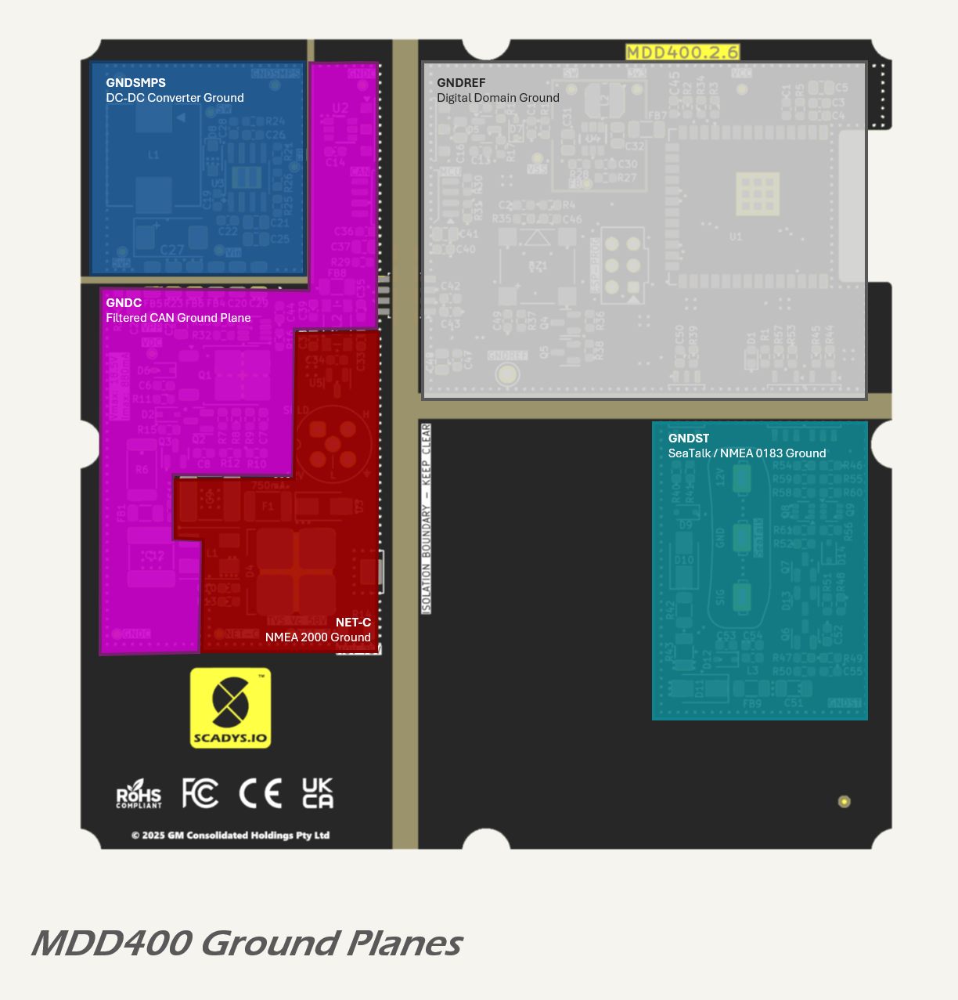

# Layout

The MDD400 PCB layout is divided into multiple functional zones, with a focus on separation between power domains, digital logic, and isolated communication interfaces. The placement strategy is optimised for EMC performance, thermal management, and manufacturability.

# Functional Zones

The board follows a compartmentalised structure, as shown below.

Each functional block is grouped into a defined physical region of the board:

* the left side of the board, around the NMEA 2000 connector, includes the unregulated input protection circuit (NET-S), providing ESD transient (load dump) and overcurrent protection,
* at the top of the PCB are the power supply functions, from left to right: 5.5 V DC-DC converter (VDC to VPP), 5 V isolation transformer(VPP to VSS, across the isolation barrier) and 3.3 V DC-DC converter ( VSS to VCC);
* the isolated CAN bus transceiver is located directly below the 5 V isolation transformer, also across the isolation barrier;
* the central area contains the 5 V domain, including the LCD interface and audio buzzer drive;
* the right-hand side hosts the 3.3 V digital domain, which includes the MCU and sensor interfaces; and
* the lower right section contains the SeaTalk / NMEA 0183 legacy serial interface.

## Ground Plane Arrangement

The internal copper layers are solid ground planes, providing unbroken low-impedance return paths for all routed signals on the outer layers. Each ground domain is implemented as a separate polygon, with isolation distances maintained throughout. These domains are (clockwise, starting at NMEA 2000 connector):

* `NET-C`: NMEA 2000 reference ground;
* `GNDC`: filtered ground for the CAN interface;
* `GNDSMPS`: local ground for the 5.5 V DC-DC converter;
* `GNDST`: isolated ground for the legacy serial interface; and
* `GNDREF`: digital and analog logic domain ground.

The ground plane arrangement is illustrated below.

Where inter-domain connections are required (e.g., GNDC to GNDSMPS), they are made via controlled impedance ferrite beads and accompanied by high-frequency filter capacitors.

