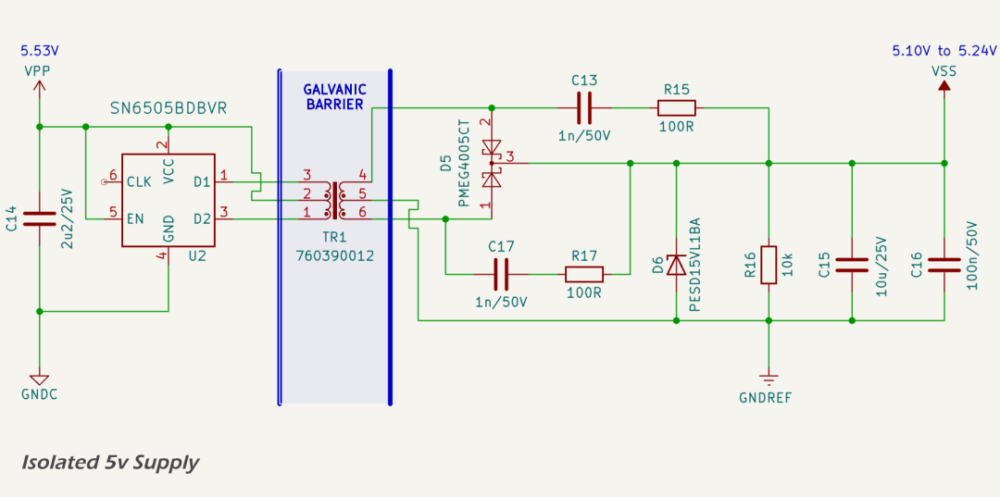

# Isolated 5V Domain

The VSS power domain provides 5 V isolated power to all digital subsystems on the MDD400. This domain is sourced from the 5.53 V NMEA 2000 input supply (VPP) via a transformer-based isolation circuit. The isolation stage uses a push-pull topology driven by an [SN6505B](https://www.ti.com/lit/ds/symlink/sn6505a.pdf) transformer driver and a 1:1 [Würth 760390012](https://www.we-online.com/components/products/datasheet/760390012.pdf) transformer, followed by [PMEG4005CT](https://lcsc.com/datasheet/lcsc_datasheet_2410010202_Nexperia-PMEG4005CT-215_C552889.pdf) Schottky rectification, filtering, and ESD/transient protection. The resulting VSS rail ranges from approximately 5.24 V at minimum load to 5.10 V at full load.

Typical loading on the VSS rail consists of:

* a 3.3 V DC-DC converter supplying internal digital logic, with a typical input current of approximately 63 mA (90 mA × 3.3 V / (5.15 V × 96%)) and a peak input current of \~17 mA;
* a DWIN LCD capacitive touch display, drawing approximately 245 mA at full brightness; and
* a piezoelectric buzzer, with negligible average current draw.

The total typical VSS current draw is therefore around 308 mA, with a peak load of approximately 330 mA. The VSS rail is not regulated post-isolation, but is buffered with a 10 µF + 100 nF ceramic output filter and additional local decoupling at the display and SMPS inputs. The SMPS includes its own 10 µF MLCC input capacitor, and the display includes 10 µF + 100 nF MLCCs at its VDD input.

Voltage ripple and sag under full load remain within acceptable bounds, and layout guidelines for ground return and power distribution are followed to minimise EMI. The isolated 5 V domain supports all internal digital subsystems while maintaining galvanic isolation from the CAN backbone.

