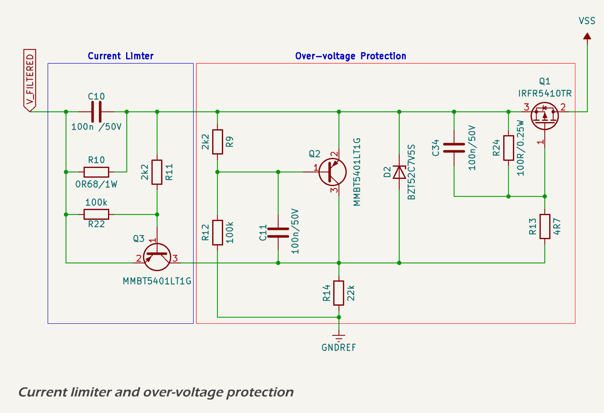

# Surge Stopper Circuit

The over-voltage and current-limiting functionality is implemented using a discrete surge stopper circuit built around a P-channel MOSFET, two bipolar junction transistors (BJTs), and a high-side shunt resistor.

The [MMBT5401](https://lcsc.com/datasheet/lcsc_datasheet_2409302135_onsemi-MMBT5401LT1G_C21488.pdf) PNP transistors selected to sense current and voltage and drive the MOSFET gate have a Vce of 150 V and a maximum Ice of 600 mA, improving reliability under high dV/dt switching conditions and providing a fast turn-off transition for the MOSFET. This ensures that both over-voltage and over-current protections activate swiftly and effectively.

The [IRFR4510](https://www.infineon.com/assets/row/public/documents/24/49/infineon-irfr4510-datasheet-en.pdf) P-channel MOSFET has a maximum continuous drain current of 45 A (252 A pulse tolerance) and a maximum power dissipation of 143 W. It.s maximum drain-source voltage of 100 V is consistent with the up-stream TVS clamping voltage of 58 V.

## Over-voltage Limiter

The over-voltage cutoff is defined by a resistive voltage divider connected to the input rail. When the divided voltage exceeds the base-emitter threshold of a monitoring PNP transistor (approximately 0.6–0.7 V), the transistor begins conducting. This pulls the gate of the IRFR4510 P-channel MOSFET upward, switching it off and disconnecting the load. The resistor values are selected to yield a trip point of approximately 18.5 V, sufficient to protect all downstream regulators and components from accidental overvoltage conditions.

A snubber circuit composed of a 100 Ω resistor and 100 nF capacitor is placed across the MOSFET's drain-source terminals. This network suppresses high-frequency ringing and voltage overshoot caused by fast switching events, protecting the MOSFET and improving electromagnetic compatibility (EMC).

A simulated [ISO 7637-2](https://www.iso.org/standard/50925.html) Pulse 5b transient (150 V peak, 80 ms decay) was applied to the input. When the input exceeds the 18.5 V trip threshold, the gate voltage begins rising rapidly through the 4.7 Ω gate resistor and 100 nF equivalent capacitance. Once the gate voltage crosses the MOSFET’s Vgs(off) threshold (approximately –2 V), the device switches off, and the output is suppressed to near zero. The simulated response confirms that the MOSFET turns off within microseconds of the over-voltage condition, limiting downstream exposure and avoiding stress to the 65 V-rated DC-DC controller and other sensitive circuitry.

The system automatically recovers when the fault condition clears, ensuring seamless protection without requiring external intervention. The combination of fast over-voltage clamping and passive TVS diodes ensures that the MOSFET does not switch unnecessarily during brief or moderate surge events.

The circuit also incorporates hysteresis, which prevents the MOSFET from oscillating on and off near the trip point. When the MOSFET switches off due to an over-voltage event, the load is disconnected and the voltage at the upper leg of the voltage divider rises slightly, maintaining the transistor in conduction. The MOSFET only re-enables once the input voltage falls well below the trip threshold, ensuring stable operation during slow-falling or noisy input conditions.

## Current Limiter

The current-limiting function is based on a 0.68 Ω high-side shunt resistor. A second PNP BJT monitors the voltage across the shunt. When the voltage drop exceeds ~0.68 V (corresponding to ~1.0 A), the transistor turns on and pulls up the MOSFET gate, disabling the load path. This mechanism protects the regulator and filter stages from sustained overcurrent events such as short circuits or excessive inrush. A pull-down resistor is used to ensure that the transistor remains off under normal conditions, preventing false triggering due to noise.
