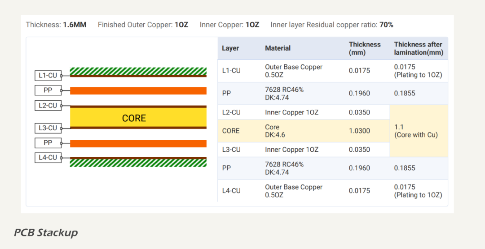

# Stackup

The MDD400 uses a four-layer PCB construction, organized to support high-speed digital signals, low-noise analog sensing, and isolated communication domains. The stackup is optimised for signal integrity, suppression of radiated emissions, and power distribution.

### Layer Arrangement

The layer arrangement is as follows:

| Layer         | Function                                |
| ------------- | --------------------------------------- |
| Top Layer     | Signal traces with power as copper pour |
| Inner Layer 1 | Ground plane                            |
| Inner Layer 2 | Ground plane                            |
| Bottom Layer  | Signal traces with power as copper pour |

### Dielectric Structure

The layer stackup is shown below.

* Top to Inner 1: 185.5 µm FR4 prepreg
* Inner 1 to Inner 2: 1100 µm FR4 core
* Inner 2 to Bottom: 185.5 µm FR4 prepreg

All copper layers are 35 µm (1 oz) on internal planes and 17.5 µm (0.5 oz) on outer layers prior to plating.

### Stackup Rationale

Placing solid ground on both internal layers ensures:

* low loop inductance for surface traces;
* robust return paths for high-speed signals on the top and bottom layers;
* strong shielding against radiated emissions from routed signals;
* minimal power-to-ground impedance when VCC is poured and bypassed on the outer layers.

This arrangement allows the ground planes to serve as return paths for signal current across all domains, while avoiding segmentation that could introduce noise coupling or radiated emissions.

### Capacitance Between Planes

The MDD400 design takes advantage of embedded capacitance between copper pours on the top/bottom (VCC) and the adjacent internal ground plane (GNDREF). 

The characteristics of the capacitive area are:

* Area: approx. 2,500 mm² (active VCC pour)
* Dielectric thickness: 185.5 µm
* Dielectric constant (FR4): εr ≈ 4.5

Estimated parallel plate capacitance is approximately 538 pF, providimg distributed HF decoupling in parallel with the discrete MLCC network. The VCC copper pours are via stitched at all load connections and with via grids to maximise interplane coupling and reduce impedance.

### Surface Finishes

All exposed copper features on the MDD400 PCB use ENIG (Electroless Nickel Immersion Gold) surface finish, providing:

* excellent solderability and flatness for fine-pitch SMD parts;
* protection against copper oxidation during storage and rework;
* reliable contact for edge connectors and exposed test pads.

Solder mask is applied over all outer layers except for pads and vias designated as exposed. The mask material is liquid photoimageable (LPI) solder resist, with a nominal thickness of 12 µm. Solder mask colour varies by build:

* green: used for proof-of-concept prototypes (version 1.x);
* blue: used for early hand-soldered prototypes; and
* black: used for production units fabricated using pick-and-place and reflow.

Mask clearance and dam spacing are designed per IPC-SM-840 Class H guidelines.

No solder mask is applied over the isolation barrier area, ensuring maximum surface clearance and avoiding moisture entrapment or capacitive coupling between domains.

### Outer Layer Pours

* VCC is poured on the top and bottom layers throughout the `DIGITAL` Domain, connected to the internal ground planes via stitching capacitors (10 µF + 100 nF typical).
* GNDREF is poured on top and bottom in analog and logic regions and connected via via stitching to the ground planes.

The use of signal routing on the outer layers allows placement flexibility and component breakout while maintaining short return paths through the adjacent ground planes. Sensitive analog traces are routed over quiet ground regions with direct via access to the internal plane.

The resulting structure ensures low EMI emission, strong decoupling, and good power integrity across all logic and analog subsystems.
