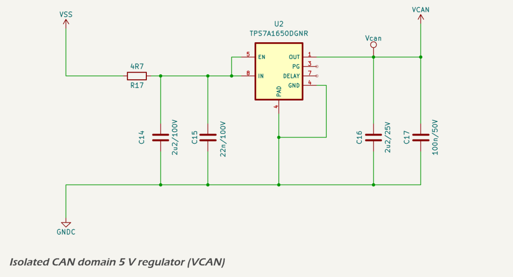

# Isolated 5 V CAN Domain (VCAN)

## Design Criteria

The VCAN domain supplies regulated 5 V power to the isolated side of the CAN and I²C interfaces. This includes the CAN transceiver, isolated I²C buffer, and an isolated current/voltage sensor. All of these devices are referenced to the CAN ground domain (GNDC) and are fully isolated from the digital/MCU domain.

The supply is derived from the protected (nominal) 12 V supply from the NMEA 2000 backbone (VSS). While the NMEA 2000 standard allows operation to 15 V maximum, the MDD400 will operate normall with a supply between 8 V and 24.8 V. A linear regulator was selected due to the low current draw of the isolated circuitry and the need to avoid switching noise in the CAN domain. Key requirements include:

* provide a stable 5.0 V rail for all isolated-side devices;
* operate over the full VSS voltage range (8–24.8 V);
* maintain low noise suitable for CAN transceivers and I²C analog front-ends; and
* deliver sufficient thermal margin under worst-case input and ambient conditions.

## Circuit Description

The regulator is based on the [Texas Instruments TPS7A1650DGNR](https://www.ti.com/lit/ds/symlink/tps7a16.pdf), a 500 mA low-noise, high-voltage linear LDO. It is configured for always-on operation by tying the EN pin directly to VIN. The PG and DELAY pins are left floating, as the regulator is not monitored or sequenced across the isolation barrier.

The input filter includes a 2.2 µF 100 V MLCC in parallel with a 22 nF high-frequency bypass capacitor. The output uses a 2.2 µF 25 V MLCC in parallel with a 100 nF bypass, as recommended for low-noise regulation and load stability. All capacitors are ceramic X7R dielectric.

No additional protection components are required on the LDO output, as the connected devices do not present any backfeed path or alternate source of power. Output capacitance is low, and the input is fully protected against reverse polarity and transient overvoltage upstream.

## Loads and Current Budget

The following isolated devices are supplied by the VCAN regulator:

* [ISO1042](https://www.ti.com/lit/ds/symlink/iso1042.pdf) isolated CAN transceiver: max 4.5 mA;
* [ISO1541](https://www.ti.com/lit/ds/symlink/iso1541.pdf) isolated I²C buffer: max 2.9 mA; and
* [INA219](https://www.ti.com/lit/ds/symlink/ina219.pdf) current/voltage sensor: max 1 mA.

Total current draw is approximately 5 mA typical, with a maximum of ~9 mA. This is well within the TPS7A1650's rated capacity of 500 mA.

## Thermal Performance

Under typical operating conditions, the MDD400 functions as a receive-only CAN device powered from a nominal 12 V NMEA 2000 supply. In this mode, the total current draw from the VCAN regulator is approximately 4.8 mA, including the ISO1042 transceiver, ISO1541 buffer, and INA219 sensor. At 12 V input, this results in a typical LDO power dissipation of 33.6 mW. At worst-case load (9 mA) and maximum input voltage (24.8 V), the power dissipation is 177 mW. 

The SOT-23 (DGK) package has a thermal resistance of ~127 °C/W, yielding a junction temperature rise of ~22.5 °C when dissipating 177mW. Even at 85 °C ambient, the device operates well within thermal limits.

## Components

The following components were selected to meet performance and thermal requirements:

* regulator IC: [Texas Instruments TPS7A1650DGNR](https://www.ti.com/lit/ds/symlink/tps7a16.pdf), 8 V to 60 V input, 5 V fixed output;
* input capacitor: 2.2 µF 100 V X7R MLCC + 22 nF 100 V X7R MLCC;
* output capacitor: 2.2 µF 25 V X7R MLCC + 100 nF 50 V X7R MLCC.

## Layout Considerations

The VCAN regulator is placed entirely within the isolated CAN domain, referenced to GNDC. Short trace lengths are used for both input and output paths, with a dedicated local ground pour for thermal and electrical performance.

Minimal output capacitance and tightly coupled input/output return paths ensure low EMI and fast transient settling, supporting reliable operation of the CAN transceiver and analog interfaces.

---

## References

1. Texas Instruments, [TPS7A16 Datasheet](https://www.ti.com/lit/ds/symlink/tps7a16.pdf)
2. Texas Instruments, [ISO1042 Datasheet](https://www.ti.com/lit/ds/symlink/iso1042.pdf)
3. Texas Instruments, [ISO1541 Datasheet](https://www.ti.com/lit/ds/symlink/iso1541.pdf)
4. Texas Instruments, [INA219 Datasheet](https://www.ti.com/lit/ds/symlink/ina219.pdf)
