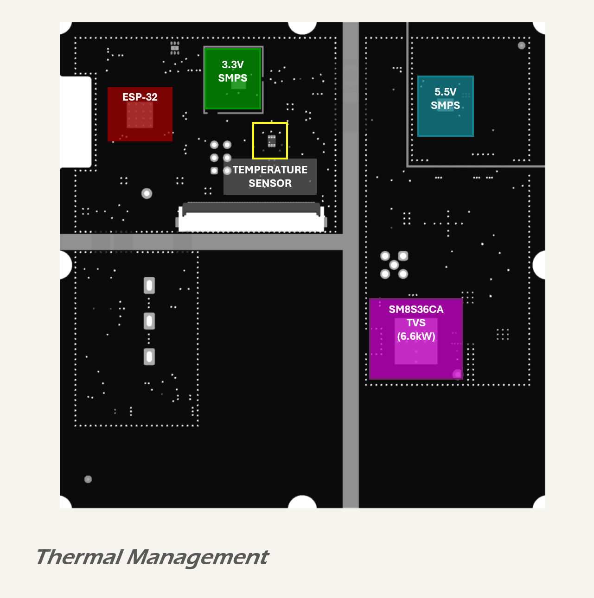

# Thermal Management

## Overview and Strategy

Thermal management in the MDD400 design follows a passive strategy supported by high-efficiency converters, thermal vias, and localised temperature monitoring. The goal is to maintain component junction temperatures within safe operating limits across the expected ambient temperature range.

### Standards and Thermal Conditions

Analysis is based on the following assumptions:

* ambient air temperature up to 60 °C for typical operating conditions in enclosed marine installations;
* a design test ambient of 85 °C to represent worst-case thermal exposure in direct sunlight (per [IEC 60068-2-2](https://webstore.iec.ch/en/publication/62437) and [JESD51-2](https://www.jedec.org/document_search?search_api_views_fulltext=JESD51-2) environmental stress standards);
* temperature rise due to self-heating derived from individual power dissipation and copper connectivity;
* component thermal derating per JEDEC guidelines, notably [JESD51-2](https://www.jedec.org/document_search?search_api_views_fulltext=JESD51-2) and JESD51-7;
* thermal performance referenced to 1 oz copper and 1.6 mm PCB thickness unless otherwise specified.

The 85 °C ambient test condition is used for thermal characterisation and certification, simulating surface heating of a black enclosure exposed to solar radiation. Temperature monitoring via the onboard sensor allows the firmware to implement protective thermal management strategies under such conditions.

### PCB Construction and Heat Flow

The MDD400 uses a four-layer PCB as detailed in the [stackup section](../circuit-pcb/stackup.md), with:

* top and bottom signal layers containing copper pours for power distribution;
* dual internal ground planes (GNDREF and GNDC) providing low-impedance return paths and shielding;
* via stitching between surface copper and internal planes for both ground and power pours;
* ENIG surface finish on all copper features.

This construction supports distributed decoupling, reduced EMI, and effective thermal conductivity vertically through the board.

### Heat Dissipation Strategy

All high-power devices are placed to maximise exposure to surrounding copper and minimise thermal coupling to temperature-sensitive components. Devices such as the ESP32 MCU, power converters, and transient protection components are mounted on copper regions stitched to the internal planes and to exposed copper regions on the bottom layer.

Via arrays are provided under or adjacent to:

* the 3.3 V and 5.5 V SMPS devices;
* the ESP32 processor;
* the SMBJ36CA TVS diode; and
* the power transformer in the isolated CAN supply.

These vias conduct heat from the component thermal pads to the bottom copper for convective dissipation and reduce hotspot formation.

### Temperature Monitoring

An [TMP112](https://www.ti.com/lit/ds/symlink/tmp112.pdf) digital temperature sensor is located on the top layer, near the ESP32 and 3.3 V SMPS, and thermally coupled to nearby copper. This sensor enables real-time monitoring of local board temperature and provides data for firmware-driven thermal throttling or alerting if required.

