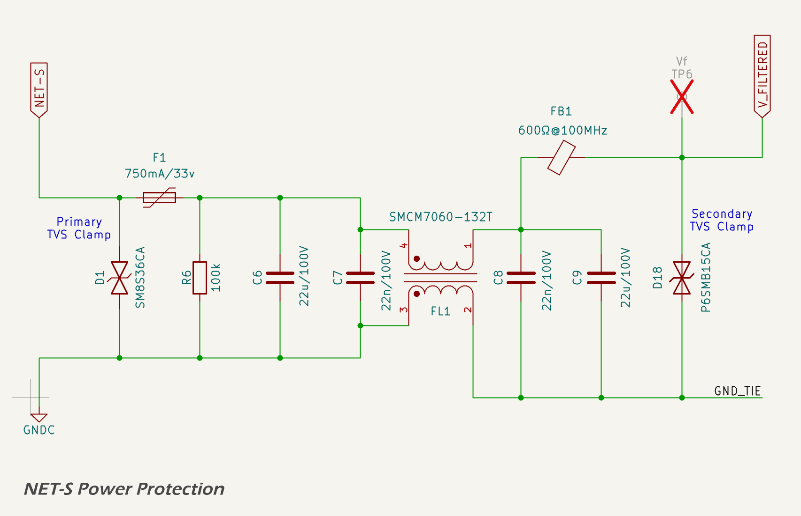

# Power Supply Protection And Filtering

## Overview And Design Criteria

The electrical environment aboard small vessels shares many characteristics with automotive systems, but with greater variation and typically less standardisation. Marine electrical systems may incorporate multiple battery banks — often with separate cranking and house systems — and are increasingly adopting lithium chemistries such as LiFePO₄. It is not uncommon for vessels to include 24 V or 48 V subsystems or to operate some loads from inverter-generated AC power.

Despite this variability, the communication and sensor networks relevant to the MDD400 are standardised to operate from nominal 12 V supplies. The [NMEA 2000](https://www.nmea.org/nmea-2000.html) backbone, as well as legacy protocols such as SeaTalk and NMEA 0183, are all 12 V-based. These systems are generally unregulated, powered by user-installed cabling, and often exposed to transients caused by inductive loads, battery switching, or alternator events. The MDD400 must tolerate these conditions while maintaining safe operation of downstream circuitry.

Designing for this environment requires careful attention to both transient suppression and steady-state fault protection. The MDD400 input protection circuit is modelled on best practices from automotive design, particularly those outlined in <a href="https://www.iso.org/standard/50925.html">ISO 7637-2</a>. While this standard is not mandatory in marine applications, it provides a useful baseline for evaluating and simulating real-world transient events.

The MDD400’s power input protection strategy is defined by the design criteria in the table below, reflecting expected conditions on small vessel 12 V systems. These criteria guided the selection and simulation of each protection stage. A coordinated arrangement of clamping, filtering, and current-limiting components has been implemented to ensure protection against common-mode and differential transients, with staged elements that absorb and suppress voltage and current surges without nuisance tripping under normal high charging voltages (up to 14.8 V). The protection stages also account for both the high peak voltages and energy content associated with load dump conditions.

<table border="1" cellpadding="6" cellspacing="0">
  <thead>
    <tr>
      <th>Protection Function</th>
      <th>Design Criteria</th>
    </tr>
  </thead>
  <tbody>
    <tr>
      <td>Reverse Polarity</td>
      <td>Survive continuous reverse connection of ±12 V No damage; automatic recovery</td>
    </tr>
    <tr>
      <td>Load Dump and Surge Clamping</td>
      <td>Survive <a href="https://www.iso.org/standard/50925.html">ISO 7637-2</a> Pulse 5b (150 V, 400 ms exponential decay) Limit to &lt; 60 V at the switching node</td>
    </tr>
    <tr>
      <td>ESD Protection</td>
      <td>Tolerate ±15 kV air discharge per <a href="https://webstore.iec.ch/en/publication/68954">IEC 61000-4-2</a></td>
    </tr>
    <tr>
      <td>Over-voltage Limiting</td>
      <td>Disconnect load above 18.5 V Reconnect below 18.5 V without latch-up</td>
    </tr>
    <tr>
      <td>Current Limiting</td>
      <td>Limit current to ~1.0 A Tolerate sustained overloads without damage</td>
    </tr>
    <tr>
      <td>EMC Filtering</td>
      <td>Suppress conducted emissions above 1 MHz; limit conducted noise to &lt; 100 mV p-p Contain radiated emissions to meet <a href="https://www.ecfr.gov/current/title-47/chapter-I/subchapter-A/part-15">FCC Part 15</a> and <a href="https://webstore.iec.ch/publication/24377">EN 55032 Class B</a> limits</td>
    </tr>
  </tbody>
</table>

These functions are implemented discretely to reduce cost, improve component availability, and allow field observability. Where appropriate, the design includes thermal protection and is engineered to fail safe under fault conditions.

The sections that follow describe each function in detail.

## Reverse Polarity Protection and Shield

The 12 V input from the [NMEA 2000](https://www.nmea.org/nmea-2000.html) connector is protected from reverse polarity using a discrete Schottky diode.

A MOSFET-based reverse protection scheme was considered but not adopted. The primary justification for using a simple diode is the presence of generous headroom in the input voltage range (nominal 12 V vs. 5 V and 3.3 V regulated rails), which makes the forward voltage drop acceptable. Diode protection offers simpler implementation, lower component cost, and greater resilience to fault modes such as latch-up or shoot-through.

The primary component is the [SS34](https://lcsc.com/datasheet/lcsc_datasheet_2310100931_MSKSEMI-SS34-MS_C2836396.pdf) (DO-214AC/SMA package), which provides reliable protection against reverse connections while introducing minimal voltage drop in normal operation:

* Maximum Reverse Voltage (VRRM): 40 V
* Average Forward Current (IF(AV)): 3.0 A
* Surge Current Rating (IFSM, 8.3 ms): 100 A
* Typical Forward Voltage Drop (VF @ 1 A): ~0.5 V
* Reverse Leakage Current: ~0.5 mA at 40 V

This approach ensures automatic recovery from incorrect wiring and protects downstream circuitry by blocking reverse current. The forward voltage drop is acceptable given the headroom available between the 12 V input and the downstream regulators.

Under reverse polarity conditions, the Schottky diode blocks current flow entirely, and no reverse current is conducted.

A TVS diode is also placed between the SHIELD pin of the NMEA 2000 connector and chassis ground. This diode is normally unpopulated and included for test and development purposes. It uses the [TPD1E05U06](https://www.ti.com/lit/ds/symlink/tpd1e05u06.pdf), a low-capacitance ESD protection diode with excellent clamping performance.

## ESD and Load Dump

The schematic below shows the full protection circuit for the NET-S input, including a primary TVS diode, PTC fuse, filtering components, and secondary clamping at the downstream side.

A [JK-mSMD075-33 resettable fuse (PTC)](https://lcsc.com/datasheet/lcsc_datasheet_2304140030_Jinrui-Electronic-Materials-Co--JK-mSMD075-33_C369169.pdf) is included downstream of the primary TVS diode to protect against sustained overloads and short-circuit faults in downstream components. The PTC is not involved in the suppression of fast transients but fulfills requirements in both NMEA and ISO marine standards that mandate overcurrent protection for device safety. Under fault conditions, it limits current by entering a high-resistance state and automatically resets once the fault is cleared. This device has a hold current of 750 mA and a trip current of approximately 1.5 A, offering effective protection for low-power marine electronics while minimizing nuisance trips.

The first line of defence against both electrostatic discharge (ESD) and high-energy surge events is a high-power transient voltage suppressor (TVS) diode. The [SM8S36CA TVS diode](https://www.smc-diodes.com/propdf/SM8S20CA%20THRU%20SM8S43CA%20N2149%20REV.-.pdf) is used at the 12 V input to clamp and absorb energy during overvoltage events. It is placed directly at the connector before any other active circuitry, allowing it to respond instantly to surge events.

This diode begins clamping at approximately 58 V and is rated for 6.6 kW peak pulse power (10/1000 µs waveform). It is bidirectional, allowing it to suppress both positive and negative transients relative to system ground. During a surge event — such as alternator load dump, battery disconnection under load, or inductive spike — the [SM8S36CA](https://www.smc-diodes.com/propdf/SM8S20CA%20THRU%20SM8S43CA%20N2149%20REV.-.pdf) diverts energy away from sensitive downstream circuits by rapidly entering avalanche breakdown.

This component was selected specifically for its compatibility with [ISO 7637-2](https://www.iso.org/standard/50925.html) Pulse 5b waveforms, including worst-case unsuppressed load dumps of up to 150 V. Simulation and test confirm that the clamped voltage at the downstream surge stopper FET remains within safe limits during these conditions.

The TVS diode also contributes to ESD protection, supplementing local filtering and layout strategies. It is capable of absorbing ±30 kV contact discharges when tested per [IEC 61000-4-2](https://webstore.iec.ch/en/publication/68954), with negligible leakage under normal operating voltages.

Simulation of the [SM8S36CA](https://www.smc-diodes.com/propdf/SM8S20CA%20THRU%20SM8S43CA%20N2149%20REV.-.pdf) response to an [ISO 7637-2](https://www.iso.org/standard/50925.html) Pulse 5b event — approximated as a 150 V exponential decay with a time constant of 80 ms — confirms that the diode clamps the downstream voltage to a maximum of 58 V throughout the transient. This provides over 40% margin relative to the 100 V absolute maximum of the surge stopper MOSFET and 65 V rating of the primary SMPS controller. The diode’s power absorption capability exceeds the energy of the test waveform, ensuring robust protection even during worst-case alternator disconnect or overvoltage conditions.

The simulated energy absorbed by the [SM8S36CA](https://www.smc-diodes.com/propdf/SM8S20CA%20THRU%20SM8S43CA%20N2149%20REV.-.pdf) during a worst-case ISO Pulse 5b event is approximately 16.7 J, well within the capabilities of this device. With a peak pulse power rating of 6600 W (10/1000 µs waveform), the diode offers ample headroom for marine surge events. This safety margin ensures long-term reliability even under repeated transient exposure.

## Over-voltage and Current Limiting

The over-voltage and current-limiting functionality is implemented using a discrete surge stopper circuit built around a P-channel MOSFET, two bipolar junction transistors (BJTs), and a high-side shunt resistor.

The over-voltage cutoff is defined by a resistive voltage divider connected to the input rail. When the divided voltage exceeds the base-emitter threshold of a monitoring PNP transistor (approximately 0.6–0.7 V), the transistor begins conducting. This pulls the gate of the P-channel MOSFET upward, switching it off and disconnecting the load. The resistor values are selected to yield a trip point of approximately 18.5 V, sufficient to protect all downstream regulators and components from accidental overvoltage conditions.

The current-limiting function is based on a 0.68 Ω high-side shunt resistor. A second PNP BJT monitors the voltage across the shunt. When the voltage drop exceeds ~0.68 V (corresponding to ~1.0 A), the transistor turns on and pulls up the MOSFET gate, disabling the load path. This mechanism protects the regulator and filter stages from sustained overcurrent events such as short circuits or excessive inrush. A pull-down resistor is used to ensure that the transistor remains off under normal conditions, preventing false triggering due to noise.

The PNP transistors used to sense current and voltage and drive the MOSFET gate have a Vce of 150 V and a maximum Ice of 600 mA, improving reliability under high dV/dt switching conditions and providing a fast turn-off transition for the MOSFET. This ensures that both over-voltage and over-current protections activate swiftly and effectively.

A snubber circuit composed of a 100 Ω resistor and 100 nF capacitor is placed across the MOSFET's drain-source terminals. This network suppresses high-frequency ringing and voltage overshoot caused by fast switching events, protecting the MOSFET and improving electromagnetic compatibility (EMC).

The system automatically recovers when the fault condition clears, ensuring seamless protection without requiring external intervention. The combination of fast over-voltage clamping and passive TVS diodes ensures that the MOSFET does not switch unnecessarily during brief or moderate surge events.

A simulated [ISO 7637-2](https://www.iso.org/standard/50925.html) Pulse 5b transient (150 V peak, 80 ms decay) was applied to the input. When the input exceeds the 18.5 V trip threshold, the gate voltage begins rising rapidly through the 4.7 Ω gate resistor and 100 nF equivalent capacitance. Once the gate voltage crosses the MOSFET’s Vgs(off) threshold (approximately –2 V), the device switches off, and the output is suppressed to near zero. The simulated response confirms that the MOSFET turns off within microseconds of the over-voltage condition, limiting downstream exposure and avoiding stress to the 42 V-rated linear regulator and other sensitive circuitry.

The circuit also incorporates hysteresis, which prevents the MOSFET from oscillating on and off near the trip point. When the MOSFET switches off due to an over-voltage event, the load is disconnected and the voltage at the upper leg of the voltage divider rises slightly, maintaining the transistor in conduction. The MOSFET only re-enables once the input voltage falls well below the trip threshold, ensuring stable operation during slow-falling or noisy input conditions.

## Analysis and Failure Mode

Each of the four onboard power regulators incorporate integrated protection features to ensure safe and reliable operation. These include short-circuit protection, thermal shutdown, and undervoltage lockout (UVLO), as detailed in the relevant section for each power domain below.

This section summarises the simulated and expected performance of each input protection element under worst-case load dump conditions. It also identifies their operating margins and expected failure modes.

*Reverse Polarity Protection*

The [SS34](https://www.onsemi.com/products/discrete-power-modules/schottky-diodes-rectifiers/ss34) Schottky diode used on each power input provides low-loss polarity protection with a typical forward voltage drop of approximately 0.5 V. The diode is rated for 3.0 A continuous forward current and can tolerate surge currents up to 100 A for 8.3 ms. In reverse polarity scenarios, the diode blocks current flow with minimal leakage (~0.5 mA at 40 V) and recovers automatically when correct polarity is restored.

To verify its suitability for transient load dump conditions, a time-series simulation was performed using the worst-case [ISO 7637-2](https://www.iso.org/standard/50925.html) Pulse 5b profile. In this scenario, the diode was modelled conducting up to 88 A peak current with a decaying profile over approximately 43 ms. The simulated energy dissipation was approximately 2.66 J, resulting in a calculated peak junction temperature of ~146 °C assuming a thermal capacitance of 0.45 J/°C and 40 °C ambient. This remains below the device’s 175 °C absolute maximum junction temperature.

The results confirm that the SS34 operates within thermal and electrical ratings even during extreme surge events. While the diode is operating close to its limit, the simulated performance under these rare transients justifies its use in this design.

*Transient Suppression (TVS Diode)*

The [SM8S36CA](https://www.smc-diodes.com/propdf/SM8S20CA%20THRU%20SM8S43CA%20N2149%20REV.-.pdf) TVS diode is placed directly at the power input connector and clamps surge events to a maximum of approximately 58 V. Simulation of [ISO 7637-2](https://www.iso.org/standard/50925.html) Pulse 5b (150 V peak, 80 ms exponential decay) confirms that the diode absorbs approximately 19.3 J of energy. Assuming a thermal capacitance of 0.16 J/°C and ambient temperature of 40 °C, the peak junction temperature is estimated at 148 °C, below the diode’s 175 °C maximum.

The PCB pad temperature beneath the diode is expected to remain under 145 °C during this event, ensuring solder joint reliability and long-term device integrity. The TVS is well suited to clamp both positive and negative transients, with high energy handling and fast response time.

*Surge Stopper Circuit (MOSFET and BJT Controller)*

The discrete surge stopper circuit incorporates an IRFR5410TR P-channel MOSFET and two PNP transistors. Under normal conditions, the MOSFET conducts to pass the filtered input voltage (V\_FILTERED) to the internal supply rail (VSS). If the input exceeds the 18.5 V trip threshold, a comparator transistor activates and pulls the MOSFET gate up, turning it off rapidly.

Simulation confirms the gate voltage rises quickly through a 100 Ω gate resistor and snubber capacitor, suppressing the output to near-zero within microseconds. The snubber prevents voltage overshoot due to inductive switching and limits dV/dt across the MOSFET. A zener diode protects the gate from excess voltage.

The circuit also includes a current limiting function via a 0.68 Ω high-side shunt resistor and BJT current sense stage. If the current exceeds approximately 1.0 A, the transistor activates and disables the MOSFET. This provides robust protection against short circuits and overloads. The circuit recovers automatically once the fault is cleared.

A pull-down resistor ensures that the gate of the overcurrent sense transistor remains low when inactive, avoiding false triggering.

Simulation of a permanent short-circuit event at the output shows the MOSFET initially conducts a 10 A pulse for under 5 µs before limiting to 0.96 A. Peak power dissipation reaches ~67 W during the spike, but steady-state dissipation drops to ~13 W, with the MOSFET temperature stabilising at ~107 °C. This is within safe limits for the IRFR5410TR, which is rated for 40 W at 25 °C ambient.

Failure modes would require extreme conditions beyond ISO 7637-2 specifications, such as:

* surge voltages >180 V sustained for over 100 ms,
* prolonged clamping driving junction temperatures above 175 °C, or
* circuit faults preventing turn-off.

These scenarios are not expected under defined operating conditions. The combined protection elements (TVS, surge stopper, current limiter, and filtering) ensure robust operation under worst-case marine transients.

*Sensitivity Analysis – Surge Voltage Tolerance*

Time-series simulations were performed for Pulse 5b events with increasing peak voltages: 150 V, 175 V, 200 V, 225 V, and 250 V. Above 175 V, the TVS junction temperature exceeds 175 °C, indicating that protection is reliable up to this point, but operation beyond that is not guaranteed without risk of failure.

*Conclusion*

The input protection circuit offers high reliability and resilience to automotive and marine surge conditions. The MOSFET gate is controlled by fast-switching discrete logic, allowing precise and early cut-off. Combined with the high-energy TVS and integrated supply protections, the circuit reliably isolates and shields downstream components during all tested fault conditions.

## EMC

The MDD400 is designed to meet both conducted and radiated electromagnetic emissions requirements for CE ([EN 55032 Class B](https://webstore.iec.ch/publication/24377)) and [FCC Part 15](https://www.ecfr.gov/current/title-47/chapter-I/subchapter-A/part-15) compliance, while ensuring robustness against electromagnetic immunity threats in line with [ISO 11452-2](https://www.iso.org/standard/43855.html) and [ISO 7637-2](https://www.iso.org/standard/50925.html). To this end, a combination of discrete filtering components and PCB layout strategies are employed to suppress emissions and protect sensitive circuitry.

### Conducted Emissions

The primary 12 V input is filtered using a multi-stage EMI suppression network consisting of:

* a π-filter topology with 22 µF ceramic input capacitors, 10 nF mid-filter capacitor, and additional 22 µF output capacitors;
* a high-performance shielded common-mode choke (SMCM7D60-132T) rated for 1.3 A;
* a 100 mΩ sense resistor for diagnostic current monitoring; and
* a 600 Ω @ 100 MHz ferrite bead (FB3) to attenuate high-frequency common-mode noise to/from the switching regulator domain.

This network effectively attenuates conducted emissions above 1 MHz and isolates switch-mode regulator noise from reaching the vessel's 12 V supply lines. The design target was to suppress switching harmonics to < 100 mV peak-to-peak, as observed at the 12 V input under full load.

### Radiated Emissions

Careful segregation of analog, digital, and high-current switching grounds helps reduce loop areas and suppress radiated emissions. Key measures include:

* low-inductance return paths using filled copper pours;
* edge-stitched ground planes isolating external connector regions;
* strategic placement of high-frequency capacitors near connector pins (e.g., 100 pF across CAN\_H/L); and
* controlled routing of the legacy serial line to minimize emissions.

### CANBUS Interface Filtering

The CAN interface is galvanically isolated and filtered to reduce both emissions and susceptibility to EMI. The filtering stage is shown below:

The CAN filter includes:

* 15 pF capacitors from each CAN line to chassis ground (NET-C);
* a 100 pF differential capacitor between CAN\_H and CAN\_L;
* a high-isolation common-mode choke (ACT45B-510-2P-TL003);
* an [NUP2105L](https://www.onsemi.com/products/esd-protection/esd-suppressors/nup2105lt1g) TVS array for ESD and transient suppression.

This design approach follows the recommendations of [ISO 11898-2](https://www.iso.org/standard/63648.html) and prevents radiated noise from coupling into the NMEA 2000 network.

### Isolated CAN Transceiver

The galvanic isolation of the CAN physical layer is achieved using the [ISO1042](https://www.ti.com/lit/ds/symlink/iso1042.pdf) isolated transceiver IC. This device provides 5 kVrms isolation between the controller side and the CAN side. A dedicated 5 V isolated supply, VCAN, is used to power the CAN side.

### Isolated VCAN Regulator

The isolated VCAN supply is generated using a push-pull transformer driver and linear post-regulator. The schematic is shown below:

A [VPSC VPS8702 transformer driver](../../../assets/pdf/VPSC-VPS8702_datasheet.pdf) converts the 5.3 V input from the VPP into a high-frequency push-pull signal suitable for driving a non-center-tapped isolation transformer. The selected transformer is a 1:1 device ([VPT87BB-01A](https://lcsc.com/datasheet/lcsc_datasheet_2108142130_VPSC-VPT87BB-01A_C2846912.pdf)), rated for reinforced isolation up to 3 kV and compatible with the VPS8702 drive topology.

After rectification and filtering, the output is regulated to 5.0 V using an [HT7550-1](https://lcsc.com/datasheet/lcsc_datasheet_2506261414_UMW-Youtai-Semiconductor-Co---Ltd--HT7550-1_C347189.pdf) linear regulator. The transformer winding provides galvanic isolation, and the resulting VCAN domain is fully isolated from GNDREF. This supply powers only the CAN transceiver, helping contain any emissions or transients on the bus.

### Grounding and Isolation Strategy

The MDD400 employs separate digital (GND) and connector/chassis (NET-C) ground domains. These are joined only at carefully controlled locations, typically through the shield of common-mode chokes or designated net-ties. This strategy minimizes ground bounce, avoids ground loops, and enhances immunity to conducted and radiated transients.

### Wireless Subsystem (Wi-Fi and Bluetooth)

The MDD400 incorporates the Espressif [ESP32-S3](https://www.espressif.com/en/products/socs/esp32-s3/resources) microcontroller, which includes integrated Wi-Fi and Bluetooth/BLE radios. The module carries CE and FCC modular certification, having been tested to comply with [FCC Part 15](https://www.ecfr.gov/current/title-47/chapter-I/subchapter-A/part-15) Subparts C and E, EN 300 328 and EN 301 489 under the [Radio Equipment Directive (RED)](https://eur-lex.europa.eu/eli/dir/2014/53/oj). Provided the integration guidelines (antenna layout, decoupling, trace clearance) are followed — as they are in the MDD400 — no further radiated emissions testing is required at the system level.

