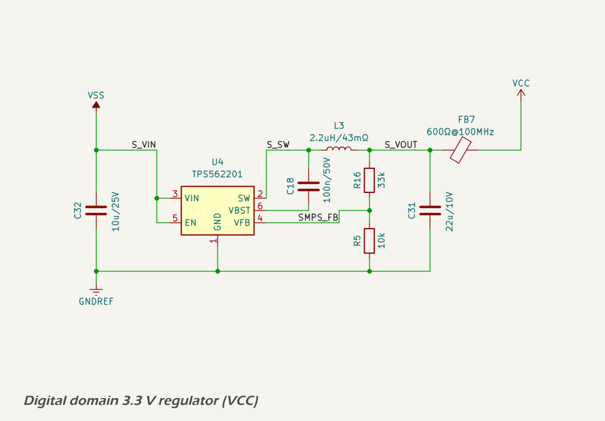
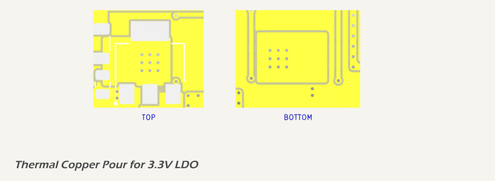

# Digital Logic 3.3 V Domain (VCC)

The 3.3 V digital logic domain supplies all microcontroller, sensor, transceiver, and analog processing loads within the MDD400. It is one of the most critical power domains in the system, and supports high-speed digital communications, analog sensing, and protocol interfacing.

## Design Criteria

The following loads are powered from the 3.3 V digital power rail (VCC):

<table border="1" cellpadding="6" cellspacing="0" style="width: 100%">
  <thead>
    <tr>
      <th>Load Component</th>
      <th style="text-align: center;">Typical Current</th>
      <th style="text-align: center;">Peak Current</th>
    </tr>
  </thead>
  <tbody>
    <tr>
      <td><a href="../mcu_storage/esp32_s3.md">Microcontroller (ESP32-S3)</a></td>
      <td style="text-align: center;">80 mA</td>
      <td style="text-align: center;">260 mA*</td>
    </tr>
    <tr>
      <td><a href="../communications/can_bus.md">CAN Transceiver, logic side (ISO1042)</a></td>
      <td style="text-align: center;">5 mA</td>
      <td style="text-align: center;">6.5 mA</td>
    </tr>
    <tr>
      <td><a href="../sensors/ambient_light.md">Ambient light sensor (OPT3004)</a></td>
      <td style="text-align: center;">&lt;1 mA</td>
      <td style="text-align: center;">&lt;1 mA</td>
    </tr>
    <tr>
      <td><a href="../power/vas.md">Dual op-amps (TLV9002IDR ×2)</a></td>
      <td style="text-align: center;">2.6 mA</td>
      <td style="text-align: center;">4 mA</td>
    </tr>
    <tr>
      <td><a href="../power/vas.md">Comparator (LM393DR)</a></td>
      <td style="text-align: center;">&lt;1 mA</td>
      <td style="text-align: center;">&lt;1 mA</td>
    </tr>
    <tr>
      <td><strong>Total</strong></td>
      <td style="text-align: center;"><strong>~90 mA**</strong></td>
      <td style="text-align: center;"><strong>~275 mA**</strong></td>
    </tr>
  </tbody>
</table>
\* Peak current reflects <a href="https://www.espressif.com/en/products/socs/esp32-s3/resources">ESP32-S3</a> operation with Wi-Fi or Bluetooth active at maximum transmit power.  
\*\* Total rounded up to nearest 5 mA.

Key design criteria for this domain include:

* Provide a stable, low-noise 3.3 V output.
* Support continuous operation at 329 mA with headroom for peak loads up to 640 mA.
* Maintain regulation from a +5.0 V input supply derived from the main 5.33 V SMPS output.
* Ensure thermal performance is within acceptable limits for ambient temperatures up to 40 °C.
* Minimize output ripple to support analog signal conditioning stages.

## Circuit Description

The 3.3 V rail is generated by a [Texas Instruments LM1117-3.3](https://www.ti.com/lit/ds/symlink/lm1117.pdf) low-dropout linear regulator, powered from the 5 V rail (after a blocking diode drop from the 5.33 V SMPS output). It supplies the [ESP32-S3](https://www.espressif.com/en/products/socs/esp32-s3/resources) microcontroller, CAN transceiver, I²C sensors, and analog front-end components.

Capacitive filtering includes:

* 10 µF local bulk capacitor at the regulator output.
* 100 nF decoupling capacitors at all major load inputs.
* Five RC-filtered 10 µF + 100 nF decoupling stages near the ESP32, op-amps, and CAN transceiver.

## Protection

The LM1117 includes built-in protection features:

* Internal current limiting to prevent damage under overcurrent conditions.
* Thermal shutdown above 150 °C junction temperature.
* Short-circuit protection.

These protections are sufficient for the low-voltage, high-availability digital domain. No additional external protection is included beyond input and output filtering.

## Performance

Performance is evaluated against voltage regulation, thermal limits, and load conditions. Total continuous load is ~90 mA, with peak load estimated at ~275 mA.

* Voltage regulation is maintained with >1.1 V headroom at all times (5.0 V input vs. 3.3 V output).
* Ripple is minimized via localized ceramic MLCC filtering and distributed bypassing.

The LM1117 operates well within its thermal limits even under worst-case environmental and load conditions (see [PCB Layout below](#pcb-layout)). Power dissipation is calculated as:

  * 90 mA → 0.153 W → ~5 °C rise → Junction temp: ~85 °C.
  * 275 mA → 0.467 W → ~15 °C rise → Junction temp: ~95 °C.

These figures assume a worst-case ambient temperature of 80 °C. Junction temperatures remain at least 30 °C below the LM1117’s 125 °C maximum rating, confirming a generous thermal margin.

## Component Selection

* The LM1117-3.3 was selected for availability, simplicity, and predictable dropout voltage (~1.1 V).
* Input and output capacitors follow TI recommendations: 10 µF bulk + 100 nF ceramic MLCC.
* All passives are 0603 size and use X7R dielectric.

Filtering near high-speed digital and analog nodes includes additional RC-paired decoupling for noise suppression.

## PCB Layout

The following thermal and electrical principles are are implemented in the PCB layout:

* The LM1117 regulator’s VO pin and tab (Pin 2 and center pad) are connected to copper pours on both the top and bottom PCB layers. 
* The output planes are termally connected via a 3×3 via array, allowing heat to dissipate through internal and external copper.
* No thermal reliefs are used in the main power paths to minimize resistance.
* Decoupling caps are placed immediately adjacent to IC power pins.

This layout supports both low-noise operation and effective heat spreading to maintain regulator performance.

<!-- # Digital Logic 3.3 V Domain (VCC)

## Digital Domain (3.3 V) Loads

The following loads are powered from the 3.3 V digital power rail (Vcc):

<table border="1" cellpadding="6" cellspacing="0" style="width: 100%">
  <thead>
    <tr>
      <th>Load Component</th>
      <th>Typical Current</th>
      <th>Peak Current</th>
    </tr>
  </thead>
  <tbody>
    <tr>
      <td>ESP32-S3</td>
      <td>250 mA</td>
      <td>450 mA*</td>
    </tr>
    <tr>
      <td>Ambient light sensor (OPT3004)</td>
      <td>0.2 mA</td>
      <td>0.2 mA</td>
    </tr>
    <tr>
      <td>Dual op-amps (TLV9002IDR ×2)</td>
      <td>2.6 mA</td>
      <td>4 mA</td>
    </tr>
    <tr>
      <td>Comparator (LM393DR)</td>
      <td>1 mA</td>
      <td>1.5 mA</td>
    </tr>
    <tr>
      <td>CAN transceiver (SN65HVD234)</td>
      <td>74 mA</td>
      <td>85 mA</td>
    </tr>
    <tr>
      <td>Pull-up loads</td>
      <td>1 mA</td>
      <td>1 mA</td>
    </tr>
    <tr>
      <td><strong>Total</strong></td>
      <td><strong>329 mA</strong></td>
      <td><strong>552 mA</strong></td>
    </tr>
  </tbody>
</table>

\*Peak current estimate reflects [ESP32-S3](https://www.espressif.com/en/products/socs/esp32-s3/resources) operation with active Wi-Fi transmission at high data rates, based on Espressif datasheet specifications.

## Regulator

The 3.3 V digital logic domain is powered by a [Texas Instruments LM1117-3.3](https://www.ti.com/lit/ds/symlink/lm1117.pdf) low-dropout (LDO) linear regulator, using the 5 V rail as its input (designated VPP). This domain powers the [ESP32-S3](https://www.espressif.com/en/products/socs/esp32-s3/resources) microcontroller, CAN transceiver, I²C sensors, and analog signal conditioning stages.

Capacitive filtering on the LDO output includes:

* 10 µF local bulk capacitance near the LDO;
* 100 nF decoupling capacitors placed near all major loads; and
* five 10 µF + 100 nF RC pairs at the ESP32, CAN transceiver, and op-amp stages.

The LM1117 features internal current limiting and thermal shutdown. Under typical operating conditions, the 3.3 V rail draws approximately 329 mA, with short-term peaks up to 552–640 mA. These values are distributed across the subsystems as shown in Table 2.

## Performance and Thermal Considerations

With a regulated input of approximately 5.0 V (following a diode drop from the 5.33 V SMPS rail), the LM1117 provides sufficient headroom above its typical dropout voltage of 1.1 V. At peak current levels up to 640 mA, the dropout remains below the available headroom, ensuring stable regulation.

Thermal dissipation is mitigated through extensive copper pours on the top and bottom PCB layers, all tied to the LDO output pin (Pin 2 / Tab). A 3×3 via array connects the thermal pad to the bottom layer, and a soldermask opening improves convective cooling. This layout results in the following thermal performance:

* **At 552 mA load**: 0.938 W dissipation → 30 °C rise → **Junction temp: 70 °C**
* **At 640 mA load**: 1.088 W dissipation → 35 °C rise → **Junction temp: 75 °C**

Given a 40 °C ambient environment, the regulator operates well below its 125 °C junction temperature limit with ample margin. These results confirm that the LM1117 is appropriately specified for both average and peak operating conditions in the MDD400. -->
