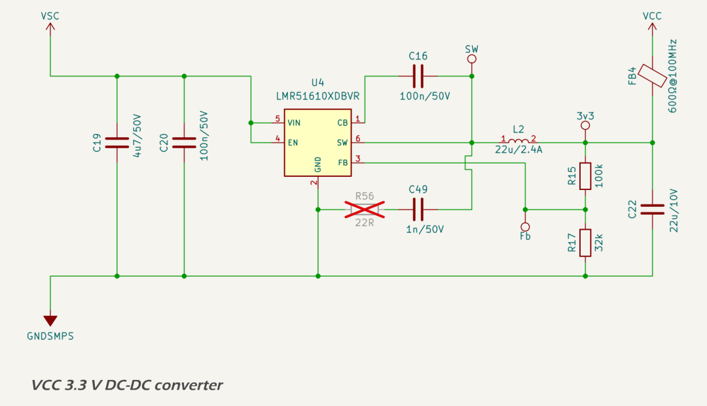

# VCC 3.3 V Domain

## Design Criteria

The VCC domain supplies 3.3 V regulated power to all digital subsystems, including the [ESP32-S3](https://www.espressif.com/sites/default/files/documentation/esp32-s3-wroom-1_datasheet_en.pdf), [OPT3004](https://www.ti.com/lit/ds/symlink/opt3004.pdf) ambient light sensor, [TMP112](https://www.ti.com/lit/ds/symlink/tmp112.pdf) temperature sensor, and the isolated sides of the [ISO1042](https://www.ti.com/lit/ds/symlink/iso1042.pdf) and [ISO1541](https://www.ti.com/lit/ds/symlink/iso1541.pdf) digital interfaces. It is derived from the 12 V input rail (VSC) using a non-synchronous buck converter based on the [Texas Instruments LMR51610](https://www.ti.com/lit/ds/symlink/lmr51610.pdf). Key design requirements include:

* provide a stable 3.3 V output for digital and isolated logic domains;
* operate reliably across a 9–18 V automotive/RV supply range;
* support peak output current of up to 275 mA during Wi-Fi transmission;
* achieve high efficiency to limit thermal rise in the enclosure; and
* ensure quiet operation compatible with analog and radio subsystems.

Typical current draw is ~90 mA, with headroom for full-load peaks during burst activity from the ESP32.

## Circuit Description

The circuit schematic for the 3.3 V DC-DC converter is based on the Texas Instruments [WEBENCH design](../../assets/pdf/3v3_smps_design_report.pdf).

The input filter includes a 4.7 µF X7R ceramic capacitor (C19) with additional bulk capacitance upstream, a high-frequency 100 nF bypass (C20), and a [Murata BLM31KN601SN1L](https://www.lcsc.com/datasheet/lcsc_datasheet_2209271730/Murata-Electronics-BLM31KN601SN1L_C668306.pdf) ferrite bead (600 Ω @ 100 MHz) to isolate SMPS noise from the upstream supply.

The main converter is implemented with a [LMR51610](https://www.ti.com/lit/ds/symlink/lmr51610.pdf) non-synchronous buck controller. A 22 µH [Taiyo Yuden NRS6028T220MMGJV](https://lcsc.com/datasheet/lcsc_datasheet_2410121622_Taiyo-Yuden-NRS6028T220MMGJV_C515357.pdf) inductor with 75 mΩ DCR is used, identical to the 5.25 V rail. The output capacitor is a 22 µF 10 V X7R MLCC.

The feedback resistor divider is adjusted for a 3.3 V output using 100 kΩ (R15) and 32 kΩ (R17). External compensation and a snubber network footprint are provided, with R56 marked DNP by default.

## Protection

The LMR51610 includes the following protection mechanisms:

* cycle-by-cycle peak current limit;
* thermal shutdown at 165 °C junction temperature; and
* input under-voltage lockout (UVLO).

These features protect the converter and connected subsystems from overload, thermal events, and supply brownout.

## Performance

Simulated results from the WEBENCH design report indicate the following typical performance at 18 V input and 275 mA peak load:

* output voltage: 3.3 V;
* efficiency: 89.0%;
* total power dissipation: 123 mW;
* phase margin: 43.0°;
* gain margin: −9.9 dB; and
* peak inductor ripple current: 313 mA.

The converter maintains good thermal performance with a predicted junction temperature of 39 °C at 30 °C ambient.

## Components

The following components were selected to meet performance, cost, and availability constraints, while ensuring reliable operation under all specified conditions:

* regulator IC: [Texas Instruments LMR51610](https://www.ti.com/lit/ds/symlink/lmr51610.pdf), 6-pin SOT-23;
* inductor: [Taiyo Yuden NRS6028T220MMGJV](https://lcsc.com/datasheet/lcsc_datasheet_2410121622_Taiyo-Yuden-NRS6028T220MMGJV_C515357.pdf), 22 µH, 75 mΩ DCR;
* output capacitor: 22 µF X7R MLCC (0805);
* output filtering: [Murata BLM31KN601SN1L](https://www.lcsc.com/datasheet/lcsc_datasheet_2209271730/Murata-Electronics-BLM31KN601SN1L_C668306.pdf) 600 Ω @ 100 MHz ferrite bead; and
* feedback, compensation, and timing components: 0402 thick-film resistors (63–125 mW) and X7R MLCCs.

## PCB Layout

The 3.3 V converter layout is identical to the 5.25 V section, with shared design constraints and stackup:

* tight input and output loop areas with short trace lengths;
* SW node enclosed in a ground moat and surrounded by vias;
* all components placed to minimize EMI and thermal hotspots;
* snubber and compensation footprints accessible for tuning.

These layout choices support quiet operation, mechanical symmetry, and efficient heat spreading.

---

## Datasheets

1. Texas Instruments, [WEBENCH Design Report](../../assets/pdf/3v3_smps_design_report.pdf)
2. Espressif, [ESP32-S3](https://www.espressif.com/sites/default/files/documentation/esp32-s3-wroom-1_datasheet_en.pdf)
3. Texas Instruments, [LMR51610](https://www.ti.com/lit/ds/symlink/lmr51610.pdf)
4. Taiyo Yuden, [NRS6028T220MMGJV](https://lcsc.com/datasheet/lcsc_datasheet_2410121622_Taiyo-Yuden-NRS6028T220MMGJV_C515357.pdf)
5. Murata, [BLM31KN601SN1L](https://lcsc.com/datasheet/lcsc_datasheet_2209271730/Murata-Electronics-BLM31KN601SN1L_C668306.pdf)
6. Texas Instruments, [OPT3004](https://www.ti.com/lit/ds/symlink/opt3004.pdf)
7. Texas Instruments, [TMP112](https://www.ti.com/lit/ds/symlink/tmp112.pdf)
8. Texas Instruments, [ISO1042](https://www.ti.com/lit/ds/symlink/iso1042.pdf)
9. Texas Instruments, [ISO1541](https://www.ti.com/lit/ds/symlink/iso1541.pdf)
