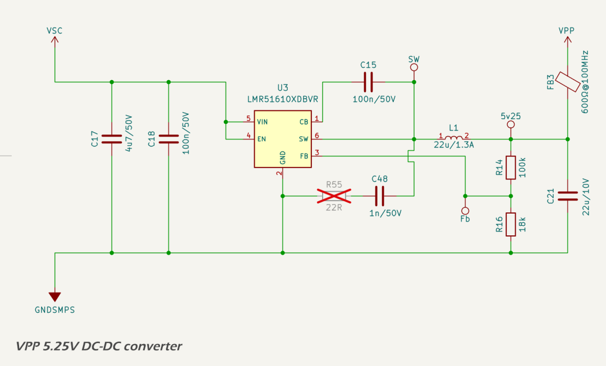

# VPP 5.25 V Domain

## Design Criteria

The VPP domain supplies intermediate 5.25 V power for the [DWIN DMG48480F040\_02WTCZ02COF](https://www.dwin-global.com/4-0-inch-intelligent-display-model-dmg48480f040_02wtcz02cof-series-product/) TFT LCD display and its backlight. It is generated from the 12 V input rail (VSC) using a high-efficiency non-synchronous buck converter based on the [Texas Instruments LMR51610](https://www.ti.com/lit/ds/symlink/lmr51610.pdf). Key design requirements include:

* provide a stable 5.25 V output for logic and interface subsystems;
* operate reliably across a 9–18 V automotive/RV supply range;
* support total continuous output load of up to 250 mA with headroom for transient loads;
* achieve high conversion efficiency to minimize thermal dissipation; and
* suppress switching noise and ripple to meet EMC and analog performance targets.

Only the DWIN LCD display and [Jiangsu Huaneng MLT-8530](https://lcsc.com/datasheet/lcsc_datasheet_2410010301_Jiangsu-Huaneng-Elec-MLT-8530_C94599.pdf) buzzer are powered from VPP. Peak current consumption is ~250 mA under full brightness conditions.

## Circuit Description

The circuit schematic for the 5.25 V DC-DC converter is based on the Texas Instruments [WEBENCH design](../../assets/pdf/5v3_smps_design_report.pdf).

The input filter includes bulk and high-frequency ceramic decoupling capacitors to suppress incoming noise and transients, along with a [Murata BLM31KN601SN1L](https://www.lcsc.com/datasheet/lcsc_datasheet_2209271730/Murata-Electronics-BLM31KN601SN1L_C668306.pdf) 600 Ω @ 100 MHz ferrite bead to isolate the SMPS from the system input rail. Input bypassing is provided by a 4.7 µF X7R MLCC (C17), supported by additional bulk capacitance upstream.

The regulator is a non-synchronous buck converter implemented with the [LMR51610](https://www.ti.com/lit/ds/symlink/lmr51610.pdf). A 22 µH shielded inductor [Taiyo Yuden NRS6028T220MMGJV](https://lcsc.com/datasheet/lcsc_datasheet_2410121622_Taiyo-Yuden-NRS6028T220MMGJV_C515357.pdf) with 75 mΩ DCR and 1.3 A saturation current is used to meet ripple and thermal targets. Output capacitance is provided by a 22 µF X7R MLCC, resulting in a peak-to-peak output ripple of 12.7 mV.

The feedback divider (100 kΩ / 18 kΩ) sets the output voltage to 5.25 V. Compensation is external, with footprint provision for a snubber network (DNP by default) to damp switch node ringing if required.

## Protection

The LMR51610 integrates multiple protection mechanisms to ensure safe operation under fault conditions:

* cycle-by-cycle peak current limiting;
* thermal shutdown at 165 °C junction temperature; and
* under-voltage lockout (UVLO) on the VIN rail.

These features protect the regulator and downstream loads from short circuits, overheating, and brownouts.

## Performance

Simulated performance from the WEBENCH model under worst-case input (18 V) and output (250 mA) conditions is as follows:

* output voltage: 5.244 V (nominal 5.25 V);
* efficiency: 92.1%;
* total power dissipation: 224 mW;
* phase margin: 63.1°;
* gain margin: −16.4 dB; and
* peak inductor ripple current: 429 mA.

Thermal performance is adequate for operation in ambient temperatures up to 80 °C, with a simulated junction temperature of 46 °C at 30 °C ambient.

## Components

The following components were selected to meet performance, cost, and availability constraints, while ensuring reliable operation under all specified conditions:

* regulator IC: [Texas Instruments LMR51610](https://www.ti.com/lit/ds/symlink/lmr51610.pdf), 6-pin SOT-23;
* inductor: [Taiyo Yuden NRS6028T220MMGJV](https://lcsc.com/datasheet/lcsc_datasheet_2410121622_Taiyo-Yuden-NRS6028T220MMGJV_C515357.pdf), 22 µH, 75 mΩ DCR;
* output capacitor: 22 µF X7R MLCC (0805);
* output filtering: [Murata BLM31KN601SN1L](https://www.lcsc.com/datasheet/lcsc_datasheet_2209271730/Murata-Electronics-BLM31KN601SN1L_C668306.pdf) 600 Ω @ 100 MHz ferrite bead; and
* feedback, compensation, and timing components: 0402 1% thick-film (125 mW) resistors and X7R MLCCs.

## PCB Layout

The SMPS is laid out on a 4-layer board with dedicated GNDSMPS and VSC planes. Layout considerations include:

* tight input loop between VIN, input capacitors, and GND;
* compact placement of output filter and inductor for minimal VOUT loop area;
* SW node contained within a ground moat and surrounded by stitching vias;
* provision for optional snubber components adjacent to SW; and
* extensive via stitching between top/bottom copper and inner ground planes.

These layout choices support low EMI, stable regulation, and safe thermal performance.

---

## Datasheets

1. Texas Instruments, [WEBENCH Design Report](../../assets/pdf/5v3_smps_design_report.pdf)
2. Texas Instruments, [LMR51610](https://www.ti.com/lit/ds/symlink/lmr51610.pdf)
3. Taiyo Yuden, [NRS6028T220MMGJV](https://lcsc.com/datasheet/lcsc_datasheet_2410121622_Taiyo-Yuden-NRS6028T220MMGJV_C515357.pdf)
4. Murata, [BLM31KN601SN1L](https://lcsc.com/datasheet/lcsc_datasheet_2209271730/Murata-Electronics-BLM31KN601SN1L_C668306.pdf)
5. DWIN, [DMG48480F040\_02WTCZ02COF](https://www.dwin-global.com/4-0-inch-intelligent-display-model-dmg48480f040_02wtcz02cof-series-product/)
6. Jiangsu Huaneng, [MLT-8530](https://lcsc.com/datasheet/lcsc_datasheet_2410010301_Jiangsu-Huaneng-Elec-MLT-8530_C94599.pdf)

