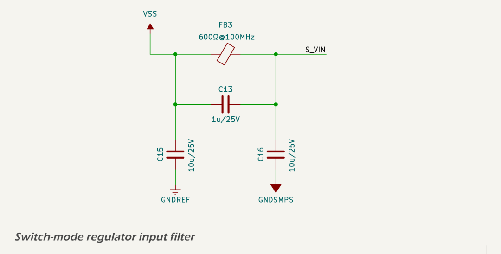
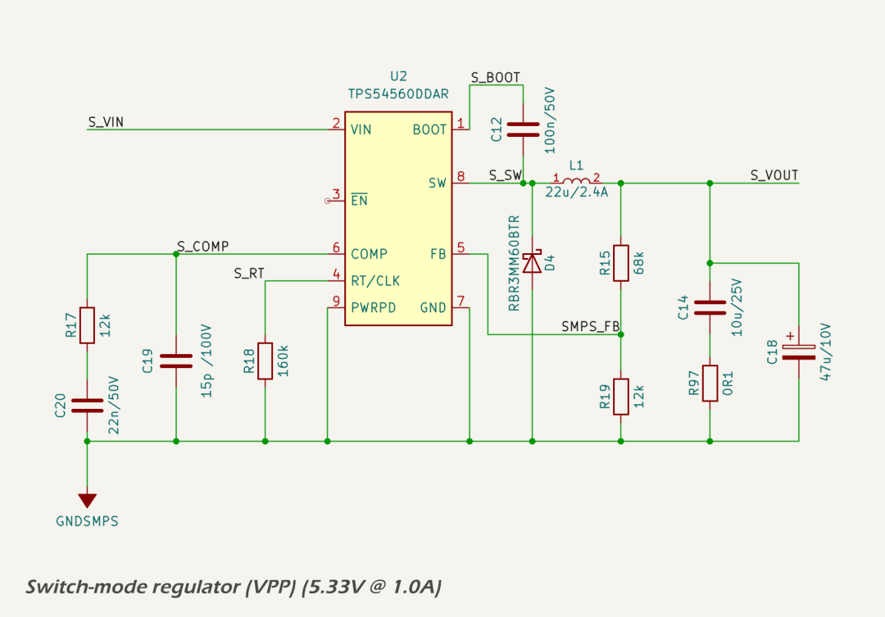
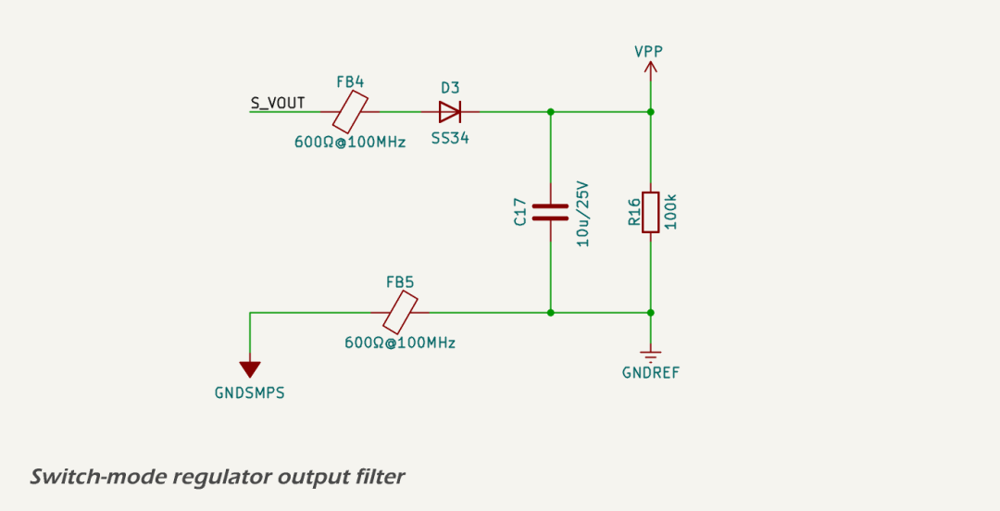
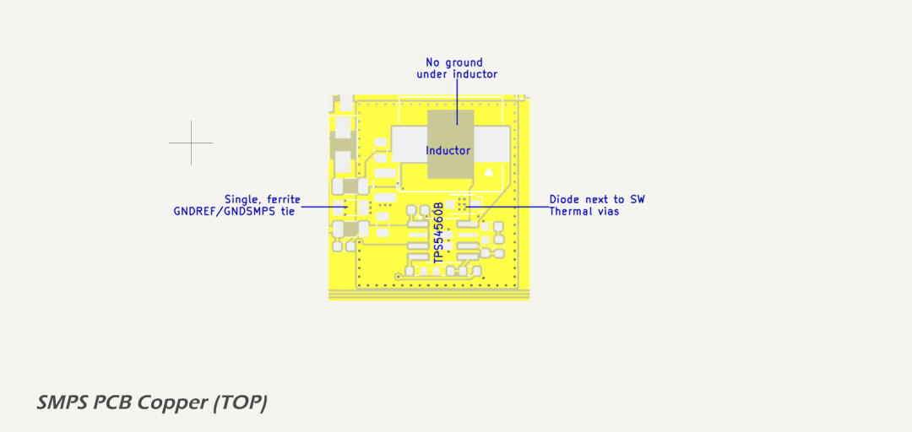

# Primary 5.3 V Domain (VPP)

## Design Criteria

The VPP domain supplies intermediate 5.33 V power for the system's primary digital and communication functions. It is generated from the 12 V input rail (VSS) using a high-efficiency synchronous buck converter. Key design requirements include:

* Provide a stable 5.33 V output for logic and interface subsystems.
* Operate reliably across a 9–16 V automotive/RV supply range.
* Support total continuous output load of up to 330 mA with headroom for transient loads.
* Achieve high conversion efficiency to minimize thermal dissipation.
* Suppress switching noise and ripple to meet EMC and analog performance targets.

The following downstream loads are powered from VPP:

<table border="1" cellpadding="6" cellspacing="0" style="width: 100%">
  <thead>
    <tr>
      <th>Downstream Load</th>
      <th style="text-align: center;">Typical Current</th>
      <th style="text-align: center;">Peak Current</th>
    </tr>
  </thead>
  <tbody>
    <tr>
      <td>LCD Display (backlight + controller)</td>
      <td style="text-align: center;">245 mA</td>
      <td style="text-align: center;">245 mA</td>
    </tr>
    <tr>
      <td>3.3 V LDO (digital logic domain)</td>
      <td style="text-align: center;">90 mA</td>
      <td style="text-align: center;">275 mA</td>
    </tr>
    <tr>
      <td>Isolated 5 V LDO (CAN logic side)</td>
      <td style="text-align: center;">8 mA</td>
      <td style="text-align: center;">9 mA</td>
    </tr>
    <tr>
      <td><strong>Total*</strong></td>
      <td style="text-align: center;"><strong>~345 mA</strong></td>
      <td style="text-align: center;"><strong>~530 mA</strong></td>
    </tr>
  </tbody>
</table>
\* Rounded up to nearest 5 mA.

## Circuit Description

The VPP rail provides a regulated 5.33 V output from the unregulated 12 V input rail using a high-efficiency synchronous buck converter based on the [Texas Instruments TPS54560B-Q1](https://www.ti.com/lit/ds/symlink/tps54560b-q1.pdf) wide-input switching regulator. Key characteristics of the TPS54560B-Q1 include:

* 4.5 V to 60 V wide input voltage range
* 5 A continuous output current capability
* Integrated high-side MOSFET
* Adjustable switching frequency (100 kHz to 2.5 MHz)
* Adjustable soft-start and power good indicator
* Cycle-by-cycle current limit and thermal shutdown
* Low shutdown IQ (<1 µA typical)
* Automotive-grade AEC-Q100 qualified

These features make the device well-suited for intermediate voltage regulation in automotive and industrial systems where noise performance, fault protection, and wide input range are critical.

The complete `VPP` regulator subsystem consists of three sections: input filter, switching regulator, and output filter. Schematics for each section are included below.

**Input Filter:**

The input filter includes bulk and high-frequency ceramic decoupling capacitors to suppress incoming noise and transients, along with a [Murata BLM31KN601SN1L](https://www.lcsc.com/datasheet/lcsc_datasheet_2209271730/Murata-Electronics-BLM31KN601SN1L_C668306.pdf) 600 Ω @ 100 MHz ferrite bead to isolate the SMPS from the system input rail. Input bypassing is provided by a 4.7 µF X7R MLCC, supported by additional bulk capacitance upstream.

**Switching Regulator Core:**

The regulator IC is configured for 600 kHz switching using a 160 kΩ timing resistor. Compensation components were selected based on WEBENCH simulation to provide excellent phase margin (>60°) and a crossover frequency near 25 kHz. The power stage uses a [Sumida 104CDMCCDS-220MC](https://www.lcsc.com/datasheet/lcsc_datasheet_2410121804/Sumida-104CDMCCDS-220MC_C2638545.pdf) 22 µH shielded inductor with 3.5 A saturation current and 2.4 A thermal current rating.

**Output Filter:**

The output filter uses a [Kyocera AVX TCJB476M010R0070](https://datasheets.kyocera-avx.com/TCJ.pdf) 47 µF tantalum-polymer capacitor providing a well-damped ESR of 70mΩ, paralleled with a 10 µF X7R ceramic capacitor for high-frequency decoupling. The ceramic capacitor is isolated by a 100 mΩ series resistor to ensure it does not dominate the total ESR, preserving the phase margin contributed by the tantalum. This hybrid approach delivers low output ripple and fast transient response while maintaining loop stability.

The use of the 47 µF tantalum capacitor is essential to achieving the target ESR recommended in the WEBENCH design. Without it, the regulator would require artificial ESR injection to avoid excessive gain and potential instability. A second ferrite bead further suppresses switching noise before handing off to the digital logic rail. A bleed resistor prevents floating voltages during startup or shutdown.

A complete WEBENCH design report for this power stage is included at [smps\_design\_report.pdf](../../assets/pdf/5v3_smps_design_report.pdf).

## Protection

The TPS54560B-Q1 integrates multiple protection mechanisms to ensure safe operation under fault conditions:

* Cycle-by-cycle peak current limiting on the high-side switch.
* Thermal shutdown with automatic recovery.
* Undervoltage lockout (UVLO) on both input and enable pins.
* Built-in soft-start limits inrush current and prevents overshoot at startup.

These features protect the regulator and downstream loads from short circuits, overheating, and brownouts.

## Performance

The regulator is designed for a nominal 5.33 V output with up to ~530 mA peak load and a typical combined load of ~340 mA. Simulated efficiency exceeds 93.5% at 12 V input and 340 mA output.

* Output ripple: ~18 mV (dominated by 70 mΩ ESR and layout parasitics).
* Inductor current ripple: ~245 mA peak-to-peak at 600 kHz switching.
* Loop stability: Simulated crossover frequency ~25 kHz, phase margin >60°.

High-efficiency conversion minimizes power loss, and a hybrid output capacitor network ensures fast transient response without compromising loop stability.

## Components

* Regulator IC: [TPS54560B-Q1](https://www.ti.com/lit/ds/symlink/tps54560b-q1.pdf)
* Inductor: [Sumida 104CDMCCDS-220MC](https://www.lcsc.com/datasheet/lcsc_datasheet_2410121804/Sumida-104CDMCCDS-220MC_C2638545.pdf), 22 µH, 3.5 A saturation
* Output caps: 47 µF tantalum-polymer + 10 µF ceramic with series damping resistor
* Input filtering: Ferrite bead + 4.7 µF ceramic cap
* Feedback, compensation, and timing components: 0603 1% thin-film resistors and X7R MLCCs

## PCB Layout

The SMPS is laid out on a 4-layer board with dedicated ground and power planes. Layout considerations include:

* Compact switching loop between VIN, SW, inductor, and output caps.
* GNDSMPS island isolated from GNDREF via ferrite bead stitching.
* Thermal vias beneath the regulator and diode transfer heat into the inner ground plane.
* Tantalum and ceramic caps are located for both loop stability and thermal spreading.
* Signal traces are kept clear of the high-frequency switching zone.

These layout choices ensure stable operation, minimal EMI, and robust thermal performance in compact enclosures.

<!-- # Primary 5.3 V Domain (5VPP)

The `VPP` rail provides a regulated 5.33 V output from the unregulated 12 V input rail `VSS` using a high-efficiency synchronous buck converter based on the [Texas Instruments TPS54560B-Q1](https://www.ti.com/lit/ds/symlink/tps54560b-q1.pdf) wide-input switching regulator. Key characteristics of the TPS54560B-Q1 include:

* 4.5 V to 60 V wide input voltage range
* 5 A continuous output current capability
* Integrated high-side MOSFET
* Adjustable switching frequency (100 kHz to 2.5 MHz)
* Adjustable soft-start and power good indicator
* Cycle-by-cycle current limit and thermal shutdown
* Low shutdown IQ (<1 µA typical)
* Automotive-grade AEC-Q100 qualified

These features make the device well-suited for intermediate voltage regulation in automotive and industrial systems where noise performance, fault protection, and wide input range are critical.

This rail supplies the serial LCD display and serves as the intermediate voltage for the 3.3 V LDO. It is designed for continuous output currents up to 1 A, with substantial thermal and electrical margin provided by the 5 A-rated controller and passive components.

A complete WEBENCH design report for this power stage is included at [smps\_design\_report.pdf](../../assets/pdf/smps_design_report.pdf).

---

## Circuit Description

The complete `VPP` regulator subsystem consists of three sections: input filter, switching regulator, and output filter. Schematics for each section are included below.

**Input Filter:**

The input filter includes bulk and high-frequency ceramic decoupling capacitors to suppress incoming noise and transients, along with a [Murata BLM31KN601SN1L](https://www.lcsc.com/datasheet/lcsc_datasheet_2209271730/Murata-Electronics-BLM31KN601SN1L_C668306.pdf) 600 Ω @ 100 MHz ferrite bead to isolate the SMPS from the system input rail. Input bypassing is provided by a 4.7 µF X7R MLCC, supported by additional bulk capacitance upstream.

**Switching Regulator Core:**

The regulator IC is configured for 600 kHz switching using a 160 kΩ timing resistor. Compensation components were selected based on WEBENCH simulation to provide excellent phase margin (>60°) and a crossover frequency near 25 kHz. The power stage uses a [Sumida 104CDMCCDS-220MC](https://www.lcsc.com/datasheet/lcsc_datasheet_2410121804/Sumida-104CDMCCDS-220MC_C2638545.pdf) 22 µH shielded inductor with 3.5 A saturation current and 2.4 A thermal current rating.

**Output Filter:**

The output filter uses a [Kyocera AVX TCJB476M010R0070](https://datasheets.kyocera-avx.com/TCJ.pdf) 47 µF tantalum-polymer capacitor providing a well-damped ESR of 70mΩ, paralleled with a 10 µF X7R ceramic capacitor for high-frequency decoupling. The ceramic capacitor is isolated by a 100 mΩ series resistor to ensure it does not dominate the total ESR, preserving the phase margin contributed by the tantalum. This hybrid approach delivers low output ripple and fast transient response while maintaining loop stability.

The use of the 47 µF tantalum capacitor is essential to achieving the target ESR recommended in the WEBENCH design. Without it, the regulator would require artificial ESR injection to avoid excessive gain and potential instability. A second ferrite bead further suppresses switching noise before handing off to the digital logic rail. A bleed resistor prevents floating voltages during startup or shutdown.

---

## Protection Features

The TPS54560B-Q1 integrates multiple protection mechanisms to ensure safe operation under fault conditions. These include cycle-by-cycle peak current limiting on the high-side switch, thermal shutdown with automatic recovery, and undervoltage lockout (UVLO) on both the input and enable pins. These features protect the regulator and downstream circuitry against short circuits, overheating, and supply brownouts. The built-in soft-start function also prevents inrush current and output overshoot at power-up.

## Performance

The regulator is simulated for 5.33 V output at 1 A load with an efficiency of 93.5% at nominal 12 V input. Measured inductor ripple is approximately 245 mA (peak-to-peak), and output ripple is estimated at 18 mV, dominated by the effective ESR (70mΩ) and layout parasitics. The control loop has a simulated phase margin of 63°, ensuring excellent transient and stability performance.

Use of a hybrid output capacitor network (tantalum + ceramic) allows for fast load response while maintaining sufficient loop damping without artificial ESR insertion. Input and output ferrite beads attenuate conducted EMI across the power and ground boundaries, improving system-level EMC.

---

## Component Selection

All resistors in this power stage are standard 0603-sized, 0.1 W thin-film types with 1% tolerance unless otherwise specified. This ensures consistent temperature and voltage stability across the regulator's control and feedback network. Capacitors are predominantly 0603 X7R MLCCs for predictable performance across temperature and bias, with exceptions noted where tantalum-polymer types are used for their controlled ESR characteristics.

## Layout Considerations

The layout is implemented on a 4-layer PCB with dedicated ground and power planes. All SMPS components are placed to minimize the switching current loop area, with the input capacitor tightly coupled to the regulator VIN and GND pins. The power stage is built on a local copper island tied to the `GNDSMPS` net, which is isolated from the main digital ground plane (`GNDREF`) and stitched via a perimeter ring and single-point connection.

The high-frequency switching path (VIN → SW → inductor → output caps → GNDSMPS) is kept compact and shielded from signal traces. Additional isolation is provided by splitting the return path of the input and output filters to `GNDREF` and `GNDSMPS` respectively, with appropriate stitching to maintain low impedance at high frequencies.

This layout strategy minimizes radiated EMI and ground bounce while supporting clean analog performance elsewhere in the system. The image above illustrates the GNDSMPS copper island layout. The switching loop is compact and centered around the regulator IC and output inductor. The ground plane is uninterrupted except under the inductor, where a keep-out is maintained on all layers to reduce capacitive coupling to the switching node. Thermal vias are placed under the regulator and flyback diode to transfer heat efficiently into internal ground planes. A dense via-stitched perimeter isolates the GNDSMPS region, and the single tie to GNDREF via a ferrite bead provides a low-noise star-ground structure.
 -->
