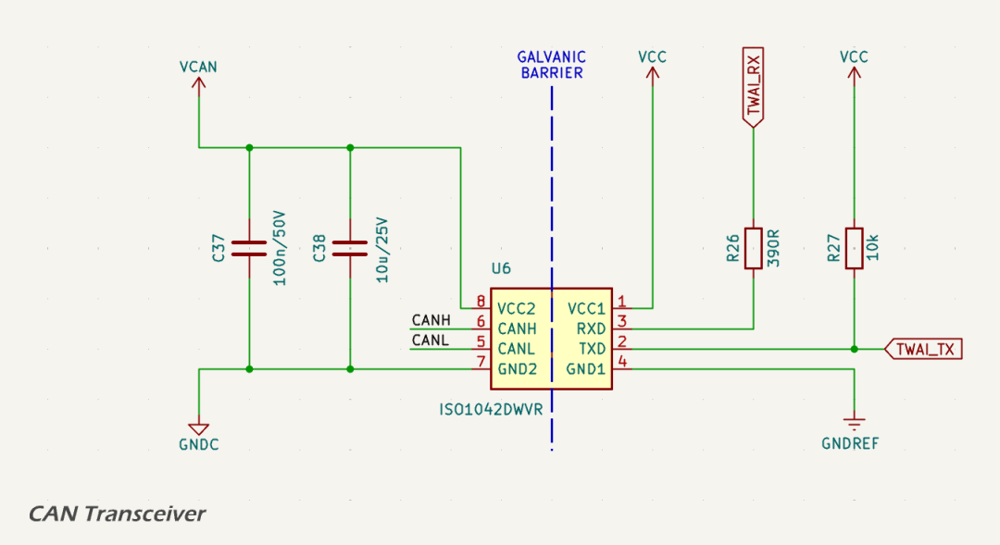
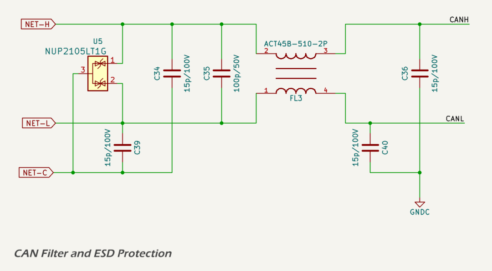

# CAN Transceiver

All versions of the MDD400 are equipped with an industry-standard CANBUS interface that is fully compatible with [NMEA 2000](https://www.nmea.org/nmea-2000.html) and RV-C backbones. The interface uses a standard 5-pin A-coded DeviceNet connector and is galvanically isolated for improved EMC performance and system reliability.

Key features:

* galvanically isolated CAN transceiver ([ISO1042](https://www.ti.com/lit/ds/symlink/iso1042.pdf));
* ESD and surge protection compliant with CISPR 25 and ISO 11452-2;
* fully compliant with NMEA 2000 physical layer specification;
* shielding and filtering designed to eliminate ground loops and radiated noise; and
* protection features to prevent bus lock-up and ensure failsafe recovery.

## CAN Transceiver

Galvanic isolation of the CAN physical layer is achieved using the [ISO1042](https://www.ti.com/lit/ds/symlink/iso1042.pdf) isolated transceiver IC. This device provides 5 kVrms isolation between the controller side and the CAN side. A dedicated 5 V isolated supply, VCAN, is used to power the CAN side.

Logic-level CAN communication is implemented through the TX and RX pins:

* TWAI\_TX connects to the transceiver’s TXD pin. A 10 kΩ pull-up resistor ensures a defined idle state and reduces noise susceptibility when the MCU pin is high-Z; and
* TWAI\_RX is connected to the transceiver’s RXD pin via a 390 Ω series resistor, which limits inrush current, dampens reflections, and protects the ESP32 input from voltage overshoot.

The ISO1042 includes several internal features to prevent CAN bus lock-up or erratic behaviour:

* TXD dominant timeout protects against stuck-low faults on the TX line;
* undervoltage lockout disables outputs when either side loses power;
* failsafe biasing ensures a recessive state if lines are unconnected or inputs are floating;
* thermal shutdown protects the device during sustained fault conditions.

These features allow the MDD400 to recover automatically from faults without locking the bus.

Neither TWAI\_TX nor TWAI\_RX are strapping pins on the ESP32-S3, ensuring reliable CAN bus behaviour during flashing, reset, and power-up.

---

## Signal Conditioning

The CAN interface is galvanically isolated and filtered to reduce both emissions and susceptibility to EMI. The filtering stage is shown below.

The CAN\_H and CAN\_L signals pass through the following components prior to reaching the transceiver:

* 15 pF capacitors to local CAN ground (NET-C), providing high-frequency common-mode filtering;
* a 100 pF differential capacitor across CAN\_H and CAN\_L, attenuating differential-mode noise;
* a [Murata ACT45B-510-2P-TL003](https://www.murata.com/en-us/products/productdata/8807038415390/QTN0099C.pdf) common-mode choke, used to suppress high-frequency common-mode interference;
* a [NUP2105LT1G](https://www.onsemi.com/pdf/datasheet/nup2105l-d.pdf) dual transient voltage suppression (TVS) array, providing protection against differential and common-mode voltage transients; and
* a [Texas Instruments ISO1042](https://www.ti.com/lit/ds/symlink/iso1042.pdf) CAN transceiver, which includes integrated galvanic isolation and failsafe features.

This signal conditioning network is designed following guidance from [Texas Instruments](https://www.ti.com/lit/ab/snoaaa1/snoaaa1.pdf) and [Monolithic Power Systems](https://www.monolithicpower.com/en/blog/post/from-cold-crank-to-load-dump-a-primer-on-automotive-transients), and is intended to minimise emissions and maximise immunity to electrical noise.

The CAN\_H and CAN\_L signals are routed as a tightly coupled differential pair with controlled impedance. Routing is kept short and direct between the connector, filtering components, and transceiver to minimise parasitic inductance and reduce discontinuities. The trace layout eliminated vias and stubs and prioritises symmetry to preserve signal integrity.

These design measures support compliance with EMC standards such as [CISPR 25](https://www.diodes.com/design/support/cispr-25) and [ISO 11452-2](https://www.iso.org/standard/68557.html), which are applicable to automotive and marine CAN networks.

To maintain galvanic isolation, the CAN transceiver's isolated ground (GNDC) is physically separated from the system ground (GNDREF) using a dedicated ground plane region. A minimum clearance of 2.5–4.0 mm is maintained between the isolated and logic ground planes, consistent with IPC-2221 and marine EMC best practices. This clearance helps ensure the isolation barrier is not compromised by parasitic coupling or leakage currents, and supports the reinforced isolation rating of the ISO1042 transceiver.

---

## Power Supply

The ISO1042 CAN transceiver operates from an isolated 5 V supply on the CAN-side domain ([VCAN](vcan.md)), referenced to the isolated ground (GNDC). The logic side is powered from the 3.3 V digital domain supply rail ([VCC](../smps/vcc.md)).

---

## Datasheets and References

1. Texas Instruments, [*ISO1042 Isolated CAN Transceiver*](https://www.ti.com/lit/ds/symlink/iso1042.pdf)
2. Murata, [*ACT45B-510-2P Common-Mode Choke*](https://www.murata.com/en-us/products/productdata/8807038415390/QTN0099C.pdf)
3. On Semiconductor, [*NUP2105LT1G Dual-Line CAN TVS*](https://www.onsemi.com/pdf/datasheet/nup2105l-d.pdf)
