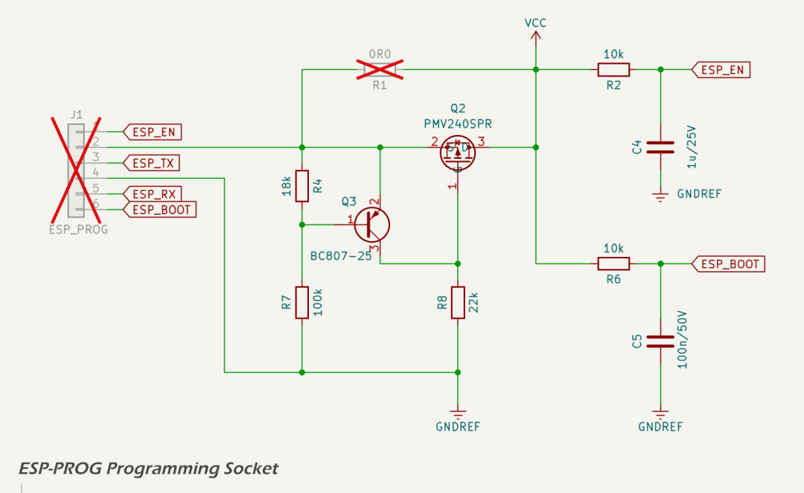

# ESP-Prog Programming Socket

The ESP-PROG programming header provides serial and boot/reset control signals for firmware upload via UART. It is compatible with [Espressif's ESP-PROG adapter](https://docs.espressif.com/projects/esp-iot-solution/en/latest/hw-reference/ESP-Prog_guide.html), and supports both development and production programming workflows.

In prototype builds, this header is populated with a 6-pin IDC male connector. In production, pogo pins in a programming fixture will make contact with the same through-hole pads from below.

## Signal Connections

The 6-pin subset of the ESP-PROG interface is used:

* [`ESP_EN`](../../quick_reference.md): connected to the ESP32-S3 `ESP_EN` (reset) pin;
* [`ESP_BOOT`](../../quick_reference.md): connected to GPIO0 to select download mode; and
* [`ESP_TX`](../../quick_reference.md) / [`ESP_RX`](../../quick_reference.md): UART0 signals for flashing and serial output.

These are compatible with standard ESP-IDF programming tools. Also see the [quick reference for the ESP32-S3 pin allocations](../../quick_reference.md).

## Over-voltage Protection

To guard against accidental over-voltage from misconfigured ESP-PROG modules (e.g. 5 V jumper set), an over-voltage protection circuit is included in prototypes. It uses:

* a [PMV240SPR](https://lcsc.com/datasheet/lcsc_datasheet_2410121947_Nexperia-PMV240SPR_C5361354.pdf) NMOS FET as a series switch;
* a [BC807-25](https://assets.nexperia.com/documents/data-sheet/BC807_SER.pdf) PNP transistor as a voltage detector; and
* resistor dividerand gate pull-down to set the trip point at approximately 3.4 V.

When `VCC` exceeds the turn-on threshold, the PNP transistor (Q3) conducts, pulling down the gate of the FET (Q2) and turning it off, thereby disconnecting the ESP-PROG `VCC` from the board.

In production, this circuit is not populated. Instead, a 0 Ω bypass resistor (R5) is fitted to directly route `VCC` to the board.

## Datasheets and References

1.  Espressif, [*Introduction to the ESP-Prog Board*](https://docs.espressif.com/projects/esp-iot-solution/en/latest/hw-reference/ESP-Prog_guide.html)
2.  Espressif, [*ESP-Prog User Guide*](https://documentation.espressif.com/espressif-esp-dev-kits/en/latest/other/esp-prog/user_guide.html?q=esp-prog)
3.  Nexperia, [*PMV240SPR 100 V, P-channel Trench MOSFET Datasheet*](https://lcsc.com/datasheet/lcsc_datasheet_2410121947_Nexperia-PMV240SPR_C5361354.pdf)
4.  Nexperia, [*BC807-25 C807 series 45 V, 500 mA PNP general-purpose transistors datasheet*](https://assets.nexperia.com/documents/data-sheet/BC807_SER.pdf)

