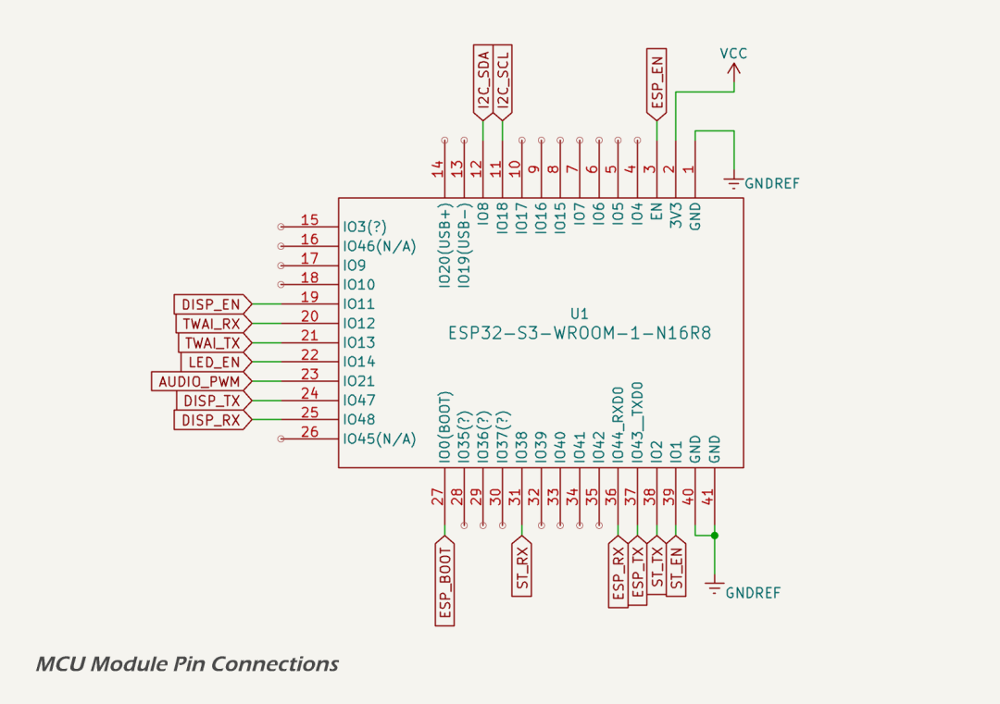

# ESP32-S3 Micro-controller Module

The MDD400 design is based on the [ESP32-S3-WROOM-1-N16R8](https://www.espressif.com/sites/default/files/documentation/esp32-s3-wroom-1_wroom-1u_datasheet_en.pdf) module, a fully integrated wireless microcontroller that includes a dual-core Xtensa® LX7 CPU running at up to 240 MHz, 512 KB SRAM, and 8 MB PSRAM. The module supports both Wi-Fi and Bluetooth / BLE, and offers a wide array of digital peripherals including SPI, I²C, UART, PWM, ADC, DAC, and TWAI®. The integrated QSPI flash and PSRAM interface supports external memory for advanced applications such as graphical user interfaces, data logging, and OTA update handling. Enhanced security features include secure boot, flash encryption, and hardware HMAC/RSA modules. The module is fully certified and incorporates an integrated antenna.

## ESP32-S3 GPIO Connections

The ESP32-S3 module is connected to the following peripherals:

* the [CANBUS interface](twai.md) is accessed via a galvanically isolated CAN transceiver;
* two environmental sensors: an [ambient light sensor](ambient_light_sensor.md) and [temperature sensor](temperature_sensor.md) are accessed via the I²C bus;
* an I²C [voltage/current sensor](../can/power_sensor.md), in the isolated [`CAN` domain](../can/index.md), is accessed via an I²C isolator;
* the [HMI display](tft_touch_display.md) is addressed via UART and its 5 V power is switched with a MOSFET high-side switch;
* a single [status LED](status_led.md) is connected to an [output pin](../../quick_reference.md) for diagnostics; 
* the serial interface in the [`LEGACY IO` domain](../seatalk/index.md) is addressed via three opto-isolators; and
* a [flash programming header](esp32_s3.md), pin-compatible with Espressif's ESP-Prog programmer's 6-pin IDC connector is connected to UART 0 and the [`ESP_BOOT`](../../quick_reference.md) and [`ESP_EN`(../../quick_reference.md)] pins. 

The schematic shows the pin allocations on the ESP32-S3 module as implemented in the MDD400 design. 

The following pull-up resistors and timing capacitors are included on selected GPIOs to ensure correct startup behaviour and stable logic levels:

* [`ESP_EN`](../../quick_reference.md) is pulled up to `VCC` with 10 kΩ and has a 1 µF capacitor to `GNDREF`;
* [`ESP_BOOT`](../../quick_reference.md) (GPIO0) is pulled up to `VCC` with 10 kΩ and has a 100 nF capacitor to `GNDREF`; and
* I²C lines ([`I2C_SCL`](../../quick_reference.md) and [`I2C_SDA`](../../quick_reference.md)) are pulled up to `VCC` with 10 kΩ resistors.

The ESP32-S3-WROOM-1 module includes [48 GPIOs](https://docs.espressif.com/projects/esp-idf/en/v5.5/esp32s3/api-reference/peripherals/gpio.html), many of which are multifunctional. The following GPIO assignments are used in the MDD400:



Please refer to the [quick reference](../../quick_reference.md) for a complete listing of the ESP32-S3 GPIO pin assignments, including signal labels, usage, strapping pins and reserved functions.

## Memory

The ESP32-S3 module includes two types of RAM:

* **SRAM**: 512 kB internal static RAM, used by default for stack, heap, and program data;
* **PSRAM**: 8 MB of external pseudo-static RAM, accessible via the memory-mapped SPI interface.

The ESP-IDF heap allocator is configured to use both internal and external memory. Internal SRAM provides low-latency access and is prioritized for timing-sensitive operations, while external PSRAM is used for large buffers and dynamic structures.

In the MDD400, PSRAM is reserved primarily for storage of time-series data associated with incoming NMEA traffic. These time series support real-time and historical graphing functions on the LCD display. The PSRAM allows extensive buffering of sampled values across multiple channels without consuming internal SRAM resources.

Additional PSRAM-based buffers may be allocated at runtime for image decoding, OTA staging, or caching depending on future firmware requirements and available heap space.

## Flash Storage

The ESP32-S3 module in the MDD400 includes 16 MB of external QSPI flash. Flash is divided into multiple regions as shown in the [partition table](../../quick_reference.md).



### Application Regions

Two 5 MB OTA slots are defined (`app0` and `app1`), allowing firmware to be updated via Bluetooth or serial without overwriting the running image. OTA updates are managed by the ESP-IDF OTA subsystem using a dual-bank approach.

### Non-volatile Data

The [`nvs` partition](../../quick_reference.md) stores key-value pairs for configuration and calibration data, while `otadata` tracks OTA image states.

### SPIFFS Usage

The [`spiffs` partition](../../quick_reference.md) is used as a general-purpose filesystem. During OTA update via BLE, this region serves as a temporary staging area for update payloads, including display image resources and configuration files, which the firmware subsequently writes to the DWIN display over UART.

In normal operation, the SPIFFS partition stores history and diagnostic data, including time-series records of incoming NMEA data. These may include environmental trends, fault logs, or usage statistics.

Partitioning and access control within the SPIFFS area is not yet finalised. One approach could involve prefix-based file organisation (e.g. `/ota/`, `/hist/`, `/diag/`), or maintaining a metadata index to track file type and source.

### Core Dumps

The `coredump` partition is reserved for post-crash diagnostics, allowing firmware to write a memory snapshot for later retrieval via serial or BLE tools.

## I²C Bus

The ESP32-S3 communicates with three external peripherals on a shared I²C bus:



All three devices share the same [`I2C_SDA`](../../quick_reference.md) and [`I2C_SCL`](../../quick_reference.md) signal lines. A single set of 4.7 kΩ pull-up resistors is present on the `DIGITAL` domain side (`VCC`), and a second set is placed on the `CAN` domain side (`VDD`), beyond the I²C isolator. Each device includes local decoupling capacitors as required by its datasheet.

## Datasheets and References

1. Espressif, [*ESP32-S3-WROOM-1 & WROOM-1U Module Datasheet*](https://www.espressif.com/sites/default/files/documentation/esp32-s3-wroom-1_wroom-1u_datasheet_en.pdf)
2. Espressif, [*API Reference | Peripherals API | GPIO & RTC GPIO*](https://docs.espressif.com/projects/esp-idf/en/v5.5/esp32s3/api-reference/peripherals/gpio.html)
3. Espressif, [*ESP-IDF JTAG Debugging Guide*](https://docs.espressif.com/projects/esp-idf/en/stable/esp32s3/api-guides/jtag-debugging/index.html)
4. Espressif, [*ESP-PROG Hardware Guide*](https://docs.espressif.com/projects/esp-iot-solution/en/latest/hw-reference/ESP-Prog_guide.html)
5. Texas Instruments, [*TMP112 Low-Power Digital Temperature Sensor Datasheet*](https://www.ti.com/lit/ds/symlink/tmp112.pdf)
6. Texas Instruments, [*OPT3004 Ambient Light Sensor Datasheet*](https://www.ti.com/lit/ds/symlink/opt3004.pdf)
7. Texas Instruments, [*INA219 Current/Power Monitor With I²C Interface Datasheet*](https://www.ti.com/lit/ds/symlink/ina219.pdf)
8. Nexperia, [*PMV240SPR P-Channel MOSFET Datasheet*](https://lcsc.com/datasheet/lcsc_datasheet_2410121947_Nexperia-PMV240SPR_C5361354.pdf)
9.  Nexperia, [*BC807-25 C807 series 45 V, 500 mA PNP general-purpose transistors datasheet*](https://assets.nexperia.com/documents/data-sheet/BC807_SER.pdf)

