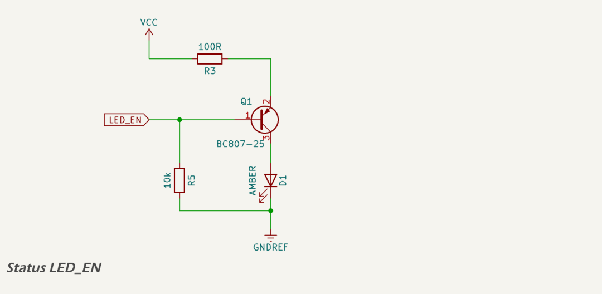

# Status LED

A single amber status LED is provided to indicate system power and support visual diagnostics. It is positioned behind a small aperture on the rear panel of the enclosure and is not visible during normal operation. Its primary purpose is to confirm the presence of regulated 3.3 V logic supply (`VCC`) during power-up and initial boot, even before firmware begins execution. The LED may also be used to flash diagnostic error codes or signal system status under firmware control.

The circuit uses a high-side PNP driver topology to ensure that the LED is lit whenever `VCC` is present, regardless of the microcontroller state. This provides a reliable indication that regulated logic power is available.

The LED is driven via a [BC807-25](https://assets.nexperia.com/documents/data-sheet/BC807_SER.pdf) PNP transistor. The transistor's emitter is connected to `VCC` through a 100 Ω current-limiting resistor (R6), while its collector sinks current through the amber LED (D1) to `GNDREF`. The transistor base is pulled low by a 10 kΩ resistor (R7), which ensures that the transistor is forward-biased and the LED is lit during system boot or whenever the microcontroller pin is floating.

The control input, labeled [`LED_EN`](../../quick_reference.md), is connected to a digital output of the ESP32-S3. When the microcontroller drives this pin high (3.3 V), the base-emitter junction is no longer forward biased, and the transistor switches off. This disables the LED. Firmware can use this mechanism to turn off the LED during normal operation, or to flash error codes by toggling the pin.

See the [quick reference](../../quick_reference.md) for the ESP32-S3 GPIO allocations.

This approach ensures a default-on state for the LED during early power-up, providing immediate visual confirmation that logic power is present. It also allows flexible firmware control of the LED after system boot.

### Brightness Analysis

The LED used is a [XINGLIGHT XL-1608UOC-06](https://lcsc.com/datasheet/lcsc_datasheet_2504101957_XINGLIGHT-XL-1608UOC-06_C965800.pdf) amber SMD 0603 footprint LED, with a typical forward voltage of 1.9 V at 20 mA. The transistor saturation voltage is assumed to be approximately 0.2 V. With `VCC` at 3.3 V, the voltage drop across R6 is 1.2 V, resulting in an estimated LED current of 12 mA.

According to the relative luminous intensity vs forward current curve, the LED emits approximately 75% of its full brightness at 12 mA compared to its 20 mA rating. The device is likely binned at D4 or D5 brightness grade, corresponding to 150–210 mcd at 20 mA.

Taking a conservative estimate of 180–200 mcd at 20 mA, and scaling by 0.75, the expected luminous intensity at 12 mA is approximately 135–150 mcd.

This brightness level is suitable for visibility through a rear panel aperture in daylight conditions and does not exceed thermal or electrical limits. In production, the exact brightness may vary depending on the bin code supplied, which is not specified by LCSC. If a lower brightness grade is supplied, the LED may appear dimmer but will remain functional as a power indicator.

## Datasheets and References

1. Nexperia, [*BC807-25 General Purpose PNP Transistor Datasheet*](https://assets.nexperia.com/documents/data-sheet/BC807_SER.pdf)
2. Xinglight, [*XL-1608UOC-06 Amber 0603 SMD LED Datasheet*](https://lcsc.com/datasheet/lcsc_datasheet_2504101957_XINGLIGHT-XL-1608UOC-06_C965800.pdf)
