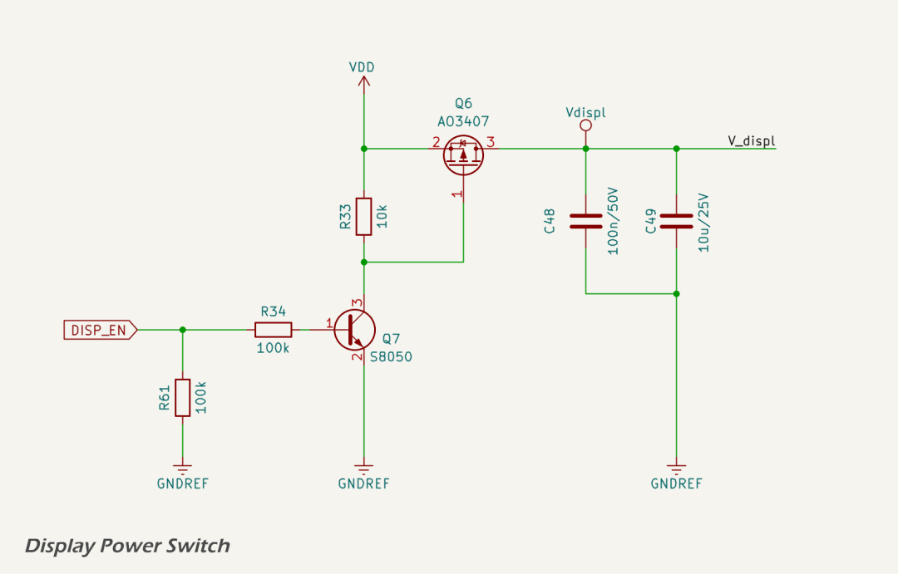

# TFT Touch Display

The MDD400 integrates a 480 × 480 pixel capacitive touch TFT HMI display for its user interface. The display is based on the [DWIN DMG48480F040\_01WTC](../../assets/pdf/DMG48480F040_01WTC_Datasheet.pdf) module and communicates with the ESP32-S3 via `UART2`. The display has a fixed 50-pin [flat flex cable (FFC)](https://en.xunpu.com.cn/product/388.html) connection, but only the power and UART pins (`U2_RX` and `U2_TX`) are connected. All other signals are left unconnected. 

### Power Supply and Control

The display is powered by the 5.0 V supply (`VDD`), switched via a high-side P-channel MOSFET ([AO3407A](https://lcsc.com/datasheet/lcsc_datasheet_2311091734_UMW-Youtai-Semiconductor-Co---Ltd--AO3407A_C347478.pdf)) under microcontroller control. The switching circuit ensures the display remains off during power-up and resets unless explicitly enabled by firmware. This prevents unintentional power draw and screen activity before the system is initialized.

The MOSFET (Q6) is pulled high by R33 and controlled by an NPN transistor (Q7, [S8050](https://lcsc.com/datasheet/lcsc_datasheet_2308071512_JSMSEMI-SS8050_C916392.pdf)). When the `DISP_EN` line is driven high by the ESP32, Q7 turns on and pulls the gate of Q6 low, enabling Vdispl. Local decoupling is provided by 100 nF and 10 µF capacitors (C48, C49).

### Communication Interface

The display uses DWIN's proprietary [DGUS II protocol](../../assets/pdf/T5L_DGUSII-Application-Development-Guide-V2.9-0207.pdf) over UART. On the ESP32, UART2 TX is connected to the display's RX, and UART2 RX to the display's TX. No other data or control lines are used. All display logic, touch processing, and UI rendering are handled by the internal T5L microcontroller in the display module. The ESP32 acts only as a host, sending commands and receiving status or touch events over serial.

This separation of UI logic from the host MCU simplifies firmware development and ensures consistent, low-latency user interface behavior. The DGUS II protocol supports page switching, button presses, slider updates, and other display interactions using a well-documented serial command set.

## References

1. UMWElectronics, [AO3407A P-Channel MOSFET Datasheet](https://lcsc.com/datasheet/lcsc_datasheet_2311091734_UMW-Youtai-Semiconductor-Co---Ltd--AO3407A_C347478.pdf)
2. JSMSEMI, [SS8050 NPN Transistor Datasheet](https://lcsc.com/datasheet/lcsc_datasheet_2308071512_JSMSEMI-SS8050_C916392.pdf)
3. DWIN, [DMG48480F040\_01WTC Capacitive Touch Display Datasheet](../../assets/pdf/DMG48480F040_01WTC_Datasheet.pdf)
4. DWIN, [DGUS II Application Development Guide V2.9](../../assets/pdf/T5L_DGUSII-Application-Development-Guide-V2.9-0207.pdf)
5. Xunpu, [FPC-05FB-50PH20 Connector Product Page](https://en.xunpu.com.cn/product/388.html)
