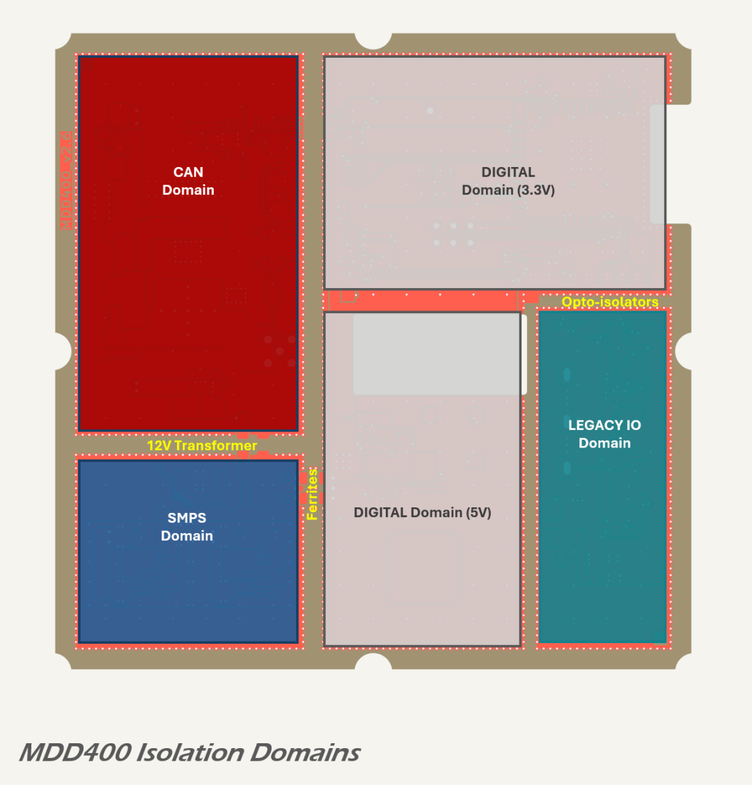
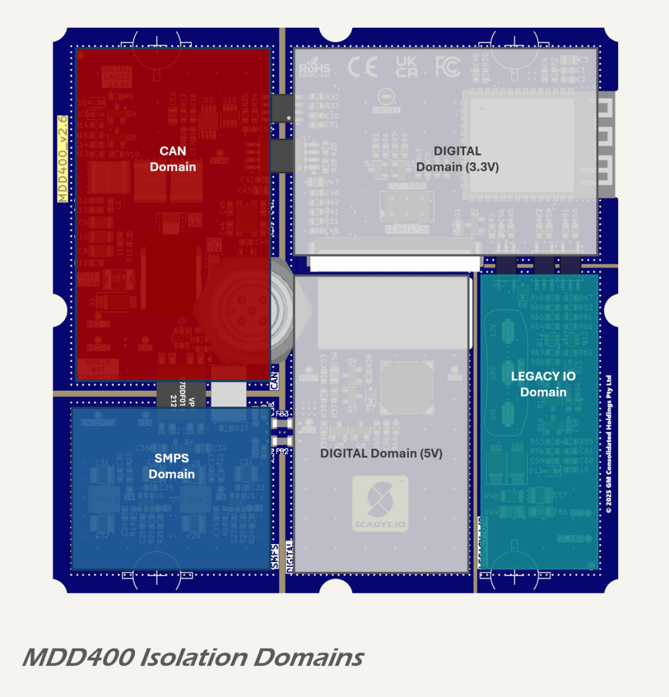
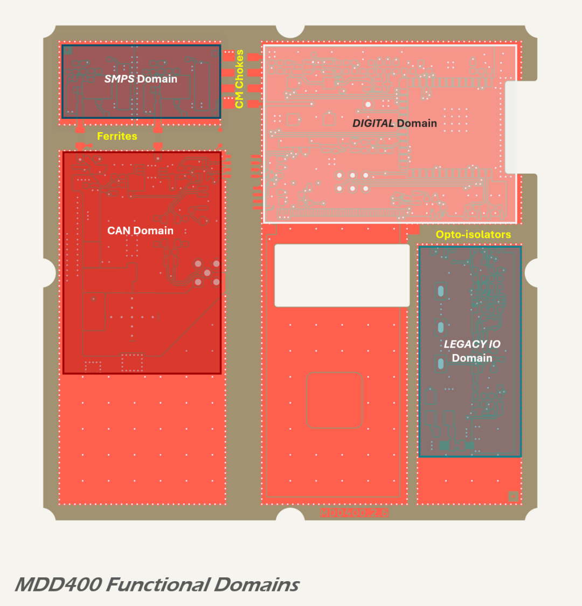

# Domain Isolation

The MDD400 implements galvanic isolation between functional domains to suppress conducted noise, block fault currents, and maintain EMC compliance. Isolation boundaries are defined in both circuit topology and PCB layout, with reinforced separation between grounds, signal paths, and copper pours.

## Isolation Boundaries

Three primary galvanic isolation boundaries are present in the MDD400 architecture:

* between the `CAN` and `SMPS` domains;
* between the `SMPS` and `Digital` domains; and
* between the `LEGACY IO` and `DIGITAL` domains.

Each boundary is implemented using domain-specific techniques: 

* the `CAN` to `SMPS` domain interface is galvanically isolated using a [VPS8701B transformer driver](https://www.lcsc.com/datasheet/C552889.pdf) and [VPT87DDF01B 12 V:12 V transformer](https://www.lcsc.com/datasheet/C2846916.pdf);
* optional components (a common-mode choke and ferrite beads) are also included across the galvanic barrier for test-only population during EMC compliance testing; and
* the `SMPS` and `DIGITAL` domains are connected via ferrite beads and Y-cap-style capacitive bypass, but remain isolated at the DC level.
* the `CAN` domain is powered independently from the filtered `VSS` input using a [TPS7A1650DGNR](https://www.ti.com/lit/ds/symlink/tps7a16.pdf) linear regulator, forming the `VCAN` rail referenced to `GNDC`. All communication to the `DIGITAL` domain occurs through the [ISO1042](https://www.ti.com/lit/ds/symlink/iso1042.pdf) isolated CAN transceiver and an [ISO1541](https://www.ti.com/lit/ds/symlink/iso1541.pdf) I²C isolator used for the onboard power sensor (INA219);
* the `LEGACY IO` domain uses three [TLP2309](https://lcsc.com/datasheet/lcsc_datasheet_2410010231_TOSHIBA-TLP2309-TPL-E_C85066.pdf) opto-isolators to isolate the `ST_RX`, `ST_TX`, and `ST_EN` signal lines. Power for the SeaTalk TX driver in the `LEGACY` domain is drawn directly from the SeaTalk I power line, conditioned locally within the domain. For receive-only operation, the `LEGACY` domain does not require 12 V power.

* the `CAN` and `SMPS` domains are fully galvanically isolated via a push-pull transformer circuit;
* two alternative isolation strategies are provided in parallel with the transformer circuit: a common-mode choke and low-impedance ferrite beads, which may be selectively populated during EMC testing;
* the `SMPS` and `DIGITAL` domains are connected via ferrite beads on both power rails and a 100 pF bypass capacitor across the ground boundary;
* no DC connection exists between `GNDSMPS` and `GNDREF`, preserving high-impedance isolation across the digital boundary.

This configuration suppresses high-frequency noise propagation between domains, minimises EMI, and protects digital logic from disturbances originating in the CAN interface or power switching stages.

## Physical Layout and Spacing

Each isolation boundary is defined by copper clearances, component placement, and polygon pours. The following layout strategies are used:

* each domain (`GNDC`, `GNDSMPS`, `GNDREF`, and `GNDST`) is implemented as a separate copper polygon on inner ground planes and top/bottom pours;
* 6 mm clearance is maintained across all isolation gaps, satisfying creepage and clearance per IEC 62368-1 for 250–300 V RMS working voltage;
* isolation gaps are free of traces, vias, and solder mask to avoid contamination or capacitive coupling;
* all inter-domain signals pass through isolated transceivers, with no direct connections between ground domains.

The layout supports optional application of conformal coating to further increase insulation resistance, particularly in humid or salt-exposed marine environments.

## Power Isolation Strategy

Power isolation is implemented as follows:

* the `CAN` domain uses a dedicated 5 V linear regulator (`VCAN`) to power the isolated side of the CAN transceiver and INA219 current/voltage sensor. These loads are low current and benefit from the regulator’s low noise performance;
* the `DIGITAL` domain receives two regulated supplies (`VDD` and `VCC`) from the `SMPS` domain via ferrites and Y-capacitors, preventing high-frequency coupling without galvanic isolation;
* the `LEGACY IO` domain receives power from the external serial interface. Isolation is provided entirely through opto-isolators on signal paths.

This approach avoids transformer-based power isolation, reducing EMI and component complexity while preserving isolation integrity.

## Purpose and Benefits

The MDD400 isolation scheme provides:

* protection from external faults and ground loop currents on CAN and legacy serial interfaces;
* suppression of conducted and radiated EMI between domains;
* domain independence, allowing separate testing and protection schemes;
* compliance with marine and industrial EMC requirements.

This isolation strategy supports modular design and enhances long-term reliability in demanding environments.

## References

1. Texas Instruments, [*ISO1042 Isolated CAN Transceiver Datasheet*](https://www.ti.com/lit/ds/symlink/iso1042.pdf)
2. Toshiba, [*TLP2309 Opto-Isolator Datasheet*](https://lcsc.com/datasheet/lcsc_datasheet_2410010231_TOSHIBA-TLP2309-TPL-E_C85066.pdf)
3. Texas Instruments, [*TPS7A16 Low-Noise 5V Regulator Datasheet*](https://www.ti.com/lit/ds/symlink/tps7a16.pdf)
4. Texas Instruments, [*INA219 Current/Power Monitor Datasheet*](https://www.ti.com/lit/ds/symlink/ina219.pdf)
5. Texas Instruments, [*ISO1541 I²C Digital Isolator Datasheet*](https://www.ti.com/lit/ds/symlink/iso1541.pdf)
6. International Electrotechnical Commission, [*IEC 62368-1 Safety Requirements*](https://webstore.iec.ch/en/publication/69308)
7. Monolithic Power Systems, [*EMI Webinar: Practical Grounding and Layout*](https://www.monolithicpower.com/en/support/videos/emi-2-webinar-early-session.html)

<!-- # Galvanic Isolation

The board implements galvanic isolation between the following domains:

* CAN and DIGITAL domains: via a 5 V push-pull transformer driver and coupled transformer and isolated CAN transceiver;
* LEGACY INTERFACE and DIGITAL domains: opto-isolated RX, TX and ST_EN signals.

These interfaces are electrically and physically separated, ensuring that faults or transients on external wiring do not couple into sensitive control circuitry.

Data lines cross the isolation boundary via an ISO1042 galvanically isolated CAN transceiver.

The LEGACY INTERFACE domain is also isolated from the `DIGITAL` Domain by three [TLP2309](https://lcsc.com/datasheet/lcsc_datasheet_2410010231_TOSHIBA-TLP2309-TPL-E_C85066.pdf) opto-isolators—used for RX, TX, and TX enable signalling. The opto-isolators are powered according to their respective signal direction: the RX path requires no external power on the legacy side, with the LED side of the opto driven directly by the ST\_SIG line, while the digital side is powered from the 3.3 V (VCC) rail; the TX and ST_EN paths are used only for SeaTalk® transmission and are powered from the 12 V supply provided by the SeaTalk® I connector.

Further details on the legacy interface circuitry, including receiver and transmitter stages, are provided in the [Serial Interface](../communications/serial.md) section.

## Isolation Barriers and Spacing

Clearance between copper pours on opposing domains is maintained at >6 mm, and the isolation gap between polygons is free of any signal routing, via stitching, or solder mask. This spacing exceeds the clearance and creepage requirements for 500 V RMS isolation under [IEC 62368-1](https://webstore.iec.ch/en/publication/69308), assuming Pollution Degree 2 and Material Group III (FR4). The absence of solder mask within the barrier gap prevents surface tracking and improves long-term reliability when combined with post-reflow cleaning or conformal coating.

Creepage across the bare FR4 surface also measures approximately 6 mm, supporting functional isolation up to 250–300 V RMS in typical industrial or marine environments. For additional robustness, a conformal coating may be applied during production to enhance surface insulation and protect against moisture or ionic contamination.

While the product does not include an exposed metal chassis, PCB layout assumes a sealed enclosure and no accessible conductive surfaces. As such, isolation is implemented between circuits but not to user-accessible touch limits.

The layout strategy ensures:

* that energy from transients or EMC injection on external interfaces cannot propagate to the `DIGITAL` Domain;
* that external grounds cannot couple noise into sensitive logic circuitry; and
* that the design meets safety and EMC best practices for floating bus systems.

 -->
