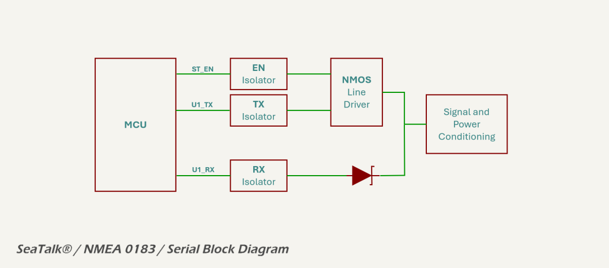

# _LEGACY IO_ Domain

On selected models, the MDD400 includes a plug-and-play serial interface that supports legacy marine protocols such as NMEA 0183 and SeaTalk® I. The interface is designed to be fault-tolerant and electrically safe in the face of reversed wiring, high-voltage transients, and EMI.

Highlights include:

* receive-only support for NMEA 0183 and RS422 talkers;
* half-duplex, single-wire support for SeaTalk® I;
* multi-stage input filtering and protection;
* optional transmission capability with controlled driver gating; and
* EMC-compliant design with safe operation under all 3-pin wiring permutations.

Given the 12 V signaling levels and the lack of galvanic isolation in typical legacy marine installations, the interface is engineered to maintain signal integrity and electromagnetic compatibility (EMC) through robust input filtering, carefully managed ground domains, and multi-stage protection. The entire legacy serial interface is galvanically isolated using opto-isolators for both the receive and transmit paths. This ensures safe operation even in the presence of wiring faults, ground loops, or installation errors, and improves immunity to conducted and radiated EMI.

The legacy interface accepts a single bidirectional signal line (`ST_SIG`), which is filtered and protected before being interfaced with the internal logic domain. 

The interface can operate either as a half-duplex, single-wire SeaTalk® I node (RX/TX), or in NMEA 0183 listener-only mode. The mode and protocol is selected in firmware.

## SeaTalk® I Mode (Single Wire, RX/TX)

SeaTalk® I is a single-wire bus using 12 V signaling, where idle = 12 V, logic 0 = pulled to 0 V. It requires careful coordination between transmit and receive functions. The MDD400 handles this using a half-duplex scheme:

- when not transmitting, the ST_TX line is tri-stated, and the receiver monitors incoming traffic on `ST_SIG`;
- to transmit, [`ST_EN`](../../quick_reference.md) is asserted to activate the driver circuitry, pulling `ST_SIG` low as needed;
- an MCU-controlled TX driver sinks current during transmission and releases the line for receive or idle;
- after transmission, the output drivers are immediately disabled to avoid contention with other devices on the bus; and
- The RX stage remains active continuously and is tolerant of slow signal edges typical of long cable runs.

Timing and contention avoidance are handled in firmware. The circuit allows for reliable operation, even on long or noisy SeaTalk® I networks.

## NMEA 0183 Mode (RX-only)

For NMEA 0183 sources, the MDD400 operates in receive-only mode. The external talker is typically a GPS, depth sounder, or wind instrument.

Although the NMEA standard allows for differential signaling (RS-422), most talkers in the marine environment operate in single-ended mode. This circuit, using an opto-isolator, is compatible with both differential and single-ended talkers. In RS422 and NMEA 0183 differential signaling, the "B" line is typically the inverting signal. When operating in single-ended mode, as used by this interface, `ST_SIG` should be connected to the "B" line to preserve correct logic polarity. This ensures that a logic 0 on the bus — corresponding to "B" being more positive than "A" — results in an active-low level at the receiver, aligning with the expected behavior of the non-inverting opto-isolated input stage.

Only the receiver of the interface is used in NMEA 0183 mode. The isolated, level-shifted signal is passed to \[`ST_RX`\] via an opto-isolator. No transmission is attempted, and the [`ST_EN`](../../quick_reference.md) signal remains low to ensure the transmitter remains disabled.

The [opto-isolated receiver circuit](rx_buffer.md) draws approximately 4.5 mA from the signal line when active, equivalent to an input impedance of ~2.7 kΩ. This is within the NMEA 0183 listener specification (≥2 kΩ) and allows multiple such receivers to be paralleled on the same talker output. In RS422 single-ended applications, the loading remains well within the drive capability of standard drivers, supporting multi-listener configurations without signal degradation.

See the [quick reference](../../quick_reference.md) for the ESP32-S3 GPIO allocations.

## Datasheets and References

1. Lite-On Inc., [*LTV-357T Optocoupler Datasheet*](https://optoelectronics.liteon.com/upload/download/DS70-2005-001/S_357T_LTV-357T_LTV-357T-G.pdf)
2. Noland Engineering, [*Understanding and Implementing NMEA 0183 and RS422 Serial Data Interfaces*](https://www.nolandeng.com/downloads/Interfaces.pdf)
3. Raymarine, [*SeaTalk® Interface Overview*](https://web.archive.org/web/20090902021951/http://raymarine.custhelp.com/app/answers/detail/a_id/1016/~/seatalk-communications---overview)
