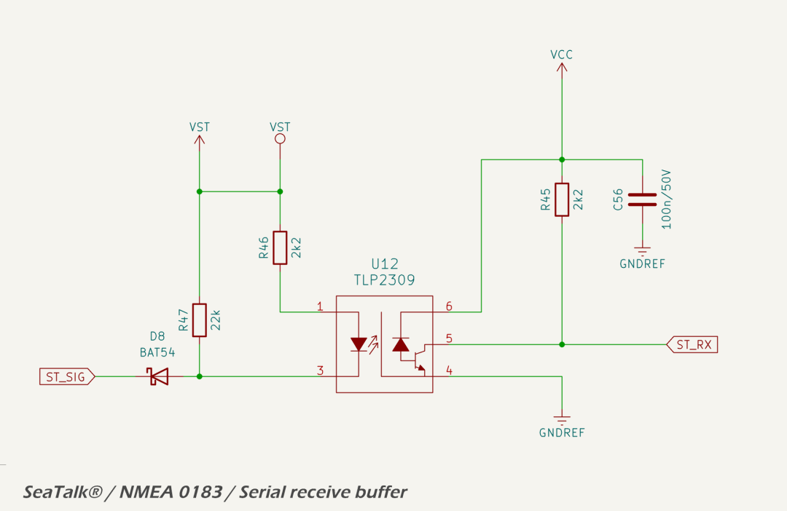

# RX Buffer

The receiver is a non-inverting, opto-isolated buffer compatible with SeaTalk<sup>®</sup> I, NMEA 0183 and RS232/RS422 protocols, as shown in the schematic below.



The receive circuit uses a high-speed logic gate opto-isolator ([TLP2309](https://toshiba.semicon-storage.com/ap-en/semiconductor/product/isolators-solid-state-relays/detail.TLP2309.html)) to provide galvanic isolation between the legacy serial input and the digital logic domain. The signal from the `ST_SIG` line passes through a [Schottky diode](https://lcsc.com/datasheet/lcsc_datasheet_2410010302_Nexperia-BAT54J-115_C130415.pdf) in series with the input, which blocks the local pull-up resistor from loading the shared bus. The line is pulled up to the local rail (`VST`) via a 22 kΩ resistor. When the external line is driven low, current flows through a 2.2 kΩ current-limiting resistor into the LED side of the opto-isolator. The output stage is non-inverting, preserving the polarity of the incoming signal for direct interpretation by the MCU.

The Toshiba TLP2309 is selected for its low input threshold current and fast switching performance. With `VST` nominally at 12 V and a worst-case forward drop of 0.45 V across the Schottky diode, the input current through the opto LED is approximately:

```
If = (12 V - 0.45 V - 1.2 V) / 2.2 kΩ ≈ 4.5 mA
```

This is sufficient to ensure reliable turn-on of the TLP2309 LED even with moderate forward voltage variation. The opto is operated well into saturation, ensuring a strong output pull-down on the open-collector transistor.

The output of the opto-isolator is pulled up to `VCC` (3.3 V) via a 2.2 kΩ resistor and filtered with a 100 nF capacitor. This produces a logic-compatible signal on the MCU receive pin ([`ST_RX`](../../quick_reference.md)).

Power domain isolation is maintained by supplying the input side of the opto from `VST` (legacy side), and the output side from `VCC` (logic side), with completely isolated grounds. The opto-isolator withstands up to 5000 Vrms isolation voltage and features high common-mode transient immunity.

The input resistor and diode combination ensures that the circuit can tolerate power transients and communication line voltages up to the clamp threshold of the upstream TVS diode, specified at 58 V. The worst-case current into the LED during such transients is limited to:

```
If(max) = (58 V - 1.2 V) / 2.2 kΩ ≈ 25.8 mA
```

This remains well below the absolute maximum continuous forward current rating of the opto LED (30 mA), and is transient in nature. The opto-isolator can safely absorb these short-duration surges without damage.


## Datasheets and References

1. Toshiba, [*TLP2309 High-Speed Logic Gate Opto-Isolator Datasheet*](https://toshiba.semicon-storage.com/ap-en/semiconductor/product/isolators-solid-state-relays/detail.TLP2309.html)
2. Nexperia, [*BAT54J Schottky Diode Datasheet*](https://lcsc.com/datasheet/lcsc_datasheet_2410010302_Nexperia-BAT54J-115_C130415.pdf)
