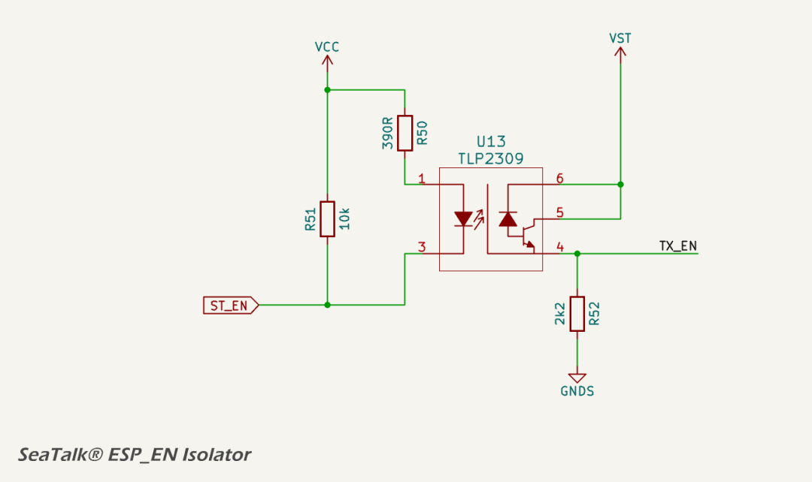
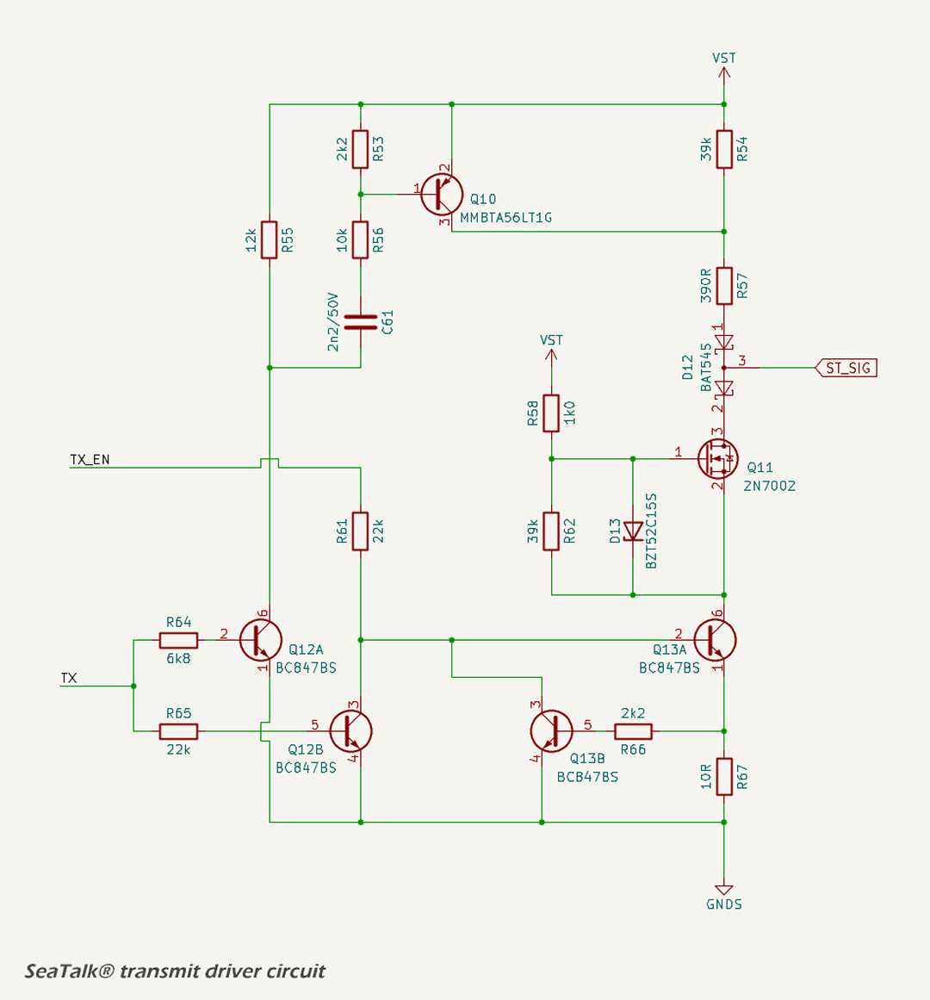

# TX Driver

For SeaTalk® I, which uses a single bi-directional wire, the MDD400 must also drive the `ST_SIG` line during transmission. The transmitter consists of three discrete stages:

* UART TX isolator;
* enable (EN) isolator; and
* NMOS TX line driver.

The UART isolator transfers the TX signal from the MCU ([`ST_TX`](../../quick_reference.md)) across the isolation barrier. The EN isolator provides independent gating control, allowing the transmitter to be tri-stated when inactive. These two control signals drive the gate and source of a discrete NMOS transistor, which forms the final line driver. The transistor pulls the signal line low to transmit a logic '0', and is otherwise high-impedance, allowing shared-bus operation with legacy SeaTalk® devices. Slew rate control is implemented via gate resistance and capacitance.

The TX circuit is disabled by default on startup ([`ST_EN`](../../quick_reference.md) is HIGH), and must be explicitly enabled by firmware.

See the [quick reference](../../quick_reference.md) for the ESP32-S3 GPIO allocations.

## TX Isolator

The TX isolator transfers the UART output signal from [`ST_TX`](../../quick_reference.md) across the isolation barrier using a [TLP2309 opto-isolator](https://lcsc.com/datasheet/lcsc_datasheet_2410010231_TOSHIBA-TLP2309-TPL-E_C85066.pdf), as shown in the schematic below.

The input to the opto-isolator is driven by the MCU TX line through a 10 kΩ pull-up and a 390 Ω series resistor. The 10 kΩ pull-up ensures that the opto is off by default, avoiding spurious transmissions during startup. The 390 Ω resistor limits the forward current through the internal LED when driven low. The `VCC` rail on the logic side is 3.3 V, resulting in approximately 6.7 mA of forward current, well within the saturation range for the device.

On the output side, the phototransistor pulls down the TX node through its open collector when active. A 2.2 kΩ pull-up to the `VST` supply ensures the line is held high when the opto is off. The output stage operates in saturation for logic '0' and cut-off for logic '1', providing non-inverting buffering. The resulting signal is then passed to the line driver stage.

The use of opto-isolation ensures galvanic separation between the MCU and the external interface, preventing ground loop currents and allowing robust operation in marine environments with potentially noisy or poorly referenced grounds.

## EN Isolator

The EN isolator uses a [TLP2309 opto-isolator](https://lcsc.com/datasheet/lcsc_datasheet_2410010231_TOSHIBA-TLP2309-TPL-E_C85066.pdf) to buffer the [`ST_EN`](../../quick_reference.md) signal across the isolation barrier. This allows the microcontroller to enable or disable the line driver while maintaining galvanic isolation.

The EN Isolator is an inverting buffer with default-disable logic. The line driver is disabled unless the microcontroller explicitly enables it by pulling ST_EN low. This configuration ensures predictable startup behavior and avoids unintended transmissions during boot.

The input side of the isolator is biased by a 10 kΩ pull-up to `VCC` and driven low by the microcontroller to activate the internal LED. A 390 Ω current-limiting resistor sets the forward current through the LED. This configuration ensures that the opto-isolator remains off by default, unless actively driven by firmware.

The output stage is an open-collector phototransistor with a 2.2 kΩ pull-down resistor. When the isolator is off, the EN line is pulled low, disabling the line driver. When the LED is forward biased, the phototransistor conducts, pulling the EN line high toward `VST`.

## NMOS TX Driver

The TX driver circuit implements an isolated, open-drain interface compatible with the SeaTalk® I single-wire serial protocols. It consists of three functional elements:

* a low-side NMOS transistor driven by a two-stage buffer ([BC847BS](https://assets.nexperia.com/documents/data-sheet/BC847BS.pdf) and [2N7002](https://assets.nexperia.com/documents/data-sheet/2N7002.pdf));
* a high-side rise-time assist stage using a [PNP transistor](https://lcsc.com/datasheet/lcsc_datasheet_2410121952_onsemi-MMBTA56LT1G_C85394.pdf) and timing network; and
* a current-limiting feedback loop to protect the gate driver stage.

The TX driver is enabled by a logic-high level on the EN line. When enabled, the output state is controlled by the TX signal (received from the opto-isolated [`ST_TX`](../../quick_reference.md) line).

### Low-Side Gate Driver

The low-side driver consists of two NPN transistors. Q12B acts as a level shifter and logic inverter driving Q13A, which sinks the gate of the NMOS transistor (Q11) when active. When the TX signal is high (idle), current flows into the base of Q12B via a 24.2 kΩ path, turning it on. This pulls the base of Q13A low, switching it off. With Q13A off, Q11's gate is not pulled low and Q11 remains off. As a result, `ST_SIG` floats to `VST` through a high-value pull-up resistor.

When the TX signal goes low, Q12B turns off, allowing Q13A's base to rise via its own bias network. Q11A turns on, pulling Q11's gate high as current flows through R62, enabling the NMOS to conduct. Q13A also provides a return path from Q11's source to ground, completing the conduction path and pulling `ST_SIG` low.

### High-Side Assist Stage

To accelerate the rising edge of `ST_SIG` during low-to-high transitions, the circuit includes a high-side pulse driver consisting of Q12A and a [PNP transistor](https://lcsc.com/datasheet/lcsc_datasheet_2410121952_onsemi-MMBTA56LT1G_C85394.pdf). When TX goes high, Q12A turns on and its collector is pulled low. This initiates two current paths:

* a DC path through R55 provides sustained current flow and discharges C61 between transitions; and
* an AC-coupled path through R53, R56, and C61 briefly turns on the PNP transistor as C51 charges.

The PNP sources current from `VST` through R57 into the `ST_SIG` line, providing a sharp rising edge to quickly restore the bus to idle. Once C61 charges, the PNP turns off and the line remains passively pulled up.

The 1 nF capacitor C61 and 12 kΩ discharge path via R55 has a time constant of approximately 12 µs. This ensures the capacitor fully discharges between transitions at baud rates up to around 36 kbps, comfortably supporting SeaTalk® I (4800 bps).

### Feedback Current Limiting

When Q13A conducts, current flows through R67 to ground. As the voltage across R67 rises, Q13B turns on and sinks current from Q13A's base, reducing its drive and limiting the collector current. This feedback loop prevents excessive current through Q13A and Q1 during active-low output states.

The combined effect of these stages is a robust, actively driven open-drain TX interface with controlled transition edges, power-up fail-safe behavior, and compatibility with legacy single-wire serial protocols.

## Datasheets and References

1. Toshiba, [*TLP2309 Opto-Isolator Datasheet*](https://lcsc.com/datasheet/lcsc_datasheet_2410010231_TOSHIBA-TLP2309-TPL-E_C85066.pdf)
2. Diodes Incorporated, [*BAT54 Series Schottky Diode Datasheet*](https://www.diodes.com/assets/Datasheets/BAT54_A_C_S.pdf)
3. Diotec, [*BZT52B2V4 Zener Diode Datasheet*](https://diotec.com/request/datasheet/bzt52b2v4.pdf)
4. Nexperia, [*BC847BS NPN Transistor Datasheet*](https://assets.nexperia.com/documents/data-sheet/BC847BS.pdf)
5. Nexperia, [*2N7002 NMOS Transistor Datasheet*](https://assets.nexperia.com/documents/data-sheet/2N7002.pdf)
6. Onsemi, [*MMBTA56 PNP Transistor Datasheet*](https://lcsc.com/datasheet/lcsc_datasheet_2410121952_onsemi-MMBTA56LT1G_C85394.pdf)
