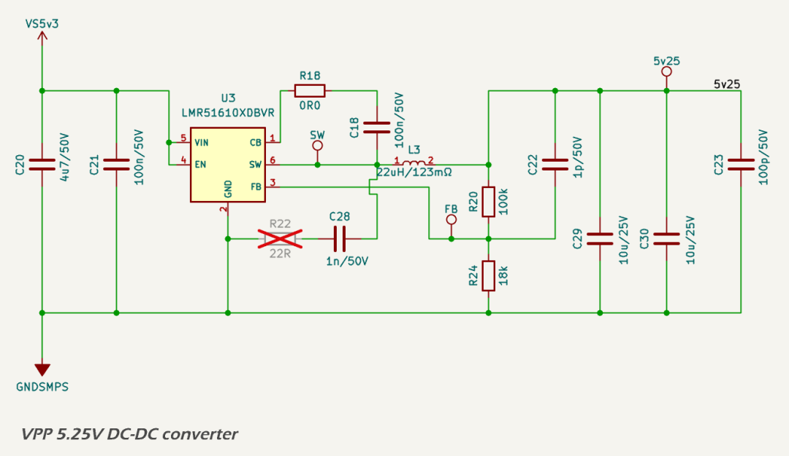
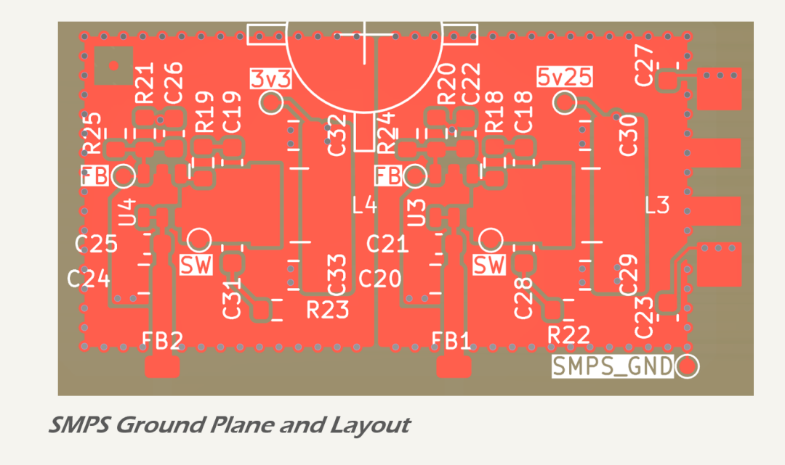

# VDD DC-DC Converter (5.0 V)

## Design Criteria

The VDD domain supplies intermediate 5.0 V power for the [DWIN TFT LCD display](https://www.dwin-global.com/4-0-inch-intelligent-display-model-dmg48480f040_02wtcz02cof-series-product/) and its backlight. It is generated from the 12 V input rail (VSC) using a high-efficiency synchronous buck converter based on the [Texas Instruments LMR51610](https://www.ti.com/lit/ds/symlink/lmr51610.pdf). Key design requirements include:

* provide a stable 5.0 V output for logic and interface subsystems;
* operate reliably across a 8 – 24.8 V automotive/RV supply range;
* support total continuous output load of up to 250 mA with headroom for transient loads;
* achieve high conversion efficiency to minimize thermal dissipation; and
* suppress switching noise and ripple to meet EMC and analog performance targets.

Only the DWIN LCD display and [Jiangsu Huaneng MLT-8530](https://lcsc.com/datasheet/lcsc_datasheet_2410010301_Jiangsu-Huaneng-Elec-MLT-8530_C94599.pdf) buzzer are powered from VDD. Peak current consumption is ~250 mA under full brightness conditions.

## Circuit Description

The circuit schematic for the 5.0 V DC-DC converter is based on the Texas Instruments [WEBENCH design](../../assets/pdf/5v3_smps_design_report.pdf).

The input filter includes bulk and high-frequency ceramic decoupling capacitors to suppress incoming noise and transients, along with a [Murata BLM31KN601SN1L](https://www.lcsc.com/datasheet/lcsc_datasheet_2209271730/Murata-Electronics-BLM31KN601SN1L_C668306.pdf) 600 Ω @ 100 MHz ferrite bead to isolate the SMPS from the system input rail. Input bypassing is provided by a 4.7 µF X7R MLCC (C20), supported by a 100 nF high-frequency decoupling capacitor (C21).

The regulator is a synchronous buck converter implemented with the [LMR51610](https://www.ti.com/lit/ds/symlink/lmr51610.pdf), configured for 400 kHz switching frequency (LMR51610XDBVR). A 22 µH shielded inductor ([Bourns SRN5040TA-220M](https://www.bourns.com/docs/product-datasheets/srn5040ta.pdf?sfvrsn=df477df6_5)) with 135 mΩ DCR and 1.6 A saturation current is used to meet ripple, thermal, and size constraints. Output capacitance is provided by two 10 µF X7R MLCCs, resulting in a peak-to-peak output ripple of 14.6 mV under maximum load.

The feedback divider (100 kΩ / 18 kΩ) sets the output voltage to 5.0 V. The circuit includes placeholder footprints for an RC snubber across the SW node (R22/C28) and a resistor in series with the bootstrap capacitor (R18). These are not populated by default but may be fitted during validation to suppress ringing or reduce EMI, consistent with the recommendations in TI application notes [SLYT465](https://www.ti.com/lit/an/slyt465/slyt465.pdf) and [SNVAA73](https://www.ti.com/lit/an/snvaa73/snvaa73.pdf).

## Protection

The LMR51610 integrates multiple protection mechanisms to ensure safe operation under fault conditions:

* cycle-by-cycle peak current limiting;
* thermal shutdown at 165 °C junction temperature; and
* under-voltage lockout (UVLO) on the VIN rail (not implemented).

These features protect the regulator and downstream loads from short circuits, overheating, and brownouts.

## Performance

Simulated performance from the WEBENCH model under worst-case input (18 V) and output (245 mA) conditions is as follows:

* output voltage: 5.244 V (nominal 5.0 V);
* efficiency: 93.1%;
* total power dissipation: 95 mW;
* phase margin: 61.1°;
* gain margin: −15.6 dB; and
* peak inductor ripple current: 427 mA.

Thermal analysis shows that the SRN5040TA-220M inductor dissipates 9.3 mW at 245 mA load, resulting in a temperature rise of less than 0.3 °C. Junction temperatures remain within specification at ambient temperatures up to 80 °C.

## Components

The following components were selected to meet performance, cost, and availability constraints, while ensuring reliable operation under all specified conditions:

* regulator IC: [Texas Instruments LMR51610](https://www.ti.com/lit/ds/symlink/lmr51610.pdf), 6-pin SOT-23 (LMR51610XDBVR);
* inductor: [Bourns SRN5040TA-220M](https://www.bourns.com/docs/product-datasheets/srn5040ta.pdf?sfvrsn=df477df6_5), 22 µH, 110 mΩ DCR;
* output capacitor: 2 × 10 µF X7R MLCCs (0805);
* output filtering: [Murata BLM31KN601SN1L](https://www.lcsc.com/datasheet/lcsc_datasheet_2209271730/Murata-Electronics-BLM31KN601SN1L_C668306.pdf) 600 Ω @ 100 MHz ferrite bead; and
* feedback, compensation, and timing components: 0402 1% thick-film (125 mW) resistors and X7R MLCCs.

## PCB Layout

The SMPS is laid out on a 4-layer board with dedicated GNDSMPS and VSC planes. Layout considerations include:

* tight input loop between VIN, input capacitors, and GND;
* compact placement of output filter and inductor for minimal VOUT loop area;
* SW node contained within a ground moat and surrounded by stitching vias;
* provision for optional snubber components adjacent to SW; and
* extensive via stitching between top/bottom copper and inner ground planes.

These layout choices support low EMI, stable regulation, and safe thermal performance.

---

## References

1. Texas Instruments, [WEBENCH Design Report](../../assets/pdf/5v3_smps_design_report.pdf)
2. Texas Instruments, [LMR51610 Datasheet](https://www.ti.com/lit/ds/symlink/lmr51610.pdf)
3. Bourns, [SRN5040TA-220M Datasheet](https://www.bourns.com/docs/product-datasheets/srn5040ta.pdf?sfvrsn=df477df6_5)
4. Murata, [BLM31KN601SN1L Datasheet](https://lcsc.com/datasheet/lcsc_datasheet_2209271730/Murata-Electronics-BLM31KN601SN1L_C668306.pdf)
5. DWIN, [DMG48480F040\_02WTCZ02COF Datasheet](https://www.dwin-global.com/4-0-inch-intelligent-display-model-dmg48480f040_02wtcz02cof-series-product/)
6. Jiangsu Huaneng, [MLT-8530 Datasheet](https://lcsc.com/datasheet/lcsc_datasheet_2410010301_Jiangsu-Huaneng-Elec-MLT-8530_C94599.pdf)
7. Texas Instruments, [SLYT465](https://www.ti.com/lit/an/slyt465/slyt465.pdf)
8. Texas Instruments, [SNVAA73](https://www.ti.com/lit/an/snvaa73/snvaa73.pdf)

