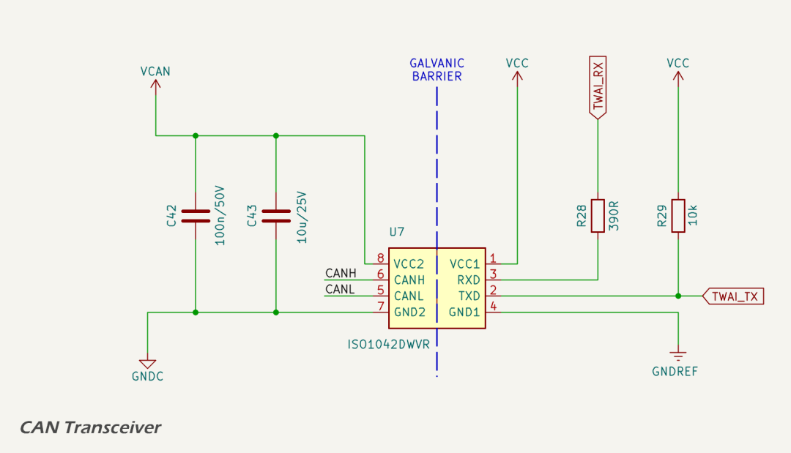

The TWAI / CAN interface is isolated from the digital domain using a galvanically isolated [CAN transceiver](https://www.ti.com/lit/ds/symlink/iso1042.pdf). This device provides 5 kVrms isolation between the controller side and the CAN side. A dedicated 5 V isolated supply, `VCAN`, is used to power the CAN side.

Logic-level CAN communication is implemented through the TX and RX pins:

* `TWAI_TX` connects to the transceiver’s TXD pin. A 10 kΩ pull-up resistor ensures a defined idle state and reduces noise susceptibility when the MCU pin is high-Z; and
* `TWAI_RX` is connected to the transceiver’s RXD pin via a 390 Ω series resistor, which limits inrush current, dampens reflections, and protects the ESP32 input from voltage overshoot.

The ISO1042 includes several internal features to prevent CAN bus lock-up or erratic behaviour:

* TXD dominant timeout protects against stuck-low faults on the TX line;
* undervoltage lockout disables outputs when either side loses power;
* failsafe biasing ensures a recessive state if lines are unconnected or inputs are floating;
* thermal shutdown protects the device during sustained fault conditions.

These features allow the unit to recover automatically from faults without locking the bus.

Neither `TWAI_TX` nor `TWAI_RX` are strapping pins on the ESP32-S3, ensuring reliable CAN bus behaviour during flashing, reset, and power-up.

## Datasheets and References

1. Texas Instruments, [*ISO1042 Isolated CAN Transceiver*](https://www.ti.com/lit/ds/symlink/iso1042.pdf)
