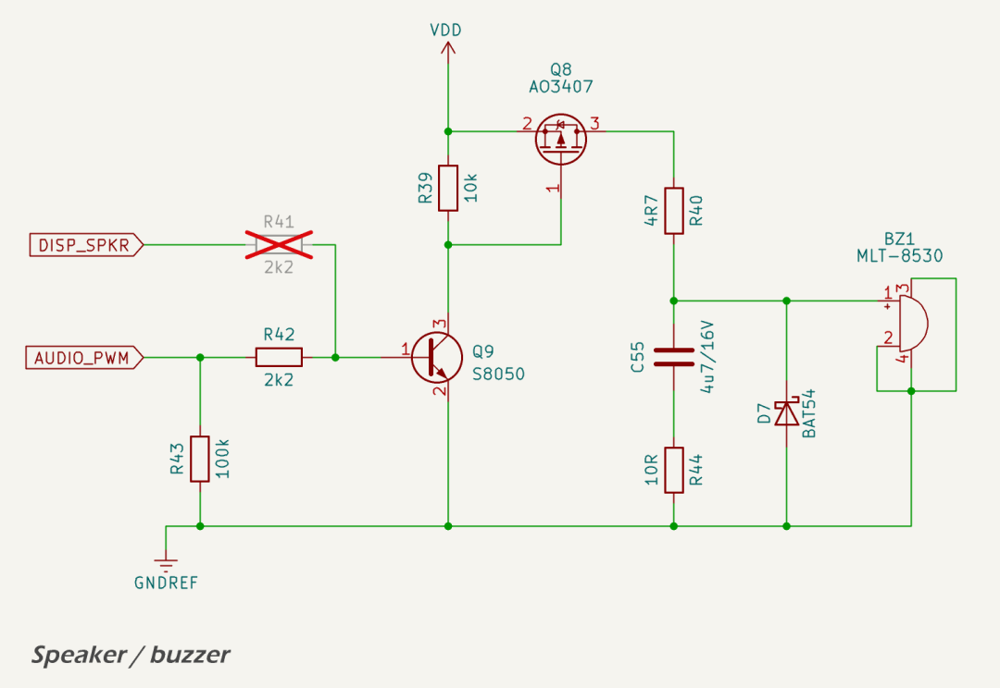
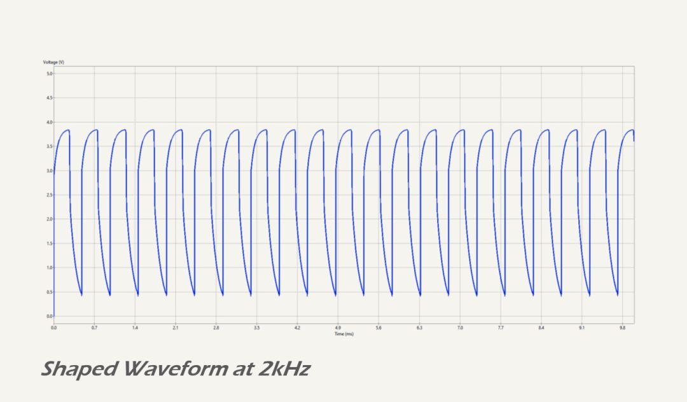
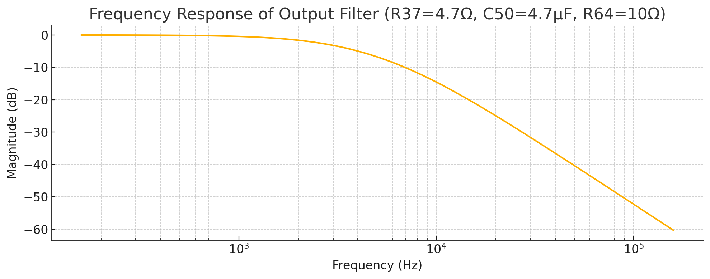

The [Jiangsu Huaneng MLT-8530 audio transducer](https://lcsc.com/datasheet/lcsc_datasheet_2410010301_Jiangsu-Huaneng-Elec-MLT-8530_C94599.pdf) has a 16 Ω nominal impedance, rated for 5 V operation.

## Schematic

The transducer is driven through a two-stage switching circuit composed of a low-side [SS8050 NPN transistor](https://lcsc.com/datasheet/lcsc_datasheet_2308071512_JSMSEMI-SS8050_C916392.pdf) and a high-side [AO3407A P-channel MOSFET](https://lcsc.com/datasheet/lcsc_datasheet_2311091734_UMW-Youtai-Semiconductor-Co---Ltd--AO3407A_C347478.pdf). This configuration allows the logic-level PWM signal from the ESP32 (`AUDIO_PWM`) to enable the MOSFET and pass power to the transducer from the 5 V `VDD` rail.

Both `AUDIO_PWM` and `DISP_SPKR` signals are routed to the SS8050 base through 2.2 kΩ resistors, allowing either source to activate the transducer. In production, `DISP_SPKR` is not connected, and only `AUDIO_PWM`is used. A 100 kΩ pulldown on the transistor base ensures the transducer remains off during MCU boot or if the pin is floating. The MOSFET gate has a 10 kΩ pull-up to `VDD` to default it off.

A [BAT54](https://www.diodes.com/assets/Datasheets/BAT54_A_C_S.pdf) Schottky diode (D6) is placed across the transducer terminals to absorb inductive kickback, protecting the MOSFET during switching.

The output is passed through a second-order passive low-pass filter to attenuate high-frequency harmonic content in the PWM waveform. The filter consists of a 4.7 Ω series resistor and 4.7 µF capacitor (R37 and C50), followed by a 10 Ω damping resistor (R64) to GND. This provides a cutoff frequency in the range of 3–7 kHz, sufficient to retain tones from C6 to A7 while reducing acoustic harshness.

## Tone Shaping

The typical tonal range intended for alert signals is C6 (1,046 Hz) to A7 (3,520 Hz). The analog filter at the transducer input attenuates harmonics above ~3–5 kHz, producing a softer and less buzzy tone. This preserves intelligibility and presence without introducing significant volume loss.

The frequency response of the filter and the shaped output waveform (at 2,092kHz) are shown below.

The series RC filter also helps reduce EMI from the high-frequency PWM switching edges.

---

## Datasheets and References

* JSMSEMI, [*SS8050 NPN Transistor Datasheet*](https://lcsc.com/datasheet/lcsc_datasheet_2308071512_JSMSEMI-SS8050_C916392.pdf)
* UMWElectronics, [*AO3407A P-Channel MOSFET Datasheet*](https://lcsc.com/datasheet/lcsc_datasheet_2311091734_UMW-Youtai-Semiconductor-Co---Ltd--AO3407A_C347478.pdf)
* Jiangsu Huaneng, [*MLT-8530 Piezoelectric Audio Transducer Datasheet*](https://lcsc.com/datasheet/lcsc_datasheet_2410010301_Jiangsu-Huaneng-Elec-MLT-8530_C94599.pdf)
* Diodes Incorporated, [*BAT54 Series Schottky Diode Datasheet*](https://www.diodes.com/assets/Datasheets/BAT54_A_C_S.pdf)
