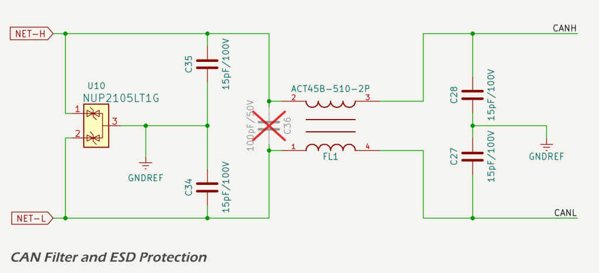

An industry-standard CANBUS interface is provided that is fully compatible with *NMEA 2000* and RV-C backbones. The interface uses a standard 5-pin A-coded male DeviceNet connector and a 3.3 V non-isolated CAN transceiver, directly interfaced to the MCU TWAI peripheral. This topology aligns with common NMEA 2000 device implementations, where the CAN transceiver ground is referenced to the vessel network ground.

The CAN physical layer is implemented using the Texas Instruments [SN65HVD234](https://www.ti.com/lit/ds/symlink/sn65hvd234.pdf) 3.3 V high-speed CAN transceiver. The device is controlled by the MCU using standard TXD and RXD signals, with an additional *ST_EN* (standby enable) control line used to place the transceiver into a low-power standby state when the CAN interface is not required.

## Connector

Connection to the NMEA 2000 network is via a standard 5-pin A-coded male DeviceNet connector, following the physical layer defined by the NMEA 2000 micro connector specification.

The five pins are assigned as follows:

* **Pin 1 – `SHLD`**: connected to the cable shield (drain wire). This pin is not connected internally. It is left floating to comply with NMEA 2000 practice, which requires the shield to be bonded to vessel ground at a single point;
* **Pin 2 – `NET-S`**: power supply positive (+12 V nominal) supplied by the NMEA 2000 backbone;
* **Pin 3 – `NET-C`**: power supply common (0 V), which serves as the ground reference for the CAN transceiver and device power input;
* **Pin 4 – `NET-H`**: CAN high, the dominant high-level differential signal on the CANBUS; and
* **Pin 5 – `NET-L`**: CAN low, the dominant low-level differential signal on the CANBUS.

The connector is sealed and keyed to ensure correct mating orientation and environmental protection.

## Signal Conditioning and Protection

The interface incorporates onboard ESD protection, surge suppression, and filtering on the CAN differential pair.

The `NET-H` and `NET-L` signals pass through the following elements prior to reaching the transceiver:

* small-value capacitors to local CAN ground, providing high-frequency common-mode filtering;
* a differential capacitor across `NET-H` and `NET-L`, attenuating differential-mode noise;
* a [common-mode choke](https://www.murata.com/en-us/products/productdata/8807038415390/QTN0099C.pdf) to suppress high-frequency common-mode interference;
* a [dual transient voltage suppression (TVS) array](https://www.onsemi.com/pdf/datasheet/nup2105l-d.pdf) providing protection against differential and common-mode voltage transients; and
* a non-isolated CAN transceiver implementing the physical layer interface.

The CAN signals are routed as a tightly coupled differential pair with controlled impedance. Routing is kept short and direct between the connector, filtering components, and transceiver to minimise parasitic inductance and discontinuities. Symmetry is maintained to preserve signal integrity and reduce mode conversion.

These measures are intended to minimise emissions and maximise immunity to electrical noise, supporting compliance with EMC standards such as CISPR 25 and ISO 11452-2, which are commonly applied to automotive and marine CAN networks.

<!--  -->

## CAN Transceiver and TWAI Interface

The SN65HVD234 operates from the 3.3 V digital supply and interfaces directly with the MCU TWAI peripheral.

Logic-level CAN communication is implemented as follows:

* `TWAI_TX` connects to the transceiver TXD input, with a pull-up resistor providing a defined recessive state when the MCU pin is high-impedance;
* `TWAI_RX` connects to the transceiver RXD output via a small series resistor, limiting inrush current and reducing susceptibility to ringing and overshoot; and
* `ST_EN` controls the transceiver operating mode, allowing the CAN interface to be placed into a low-power standby state under firmware control.

The transceiver includes internal features intended to prevent CAN bus lock-up and undefined behaviour:

* TXD dominant timeout to protect against stuck-low faults on the transmit input;
* undervoltage lockout to disable outputs if the supply voltage is out of range;
* failsafe receiver behaviour to ensure a recessive output if bus lines are open or floating; and
* thermal shutdown to protect the device under sustained fault conditions.

Neither `TWAI_TX` nor `TWAI_RX` are MCU strapping pins, ensuring predictable CAN behaviour during reset, flashing, and power-up.

## References

1. National Marine Electronics Association, *NMEA 2000 Standard®*, [https://www.nmea.org/nmea-2000.html](https://www.nmea.org/nmea-2000.html).
2. Maretron, *How do I check the health of my NMEA 2000 cabling before powering my network?*, [https://www.maretron.com/wp-content/phpkbv95/article.php?id=443](https://www.maretron.com/wp-content/phpkbv95/article.php?id=443).
3. Texas Instruments, *SN65HVD234 3.3‑V CAN Transceiver Datasheet*, [https://www.ti.com/lit/ds/symlink/sn65hvd234.pdf](https://www.ti.com/lit/ds/symlink/sn65hvd234.pdf).
4. Murata, *ACT45B‑510‑2P Common‑Mode Choke Datasheet*, [https://www.murata.com/en-us/products/productdata/8807038415390/QTN0099C.pdf](https://www.murata.com/en-us/products/productdata/8807038415390/QTN0099C.pdf).
5. onsemi, *NUP2105LT1G Dual‑Line CAN TVS Diode Datasheet*, [https://www.onsemi.com/pdf/datasheet/nup2105l-d.pdf](https://www.onsemi.com/pdf/datasheet/nup2105l-d.pdf).
6. Electronic Design, *CISPR 25 Class 5: Evaluating EMI in Automotive Applications*, [https://www.electronicdesign.com/technologies/power/article/21274517/](https://www.electronicdesign.com/technologies/power/article/21274517/).
7. In Compliance Magazine, *Automotive EMC Testing: CISPR 25, ISO 11452‑2 and Equivalent Standards*, [https://incompliancemag.com/automotive-emc-testing-cispr-25-iso-11452-2-and-equivalent-standards-part-1/](https://incompliancemag.com/automotive-emc-testing-cispr-25-iso-11452-2-and-equivalent-standards-part-1/).
