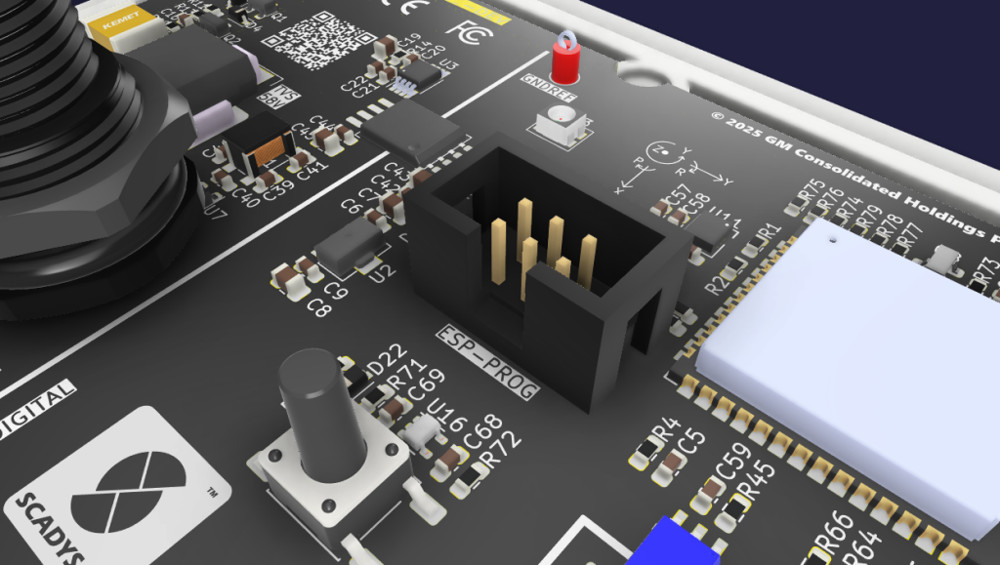
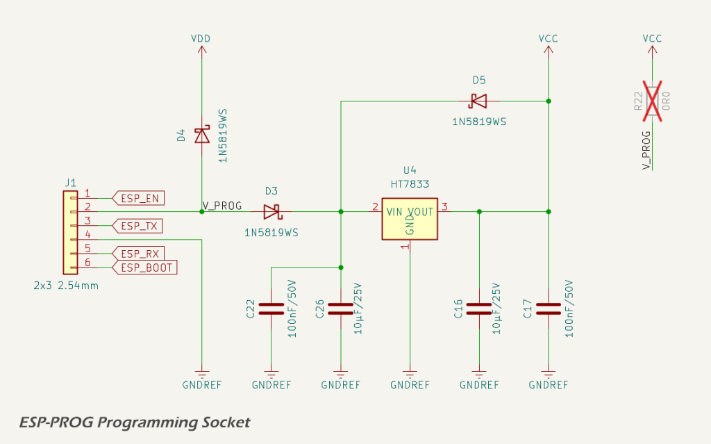

The ESP-PROG programming header provides UART and control signals for firmware upload and recovery via the ESP32-S3 ROM bootloader. The interface is compatible with Espressif’s ESP-PROG adapter and supports both development and fixture-based programming workflows.

A 6-pin, 2×3, 2.54 mm header footprint is provided. In prototype and development builds this footprint may be populated with a boxed IDC header and the associated programming power conditioning components. In standard production units, the ESP-PROG header, LDO, diodes, and all associated passives are omitted, with only the 0 Ω link between `V_PROG` and *VCC* populated. In this configuration, the board is programmed using a pogo-pin fixture that mates with the unpopulated through-hole pads of the header footprint and relies on the system *VCC* supply rather than a programming-supplied voltage.

## Signal Connections

The following ESP-PROG signals are implemented:

* `ESP_EN`: connected to the ESP32-S3 enable (reset) pin;
* `ESP_BOOT`: connected to `GPIO0` to select ROM download mode during reset; and
* `ESP_TX` / `ESP_RX`: UART0 transmit and receive signals used for flashing and console output.

These signals follow the standard ESP32-S3 programming convention and are compatible with ESP-IDF tooling and Espressif reference programmers.

## Programming Power Interface

The ESP-PROG connector includes a power input (`V_PROG`) intended to accept a nominal 5 V supply from the programmer. This input is locally conditioned and regulated before being allowed to power the 3.3 V digital domain.

Over-voltage protection and regulation are implemented using a low-dropout linear regulator stage, shown below.

The regulation and protection network operates as follows:

* `V_PROG` is fed through a Schottky diode to provide reverse-polarity protection and to decouple the programming supply from the rest of the board;
* the protected input is regulated down to 3.3 V using an HT7833 low-dropout regulator;
* the regulator output is connected to the main *VCC* rail through a second Schottky diode, preventing back-feeding of the programmer when the board is externally powered; and
* an additional diode from the local *VDD* rail to `V_PROG` clamps excessive negative or transient differentials during hot-plug events.

The LDO stage is supported by local input and output decoupling capacitors:

* 100 nF and 10 µF capacitors on the regulator input for stability and transient suppression; and
* 10 µF and 100 nF capacitors on the regulator output for load stability and noise reduction.

This arrangement ensures that an ESP-PROG supplying 5 V cannot directly overstress the 3.3 V rail, while still allowing normal operation when the board is already powered from its primary supply. The use of diode isolation avoids contention between the programming supply and the system power source.

No level shifting or buffering is provided on the UART, BOOT, or EN signals. Correct orientation and configuration of the programming adapter is therefore required.

## References

1. Espressif, *Introduction to the ESP-Prog Board*, [https://docs.espressif.com/projects/esp-iot-solution/en/latest/hw-reference/ESP-Prog_guide.html](https://docs.espressif.com/projects/esp-iot-solution/en/latest/hw-reference/ESP-Prog_guide.html).
2. Espressif, *ESP-Prog User Guide*, [https://documentation.espressif.com/espressif-esp-dev-kits/en/latest/other/esp-prog/user_guide.html](https://documentation.espressif.com/espressif-esp-dev-kits/en/latest/other/esp-prog/user_guide.html).
3. UMW, *HT78xx Series Low Dropout Regulator Datasheet*, [https://www.lcsc.com/datasheet/C347195.pdf](https://www.lcsc.com/datasheet/C347195.pdf).
4. JSMICRO Semiconductor, *1N5819WS 40 V 1 A Schottky Barrier Rectifier Datasheet*, [https://www.lcsc.com/datasheet/C2927280.pdf](https://www.lcsc.com/datasheet/C2927280.pdf).
