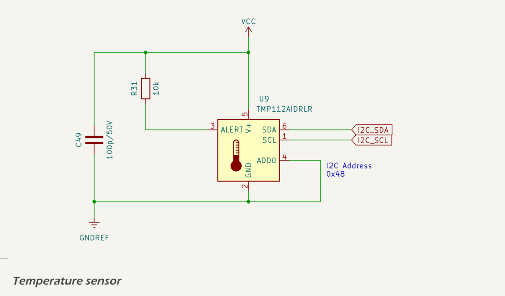

A  [TMP112AIDRLR](https://www.ti.com/lit/ds/symlink/tmp112.pdf) temperature sensor is mounted on the main board. This sensor is connected to the ESP32-S3 via the I²C bus pins `I2C_SCL` and `I2C_SDA`. The TMP112 device address is configured via the ADD0 pin to `0x48`, the default address when ADD0 is tied to GND.

The TMP112 supports 12-bit resolution (0.0625 °C per bit) with typical accuracy of ±0.5 °C across the range --40 °C to +125 °C. It is powered from the regulated logic supply (`VCC`), and includes 100 pF and 1 µF local bypass capacitors for stability. A 10 kΩ pull-up resistor is fitted on the ALERT line, allowing firmware to configure an interrupt for temperature threshold crossing if needed.

This sensor provides a reliable indicator of local temperature - particularly important in marine environments where direct sun exposure can rapidly elevate surface temperatures beyond the device's rated operating range. 