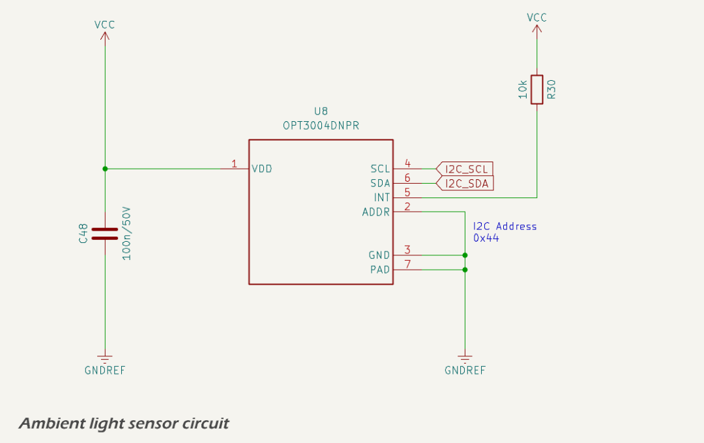

The [OPT3004DNPR](https://www.ti.com/lit/ds/symlink/opt3004.pdf) is low-power digital ambient light sensor with high dynamic range and spectral response closely matching the human eye. The sensor communicates with the ESP32-S3 via I²C (`I2C_SCL` and `I2C_SDA` pins). The OPT3004 address is configured via the ADDR pin (connected to GND), setting its I²C address to `0x44`.

The OPT3004 provides a 16-bit lux measurement over a dynamic range of 0.01 lux to 83,000 lux, automatically scaling via its built-in exponent/mantissa format. This range is ideal for both indoor/dim environments and direct sunlight detection. The sensor includes an interrupt output (INT), pulled up to VCC via a 10kΩ resistor.

The device is powered from the 3.3 V logic supply (`VCC`) and is locally decoupled with a 100 nF capacitor.

The `I2C` bus has [pull-up resistors](esp32_i2c_bus.md) on the `I2C_SCL` and `I2C_SDA` lines.