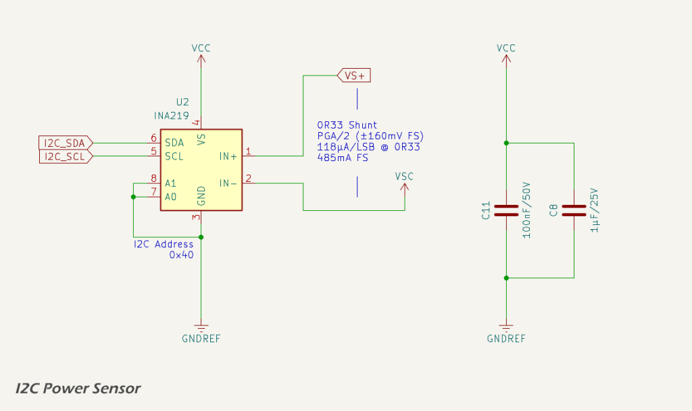

## Overview

The power sensor circuit (schematic below) uses a [INA219](https://www.ti.com/lit/ds/symlink/ina219.pdf) current/power Monitor with I²C Interface. The INA219's A1 and A0 address pins are both tied to ground, setting the address of the sensor on the I²C bus to [`0X40`].

## Voltage Sensing

The input voltage is sensed downstream of the over-voltage protection MOSFET, which disconnects the load when the supply exceeds 24.6 V. This ensures that the INA219 is never exposed to transients or sustained voltages above its absolute maximum input rating of 26 V. The INA219's VS pin is supplied from the 3.3 V digital supply rail (`VCC`), and its voltage measurement is taken between IN+ and IN− referenced to `GNDC`.

## Current Sensing

The input current is measured using a high-side 330 mΩ shunt resistor ([Yageo PT0603FR-070R33L](https://www.yageo.com/en/Product-Line/Resistors/Chip-Resistors/Thick-Film/PT/PT0603FR-070R33L)) placed between the protected supply (VS+) and the internal supply rail (VS−). This location ensures that current is measured after the MOSFET limiter, protecting the INA219 from over-current events during external transients such as load dump (ISO 7637-2 Pulse 5b).

At the maximum expected load current of 250 mA, the voltage drop across the shunt is 82.5 mV. The INA219 is configured for a programmable gain amplifier (PGA) setting of /2, yielding a ±160 mV full-scale input range. This provides sufficient headroom while maintaining acceptable resolution.

The effective current measurement resolution at 12-bit is approximately 118 μA/LSB:

* shunt voltage resolution = 160 mV / 2¹² = 39 μV;
* current resolution = 39 μV / 0.33 Ω ≈ 118 μA/LSB.

Peak measurable current without clipping is:

* Imax = 160 mV / 0.33 Ω ≈ 485 mA.

This comfortably exceeds the 250 mA peak expected load.

## Protection Considerations

By placing the shunt resistor downstream of the 24.6 V over-voltage MOSFET limiter, the INA219 is shielded from high-voltage transients and does not require additional series resistors or transient protection devices at IN+ or IN−. This simplifies the circuit and improves measurement accuracy. As a result of this topology, the INA219 only measures the regulated supply voltage seen by the protected circuits, rather than the raw external supply. This is sufficient for diagnostic and power management purposes.

## Datasheets and Citations

1. Texas Instruments, [*INA219 Current/Power Monitor With I²C Interface Datasheet*](https://www.ti.com/lit/ds/symlink/ina219.pdf)
3. Yageo, [*PT0603FR-070R33L Precision Thick Film Resistor Datasheet*](https://www.yageo.com/en/Product-Line/Resistors/Chip-Resistors/Thick-Film/PT/PT0603FR-070R33L)
