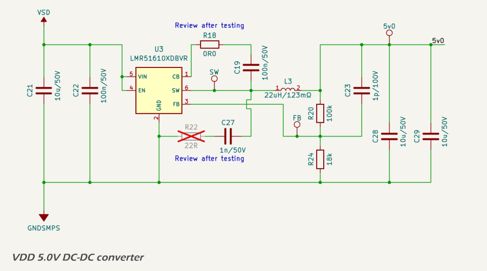

The `VDD` domain supplies intermediate 5.0 V power for the [DWIN TFT LCD display](https://www.dwin-global.com/4-0-inch-intelligent-display-model-dmg48480f040_02wtcz02cof-series-product/) and its backlight. 

Regulated 5.0 V powe is generated from the 12 V input rail (`VSD`) using a high-efficiency synchronous buck converter based on the [Texas Instruments LMR51610](https://www.ti.com/lit/ds/symlink/lmr51610.pdf). Key design requirements include:

* provide a stable 5.0 V output for logic and interface subsystems;
* operate reliably across a 8 V to 14.8 V automotive/RV supply range;
* support total continuous output load of up to 250 mA with headroom for transient loads;
* achieve high conversion efficiency to minimize thermal dissipation; and
* suppress switching noise and ripple to meet EMC and analog performance targets.

## Circuit Description

The circuit schematic for the 5.0 V DC-DC converter is based on the Texas Instruments [WEBENCH design](../../pdf/5v3_smps_design_report.pdf).

The input stage consists of a 10 µF and 100 nF ceramic decoupling capacitor directly after the isolation transformer, without any additional filtering. The upstream over-voltage protection circuit disconnects the supply above 18.6 V, ensuring that the converter operates only within its safe input range. The regulator is a synchronous buck converter implemented with the [LMR51610](https://www.ti.com/lit/ds/symlink/lmr51610.pdf), configured for 400 kHz operation (LMR51610XDBVR).

A 22 µH shielded inductor ([Bourns SRN5040TA-220M](https://www.bourns.com/docs/product-datasheets/srn5040ta.pdf?sfvrsn=df477df6_5)) with 123 mΩ DCR and 1.6 A saturation current is used to balance size, ripple, and thermal performance. Output capacitance consists of two 10 µF X7R MLCCs. A 100 pF feedforward capacitor improves transient response.

Voltage feedback is set via a 100 kΩ / 18 kΩ divider. Optional snubber components (R22/C27) and a series resistor on the bootstrap capacitor (R18) are included for evaluation and are unpopulated by default.

## Capacitor Selection and EMI Considerations

* bulk input and output capacitors are 1210-size [Murata GRM32ER71H106KA12L](https://search.murata.com/GRM32ER71H106KA12L) 10 µF X7R MLCCs. These provide high effective capacitance at typical bias voltages (12 V in, 5 V out) and excellent temperature stability;
* all other capacitors are Murata 0603 X7R or C0G types where available, selected for minimal ESR and thermal drift;
* the use of 1210 package capacitors reduces DC bias derating compared to 0805 and 0603 parts, preserving effective capacitance at operating voltage;
* distributed placement of high-frequency bypass (100 nF) and low-ESL 10 µF MLCCs reduces radiated and conducted EMI;
* the snubber footprint allows damping of high-frequency ringing on the SW node if required after EMI testing.

This approach minimises voltage ripple and resonance, suppresses switching noise, and ensures low impedance across the switching frequency range.

## Protection

The LMR51610 integrates multiple protection mechanisms:

* cycle-by-cycle peak current limiting;
* thermal shutdown at 165 °C junction temperature; and
* undervoltage lockout (UVLO) on VIN (not used in this configuration).

These protect the converter and downstream loads from faults including short circuits, overtemperature, and input brownout.

## Performance

Simulated performance (WEBENCH, 18 V input, 245 mA output):

* output voltage: 5.244 V;
* efficiency: 93.1%;
* power dissipation: 95 mW;
* phase margin: 61.1°;
* gain margin: −15.6 dB; and
* inductor ripple current: 427 mA peak.

Thermal simulation shows inductor dissipation of 9.3 mW and < 0.3 °C rise under full load. Junction temperatures remain within limits at ambient temperatures up to 80 °C.

## Layout Notes

* tight VIN-GND-SW input loop;
* short VOUT loop with output filter capacitors close to and either side of the inductor;
* SW node enclosed by ground moat with stitching vias to inner plane;
* provision for snubber at edge of SW copper;
* decoupling capacitors close to VIN and VOUT pins;
* shared GNDSMPS inner plane with solid via connection to GND pad.

These practices support low EMI, high efficiency, and robust thermal operation.

## Datasheets and References

1. Texas Instruments, [*LMR516xx SIMPLE SWITCHER® Power Converter, 4-V to 65-V, 0.6-A/1-A Buck Converter Datasheet*](https://www.ti.com/lit/ds/symlink/lmr51610.pdf)
2. Texas Instruments, [*Controlling switch-node ringing in synchronous buck converters*](https://www.ti.com/lit/an/slyt465/slyt465.pdf)
3. Texas Instruments, [*Design Consideration on Boot Resistor in Buck Converter*](https://www.ti.com/lit/an/snvaa73/snvaa73.pdf)
4. Murata, [*GRM32ER71H106KA12L 10 µF 1210 X7R Capacitor Datasheet*](https://search.murata.com/GRM32ER71H106KA12L)
5. Bourns, [*SRN5040TA-220M Power Inductor Datasheet*](https://www.bourns.com/docs/product-datasheets/srn5040ta.pdf?sfvrsn=df477df6_5)
6. Murata, [*BLM31KN601SN1L Ferrite Bead Datasheet*](https://lcsc.com/datasheet/lcsc_datasheet_2209271730_Murata-Electronics-BLM31KN601SN1L_C668306.pdf)
