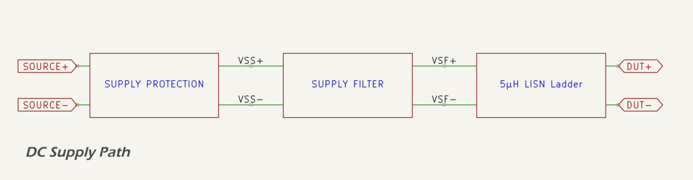
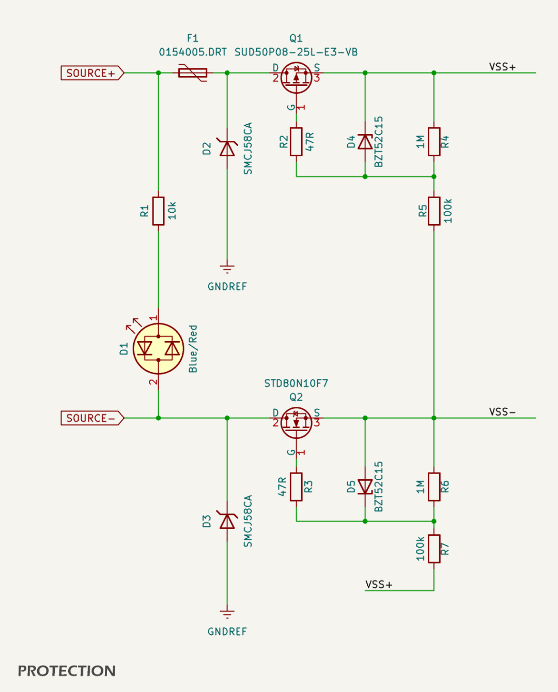
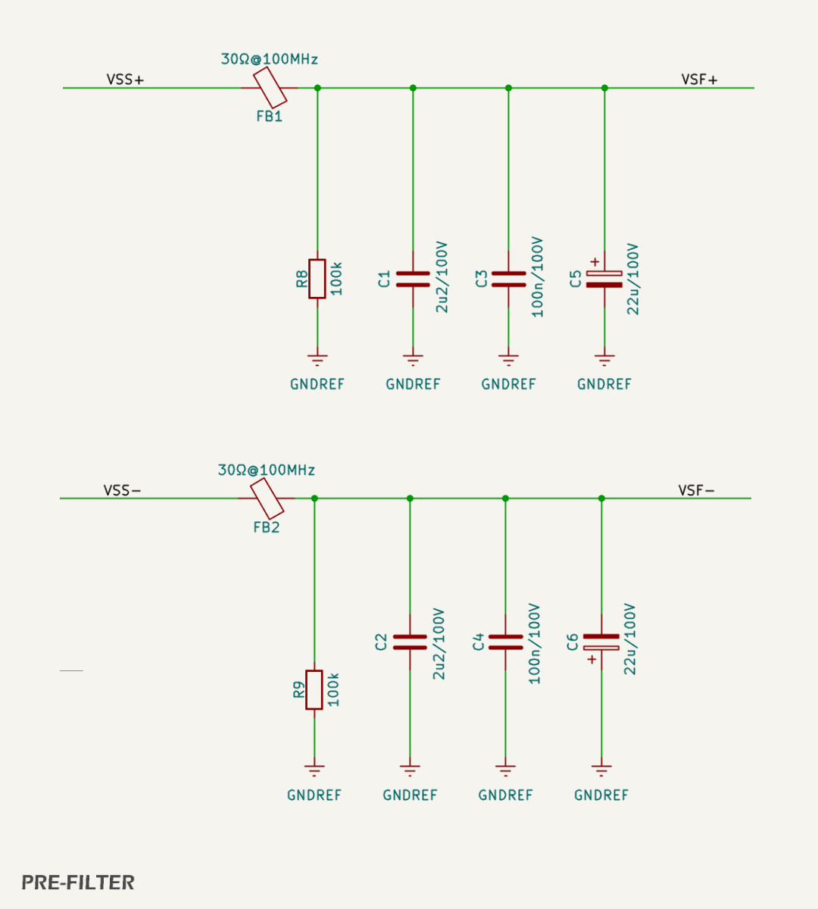
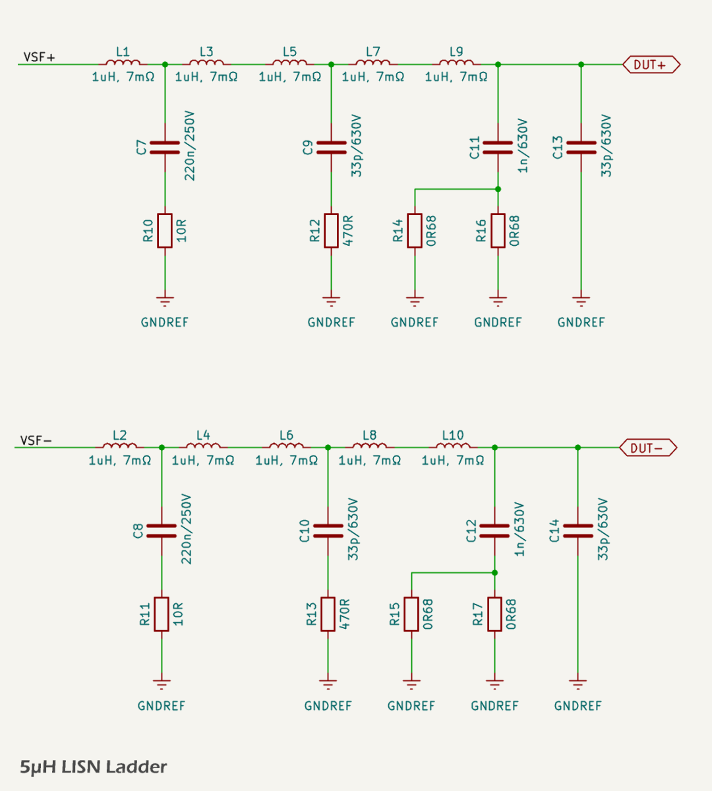
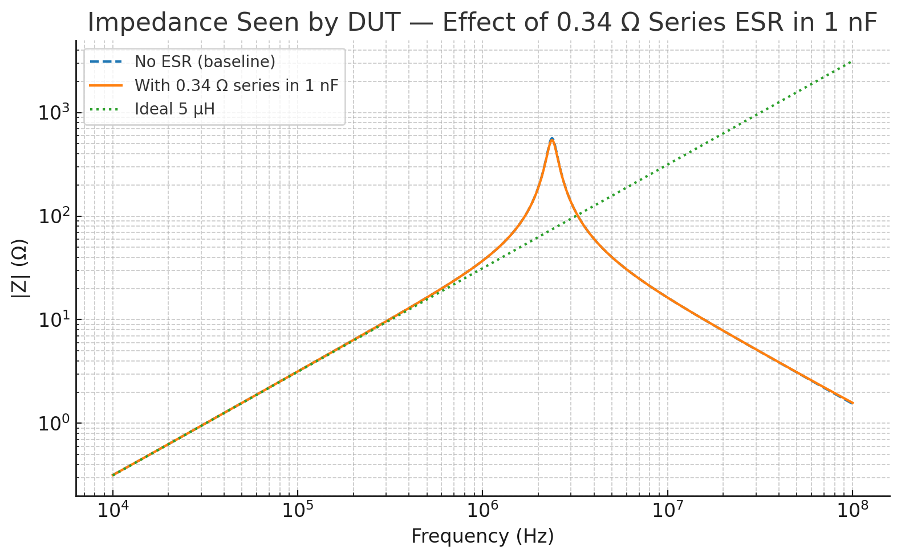
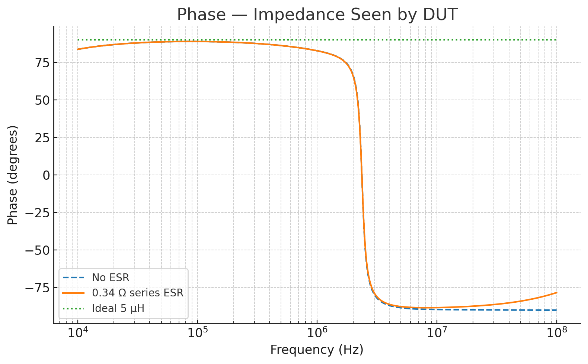

# DC Supply Path

This page explains the DC supply path used in *CANBench Duo*: from the front‑panel supply posts, through polarity protection and a compact PSU pre‑filter, into the dual‑line 5 µH LISN ladder that feeds the DUT. The intent is to survive common lab mishaps (reverse battery, ESD/benign surges), keep the bench supply’s RF hash out of the measurement ground, and present the stable impedance expected of a CISPR 25 artificial network when making conducted‑emission measurements.

## Supply Protection

The supply‑protection stage provides a low‑loss forward path when the supply is connected correctly, blocks current if the posts are reversed, suppresses fast surges and ESD at the raw inputs, and gives the user a clear visual indication of polarity. A series fuse ahead of the positive post prevents a hard fault in the LISN or DUT from damaging the power source.

Reverse‑polarity immunity is achieved with self‑driven ideal‑diode MOSFETs on both conductors. On the positive input `SOURCE+`, a P‑channel MOSFET, [`SUD50P08‑25L‑E3‑VB`](https://www.vishay.com/docs/72606/sud50p08.pdf), is wired with its drain on the post and its source on the protected rail `VSS+`. In correct polarity the body diode is reverse‑biased, so the device does not conduct until the gate is driven negative relative to the source. A 47 Ω gate stopper (`R2`) limits edge current and damps ringing, and a 100 kΩ gate‑to‑reference pull (`R5`) ensures turn‑on when a valid return exists. A 15 V zener [`BZT52C15`](https://www.diodes.com/assets/Datasheets/ds18005.pdf) (`D4`) clamps gate‑to‑source during hot‑plugging so the ±20 V limit is never exceeded. The negative conductor `SOURCE−` uses a complementary N‑channel device, [`STD80N10F7`](https://www.st.com/resource/en/datasheet/std80n10f7.pdf), with a 47 Ω gate resistor (`R3`), a 100 kΩ gate pull (`R7`), and a 15 V zener clamp (`D5`). A pair of 1 MΩ bleeds (`R4` and `R6`) guarantee a defined off‑state if either gate is left floating.

Each raw post is tied to the ground reference plane through a bidirectional TVS to catch fast connection spikes and ESD. Parts in the SMCJ58CA class (`D2`, `D3`) clamp benign events below a level that could stress the MOSFETs while remaining non‑conductive during normal 12 V and 48 V operation. Upstream of `SOURCE+` a [`Littelfuse NANO2® 5 A Slo-Blo® Fuse`](https://www.littelfuse.com/assetdocs/littelfuse_fuse_449_datasheet.pdf) provides primary over‑current protection.

A front‑panel anti‑parallel bi‑color LED (`D1`) is placed across the raw posts through a single series resistor `R1` (10 kΩ). The LED lights blue when `SOURCE+` is positive relative to `SOURCE−`, and red when the supply is reversed. At 12 V the indicator draws about 0.6 mA; at 48 V it draws approximately 3–4 mA.

### Performance

With correct polarity both MOSFETs enhance and the voltage drop is the product of current and `RDS(on)`; for the selected devices this is typically below 50 mV at a few amperes. If the supply leads are reversed, the body diodes are reverse‑biased and the gates see roughly 0 V, so no current flows into the LISN. The TVS parts clip ESD and short surges to the 50–60 V region, protecting both the MOSFET gates and the bulk capacitors downstream. The LED indicates state unambiguously and, being ahead of the MOSFETs, reflects the actual wiring rather than the protected rails.

## Supply Pre‑Filter (PSU Isolation)

The pre‑filter prevents high‑frequency noise from the bench supply from propagating into the LISN’s ground reference and the DUT wiring. It provides a local high‑frequency return path that remains upstream of the 5 µH ladder so the standardized series impedance seen by the DUT is unaffected.

Immediately after the protection stage each rail passes through a power ferrite bead (`FB1`, `FB2`). We use the Murata BLE32PN300SN1L‑class device ([datasheet](https://www.murata.com/en-us/products/productdetail?partno=BLE32PN300SN1L)), a 1210 bead with very low DC resistance and a resistive 30 Ω‑class impedance at 100 MHz. Placing the beads here ensures RF current loops close locally and do not enter the 5 µH network.

On the bead’s downstream side each rail ties to GRP with a compact three‑decade shunt stack: a 22 µF/100 V SMD electrolytic (Panasonic FK series), a 2.2 µF/100 V X7R MLCC, and a 100 nF/100 V X7R MLCC. The electrolytic provides useful ESR to damp the ceramics’ high‑Q behavior, so the combination remains well‑behaved over frequency rather than producing anti‑resonance notches. The shunts are physically tight to the bead so the high‑frequency loop area is small. Each rail includes a 100 kΩ bleed to GRP (`R8` on `VSS+`, `R9` on `VSS−`) to discharge the bulk after power‑off and to provide a static reference from the supply rails to the measurement ground so the MOSFET gates never see a floating reference during handling.

At low frequency the bead acts as a near‑short and the shunts simply look like benign bulk capacitance. In the tens‑of‑MHz region the bead’s impedance rises toward about 30 Ω and the 100 nF capacitor presents roughly 16 Ω of reactance, giving a modest single‑pole attenuation of the supply’s RF content. Because most of the bead’s impedance is resistive, it dissipates rather than resonates, keeping the upstream SMPS hash from modulating the LISN ladder. This pre‑filter sits ahead of the 5 µH network, so the DUT still sees the canonical series inductance and the port impedance remains predictable.

## 5 µH LISN Ladder (Dual Line)

The ladder implements the dual‑line 5 µH artificial network expected by CISPR‑style conducted‑emissions measurements on DC leads. It provides a stable, mostly inductive source impedance from 150 kHz upward while avoiding large impedance peaks through VHF that could distort measurements. The structure is symmetrical on `VSF+` and `VSF−` so both the positive and negative DUT leads are treated identically.

Each rail uses five series inductors of approximately 1 µH with low DCR. On the positive leg the chain is `L1`, `L3`, `L5`, `L7`, `L9`; on the negative leg it is `L2`, `L4`, `L6`, `L8`, `L10`. A shielded 0630 part with about 7 mΩ DC resistance and more than 10 A saturation capability was chosen to ensure linear behavior during transient load steps. Splitting the total inductance across five parts pushes each coil’s self‑resonance higher and spreads parasitics along the line, which makes the overall impedance flatter than a single large inductor.

Multi‑section ladders can ring unless energy is bled out at strategic points, so two series RC dampers are used on each rail. The first sits at the node between the first and second inductors and consists of 220 nF in series with 10 Ω (`C7`/`R10` on the positive rail, `C8`/`R11` on the negative). Its pole at roughly 72 kHz is below the 150 kHz measurement band; it quietly shunts low‑frequency energy from the supply without affecting the test band. The second damper is at the center of the ladder between the third and fourth inductors and uses 33 pF (C0G) in series with 470 Ω (`C9`/`R12` on the positive, `C10`/`R13` on the negative). This network targets the mid‑VHF region; its corner near 10 MHz bleeds the energy that would otherwise produce a tall resonance around the combined self‑resonances of the coils and traces. Because the resistors are in series with the capacitors, they act as loss elements rather than simple shunts, so the impedance versus frequency falls smoothly instead of forming narrow notches.

At the DUT node on each rail a 1 nF X7R is placed in parallel with a 33 pF C0G to GRP. In response to simulation of the complete ladder, a small, explicit series ESR was added in the 1 nF path to broaden and tame the mid‑band resonance without disturbing the low‑frequency inductive law. On the positive rail the series element is formed by two 0.68 Ω resistors in parallel (`R14` and `R16`) placed beneath `C11`; on the negative rail the same arrangement is used (`R15` and `R17`) beneath `C12`. The parallel configuration yields approximately 0.34 Ω with lower effective ESL than a single part, so the 1 nF behaves as intended up through VHF. In field testing these values may be adjusted slightly to accommodate layout‑specific parasitics or to optimize the damping around 2–3 MHz.

From DC to well into the LF band the DUT sees roughly 5 µH of series inductance: the reactance is about 4.7 Ω at 150 kHz and about 31–37 Ω in the 1 MHz vicinity. The 72 kHz damper prevents the response from ramping sharply just below the band edge, the mid‑ladder 33 pF/470 Ω network suppresses the multi‑section ringing that typically appears in the tens‑of‑MHz region, and the added ESR in series with `C11` and `C12` removes the remaining sharpness at the top of the mid‑band hump while keeping the very‑high‑frequency end smooth.

### Simulated impedance and phase

The figures below summarise the AC analysis of one rail with the source end shorted, which corresponds to the impedance presented to the DUT. The curves include the ladder with and without the additional ESR in the 1 nF shunt and an ideal 5 µH reference for context.

Across the CISPR 25 band the response is dominated by the intended 5 µH law at the low end and by the controlled shunt capacitances at the high end. Below about 1 MHz the magnitude tracks an ideal 5 µH closely, and at 150 kHz it is approximately 4.8 Ω with an inductive phase near 90°. The two RC dampers remove the high‑Q peaking that a five‑section ladder would otherwise exhibit around a few megahertz. Adding about 0.34 Ω in the 1 nF path further reduces the height and sharpness of the mid‑band resonance and keeps the phase from running deeply capacitive above tens of megahertz. The result is a smooth, largely monotonic impedance profile that steers a predictable share of the conducted RF current into the 50 Ω measurement port.

## Operating Conditions and Limits

This section provides quantified limits for voltage, continuous current, and short surge current based on the actual components in the DC supply path: the Littelfuse OMNI‑BLOK Nano² time‑lag assembly on `SOURCE+` (0154005.DRT, 5 A Slo‑Blo, 125 V), ideal‑diode MOSFETs on both rails, 1210 power‑bead pre‑filters, and the five‑section 5 µH ladder. Values assume 25 °C ambient and generous copper under the fuse holder and beads; apply the derating notes below for warmer environments.

<table style="width:100%">
  <colgroup>
    <col style="width:22%">
    <col style="width:22%">
    <col style="width:18%">
    <col style="width:38%">
  </colgroup>
  <thead>
    <tr>
      <th>parameter</th>
      <th>condition</th>
      <th>limit/spec</th>
      <th>notes</th>
    </tr>
  </thead>
  <tbody>
    <tr>
      <td>Operating input voltage (continuous)</td>
      <td>DC bench use</td>
      <td>9–48 V</td>
      <td>TVS devices on the raw posts remain non‑conductive in this range; all downstream parts are ≥100 V rated.</td>
    </tr>
    <tr>
      <td>Absolute continuous input ceiling</td>
      <td>DC bench use</td>
      <td>≤ 55 V</td>
      <td>Above ≈55–58 V the SMCJ58CA clamps begin to conduct to GRP; do not operate continuously beyond this.</td>
    </tr>
    <tr>
      <td>ESD/benign surge tolerance</td>
      <td>fast transients on posts</td>
      <td>clamped by TVS</td>
      <td>Intended for bench mishaps; not ISO 7637‑2 load‑dump absorption.</td>
    </tr>
    <tr>
      <td>Continuous current (as built)</td>
      <td>25 °C ambient</td>
      <td>4.0 A</td>
      <td>Set by 0154005.DRT heating and bead dissipation; maintains comfortable thermal margin.</td>
    </tr>
    <tr>
      <td>Continuous current (warm ambient)</td>
      <td>40 °C ambient</td>
      <td>3.0 A</td>
      <td>Expect ≈1 A derating due to higher fuse and bead temperature rise.</td>
    </tr>
    <tr>
      <td>Short surge current</td>
      <td>≤ 10 ms, single shot</td>
      <td>up to 10 A</td>
      <td>Limited by bead energy and inductor saturation; time‑lag fuse rides through single events.</td>
    </tr>
    <tr>
      <td>Extended surge current</td>
      <td>≤ 100 ms, single shot</td>
      <td>up to 6 A</td>
      <td>Time‑lag characteristic avoids nuisance opening; keep duty cycle low to prevent heat soak.</td>
    </tr>
    <tr>
      <td>DC path drop (typical)</td>
      <td>3.0 A load</td>
      <td>≈ 0.20–0.25 V</td>
      <td>Sum of MOSFETs (~0.08–0.10 V), two beads (~0.06 V), OMNI‑BLOK path (~0.06–0.09 V depending on insert temperature).</td>
    </tr>
    <tr>
      <td>DC path drop (typical)</td>
      <td>4.0 A load</td>
      <td>≈ 0.30–0.35 V</td>
      <td>MOSFETs (~0.11 V), two beads (~0.08 V), OMNI‑BLOK path (~0.10–0.16 V, cold vs warm).</td>
    </tr>
    <tr>
      <td>MOSFET dissipation (total of Q1+Q2)</td>
      <td>4.0 A</td>
      <td>≈ 0.43 W</td>
      <td>Based on ~27 mΩ combined RDS(on) at full enhancement; DPAK on copper gives wide thermal margin.</td>
    </tr>
    <tr>
      <td>Bead dissipation (each)</td>
      <td>4.0 A</td>
      <td>≈ 0.16 W</td>
      <td>P ≈ I²·RDC with ~10 mΩ power bead; one per rail.</td>
    </tr>
    <tr>
      <td>Inductor saturation</td>
      <td>any steady or surge</td>
      <td>≥ 12 A per inductor</td>
      <td>The five 1 µH parts are not the continuous bottleneck in this design.</td>
    </tr>
  </tbody>
</table>

The continuous‑current specification is governed by the [slow‑blow OMNI‑BLOK assembly](https://www.littelfuse.com/assetdocs/littelfuse-fuse-154-series-data-sheet) and the pre‑filter beads, not by the 1 µH ladder. With a [5 A time‑lag insert (0449005.MR)](https://www.littelfuse.com/assetdocs/littelfuse_fuse_449_datasheet.pdf) pre‑loaded in the [fuse holder](https://www.littelfuse.com/assetdocs/littelfuse-fuse-154-series-data-sheet) and [BLE32PN‑class](https://www.murata.com/en-us/products/productdetail?partno=BLE32PN300SN1L) ferrite beads, 4.0 A at 25 °C offers comfortable margin with modest temperature rise at both the fuse and beads. If higher continuous current is required in future revisions, consider a larger‑body time‑delay SMD fuse (e.g., 2410 format) and higher‑current beads of similar impedance; the LISN topology does not need to change.

Short pulses to 10 A for up to 10 ms and to 6 A for up to 100 ms are acceptable as single events because the time‑lag characteristic tolerates their I²t and the beads’ thermal mass prevents an excessive temperature rise. Repetitive bursts should be kept to low duty cycle so the average heating of the beads and fuse does not accumulate. The 1 µH inductors have 12 A class DC capability and will not be the limiting element unless surges are sustained.

From an RF/EMI perspective, the 5 µH ladder presents approximately j·ω·5 µH below 1 MHz, so at 150 kHz the ladder impedance is about 4.7 Ω and at 1 MHz about 31–37 Ω. The AC‑coupled 50 Ω measurement port therefore captures an increasing share of the conducted RF current with frequency: roughly 7% at 150 kHz, about 40% by 1 MHz, and more than 85% by 10 MHz, approaching 95% by 30 MHz. The two ladder dampers and the small series ESR added in the 1 nF DUT‑node branch prevent narrow peaking and keep this split smooth, which reduces the chance of measurement bias or port overload.

Derating notes: increase copper area under and around the OMNI‑BLOK pads and beads if you target continuous currents above 3 A in warm ambient. Maintain airflow paths and avoid enclosing the holder without ventilation. All voltage ratings given here assume the TVS parts are installed on the raw posts as shown in the protection schematic; removing the TVS devices raises the continuous input ceiling but is not recommended for a measurement instrument.

## References

1. Electronic Design, [*CISPR 25 Class 5: Evaluating EMI in Automotive Applications*](https://www.electronicdesign.com/technologies/power/article/21274517/)
2. IEC, [*CISPR 25: Vehicles, boats and internal combustion engines – Radio disturbance characteristics – Limits and methods of measurement for the protection of on‑board receivers*](https://webstore.iec.ch/publication/7077)
3. Vishay, [*SUD50P08‑25L‑E3‑VB Datasheet*](https://www.vishay.com/docs/72606/sud50p08.pdf)
4. STMicroelectronics, [*STD80N10F7 Datasheet*](https://www.st.com/resource/en/datasheet/std80n10f7.pdf)
5. Diodes Inc., [*BZT52C15 Zener Datasheet*](https://www.diodes.com/assets/Datasheets/ds18005.pdf)
6. Littelfuse, [*SMCJ58CA TVS Diode Datasheet*](https://www.littelfuse.com/products/tvs-diodes/automotive-tvs/spa-automotive-tvs/smcj58ca.aspx)
7. Murata, [*BLE32PN300SN1L Power Ferrite Bead*](https://www.murata.com/en-us/products/productdetail?partno=BLE32PN300SN1L)
8. Panasonic, [*FK Series 22 µF/100 V SMD Electrolytic*](https://industrial.panasonic.com/cdbs/www-data/pdf/RDF0000/ABA0000C1189.pdf)
9. Murata, [*GRM32 2.2 µF/100 V X7R MLCC*](https://www.murata.com/en-us/products/productdetail?partno=GRM32ER72A225KA35%23)
10. Murata, [*GCM21 100 nF/100 V X7R MLCC*](https://www.murata.com/en-us/products/productdetail?partno=GCM21BR72A104KA37%23)
11. IEC, [*Basic concepts for Artificial Networks (AN) used in EMC testing*](https://webstore.iec.ch/) — background notes relevant to LISN behavior.
12. Littelfuse, [*154/154T/154L/154TL Series OMNI-BLOK® Fuse and Holder Assembly*](https://www.littelfuse.com/assetdocs/littelfuse-fuse-154-series-data-sheet)
13. LittelFuse, [*Littelfuse 449 Series NANO2® Slo-Blo® Fuse*](https://www.littelfuse.com/assetdocs/littelfuse_fuse_449_datasheet.pdf)
