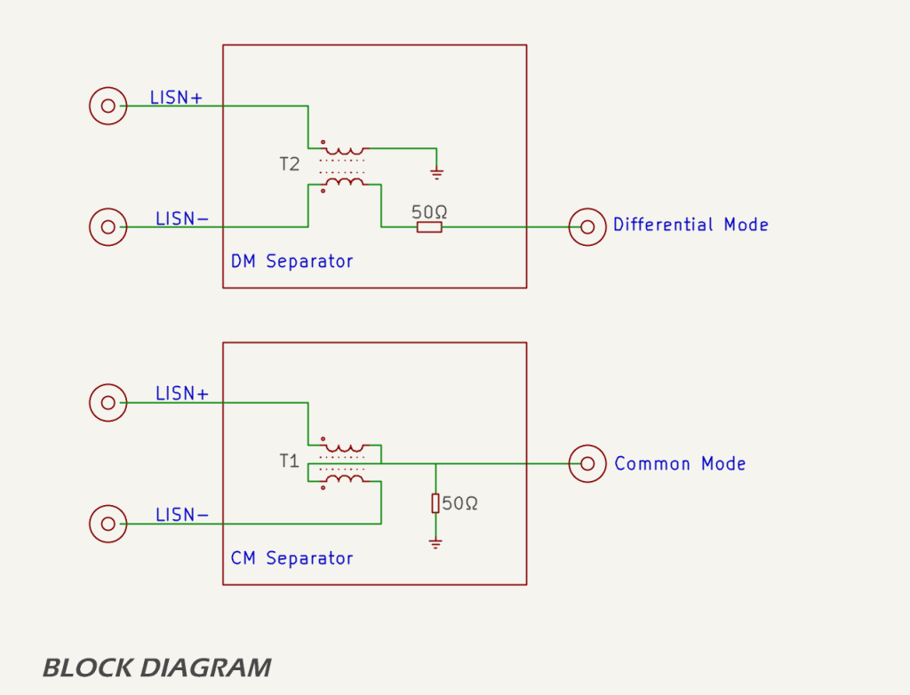
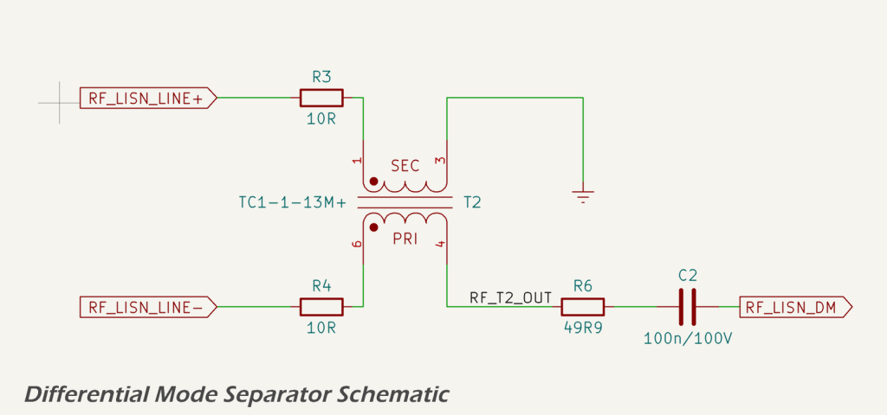
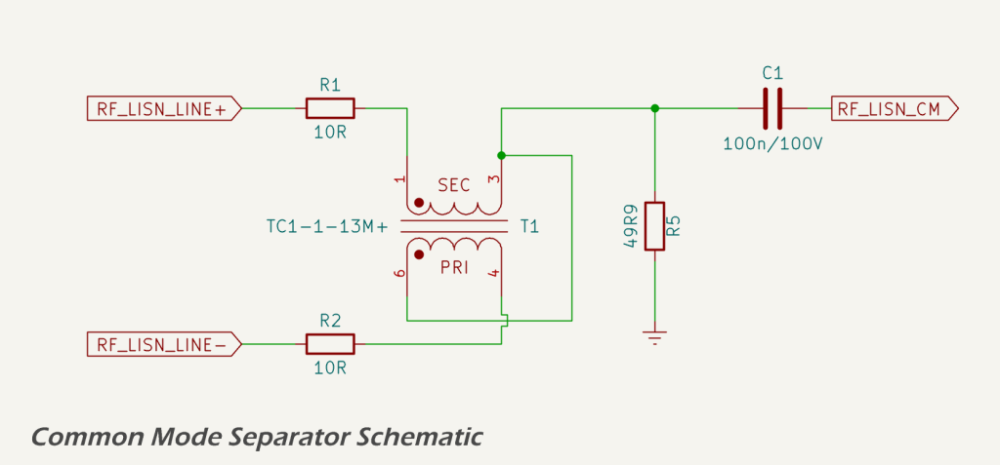
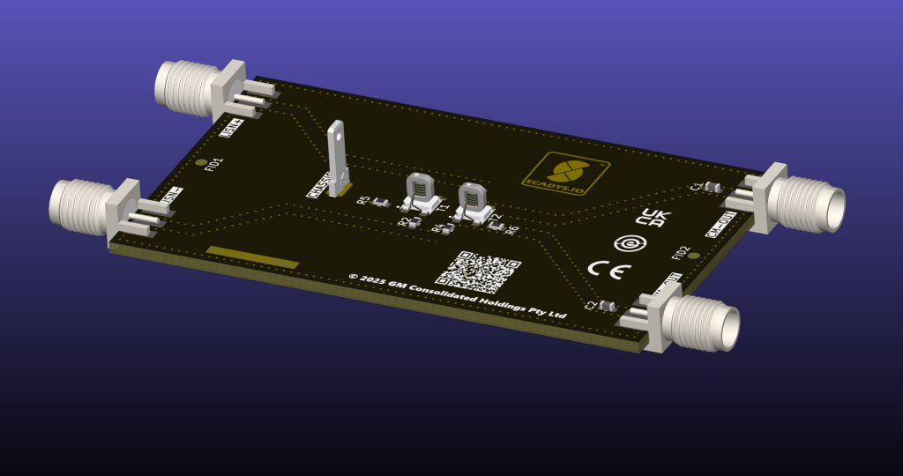

# Circuit & PCB

This page explains the CANBench TrueZ circuit and the PCB layout choices. It sets out the CM/DM separator topology, why the transformer was chosen, and the two small implementation details that make the hardware dependable in day‑to‑day use:

* series dampers; and
* optional DC‑blocks.

!!! note
    TrueZ is the companion to the CANBench Duo DC LISN. Duo’s measurement port already provides RF coupling, attenuation, and front‑end protection. TrueZ focuses on mode separation (CM versus DM) and keeps everything else minimal.

## Block diagram

The design follows the separator method described by [Wang, Lee, and Odendaal](assets/pdf/ieee_cps_cm_dm.pdf). The two LISN lines are summed to obtain the common‑mode component and differenced to obtain the differential‑mode component. Each output then uses a specific 50 Ω termination so the LISN side sees a real 50 Ω across frequency:

* the DM output includes a 49.9 Ω series element ahead of a 50 Ω analyzer input, while 
* the CM output includes a 49.9 Ω shunt in parallel with the analyzer’s 50 Ω input. 
  
  With these terminations, the intended mode transfers at close to unity and leakage into the other mode is kept low within the useful band of the transformers.

## Schematic overview

In the differential‑mode path (shown below), the two LISN lines first pass through small series resistors and then into transformer T2. The secondary is referenced to ground so that the output reflects the voltage difference between the two lines. A 49.9 Ω series resistor and an optional in‑line DC‑blocking capacitor feed the edge-launce SMA connector, on the assumption that the analyzer presents a 50 Ω load.

In the common‑mode path (shown below), the lines again pass through series resistors before entering transformer T1. The secondary drives a single node that represents the summed content of the two lines. A 49.9 Ω shunt to ground sits at this node so that, together with the analyzer’s 50 Ω input, the method’s termination is achieved. An optional DC‑block then feeds the CM SMA connector.

## PCB layout

The PCB uses a two‑layer FR‑4 stack with coplanar‑waveguide‑with‑ground runs from the SMAs to a compact transformer island. Trace width and gap are set for approximately 50 Ω and the coplanar gaps are stitched with a tight via fence. The LISN+ and LISN− routes are kept symmetrical so the two paths remain balanced. SMA shells and mounting hardware bond to chassis copper to stabilise return paths and improve repeatability.

## Transformer selection

The separator uses the [Mini‑Circuits TC1‑1‑13M+ transformer](https://www.minicircuits.com/pdfs/TC1-1-13M+.pdf) for both the common‑mode and differential mode paths. This is a 1:1 transmission‑line transformer intended for 50 Ω systems. A transmission‑line implementation preserves the “real‑50 Ω input” assumption in the separator method far better than a simple flux‑coupled part. It offers good amplitude and phase balance across the band relevant to CAN and NMEA 2000 conducted‑emissions work, and — critically for a small accessory — it is cost-effective and freely available from our preferred suppliers. 

Using the same device for T1 (CM) and T2 (DM) keeps the bill of materials short and sourcing straightforward. At the very bottom of the CISPR band some droop and rising leakage should be expected. The (calculated) calibration curves below can be used to linearize the measurements if necessary. In practice, when used for diagnosing and evaluating EMC reduction options, the low-frequency is not material.

## Series dampers

Each LISN leg includes a 10 Ω series resistor ahead of the transformer. These small parts add a touch of damping that reduces high‑Q peaking from transformer parasitics and cabling, and they limit surge energy into the windings during fault conditions or hot‑plug events. Because the mode‑specific terminations at the outputs still dominate the impedance environment, these resistors do not change the interpretation of the separator’s measurements.

## Optional DC‑blocks

An in‑line capacitor footprint is provided ahead of each SMA output. The capacitors block residual DC and very low‑frequency content that might otherwise reach the analyzer in unusual setups. When TrueZ is used strictly as a companion to the CANBench Duo—where the measurement port already provides RF coupling and protection—these positions can be stuffed as 0 Ω links for maximum simplicity and signal‑to‑noise. Where additional isolation is desired, 0603 capacitors in the 100 nF X7R class place the high‑pass corner far below 150 kHz for both paths; smaller C0G values are also workable if a known low‑end droop is acceptable and will be corrected once.

## References

1. J. Wang, F. C. Lee, and W. Odendaal, *Characterization, Evaluation, and Design of Noise Separator for Conducted EMI Noise Diagnosis* — IEEE Transactions on Power Electronics, vol. 20, no. 4, 2005. (PDF in repo: `assets/pdf/ieee_cps_cm_dm.pdf`)
2. IEC, *CISPR 25: Vehicles, boats and internal combustion engines – Radio disturbance characteristics – Limits and methods of measurement for the protection of on‑board receivers* — International Electrotechnical Commission, 2021. [https://webstore.iec.ch/publication/7077](https://webstore.iec.ch/publication/7077)
3. Electronic Design, *CISPR 25 Class 5: Evaluating EMI in Automotive Applications* — overview article. [https://www.electronicdesign.com/technologies/power/article/21274517/](https://www.electronicdesign.com/technologies/power/article/21274517/)
4. In Compliance Magazine, *Automotive EMC Testing: CISPR 25, ISO 11452‑2 and Equivalent Standards* — practical test guidance. [https://incompliancemag.com/automotive-emc-testing-cispr-25-iso-11452-2-and-equivalent-standards-part-1/](https://incompliancemag.com/automotive-emc-testing-cispr-25-iso-11452-2-and-equivalent-standards-part-1/)
5. EEVblog Forum, *DIY DM/CM Separator for EMC – LISN Mate* — community discussion. [https://www.eevblog.com/forum/projects/diy-dm-cm-seperator-for-emc-lisn-mate/](https://www.eevblog.com/forum/projects/diy-dm-cm-seperator-for-emc-lisn-mate/)
6. TinySA Project, *tinySA Wiki* — budget analyzer reference. [https://tinysa.org/wiki/](https://tinysa.org/wiki/)
7. Mini‑Circuits, *TC1‑1‑13M+ datasheet*. [https://www.minicircuits.com/pdfs/TC1-1-13M+.pdf](https://www.minicircuits.com/pdfs/TC1-1-13M+.pdf)
