# Enclosure

This page describes the CANBench TrueZ mechanical design, materials and finish. It also details the assembly sequence and the external markings applied to the product.

## Design

The enclosure is a compact split‑extrusion with removable end plates, supplied by Yongu (YONGU Industrial). It was selected to provide a rigid RF reference for the SMA shells while keeping the assembly simple and repeatable. Dimensions are based on the manufacturer’s [drawing for the YONGU H06 series](assets/pdf/YG-H06_Drawings.pdf) and should be verified against the latest revision when ordering.

The two halves of the enclosure are 6063‑T5 extruded aluminium. The end plates are 5052‑H32 aluminium sheet. Countersunk assembly screws are *M2.5 × 6* per GB‑T 819.1.

The body and plates use a black anodized finish. Product identification, I/O labels and compliance marks are laser‑etched on the plates. The anodizing is removed (laser-etched) around the drilled openings for the SMA connectors to ensure a low impedance contact with the connectors and their saw-tooth washers.

The following dimensions were taken from the [drawing](assets/pdf/YG-H06_Drawings.pdf):

* outside body dimensions are 78 mm x 63 mm x 25 mm (L x W x H);
* internal slide length that accepts the PCB is 75 mm (± 0.1 mm) 
* faceplates are attached with four countersunk M2.5 screws in a 60 mm x 12.5 mm pattern; and
* the inner rail spacing is 57 ± 0.1 mm. 

## Assembly

!!! warning
    The PCB is intentionally supplied without the edge-launch SMA connectors fitted. These are supplied separately and must be soldered to the PCB following the sequence below.

    The PCB and the two SMA flange faces together are 0.35 mm shorter than the internal slide length (75 mm) to allow for manufacturing tolerances. The sequence below ensures the SMA connector flanges sit perfectly flush with the faceplates before soldering, preventing residual stress that could distort the faceplates.

Begin with the enclosure disassembled and the end plates free of hardware. 

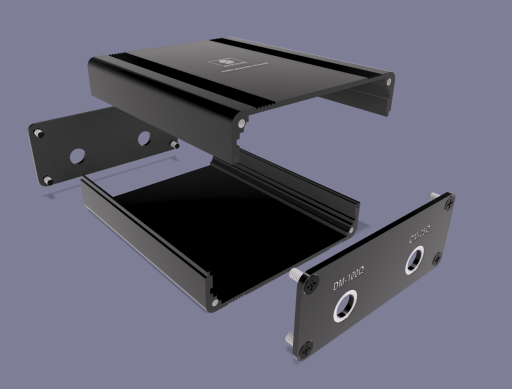

### STEP 1: Fit SMA connectors to the end plates.

Install the bulkhead SMA connectors into the faceplates with the supplied nuts and saw-tooth washers. The *teeth of the washers must face inward (toward the faceplate)*. Set the nuts finger‑tight only. Check the orientation of the solder pins so that the center and ground pins will be aligned with the PCB pads when the board is in place. 

!!!note
    Ensure the SMA connectors are oriented as shown in the image below, otherwise the center pin will not be on the correct (top) side of the PCB and/or the PCB may be upside down after assembly. The nuts should be finger-tight only to allow minor re-alignment during assembly/soldering

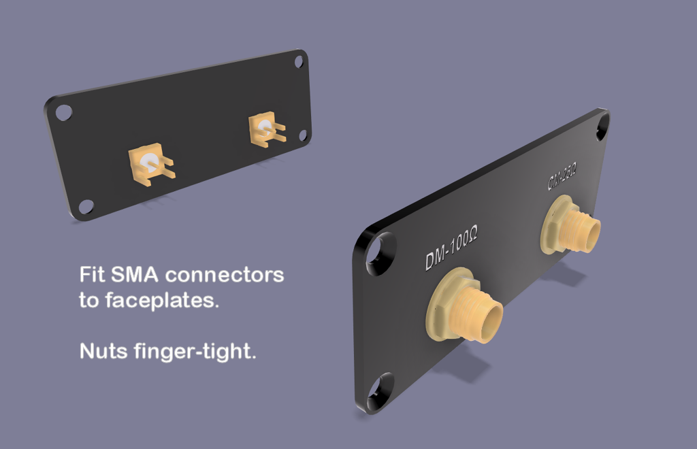

### STEP 2: Attach the faceplates to the top extrusion

Use the small countersunk screws to mount both plates to the **TOP** half only. Again, confirm the pin orientations; the pins should be level and pointing inward.

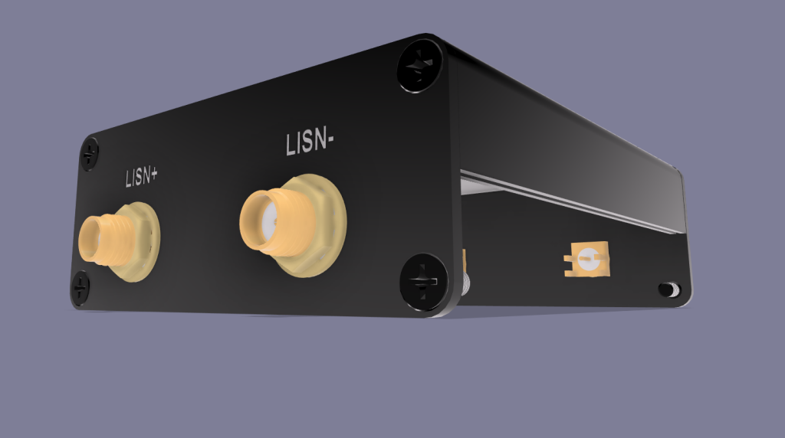

### STEP 3: Slide PCB into position. 

Place the enclosure face down on a soft, non-scratching surface. Slide the PCB into position until the SMA pins align with their pads on the PCB. The board should sit between the SMA connector flanges without forcing either faceplate.

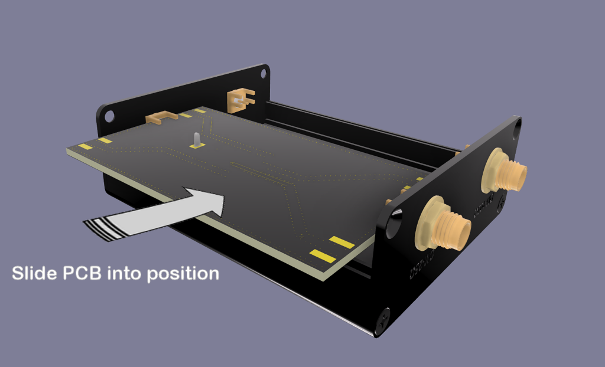

### STEP 4: Solder SMA ground pins 

Solder the SMA ground tabs to the bottom copper first. This locks the board to the mechanical reference provided by the faceplates. Inspect all solder joints for full wetting to the pad edges.

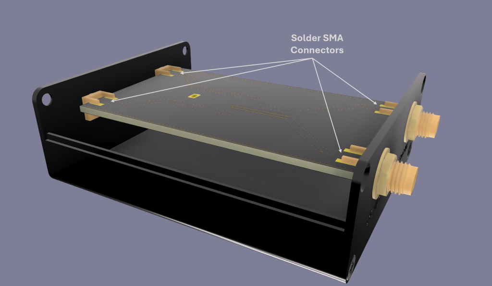

### STEP 5: Fit bottom extrusion, remove top extrusion

Fit the bottom half extrusion to the faceplates with four M2.5 screws, then remove the four screws that secure the top extrusion and remove the extrusion to expose the top side of the PCB that carries the components.

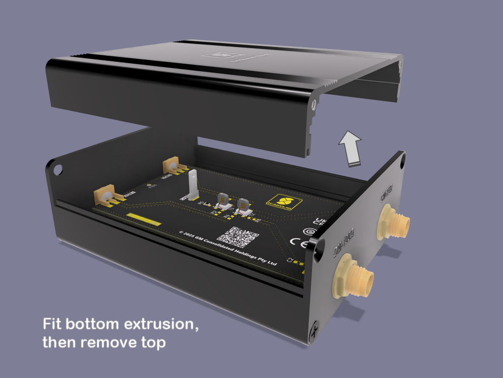

### STEP 6: Solder top pins

Solder the remaining SMA connector tabs and center pins from the top side and inspect all joints for full wetting to the pad edges.

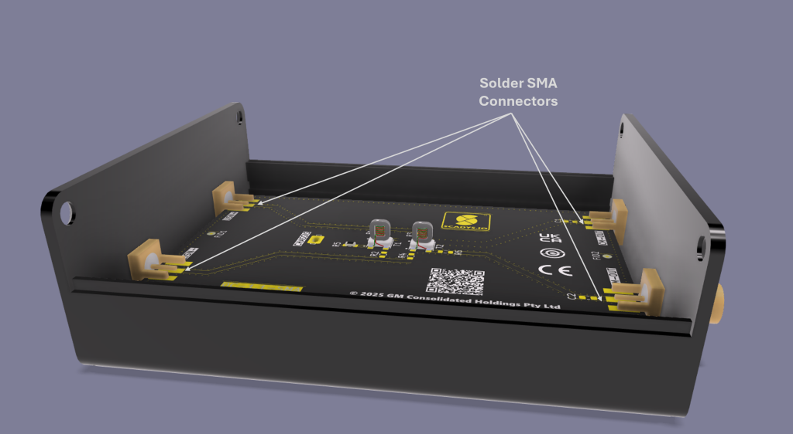

### STEP 7: Reassemble the enclosure

!!!tip
    It is good practice to disassemble the unit after soldering is complete and clean all flux residue with isopropyl alcohol. Reassemble after cleaning.

Refit the top extrusion using the four M2.5 screws and tighten the SMA nuts to approximately 0.3 N·m.

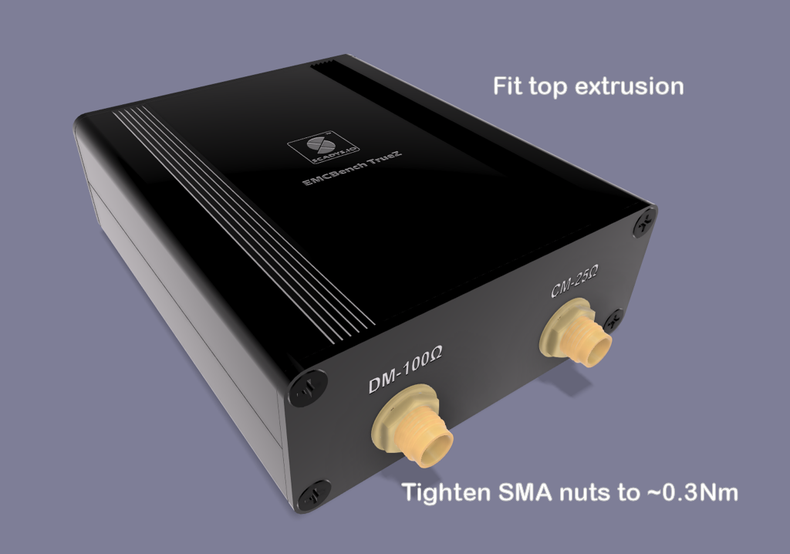

This procedure aligns the SMA shells to the plates first, then fixes the board, so the plates remain flat and stress‑free after tightening.

## Markings

Both end plates are laser engraved for clear connection and traceability. The input plate carries the LISN connections and the output plate carries the common-mode and differential-mode analyzer ports.

### Input labels

The LISN side is marked LISN+ and LISN− adjacent to the two bulkhead SMAs so the short RF jumper leads from the `CANBench Duo` LISN are unambiguous.

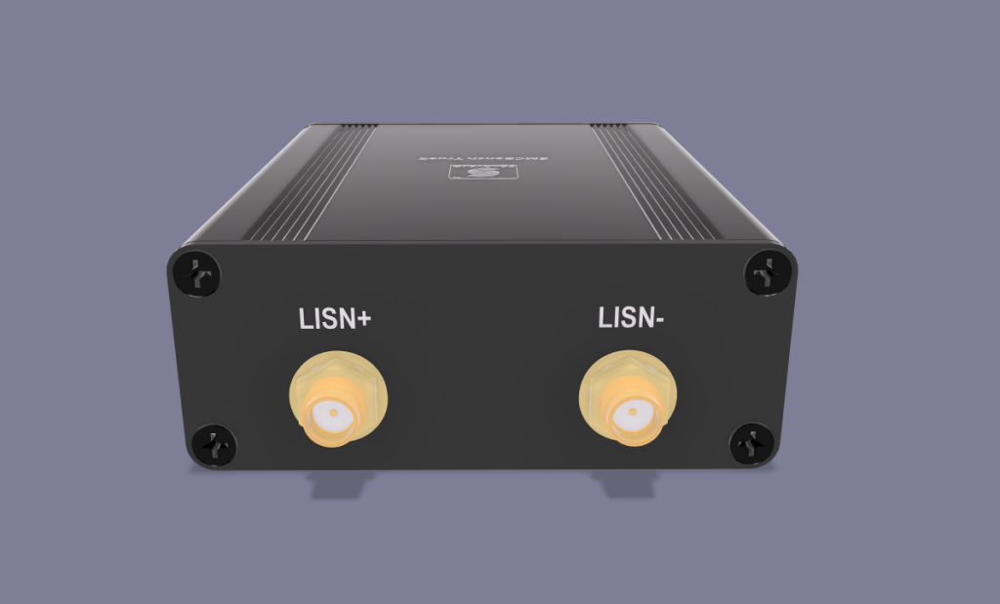

### Output labels

The analyzer/output side is marked DM‑100 Ω and CM‑25 Ω to reflect the effective terminations used by the separator method.
  
The DM port has 49.9 Ω in series and the CM port has 49.9 Ω shunt in parallel. This ensures unity transfer with a 50 Ω spectrum analyzer and a real 50 Ω seen by the LISN.

!!!info
    The labels assume a 50 Ω instrument input. Using a high-impedance scope without a 50 Ω feed-through, or an analyzer set to high-Z, breaks the 25 Ω/100 Ω unity transfer condition.

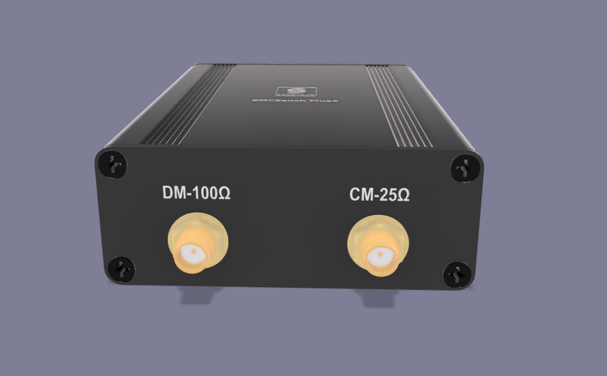

### Product labels

!!!TODO

    The QR code and product label/barcode shown in the early renders are NOT correct. These are placeholders and must be updated for production release.

The bottom of the enclosure carries the product name, logo and traceability marks:

* the QR code links to the [CANBench TrueZ technical documentation](https://docs.scadys.io/products/canbench_truez); 
* a bar code encodes the product code; and
* Compliance marks (CE/UKCA on a RoHS basis). 

Prototypes are clearly marked "*PROTOTYPE - NOT FOR RESALE*" and are also identified by the "-T" suffix in the product code.

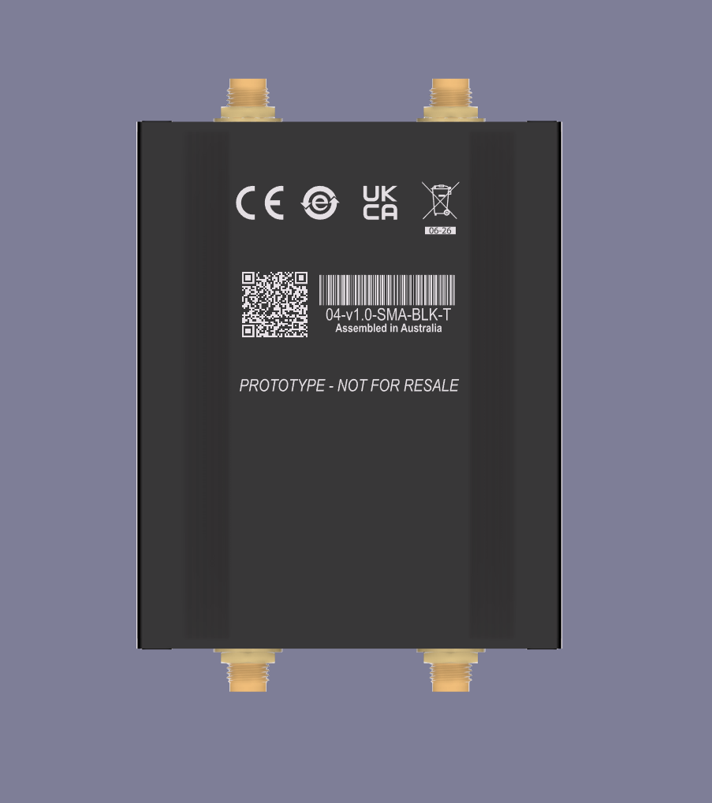

Keep plate artwork and the QR/Bar‑code data in the mechanical source repository. When the product code or URL changes, regenerate the laser files and update this page.

## References

1. YONGU, 2020, [*Drawing YG-H06A-0000-00X, YONGU H06 Series*](assets/pdf/YG-H06_Drawings.pdf), Rev A1, Yongu Industrial, 11/05/2020
2. YONGU, 2024, [*Split Aluminum Handheld Enclosure H06 63×35 mm*](https://www.yg-enclosure.com/product/yongu-split-aluminum-handheld-enclosure-h06-63-35mm.html), YONGU Industrial, 2024.
3. EEVblog Forum, [*CM‑DM Separator for Dual LISNs*](https://www.eevblog.com/forum/projects/diy-dm-cm-seperator-for-emc-lisn-mate/), accessed 2025.
4. J. Wang, F. C. Lee, and W. Odendaal, [*Characterization, Evaluation, and Design of Noise Separator for Conducted EMI Noise Diagnosis*](assets/pdf/ieee_cps_cm_dm.pdf), IEEE Transactions on Power Electronics, vol. 20, no. 4, 2005.