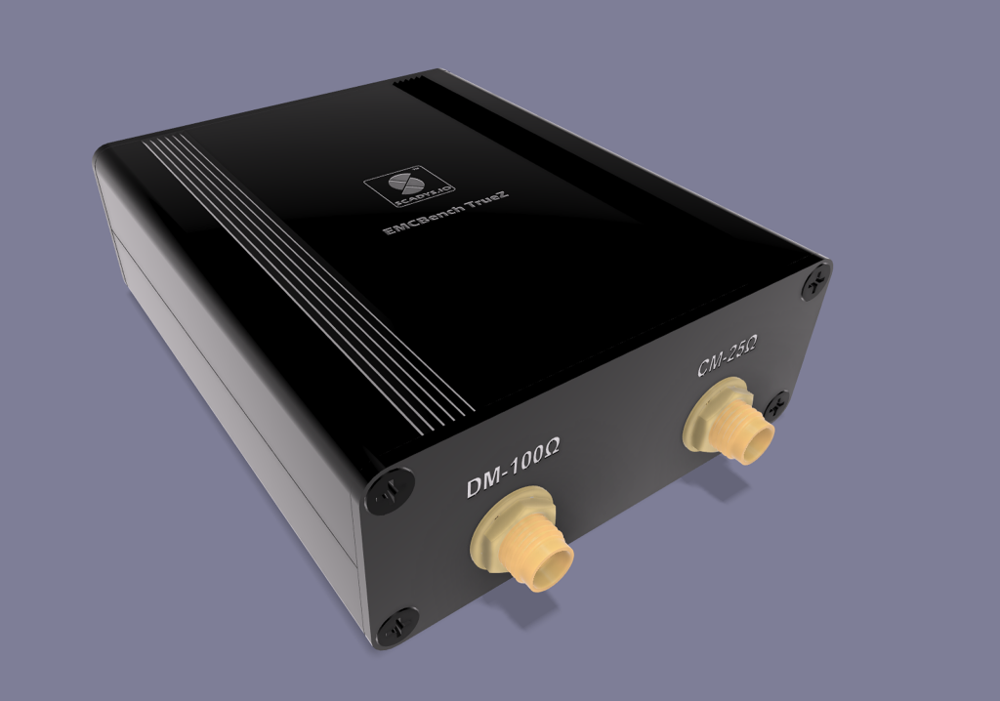

# CANBench TrueZ

The CANBench TrueZ is a compact common‑mode / differential‑mode (CM/DM) noise separator for conducted‑emissions diagnostics on DC‑powered CANbus devices, including NMEA 2000 equipment. 

It is a companion to the CANBench Duo DC LISN, providing mode separation after the LISN’s RF measurement port to support fast A/B testing, troubleshooting, and pre‑compliance checks before formal lab work. The device follows the separator topology described by [Wang, Lee, and Odendaal](assets/pdf/ieee_cps_cm_dm.pdf), which yields real‑world, repeatable results with simple 50 Ω test gear when built and terminated correctly. Refer to the *Wang, Lee & Odendaal* paper for the method, assumptions, and limits.

## Functional specification

The CANBench TrueZ aims to mirror common lab practices while staying simple and inexpensive:

* separates conducted noise into differential‑mode (DM) and common‑mode (CM) components using two 1:1 transmission‑line transformers with defined 50 Ω environments; and
* presents analyzer‑friendly 50 Ω outputs on SMA, with one port terminated per the noise‑separator method (DM port includes 49.9 Ω series; CM port includes 49.9 Ω shunt to ground), assuming a 50 Ω analyzer input;
* accepts the CANBench Duo LISN RF measurement port as its source (pad and ESD protection live in the LISN, not in TrueZ);
* supports indicative measurements from 150 kHz to 110 MHz for CAN/NMEA 2000 development;
* allows simple, one‑time calibration to flatten response and document trust‑bands for users; and
* fits common handheld aluminum enclosures for field use.

The block diagram below shows the topology.

## Use case

TrueZ is for developers who need fast feedback on conducted emissions during design and debug. Typical uses include:

* comparing mitigations such as ferrites, cable routing, and filter changes while watching CM/DM trends;
* screening prototypes before third‑party testing against automotive and marine receiver‑protection standards (e.g., CISPR 25); and
* diagnosing whether a failure path is CM‑dominated or DM‑dominated, which guides where to apply fixes.

For budget analyzers such as the TinySA Ultra or entry‑level spectrum analyzers, TrueZ provides a stable, 50 Ω, SMA‑based interface that behaves predictably and can be corrected with a simple amplitude curve. A lab analyzer will work without changes; the assumptions remain the same.

## Measurement principle (summary)

The separator sums the LISN’s two RF line signals to produce CM noise and takes their difference to produce DM noise. To meet the method’s assumptions, each output uses a specific termination so that the LISN side “sees” a real 50 Ω input over frequency; the DM output includes a series 49.9 Ω element in front of a 50 Ω analyzer, and the CM output includes a shunt 49.9 Ω element in parallel with a 50 Ω analyzer. This arrangement yields near‑unity transfer for the intended mode and minimizes leakage into the other mode within the useful band of the transformers. The approach is detailed by Wang, Lee, and Odendaal, with practical DIY context discussed in the EEVblog thread listed below.

## Connections

The connection scheme mirrors lab fixtures and the CANBench Duo LISN:

* **Input from LISN**; the TrueZ input mates with the CANBench Duo RF measurement port;
* **DM OUT (SMA)**; measured through a 49.9 Ω series element into a 50 Ω analyzer;
* **CM OUT (SMA)**; measured with a 49.9 Ω shunt to ground in parallel with a 50 Ω analyzer; and
* **Chassis bond**; SMA shells and mounting points bond to the enclosure to stabilize return paths.

Use high‑quality 50 Ω SMA patch leads to the analyzer. Keep cable lengths short and consistent when comparing changes on the device under test.

## Scope and limits

* The topology and terminations follow the referenced separator method and are appropriate for pre‑compliance and diagnostics when used with a 50 Ω analyzer and a DC LISN;
* the default transformer choice targets a practical band for CAN/NMEA 2000 work; performance below ~0.5 MHz is indicative and benefits from a one‑time correction curve captured on a golden unit;
* results above ~80–100 MHz depend strongly on layout, cabling, and analyzer setup; and
* TrueZ is not a calibratable laboratory instrument; it is a repeatable diagnostic fixture intended to complement the CANBench Duo.

## Quick start

* connect the device under test to the CANBench Duo LISN as usual; and
* feed the CANBench Duo RF measurement port into TrueZ; and
* connect **DM OUT** and **CM OUT** to two analyzer channels (or measure sequentially with one channel); and
* set 50 Ω input impedance on the analyzer; and
* sweep 150 kHz–110 MHz to observe CM and DM traces; and
* compare changes after each mitigation step.

## Specifications (informative)

* input: CANBench Duo RF measurement port;
* outputs: SMA, 50 Ω system; DM port includes 49.9 Ω series; CM port includes 49.9 Ω shunt;
* nominal working band: 150 kHz to 110 MHz for indicative pre‑compliance work;
* transformers: 1:1 transmission‑line, 50 Ω system parts, matched to the method’s assumptions;
* enclosure: compact split‑aluminum handheld enclosure (see reference link);
* analyzer assumption: 50 Ω input; and
* safety: DC LISN provides attenuation and protection upstream of TrueZ.

## Related equipment

* CANBench Duo DC LISN (measurement port provides pad and ESD protection);
* spectrum analyzer with 50 Ω input (handheld or bench);
* short 50 Ω SMA cables and adapters; and
* optional near‑field probes for follow‑up radiated checks.

## References

1. J. Wang, F. C. Lee, and W. Odendaal, [*Characterization, Evaluation, and Design of Noise Separator for Conducted EMI Noise Diagnosis*](assets/pdf/ieee_cps_cm_dm.pdf), IEEE Transactions on Power Electronics, vol. 20, no. 4, 2005.
2. IEC, [*CISPR 25: Vehicles, boats and internal combustion engines – Radio disturbance characteristics – Limits and methods of measurement for the protection of on‑board receivers*](https://webstore.iec.ch/publication/7077), International Electrotechnical Commission, 2021.
3. Electronic Design, [*CISPR 25 Class 5: Evaluating EMI in Automotive Applications*](https://www.electronicdesign.com/technologies/power/article/21274517/), Informa, 2016.
4. In Compliance Magazine, [*Automotive EMC Testing: CISPR 25, ISO 11452‑2 and Equivalent Standards*](https://incompliancemag.com/automotive-emc-testing-cispr-25-iso-11452-2-and-equivalent-standards-part-1/), Lectrix, 2019.
5. EEVblog Forum, [*CM‑DM Separator for Dual LISNs*](https://www.eevblog.com/forum/projects/diy-dm-cm-seperator-for-emc-lisn-mate/), accessed 2025.
6. TinySA Project, [*tinySA Wiki*](https://tinysa.org/wiki/), accessed 2025.
7. YONGU, [*Split Aluminum Handheld Enclosure H06 63×35 mm*](https://www.yg-enclosure.com/product/yongu-split-aluminum-handheld-enclosure-h06-63-35mm.html), YONGU Industrial, 2024.

<!-- # CANBench TrueZ

The CANBench TrueZ is a ..

## Functional Specification

The CANBench TrueZ follows the principle that a pre-compliance fixture should emulate laboratory test conditions as closely as possible, while remaining accessible and inexpensive for developers. The design philosophy is to provide adequate accuracy for pre-compliance testing and additional diagnostic tools that support practical debugging, all in a compact, open-hardware package:

- list functional specs;
- ...;

## Use Case

The CANBench TrueZ is designed with the philosophy that inexpensive tools such as the [TinySA](https://tinysa.org/wiki/) spectrum analyzer can still provide meaningful insights if connected through a well-defined and repeatable measurement fixture. By using SMA outputs, the fixture interfaces directly with such analyzers. Likewise, many CAN devices in marine and industrial settings use A-coded Micro-C 5-pin connectors, which are therefore adopted here.

The CANBench TrueZ is intended for conducted emissions pre-compliance testing of DC-powered CANbus devices, including NMEA 2000 marine electronics and other automotive or industrial control systems. Typical applications include:

- verifying conducted emissions performance during development;
- screening for compliance before third-party lab testing; and
- diagnosing and troubleshooting noise issues in CANbus devices.

## Connections

The connection philosophy is to make the CANBench TrueZ simple, familiar, and interoperable with both laboratory and field equipment. CAN devices often rely on standardized connectors, while test equipment relies on banana sockets and SMA ports. The fixture reflects this by providing each style of connection in parallel.

- list connectionst  

## References

1. Electronic Design, [*CISPR 25 Class 5: Evaluating EMI in Automotive Applications*](https://www.electronicdesign.com/technologies/power/article/21274517/)  
2. Compliance Magazine, [*Automotive EMC Testing: CISPR 25, ISO 11452-2 and Equivalent Standards*](https://incompliancemag.com/automotive-emc-testing-cispr-25-iso-11452-2-and-equivalent-standards-part-1/)  
3. IEC, [*CISPR 25: Vehicles, boats and internal combustion engines – Radio disturbance characteristics – Limits and methods of measurement for the protection of on-board receivers*](https://webstore.iec.ch/publication/7077)  
4. ISO, [*ISO 7637-2: Road vehicles – Electrical disturbances from conduction and coupling – Part 2: Electrical transient conduction along supply lines only*](https://www.iso.org/standard/71201.html)
5. YONGU Enclosure, [*YONGU Split Aluminum Handheld Enclosure H06 63*35mm*](https://www.yg-enclosure.com/product/yongu-split-aluminum-handheld-enclosure-h06-63-35mm.html)
6. EEV Blog, [*CM-DM Seperator for Dual LISNs*](https://www.eevblog.com/forum/projects/diy-dm-cm-seperator-for-emc-lisn-mate/)
7. Wang, Lee & Odendaal, [*Characterization, Evaluation, and Design of Noise Separator for Conducted EMI Noise Diagnosis*](assets/pdf/ieee_cps_cm_dm.pdf), IEEE Transactions on Power Electronics, Volume: 20 , Issue: 4 , July 2005 -->

