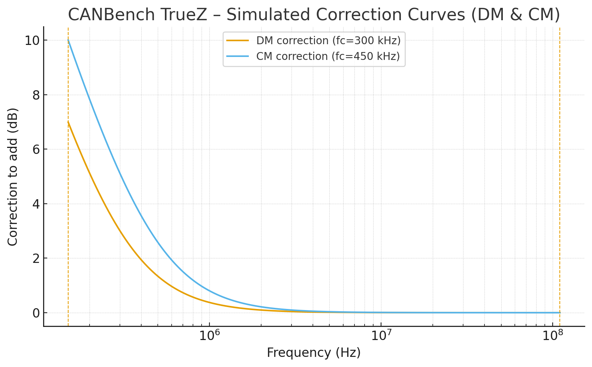

# Usage

This page describes how to connect CANBench TrueZ, how to run measurements with a spectrum analyzer and the CANBench Duo DC LISN, and how to interpret common‑mode (CM) and differential‑mode (DM) results when diagnosing conducted emissions on CANbus and NMEA 2000 equipment. It also outlines practical mitigation techniques and the mode signatures you should expect to see when each is effective.

## Connection and setup

The test arrangement mirrors the layout used in automotive and marine conducted‑emissions work. The device under test (DUT) is powered through the CANBench Duo LISN, which provides separate RF measurement ports for LISN+ and LISN−. TrueZ sits between those two RF ports and the spectrum analyzer and splits the noise into CM and DM components.

Begin with the physical setup, then walk through the connections in order. Two short, identical 50 Ω SMA cables are needed from the CANBench Duo to the TrueZ inputs so that path lengths and losses are matched.

* Wire the DUT to the CANBench Duo as for a normal conducted‑emissions sweep and confirm supply voltage/current settings.
* Bond the LISN ground/chassis per your bench standard and keep DC leads short and tidy.
* Connect the LISN LISN+ RF measurement port to the LISN+ SMA on TrueZ using a short 50 Ω SMA patch lead.
* Connect the LISN LISN− RF measurement port to the LISN− SMA on TrueZ using a second, identical SMA patch lead.
* Connect DM OUT from TrueZ to the analyzer input (50 Ω). If you have two inputs, also connect CM OUT; otherwise measure sequentially using the same cable for consistency.
* Configure the analyzer for 50 Ω input, choose a span such as 150 kHz to 110 MHz, and set RBW/VBW/detector to suit your workflow or standard.

When using TrueZ only with the CANBench Duo, the DC‑blocking capacitors on TrueZ may be installed as 0 Ω links because Duo’s measurement ports already provide RF coupling and protection. If you use TrueZ in other arrangements, fit the DC‑blocks to keep slow or DC content out of the analyzer.

## Running a measurement

A short, repeatable sequence helps produce comparable results. The idea is to capture mode‑separated baselines and then repeat after each change.

* Perform a baseline sweep of the DM OUT port and let any averaging/peak‑hold settle.
* Repeat on the CM OUT port using the same analyzer cable if you have only one input.
* Apply the TrueZ correction at low frequencies where the transformers introduce a gentle high‑pass response; add the correction (in dB) to the measured data.
* Record screenshots and note analyzer settings and cable routing so later tests are comparable.

The figure below shows a simulated starting correction that you can replace with a measured curve from a golden unit.

When you conduct comparative tests—such as adding ferrites or modifying an input filter—keep the physical test geometry fixed. Cable routing, proximity to the chassis, and even bench clutter can move a marginal result by several decibels, so it pays to control what you can and record the setup with photos.

## When CM and DM matter

Mode separation answers two questions that are central to efficient EMC debugging: “where is the energy flowing?” and “what structure is supporting the current?”:

* differential‑mode noise is driven by ripple or switching action inside the DUT that appears across the supply rails. It flows out on one conductor and returns on the other, completing a loop set by the local power distribution and any added filters; and
* common‑mode noise is driven by parasitic coupling—usually from fast edges in the DUT to the chassis or earth—so that both supply conductors move together with respect to the reference. It returns through stray capacitances to chassis, to other cables, and to the environment. The distinction matters because the remedies are different.

A DM‑dominated trace often features discrete spectral lines tied to the converter switching frequency and its harmonics. The amplitudes track with load current and with changes to the converter’s control loop. In contrast, a CM‑dominated trace tends to respond strongly to cable moves, to the presence of large exposed metal, and to how the DUT enclosure is bonded. Peaks might align with clock harmonics or fast I/O activity that couples capacitively to the supply network and then to the harness. In many systems both modes coexist; the value of TrueZ is that it shows you which is larger at each frequency decade so that your effort goes where it matters most.

## Practical mitigation and expected mode signatures

Mitigation measures act on specific current paths, and the same change can affect CM and DM very differently. The paragraphs below outline common actions and the signatures you should expect to see when each is effective

### Ferrite sleeves or clamp‑ons

Start with ferrite sleeves or clamp‑ons on the DC harness near the DUT. When the device is carrying common‑mode current the ferrite presents a high impedance to the equal‑phase current on both conductors and the CM trace typically falls across a broad band. The DM trace may barely move, because differential currents see the ferrite mostly as a small series resistance and a negligible loop‑area change. If the ferrite is wound with both conductors through the same core, its DM impedance rises while its CM impedance increases even more, which can benefit both traces at once.

### Common‑mode chokes

Common‑mode chokes in series with the DC input provide a high CM impedance with only a modest DM impedance due to leakage inductance. In measurements this shows up as a pronounced reduction in CM amplitude over the choke’s useful band, with the DM trace changing only by the amount expected from the added leakage and any associated damping components. If the DM ripple is large, the choke alone is rarely the cure; it treats the wrong problem.

### π or LC filters

For differential‑mode noise, a π‑filter or LC filter placed close to the converter input is the most direct remedy. The DM trace should drop at and above the filter corner frequency; the shape of the reduction depends on the Q of the network, the ESR of the capacitors, and any explicit damping. The CM trace might not change unless the filter layout reduces the parasitic capacitance from switching nodes to chassis.

### Earthing / bonding

Changes that improve bonding and chassis return paths primarily affect CM. Tying the SMA shells and LISN reference solidly to the enclosure, shortening pigtails, and ensuring metal panels make clean contact can move CM peaks by 10–20 dB when the dominant path is capacitive coupling to the chassis. The DM trace may be largely unaffected because the differential loop is internal to the DUT and the LISN.

### PCB layout

Layout‑level improvements such as shrinking the hot‑loop area of a switching stage, adding a shield between the switch node and the enclosure, or rerouting harness conductors away from noisy structures can influence both modes. The tell is whether the CM trace responds more than the DM trace; if so, the coupling was mostly parasitic and the fix is in the right direction. If the DM trace responds strongly while CM stays put, the fix altered the loop impedance seen by the converter.

## A disciplined workflow

Effective debugging benefits from a consistent sequence. Establish a baseline by measuring DM and CM with the DUT in a realistic but tidy cabling arrangement. Apply one change at a time and repeat the sweep. Record the before/after traces and a photo of the setup. Pay attention to the frequency regions where regulatory masks are tight for your product class, because those are the regions where you need margin in both modes. If you are close to a limit for a given band, prioritise mitigations that reduce the trace that dominates in that band; the other mode can wait if its contribution is small.

Correct the measured traces with the calibration curve when you need more accurate low‑frequency amplitudes. The curve represents the excess insertion loss of the separators at the bottom of the band and is added to the measured level. Store a copy of the curve with your project data and note which TrueZ unit generated it; this helps when you retest later and want to reproduce the same analysis steps.

## Notes on repeatability

Small details matter in conducted‑emissions work. Keep cable lengths the same between tests and avoid large loops or draped harnesses that wander near the analyzer or metal fixtures. Maintain the same bench layout when comparing results from one day to the next. If results shift unexpectedly, check the analyzer input attenuation, the LISN bonding, the TrueZ SMA connections, and the DUT load state before assuming a hardware change is responsible.

!!! tip "Bench checklist"
    The list below acts as a quick pre‑flight before every sweep.

    - Photos of the setup taken and filed with the project.
    - Analyzer input set to 50 Ω, attenuation/limiter as intended, RBW/VBW/detector noted.
    - Two short, identical SMA cables from CANBench Duo to TrueZ; one cable reused for both outputs if measuring sequentially.
    - LISN grounding and chassis bonds verified and unchanged from the baseline.
    - DUT load current and operating mode documented; harness routed the same way as last time.
    

## Further reading

For deeper background on using CM/DM separation in EMC diagnosis and mitigation, the resources below are a good start.

* Keysight, *Separating Common‑Mode and Differential‑Mode EMC Noise* — application note explaining the theory and measurement workflow. [https://www.keysight.com/us/en/assets/7018-01213/application-notes/5968-5316.pdf](https://www.keysight.com/us/en/assets/7018-01213/application-notes/5968-5316.pdf)
* In Compliance Magazine, [*Measuring Common Mode Versus Differential Mode Conducted Emissions*](https://incompliancemag.com/measuring-common-mode-versus-differential-mode-conducted-emissions/)
* Würth Elektronik, [*ANP047 – Understanding Common‑Mode Chokes*](https://www.we-online.com/files/pdf1/webinar_13.03.2019_compendium-about-common-mode-chokes.pdf) — choke behaviour and selection in CM/DM terms. 
* EMC Standards (Keith Armstrong), [*EMC for Systems and Installations*](https://incompliancemag.com/emc-and-safety-for-installations-part-1/) — articles on CM/DM paths and practical fixes.
