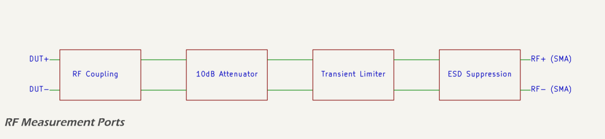

# LISN RF Measurement Port

# CAN RF Measurement Port

The RF measurement ports provide analyzer outputs for each 5 µH LISN channel. Their function is to transfer the noise voltage present on each DC conductor to a spectrum analyzer while preventing DC bias and excessive transients from reaching the instrument. These ports are limited to conducted emissions testing and are not intended for transient testing. The measurement range follows the requirements of [CISPR 25](https://webstore.iec.ch/publication/7077), covering 150 kHz to 108 MHz.

The analyzer provides the 50 Ω termination, so the ports present a 50 Ω source impedance but no internal shunt load. Connectors are soldered directly to the PCB and exit through the top of the Hammond 1590XX enclosure. This avoids off-board wiring and maintains predictable impedance. Space constraints in the enclosure require a short, ordered signal path with well-defined circuit elements.

The vertical SMA connector defines the reference plane and completes the interface to external measurement equipment.

The functional specification is as follows:

* transfer conducted emissions from 150 kHz to 108 MHz, with margin to 120 MHz;
* present 50 Ω source impedance, with return loss better than 20 dB;
* provide 10 dB attenuation with accuracy within ±0.5 dB;
* block DC voltages up to 48 V;
* limit residual fast transients coupled from the DUT side so that analyzer input is ≤ +10 dBm into 50 Ω;
* withstand ESD at the SMA port to IEC 61000-4-2 levels (±8 kV air, ±6 kV contact);
* use only board-mounted connectors.

The RF signal path from the DUT node to the analyzer consists of four sub-circuits:

* RF coupling capacitors that provide high-voltage DC blocking;
* a fixed 10 dB resistive attenuator referenced to 50 Ω;
* a transient limiter that clamps fast surge energy to analyzer-safe levels;
* a low-capacitance ESD suppressor located at the SMA connector.

The sub-circuit elements of the RF measurement ports are shown in the block diagram below.

The RF measurement ports form the final stage of the dual 5 µH LISN channels and provide analyzer-safe outputs for conducted emissions testing. In accordance with [CISPR 25](https://webstore.iec.ch/publication/7077) and [ISO 7637-2](https://www.iso.org/standard/71201.html), the ports must transfer the noise present on each DC conductor while preventing DC bias, transients, and over-voltage from reaching the spectrum analyzer. 

The EMCBench CAN-LISN is intended as a pre-compliance fixture. The design therefore prioritises fidelity of measurement, predictable impedance, and protection of external equipment, while remaining practical in terms of size, cost, and assembly:

* the per-line LISN outputs are the compliance-relevant measurement points;
* diagnostic ports such as common-mode or differential-mode monitors are used only for comparative troubleshooting;
* it is assumed that the measurement instrument provides a 50 Ω termination, so the port must present the correct source impedance without an internal load; and
* unused ports are always terminated with an external 50 Ω SMA terminator.

The functional specifications are:

* transfer conducted emissions from 150 kHz to 108 MHz, with margin to 120 MHz;
* present 50 Ω source impedance, with return loss better than 20 dB across the band;
* provide 10 dB attenuation with accuracy within ±0.5 dB;
* block DC voltages up to 48 V with generous headroom / margin;
* withstand fast transients coupled from the DUT side, limiting any residual seen at the analyzer input to ≤ +10 dBm into 50 Ω;
* withstand ESD and handling discharges at the SMA port to IEC 61000-4-2 levels (±8 kV air, ±6 kV contact) without damage or parametric shift; and
* use only board-mounted connectors.

The RF signal path from the LISN junction to the analyzer consists of:

* RF coupling capacitors for DC blocking;
* a fixed 10 dB resistive attenuator;
* a transient limiter for surge protection;
* a low-capacitance ESD suppressor at the connector;
* the vertical SMA connector that defines the 50 Ω reference plane.

<!-- Start with a lead-in paragraph that contains:
- context (what is this for, what are the requirements -CISPR, DC LISN 5uH 50Ω)
- and functional specification
- block diagram followed by summary of the elements

Describe elements in order of signal flow:

## DUT Tap Point (include coupling)

## RF Limiter

## Attenuator Pad (10dB)

## Protection -->

<!-- Previous Analysis kept for reference

Essential blocks (in reverse signal order, SMA → DUT tap):

* *Vertical/thru-hole SMA (female):* clean 50 Ω transition to your CPWG; robust, repeatable connectorization.
* *ultra‑low‑cap ESD at the connector:*, RF‑grade ESD array (≈0.2–0.8 pF/line, bidirectional). Catches direct ESD/cable‑mate spikes right at the shell with minimal RF loading.
* *short 50 Ω CPWG run (via‑fenced):* as short as practical (a few cm max), no stubs, gentle bends, ground‑via fence both sides. Preserves return path and keeps S11 flat to 108 MHz.
* *Fixed attenuator pad:* protects the analyser and damps small impedance wiggles; a single switch/jumper can select IN/OUT.
  * option A: bypass (0 dB) for max sensitivity; or
  * option B: inline 10 dB π‑pad or T‑pad using 1 % RF resistors.
* *RF limiter (small‑signal diodes to ground):* topology: two series 1N4148 (or BAV99) to GND in each polarity (i.e., anti‑parallel series pairs). Clip level: ~±1.2–1.4 V (gentle onset, low capacitance). “Last line” amplitude clipper for bursts without loading small signals.
* *DC‑blocking capacitor(s) (series, port side):* choose effective C so f_c ≲ 50–80 kHz with 50 Ω (e.g., 0.047–0.1 µF effective). One cap is simplest; two back‑to‑back X7R can be used to raise DC rating and symmetry (remember two in series halves C). Voltage: ≥100 V is a safe default for 12/24 V systems. Prevents any DC/bias from reaching the analyser, ensures flat passband from 150 kHz up.
* *small series “coupling” resistor (optional, 0–51 Ω):* between the DC‑block and the choke. Tames peaking with layout parasitics and shares surge energy; 0–22 Ω is usually enough if you already have a 10 dB pad.
* *coupling choke to the DUT line:* ≈1 mH RF choke (the same class used in the Wurth design). Decent SRF and low parasitic C; DCR not critical; current rating enough for fault cases. Forms the HF‑only coupling branch so the port “sees” the line noise, not DC.
* *DUT tap point (on the DUT side of the 5 µH ladder):* You want the measurement to reflect the standard 5 µH+50 Ω environment the DUT “sees”.
* *port side housekeeping (simple, but useful):* 50 Ω shunt footprint (normally DNP): lets you terminate the port when no analyser is connected (prevents a floating node during bring‑up).
* *high‑value bleed (e.g., 470 k–1 MΩ to GND on the port side of the DC‑block):* discharges the series cap after disconnects and keeps the limiter bias neutral. -->