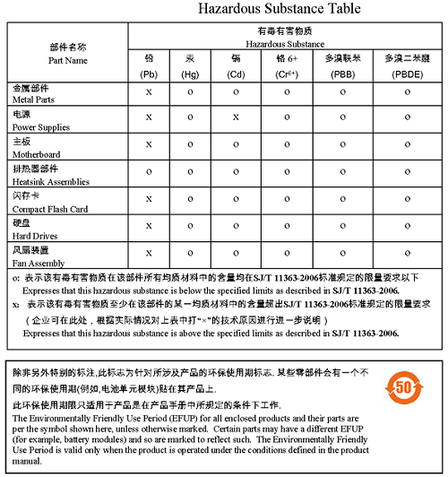

# China RoHS (SJ/T 11364)

## Applies to

<table>
  <colgroup>
    <col style="width:25%">
    <col style="width:25%">
    <col style="width:25%">
    <col style="width:25%">
  </colgroup>
  <thead>
    <tr>
      <th class="centered">Lab Grade</th>
      <th class="centered">Pre-compliance Grade</th>
      <th class="centered">Complete Build Kit</th>
      <th class="centered">PCB + THT Kit</th>
    </tr>
  </thead>
  <tbody>
    <tr>
      <td class="centered">✅</td>
      <td class="centered">✅</td>
      <td class="centered">N/A</td>
      <td class="centered">N/A</td>
    </tr>
  </tbody>
</table>

✅ = requirement applies to the product as supplied in that column.N/A = requirement not applicable at point of sale because the product is not supplied as a finished apparatus; compliance obligations attach to the assembler of the finished equipment.

## Scope

China regulates hazardous substances in electrical and electronic products under [*SJ/T 11364: Marking for the restriction of hazardous substances*](https://standards.globalspec.com/std/14383091/sj-t-11364). The regulation is part of the Management Methods for the Restriction of the Use of Hazardous Substances in Electrical and Electronic Products, commonly referred to as “China RoHS.” It requires labelling of restricted substances and disclosure of environmental protection use period (EPUP).

## Why it applies

Finished units of the EMCBench CAN-LISN placed on the Chinese market are considered electronic products and must comply with China RoHS requirements. This includes the presence of hazardous substances above permitted limits and the declaration of an EPUP. Kits and PCB assemblies are not finished products and therefore do not fall under the regulation at the point of sale.

## Achieving compliance

Compliance involves both substance control and mandatory labelling:

- assess and document whether restricted substances exceed allowable thresholds in any component;  
- where substances are present above limits, identify them in a disclosure table;  
- declare an Environmental Protection Use Period (EPUP), expressed as a number of years during which the product can be used safely under normal conditions;  
- affix the appropriate China RoHS logo to the product, packaging, or documentation.  

The EPUP logo indicates the number of years, placed in the centre of the symbol.

## Record keeping

Manufacturers must:

- maintain supplier declarations on substance content;  
- provide a disclosure table identifying components containing restricted substances;  
- keep compliance records available for inspection by Chinese authorities.

## Labelling and instructions

Finished units must display the China RoHS environmental protection logo and the EPUP value. An example of the symbol is shown below. The symbol on the left is affixed to products that pass RoHS 2 compliance for all materials, while the symbol on the right is affixed to products containing substances above RoHS limits, and displaying the Environment Use Period (in this example 10 years).

Along with the non-compliance mark, a Hazardous Substance table must also be supplied with the product that lists each part that is out of compliance. The disclosure table must be provided in the user manual or other accompanying documentation, identifying any non-compliant substances by component category.

## References

1. Standardization Administration of China, [*SJ/T 11364: Marking for the restriction of hazardous substances in electrical and electronic products*](https://standards.globalspec.com/std/14383091/sj-t-11364), Chinese Standards, 2014  
2. China Ministry of Industry and Information Technology, [*Administrative Measures for the Restriction of the Use of Hazardous Substances in Electrical and Electronic Products*](http://www.miit.gov.cn/), MIIT Guidance, 2016  
3. ✅ RoHs Guide, [*China RoHS*](https://www.rohsguide.com/china-rohs.htm), last accessed August 2025
