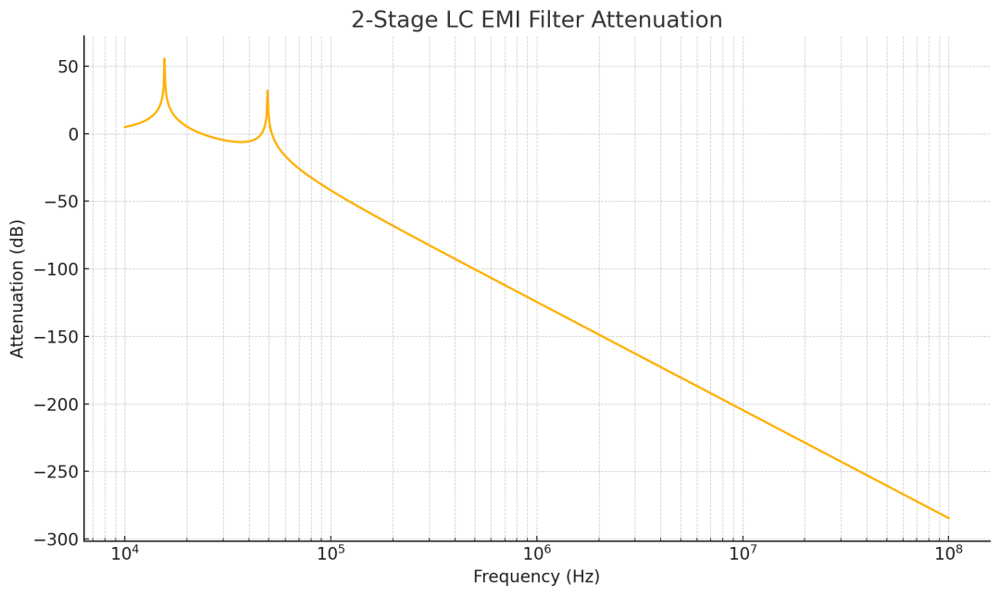
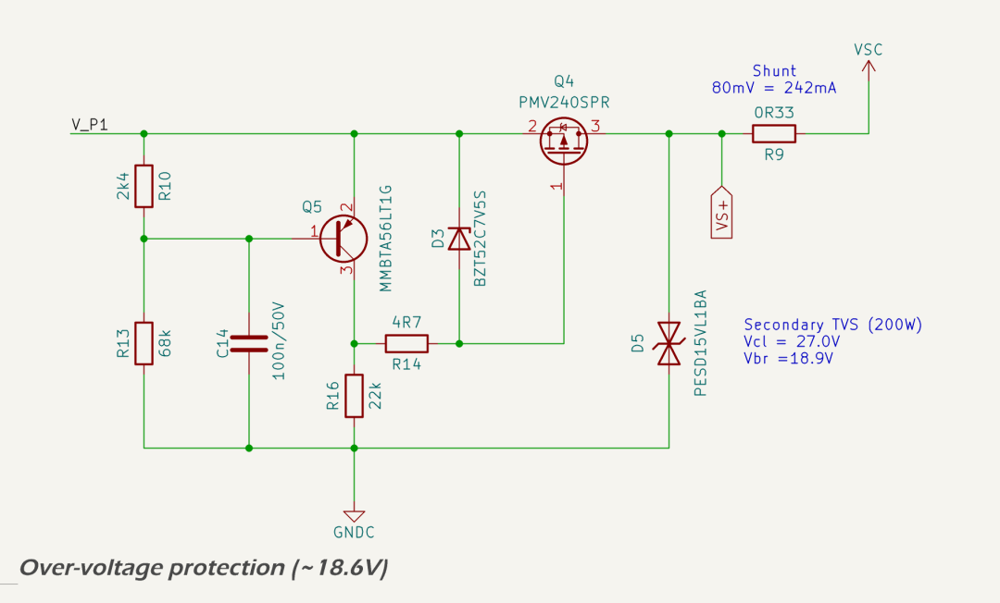

# `NET-S` Power Conditioning

The `NET-S` power conditioning circuit is shown below.

## NMEA Shield

In accordance with NMEA 2000 guidelines, the shield pin of the NMEA connector is not connected to any circuit reference or chassis ground. This prevents unintended ground loops and maintains electrical isolation between the device and the backbone cabling. No transient suppression components are populated at this node in the production version.

## TVS and MOV Protection

The first line of defence against electrostatic discharge (ESD) and high-energy surge events is a high-power bidirectional TVS diode. The [SM8S36CA](https://www.smc-diodes.com/propdf/SM8S20CA%20THRU%20SM8S43CA%20N2149%20REV.-.pdf) is placed directly across the `NET-S` input to clamp and absorb energy during overvoltage events such as alternator load dump, battery disconnection under load, or inductive spikes. This diode begins clamping at approximately 58 V and is rated for 6.6 kW peak pulse power (10/1000 µs). It is also capable of absorbing ±30 kV contact discharges per IEC 61000-4-2.

The SM8S36CA TVS diode was thermally modelled under [ISO 7637-2](https://www.iso.org/standard/50925.html) Pulse 5b conditions to validate its performance during worst-case load dump events. For a 12 V system pulse (150 V, 400 ms), it absorbs ~320 mJ and remains well below its 150 °C maximum junction temperature, with estimated temperature rise of only 8 °C due to conservative PCB layout and copper thermal mass. However, in a 24 V system with Pulse 5b rising to 300 V, the energy dissipation exceeds 18 J — resulting in thermal runaway. The device is therefore not suitable for full load dump protection in 24 V environments. It does, however, remain effective for ISO 7637-2 Pulses 1, 2a, 3a, and 3b, including relay switching and ESD transients.

A [V33MLA1206NH MOV](https://lcsc.com/datasheet/lcsc_datasheet_2410121837_Littelfuse-V33MLA1206NH_C187727.pdf) is fitted in parallel with the TVS diode. The MOV supplements the TVS by absorbing slower transients and helping to limit energy throughput to downstream components.

## Polarity Protection

The 12 V input from the [NMEA 2000](https://www.nmea.org/nmea-2000.html) connector is protected from reverse polarity using a discrete Schottky diode.

A MOSFET-based reverse protection scheme was considered but not adopted. The primary justification for using a simple diode is the presence of generous headroom in the input voltage range (nominal 12 V vs. 5 V and 3.3 V regulated rails), which makes the forward voltage drop acceptable. Diode protection offers simpler implementation, lower component cost, and greater resilience to fault modes such as latch-up or shoot-through.

The primary component is the [SS34](https://lcsc.com/datasheet/lcsc_datasheet_2310100931_MSKSEMI-SS34-MS_C2836396.pdf) (DO-214AC/SMA package), which provides reliable protection against reverse connections while introducing minimal voltage drop in normal operation:

* maximum reverse voltage (VRRM): 40 V;
* average forward current (IF(AV)): 3.0 A;
* surge current rating (IFSM, 8.3 ms): 100 A; and
* typical forward voltage drop (VF @ 1 A): ~0.5 V.

This approach ensures automatic recovery from incorrect wiring and protects downstream circuitry by blocking reverse current. Under reverse polarity conditions, the Schottky diode blocks current flow entirely, and no reverse current is conducted.

## Bulk/Damping Capacitor

Two 22 µF size 2220 100V MLCC capacitors are placed after the resettable fuse and before the EMI filter. This capacitor provides damping of high-frequency oscillations on the input cable and absorbs surge energy clamped by the TVS and MOV components. A 150 mΩ resistor i series with this bulk capacitance provides beneficial resistive damping and suppresses ringing. A 100 kΩ resistor is placed in parallel with the capacitance to ensure safe discharge after power-off.

## 2-Stage EMI Filter

Downstream of the bulk capacitor, a two-stage LC filter provides differential-mode attenuation of conducted EMI. The filter consists of:

* a [1 µH Murata LQM18FN100M00D](https://lcsc.com/datasheet/lcsc_datasheet_2410121333_Murata-Electronics-LQM18FN100M00D_C86083.pdf) chip inductor followed by 10.4 µF ceramic (X7R) capacitance;
* a 4.7 µH chip inductor followed by 22.2 µF ceramic (X7R) capacitance.

These stages attenuate both inbound and outbound conducted EMI. Inbound suppression protects internal regulators and transceivers from powerline noise. Outbound suppression reduces emissions from internal switching converters and digital transients.

The filter has been shown through simulation to deliver >60 dB attenuation at 10 MHz and >100 dB above 100 MHz. This differential-mode filter is preferred to a common-mode choke filter to avoid introducing ambiguity in the `CAN` domain ground reference.

## Over-voltage Protection

A [P-channel MOSFET](https://lcsc.com/datasheet/lcsc_datasheet_2410121947_Nexperia-PMV240SPR_C5361354.pdf) is used to disconnect the load if the input voltage exceeds a defined threshold. A resistive divider monitors the supply voltage and drives the base of a PNP transistor. When the divided voltage exceeds ~0.65 V, the PNP conducts, pulling up the gate of the MOSFET and turning it off. The threshold is set to approximately 24.6 V, ensuring the [INA219](https://www.ti.com/lit/ds/symlink/ina219.pdf) I²C power sensor (27 V maximum sense voltage) is not overstressed.

The gate of the MOSFET is clamped by a 7.5 V zener diode to limit VGS, and a 22 kΩ pull-down resistor ensures it remains on under normal conditions. The circuit is self-resetting and restores output power automatically when the input voltage returns to normal.

A downstream TVS diode with a higher standoff rating (e.g. SMBJ26A) is included to absorb any residual surge energy that might pass the cutoff switch, further protecting sensitive loads such as the INA219.

## Datasheets and Citations

1. International Standards Organization (ISO), [*ISO 7637-2, Road vehicles — Electrical disturbances from conduction and coupling Part 2: Electrical transient conduction along supply lines only*](https://www.iso.org/standard/50925.html)
2. SMC Diode Solutions, [*SM8S36CA Bidirectional TVS Diode Datasheet*](https://www.smc-diodes.com/propdf/SM8S20CA%20THRU%20SM8S43CA%20N2149%20REV.-.pdf)
3. Littelfuse, [*V33MLA1206NH Metal Oxide Varistor Datasheet*](https://lcsc.com/datasheet/lcsc_datasheet_2410121837_Littelfuse-V33MLA1206NH_C187727.pdf)
4. MSKSEMI, [*SS34 Schottky Diode Datasheet*](https://lcsc.com/datasheet/lcsc_datasheet_2310100931_MSKSEMI-SS34-MS_C2836396.pdf)
5. Murata, [*LQM18FNxxxM00D Chip Inductor Datasheet*](https://lcsc.com/datasheet/lcsc_datasheet_2410121333_Murata-Electronics-LQM18FN100M00D_C86083.pdf)
6. Texas Instruments, [*INA219 Current/Power Monitor With I²C Interface Datasheet*](https://www.ti.com/lit/ds/symlink/ina219.pdf)
7. Nexperia. [*PMV240SPR P-channel MOSFET datasheet*](https://lcsc.com/datasheet/lcsc_datasheet_2410121947_Nexperia-PMV240SPR_C5361354.pdf)
