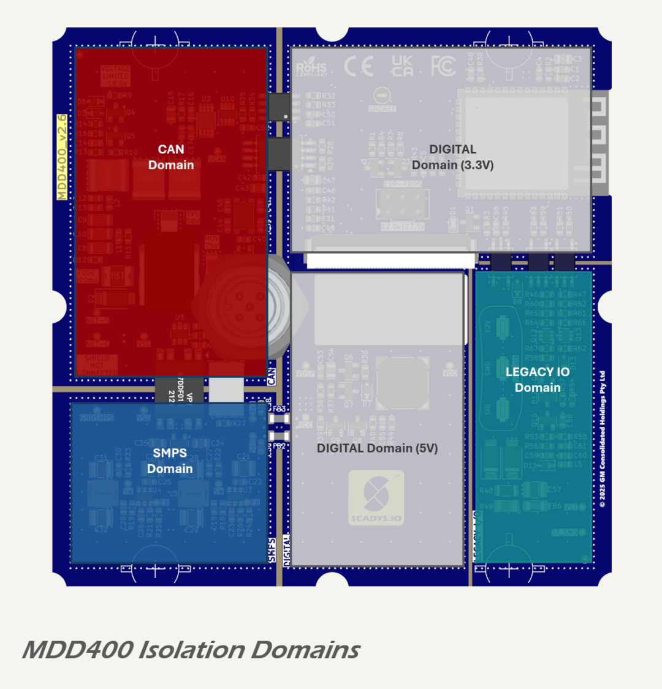
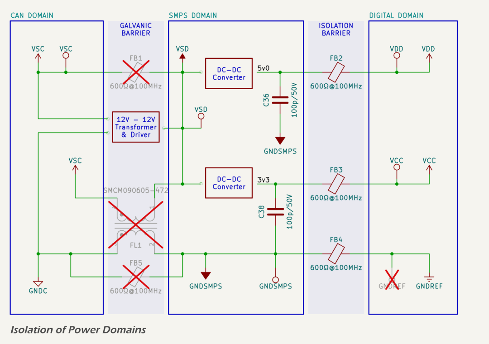

# MDD400 Circuit Design and PCB Layout

This section provides an overview of the MDD400 circuit architecture and PCB layout, structured according to four electrical domains within the device: `CAN`, `SMPS`, `Digital`, and `LEGACY IO`. 

## Functional Domains

Each domain implements a specific set of functions, with galvanic or pseudo-isolation between critical boundaries. The image below illustrates the physical layout of these domains on the main PCB:

### _CAN_ Domain

The `CAN` domain contains all circuitry related to the NMEA 2000 interface. Filtered and conditioned 12 V input from the NMEA 2000 backbone is used to supply this domain. Key components include:

* protection and power conditioning for the CAN supply rail;
* current sensing via a shunt and I²C power sensor circuit, communicating with the `DIGITAL` domain via an I²C isolator; and
* a galvanically isolated CAN transceiver.

The I²C power sensor and CAN transceiver are powered from a local 5 V LDO regulator. 

The `CAN` domain is physically isolated on the PCB and galvanically isolated from the digital and legacy IO domains.

### _SMPS_ Domain

The `SMPS` domain generates internal power rails from the conditioned 12 V input supply, which is shared with the `CAN` domain. It includes:

* a 5.3 V DC-DC converter (`VDD`) used for display, buzzer, and other 5 V loads;
* a 3.3 V DC-DC converter (`VCC`) supplying digital logic and sensors; and
* input filtering, protection, and layout provisions for EMI suppression.

These regulators power the `DIGITAL` domain. Ground and power planes between SMPS and digital domains are galvanically isolated using a transformer driver and isolation transformer.

### _DIGITAL_ Domain

The `DIGITAL` domain includes the main microcontroller and all logic-level circuitry. It is powered by the `VDD` and `VCC` rails provided by the `SMPS` domain. This domain includes:

* microcontroller module;
* I²C temperature and ambient light sensors;
* TFT LCD touch screen HMI display.

While electrically connected to the `SMPS` domain, the digital switching circuits are galvanically isolated from the `CAN` and `LEGACY IO` domains.

### _LEGACY IO_ Domain

The `LEGACY IO` domain supports 12 V serial interfaces compatible with NMEA 0183 and SeaTalk systems. It is fully galvanically isolated from all other domains, with communication across the isolation barrier handled via opto-isolators. This domain includes:

* power and signal conditioning for legacy RX and TX lines;
* opto-isolated receive buffer; and
* discrete transmit driver circuit.

Power for this domain is derived from the serial input connector.

Each of these domains is described in detail in its corresponding documentation section, including full schematics, layout notes, and component selection rationale.

## Isolation Strategy

The MDD400 implements galvanic isolation between functional domains to suppress conducted noise, block fault currents, and maintain EMC compliance. Isolation boundaries are defined in both circuit topology and PCB layout, with reinforced separation between grounds, signal paths, and copper pours.

* the `CAN` and `SMPS` domains are fully galvanically isolated via a push-pull transformer circuit;
* two alternative isolation strategies are provided in parallel with the transformer circuit: a common-mode choke and low-impedance ferrite beads, which may be selectively populated during EMC testing;
* the `SMPS` and `DIGITAL` domains are connected via ferrite beads on both power rails and a 100 pF bypass capacitor across the ground boundary;
* no DC connection exists between `GNDSMPS` and `GNDREF`, preserving high-impedance isolation across the digital boundary.

## EMC and EMI/ESD Protection

The NMEA 2000 connections are fully protected from ESD and EMI, while also effectively blocking radiated EMI for compliance withe CANBUS and NMEA 2000 requirements:

- bulk damping capacitance and transient/polarity protection of the 12 V NMEA 2000 backbone power (`NET-S`);
- a two-stage L-C EMI filter provides bi-directional EMI suppression;
- two-stage over-voltage protection consisting of a 6kW TVS, clamping at 58 V and a over-voltage cut-out that disconnects above 18.6 V; and
- galvanically isolated CAN transceiver with best-practice filtering/conditioning of the differential CAN signals (`NET-H` and `NET-S`).