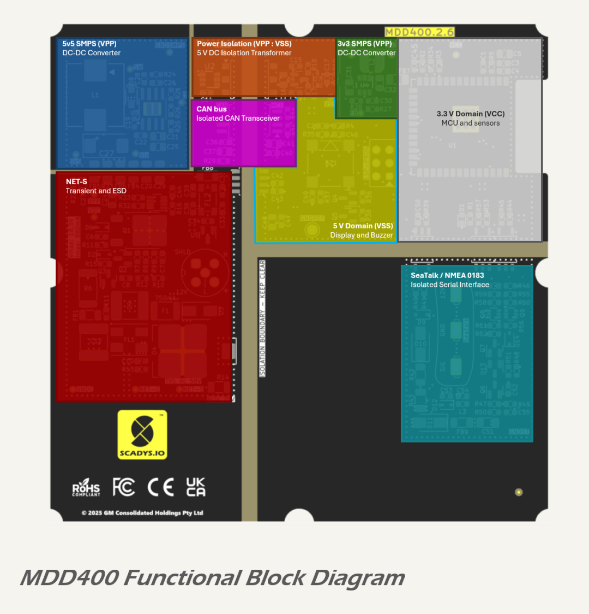

# Layout

The layout of the MDD400 PCB is guided by functional separation between domains, isolation requirements, EMC best practices, and thermal management constraints. The board is organized into well-defined physical zones that correspond to the electrical domains: `CAN`, `SMPS`, `DIGITAL`, and `LEGACY IO`.

## Domain Placement

Functional areas are compartmentalised across the board to maintain isolation boundaries and reduce noise coupling. The figure below shows the physical layout of these domains:

Key placement details are as follows:

* the upper left quadrant, near the NMEA 2000 connector, contains the `CAN` domain, including input protection circuitry on `NET-S`, the isolated CAN transceiver, and power filtering;
* in the bottom-left quadrant is the `SMPS` domain, housing the 5.3 V and 3.3 V DC-DC converters;
* the central region is occupied by the `DIGITAL` domain, including the ESP32 MCU, display interface, sensors, buzzer, and associated logic; and
* the lower right quadrant is assigned to the `LEGACY IO` domain, which includes opto-isolated circuits for SeaTalk and NMEA 0183 serial communication.

Each domain is separated by defined clearance zones and copper pour boundaries. The only electrical connections between domains are via isolated communication channels or filtered / isolated power paths.

## Connector Placement

The board includes four primary external connectors, each associated with a specific domain. These connectors are listed in the table below with their physical coordinates (in mm, origin at geometric center of PBC):



## Routing and Layer Strategy

All routed signals are confined to the top and bottom layers, with the two internal layers dedicated entirely to ground. This arrangement ensures short, low-impedance return paths and strong suppression of EMI.

Power and ground copper pours are assigned per domain:

* the `CAN` domain uses `GNDC` as its ground reference;
* the `SMPS` domain uses `GNDSMPS`;
* the `DIGITAL` domain uses `GNDREF`; and
* the `LEGACY IO` domain uses `GNDST`.

No galvanic connection exists between these ground domains, except where explicitly bridged via filter elements. Ferrite beads and common-mode chokes are used to maintain isolation while enabling controlled power flow between the `CAN`, `SMPS`, and `DIGITAL` domains.

## Shielding and Return Paths

The NMEA 2000 cable shield (`SHLD`) is not connected internally to avoid creating a ground loop. Instead, it is left floating, consistent with marine EMC guidelines. This decision is aligned with the use of a plastic enclosure and isolation of internal ground domains.

Stitched ground pours, edge stitching, and via arrays under high-speed and high-power components provide robust shielding and thermal conduction across the board. Signal traces are routed over continuous internal ground planes to minimize loop areas.

## Thermal Considerations

Thermal vias are included under all power semiconductors and high-dissipation components. The `SMPS` domain features stitched copper pours under each DC-DC converter and inductor. The MCU and display driver are positioned for balanced heat distribution, away from the isolated CAN and `LEGACY IO` circuitry.

## References

1. Monolithic Power Systems, [*EMI Webinar: Practical Grounding and Layout*](https://www.monolithicpower.com/en/support/videos/emi-2-webinar-early-session.html?srsltid=AfmBOop1N5qpjFNFHkvJIyWCZOyt30Mt_P6bsL53Dz79rUJPYOWXOTq6)

<!-- # Layout

The MDD400 PCB layout is divided into multiple functional zones, with a focus on separation between power domains, digital logic, and isolated communication interfaces. The placement strategy is optimised for EMC performance, thermal management, and manufacturability.

# Functional Zones

The board follows a compartmentalised structure, as shown below.

Each functional block is grouped into a defined physical region of the board:

* the left side of the board, around the NMEA 2000 connector, includes the unregulated input protection circuit (NET-S), providing ESD transient (load dump) and overcurrent protection,
* at the top of the PCB are the power supply functions, from left to right: 5.5 V DC-DC converter (VDC to VPP), 5 V isolation transformer(VPP to VSS, across the isolation barrier) and 3.3 V DC-DC converter ( VSS to VCC);
* the isolated CAN bus transceiver is located directly below the 5 V isolation transformer, also across the isolation barrier;
* the central area contains the 5 V domain, including the LCD interface and audio buzzer drive;
* the right-hand side hosts the 3.3 V `DIGITAL` Domain, which includes the MCU and sensor interfaces; and
* the lower right section contains the SeaTalk / NMEA 0183 legacy serial interface.

## Ground Plane Arrangement

The MDD400 follows the NMEA 2000 recommendation for shield handling: the shield connection on the NMEA 2000 connector is left unconnected (floating) within the device. This approach avoids introducing ground loops and accommodates the fact that the enclosure is constructed entirely from PMMA, with no conductive chassis components available for bonding or shielding.

Each isolated domain on the PCB has its own dedicated ground plane, as shown in the layout and ground plane figures. These include NET-C (NMEA 2000 ground), GNDC (filtered CAN ground), GNDSMPS (local converter ground), GNDST (legacy serial interface ground), and GNDREF (digital logic ground). No galvanic or capacitive connections exist between these planes except where intentional domain bridging is implemented using ferrite beads and filter capacitors.

The ground arrangement, combined with floating shield handling, ensures that common-mode disturbances or externally coupled EMI do not propagate across the isolation boundaries. This design supports EMC compliance and safe operation in marine installations, where differential voltages between system grounds are common.

The internal copper layers are solid ground planes, providing unbroken low-impedance return paths for all routed signals on the outer layers. Each ground domain is implemented as a separate polygon, with isolation distances maintained throughout. These domains are (clockwise, starting at NMEA 2000 connector):

* `NET-C`: NMEA 2000 reference ground;
* `GNDC`: filtered ground for the CAN interface;
* `GNDSMPS`: local ground for the 5.5 V DC-DC converter;
* `GNDST`: isolated ground for the legacy serial interface; and
* `GNDREF`: digital and analog logic domain ground.

The ground plane arrangement is illustrated below.

Where inter-domain connections are required (e.g., GNDC to GNDSMPS), they are made via controlled impedance ferrite beads and accompanied by high-frequency filter capacitors.

## Connectors
<table>
    <colgroup>
        <col style="width:100%">
        <col style="width:100%">
        <col style="width:50%">
        <col style="width:10%" class="right-aligned">
        <col style="width:10%" class="right-aligned">
    </colgroup>
    <thead>
        <tr>
            <th>Connector</th>
            <th class="centered">Style</th>
            <th class="centered">Domain</th>
            <th class="centered right-aligned">X</th>
            <th class="centered right-aligned">Y</th>
        </tr>
    </thead>
    <tbody>
        <tr>
            <td>NMEA 2000</td>
            <td class="centered">DeviceNet Micro-C 5-pin Code A</td>
            <td class="centered">CAN</td>
            <td class="right-aligned">-16.0</td>
            <td class="right-aligned">0.0</td>
        </tr>
        <tr>
            <td>ESP-PROG Programmer</td>
            <td class="centered">IDC 6-pin Male 2.54mm pitch</td>
            <td class="centered">DIGITAL</td>
            <td class="right-aligned">12.0</td>
            <td class="right-aligned">-17.5</td>
        </tr>
        <tr>
            <td>DWIN Display FFC</td>
            <td class="centered">50-pin 0.5mm FPC Top and Bottom Clamshell</td>
            <td class="centered">DIGITAL</td>
            <td class="right-aligned">10.0</td>
            <td class="right-aligned">-10.0</td>
        </tr>
        <tr>
            <td>SeaTalk I / NMEA 0183</td>
            <td class="centered">SeaTalk I 3-pin Autohelm Style</td>
            <td class="centered">LEGACY IO</td>
            <td class="right-aligned">29.0</td>
            <td class="right-aligned">10.5</td>
        </tr>
    </tbody>
</table>

 -->
