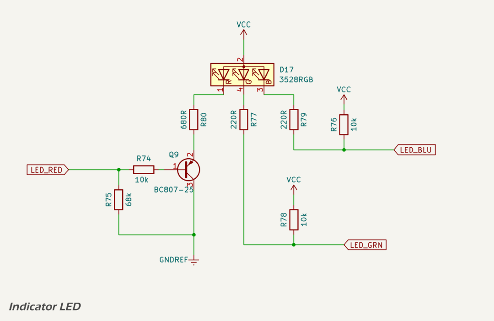

# Indicator LED

The WTI400 uses a single [3528-package common anode RGB LED](https://www.lcsc.com/datasheet/C2843813.pdf) as a status indicator. This device provides three die (red, green, blue) that can be driven individually to indicate system state or combined to produce mixed colours.

## Circuit overview

The schematic above shows the indicator LED circuit, powered from the 3.3 V logic rail. Each colour is current-limited by a dedicated series resistor. The red channel is driven by a PNP transistor stage, while the green and blue channels are switched directly by GPIO pins on the ESP32-S3.

* **Red channel**: implemented with a high-side PNP transistor. A pull-down on the transistor base ensures the red LED is illuminated during reset and boot, when the microcontroller pins are floating. This provides a simple power-on indicator before firmware starts executing;
* **Green and blue channels**: connected directly to ESP32 GPIOs through current-limiting resistors. Weak pull-ups hold these channels off until the firmware configures the pins. Once initialised, the microcontroller can assert or PWM these channels directly to produce the required status colours.

## Design objectives

The design of the indicator LED was guided by a small number of key objectives. These ensure the circuit provides useful information to the user at all stages of device operation, while keeping component count low.

* boot indication: device power present but firmware not running is shown by a steady red LED;
* firmware control: once the ESP32-S3 has initialised, all three colour channels can be controlled individually;
* simplicity: only the red channel requires a discrete driver transistor. Green and blue can be driven directly within the current capability of ESP32 GPIOs; and
* current limiting: each LED die has its own resistor, selected to balance colour brightness at approximately 1–2 mA per channel. Red uses a higher value to compensate for its greater luminous efficiency; green and blue use lower values to provide comparable apparent intensity.

## Brightness and visibility

The LED forward voltages at 20 mA are specified as 1.8–2.2 V (red), 2.9–3.2 V (green) and 3.0–3.3 V (blue). At the intended drive currents of ~1–2 mA, the forward voltages are somewhat lower, allowing adequate headroom from a 3.3 V supply. The design produces moderate indoor brightness suitable for a status indicator, without excessive current draw or glare.

## Summary

This arrangement meets all design objectives:

* provides a default red indicator during boot/reset;
* ensures green and blue are off until firmware takes control;
* allows flexible colour mixing once the microcontroller is running; and
* uses minimal external components while staying within ESP32 GPIO drive limits.

## References

1. XingLight, [*XL-3528RGBW-HM datasheet*](https://www.lcsc.com/datasheet/C2843813.pdf), LCSC, accessed 2025.
