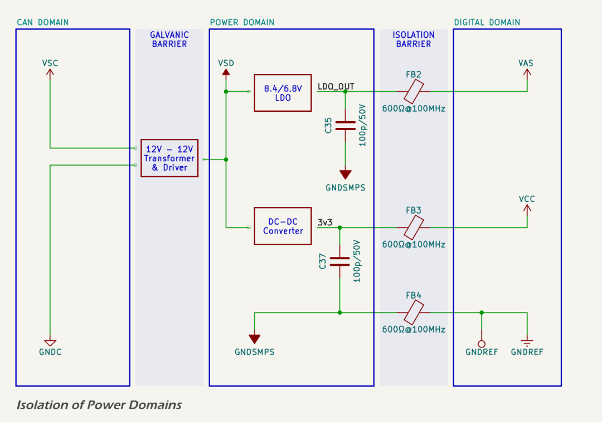
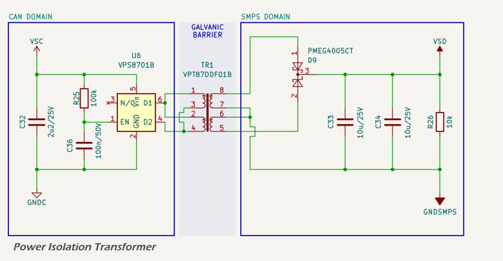

# _POWER_ Domain

The `POWER` domain provides two regulated supplies for the `DIGITAL` domain:

* a 3.3 V rail (`VCC`) for the MCU and attached devices; and
* a voltage-selectable low-current rail (`VAS`) (6.5 V / 8.0 V) for the masthead wind transducer and its analog signal conditioning circuits.

## Domain Isolation

The following schematic shows the isolation strategy between `CAN`, `POWER`, and `DIGITAL` domains:

* the `CAN` and `POWER` domains are fully galvanically isolated via a push-pull transformer circuit;
* the `POWER` and `DIGITAL` domains are connected via ferrite beads on both power rails and a 100 pF bypass capacitor across the ground boundary; and
* no DC connection exists between `GNDSMPS` and `GNDREF`, preserving high-impedance isolation across the digital boundary.

This configuration suppresses high-frequency noise propagation between domains, minimises EMI, and protects digital logic from disturbances originating in the CAN interface or power switching stages.

The `POWER` domain is galvanically isolated from the upstream `CAN` domain via a dedicated push-pull transformer driver and 1:1 isolation transformer. The transformer output is rectified using a [PMEG4005CT Schottky diode](https://www.lcsc.com/datasheet/C1692757.pdf), filtered, and supplied as `VSD` to the two regulators.

The `SMPS` ground reference (`GNDSMPS`) is isolated from both the `CAN` domain (`GNDC`) and the `DIGITAL` domain (`GNDREF`). Isolation boundaries are defined as follows:

* the `CAN` to `POWER` domain interface is galvanically isolated using a [VPS8701B transformer driver](https://www.lcsc.com/datasheet/C552889.pdf) and [VPT87DDF01B 12 V:12 V transformer](https://www.lcsc.com/datasheet/C2846916.pdf); and
* the `POWER` and `DIGITAL` domains are connected via ferrite beads and Y-cap-style capacitive bypass, but remain isolated at the DC level.

The SMPS converter has its own feedback and filtering network tailored to the downstream load. The converter is configured for 400 kHz operation and uses [low DCR 22 µH shielded inductors](https://www.bourns.com/docs/product-datasheets/srn5040ta.pdf?sfvrsn=df477df6_5).

Detailed implementation of each regulator is covered in the `VAS` and `VCC` sections.

Layout follows [best practice for minimising radiated EMI](https://www.monolithicpower.com/en/support/videos/emi-2-webinar-early-session.html?srsltid=AfmBOop1N5qpjFNFHkvJIyWCZOyt30Mt_P6bsL53Dz79rUJPYOWXOTq6), including:

* tight hot loops on both the input and output;
* shielded inductor with minimal above PCB radiators;
* selection and placement of passives;
* ground plane isolation and via stitching; and
* provision for optional damping of ringing in the switching loop.

Thermal design includes stitched copper pours under the regulator and output inductor. The output inductors are generously specified with low DCR and no thermal or stability concerns are expected.

## 3.3 V SMPS (*VCC*)

The 3.3 V rail supplies all digital logic and interfaces, including:

* the [ESP32-S3](https://www.espressif.com/sites/default/files/documentation/esp32-s3-wroom-1_datasheet_en.pdf);
* indicator LEDs; and
* the logic side of the [ISO1042](https://www.ti.com/lit/ds/symlink/iso1042.pdf) CAN transceiver.

Typical load is ~90 mA, peaking at ~275 mA during Wi-Fi operation. Simulated ripple is <8 mV peak-to-peak. The VCC supply is implemented using a synchronous buck converter based on the [Texas Instruments LMR51610](https://www.ti.com/lit/ds/symlink/lmr51610.pdf) regulator IC. 

## 6.5/8.0 V LDO (*VAS*)

The analog supply rail `VAS` is dedicated to powering a legacy masthead wind transducer, such as popular transducers from Raymarine/Autohelm and Navico (B&G, Simrad). These require a DC supply of either 6.5 V or 8.0 V, typically at ~25 mA.

## Datasheets and References

1. Texas Instruments, [*LMR516xx SIMPLE SWITCHER® Power Converter, 4-V to 65-V, 0.6-A/1-A Buck Converter in a SOT-23 Package Datasheet*](https://www.ti.com/lit/ds/symlink/lmr51610.pdf)
2. Murata Electronics, [*BLM31KN601SN1L Ferrite Bead Datasheet*](https://lcsc.com/datasheet/lcsc_datasheet_2209271730_Murata-Electronics-BLM31KN601SN1L_C668306.pdf)
3. Texas Instruments, [*Controlling switch-node ringing in synchronous buck converters*](https://www.ti.com/lit/an/slyt465/slyt465.pdf), Application Note SLYT465
4. Texas Instruments, [*Design Consideration on Boot Resistor in Buck Converter*](https://www.ti.com/lit/an/snvaa73/snvaa73.pdf), Application Note SNVAA73
5. Espressif, [*ESP32-S3 32-bit MCU & 2.4 GHz Wi-Fi & Bluetooth 5 (LE) Datasheet*](https://www.espressif.com/sites/default/files/documentation/esp32-s3-wroom-1_wroom-1u_datasheet_en.pdf)
6. Texas Instruments, [*OPT3004 Ambient Light Sensor (ALS) Datasheet*](https://www.ti.com/lit/ds/symlink/opt3004.pdf)
7. Texas Instruments, [*TMP112 High-Accuracy, Low-Power, Digital Temperature Sensors Datasheet*](https://www.ti.com/lit/ds/symlink/tmp112.pdf)
8. Texas Instruments, [*ISO1042 Isolated CAN Transceiver Datasheet*](https://www.ti.com/lit/ds/symlink/iso1042.pdf)
9. Texas Instruments, [*ISO1541 Low-Power Bidirectional I²C Isolators Datasheet*](https://www.ti.com/lit/ds/symlink/iso1541.pdf)
10. DWIN, [*DMG48480F040_02WTCZ02COF HMI TFT LCD Display with Capacitive Touch Screen Datasheet*](https://www.dwin-global.com/4-0-inch-intelligent-display-model-dmg48480f040_02wtcz02cof-series-product/)
11. Jiangsu Huaneng, [*MLT-8530 Electro-Magnetic Buzzer (SMD Type) Datasheet*](https://lcsc.com/datasheet/lcsc_datasheet_2410010301_Jiangsu-Huaneng-Elec-MLT-8530_C94599.pdf)
12. Bourns, [*SRN5040TA-220M Semi-shielded AEC-Q200 Compliant Power Inductors Datasheet*](https://www.bourns.com/docs/product-datasheets/srn5040ta.pdf?sfvrsn=df477df6_5)
13. SXN, [*SMCM Series (SMCM7060-102T) Common Mode Line Filter Datasheet*](https://lcsc.com/datasheet/C5189123.pdf)
14. Nexperia, [*PMEG4005CT Dual Schottky Rectifier Datasheet*](https://www.lcsc.com/datasheet/C1692757.pdf)
15. VPSC, [*VPS8701B Push-Pull Transformer Driver Datasheet*](https://www.lcsc.com/datasheet/C552889.pdf)
16. VPSC, [*VPT87DDF01B 12 V:12 V Transformer Datasheet*](https://www.lcsc.com/datasheet/C2846916.pdf)
17. Monolithic Power Systems, [*EMI Webinar: Practical Grounding and Layout*](https://www.monolithicpower.com/en/support/videos/emi-2-webinar-early-session.html?srsltid=AfmBOop1N5qpjFNFHkvJIyWCZOyt30Mt_P6bsL53Dz79rUJPYOWXOTq6)

<!-- 
# *POWER* Domain

The `POWER` domain provides two regulated supplies for the `DIGITAL` domain:

* a 3.3 V rail (`VCC`) for the MCU and attached devices; and
* a voltage selectable low-current rail (`VAS`) (6.5 V / 8.0V) for the masthead wind transducer and its analog signal conditioning circuits; and

## Domain Isolation

The following schematic shows the isolation strategy between `CAN`, `SMPS`, and `DIGITAL` domains:

* the `CAN` and `POWER` domains are fully galvanically isolated via a push-pull transformer circuit; and
* the `POWER` and `DIGITAL` domains are connected via ferrite beads on both power rails and a 100 pF bypass capacitor across the ground boundary;
* no DC connection exists between `GNDSMPS` and `GNDREF`, preserving high-impedance isolation across the digital boundary.

This configuration suppresses high-frequency noise propagation between domains, minimises EMI, and protects digital logic from disturbances originating in the CAN interface or power switching stages.

The `POWER` domain is galvanically isolated from the upstream `CAN` domain via a dedicated push-pull transformer driver and 1:1 isolation transformer. The transformer output is rectified using a [PMEG4005CT Schottky diode](https://www.lcsc.com/datasheet/C1692757.pdf), filtered, and supplied as `VSD` to the two DC-DC converters.

The `SMPS` ground reference (`GNDSMPS`) is isolated from both the `CAN` domain (`GNDC`) and the `DIGITAL` domain (`GNDREF`). Isolation boundaries are defined as follows:

* the `CAN` to `POWER` domain interface is galvanically isolated using a [VPS8701B transformer driver](https://www.lcsc.com/datasheet/C552889.pdf) and [VPT87DDF01B 12 V:12 V transformer](https://www.lcsc.com/datasheet/C2846916.pdf); and
* the `POWER` and `DIGITAL` domains are connected via ferrite beads and Y-cap-style capacitive bypass, but remain isolated at the DC level.

Each SMPS converter has its own feedback and filtering network tailored to the downstream load. The converters are configured for 400 kHz operation and use [low DCR 22 µH shielded inductors](https://www.bourns.com/docs/product-datasheets/srn5040ta.pdf?sfvrsn=df477df6_5).

Detailed implementation of each converter is covered in the `VDD` and `VCC` sections.

Layout follows [best practice for minimising radiated EMI](https://www.monolithicpower.com/en/support/videos/emi-2-webinar-early-session.html?srsltid=AfmBOop1N5qpjFNFHkvJIyWCZOyt30Mt_P6bsL53Dz79rUJPYOWXOTq6), including:

* tight hot loops on both the input and output;
* shielded inductor with minimal above PCB radiators;
* selection and placement of passives;
* ground plane isolation and via stitching; and
* provision for optional damping of ringing in the switching loop.

Thermal design includes stitched copper pours under the regulator and output inductor. The output inductors are generously specified with low DCR and no thermal or stability concerns are expected.

## 3.3 V SMPS (*VCC*)

The 3.3 V rail supplies all digital logic and interfaces, including:

* the [ESP32-S3](https://www.espressif.com/sites/default/files/documentation/esp32-s3-wroom-1_datasheet_en.pdf); 
* indicator LEDs; and
* the logic side of the [ISO1042](https://www.ti.com/lit/ds/symlink/iso1042.pdf) CAN transceiver.

Typical load is ~90 mA, peaking at ~275 mA during Wi-Fi operation. Simulated ripple is <8 mV peak-to-peak. The VCC supply  is implemented using a synchronous buck converter based on the [Texas Instruments LMR51610](https://www.ti.com/lit/ds/symlink/lmr51610.pdf) regulator IC. 

## 6.5/8.0 V LDO (*VAS*)

The analog supply rail `VAS` is dedicated to powering a legacy masthead wind transducer, such as popular transducers from Raymarine/Autohelm and Navico (B&G, Simrad). These require a DC supply of either 6.5 V or 8.0 V, typically at ~25 mA.

## Datasheets and References

1. Texas Instruments, [*LMR516xx SIMPLE SWITCHER® Power Converter, 4-V to 65-V, 0.6-A/1-A Buck Converter in a SOT-23 Package Datasheet*](https://www.ti.com/lit/ds/symlink/lmr51610.pdf)
2. Murata Electronics, [*BLM31KN601SN1L Ferrite Bead Datasheet*](https://lcsc.com/datasheet/lcsc_datasheet_2209271730_Murata-Electronics-BLM31KN601SN1L_C668306.pdf)
3. Texas Instruments, [*Controlling switch-node ringing in synchronous buck converters*](https://www.ti.com/lit/an/slyt465/slyt465.pdf), Application Note SLYT465
4. Texas Instruments, [*Design Consideration on Boot Resistor in Buck Converter*](https://www.ti.com/lit/an/snvaa73/snvaa73.pdf), Application Note SNVAA73
5. Espressif, [*ESP32-S3 32-bit MCU & 2.4 GHz Wi-Fi & Bluetooth 5 (LE) Datasheet*](https://www.espressif.com/sites/default/files/documentation/esp32-s3-wroom-1_wroom-1u_datasheet_en.pdf)
6. Texas Instruments, [*OPT3004 Ambient Light Sensor (ALS) Datasheet*](https://www.ti.com/lit/ds/symlink/opt3004.pdf)
7. Texas Instruments, [*TMP112 High-Accuracy, Low-Power, Digital Temperature Sensors Datasheet*](https://www.ti.com/lit/ds/symlink/tmp112.pdf)
8. Texas Instruments, [*ISO1042 Isolated CAN Transceiver Datasheet*](https://www.ti.com/lit/ds/symlink/iso1042.pdf)
9. Texas Instruments, [*ISO1541 Low-Power Bidirectional I²C Isolators Datasheet*](https://www.ti.com/lit/ds/symlink/iso1541.pdf)
10. DWIN, [*DMG48480F040_02WTCZ02COF HMI TFT LCD Display with Capacitive Touch Screen Datasheet*](https://www.dwin-global.com/4-0-inch-intelligent-display-model-dmg48480f040_02wtcz02cof-series-product/)
11. Jiangsu Huaneng, [*MLT-8530 Electro-Magnetic Buzzer (SMD Type) Datasheet*](https://lcsc.com/datasheet/lcsc_datasheet_2410010301_Jiangsu-Huaneng-Elec-MLT-8530_C94599.pdf)
12. Bourns, [*SRN5040TA-220M Semi-shielded AEC-Q200 Compliant Power Inductors Datasheet*](https://www.bourns.com/docs/product-datasheets/srn5040ta.pdf?sfvrsn=df477df6_5)
13. SXN, [*SMCM Series (SMCM7060-102T) Common Mode Line Filter Datasheet*](https://lcsc.com/datasheet/C5189123.pdf)
14. Nexperia, [*PMEG4005CT Dual Schottky Rectifier Datasheet*](https://www.lcsc.com/datasheet/C1692757.pdf)
15. VPSC, [*VPS8701B Push-Pull Transformer Driver Datasheet*](https://www.lcsc.com/datasheet/C552889.pdf)
16. VPSC, [*VPT87DDF01B 12 V:12 V Transformer Datasheet*](https://www.lcsc.com/datasheet/C2846916.pdf)
17. Monolithic Power Systems, [*EMI Webinar: Practical Grounding and Layout*](https://www.monolithicpower.com/en/support/videos/emi-2-webinar-early-session.html?srsltid=AfmBOop1N5qpjFNFHkvJIyWCZOyt30Mt_P6bsL53Dz79rUJPYOWXOTq6)
 -->
