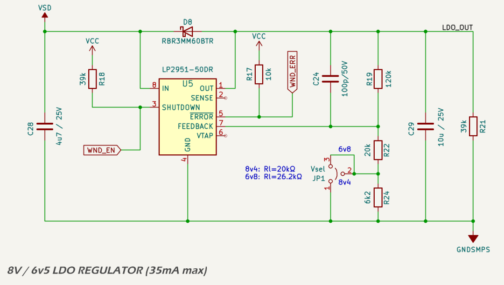
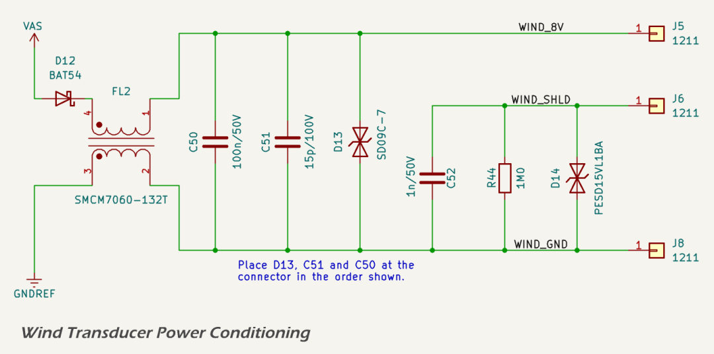

# _VAS_ — Wind Transducer Supply

The `VAS` rail powers legacy masthead wind transducers (Raymarine / Autohelm; Navico — B&G, Simrad). It is generated from the isolated *VSD* rail using a low-quiescent, short-circuit-protected LDO. A front-end filter at the connector provides ESD/surge robustness and RF cleanliness on the cable.

## Requirements

* Two setpoints: 8.4 V (Raymarine) and 6.8 V (B&G), jumper selectable.  
* Load: 20 mA nominal, 35 mA peak.  
* MCU control: enable/disable from a 3.3 V GPIO.  
* Fault visibility: power-good indication to firmware.  
* Quiet supply into a long, outdoor cable with unknown vessel bonding.

## Implementation Summary

The rail is generated from *VSD* by a [Texas Instruments LP2951-50DR](https://www.ti.com/lit/ds/symlink/lp2951.pdf) operated in adjustable mode. The device was chosen for its low dropout, integrated current limit and thermal shutdown, and the SHUTDOWN/ERROR pins that make supervision simple. The new-chip reference is 1.200 V (typical), and the quiescent current is low enough for the supply to remain available without meaningful idle loss.

Output selection is handled by a small feedback network. R19 (120 kΩ) connects from OUT to FB. The bottom leg is jumper-selectable: with R22 (20 kΩ) to ground the regulator sets about 8.4 V; adding R24 (6.2 kΩ) in series gives 26.2 kΩ for about 6.8 V via JP1. The setpoints follow the adjustable-output equation given in the LP2951 datasheet. A series BAT54 at the connector then drops roughly 0.25–0.35 V at 20–35 mA so the transducer sees ~8.0 V or ~6.5 V in service.

Local decoupling is deliberately simple and close to the pins: C28 = 4.7 µF X7R at IN and C29 = 10 µF X7R at OUT. The divider current (about 46–60 µA depending on setpoint) exceeds the datasheet’s >12 µA guideline, so a feed-forward capacitor is optional; C24 = 100 pF is fitted to tighten transient behaviour with long cabling.

Control and monitoring use the native pins. SHUTDOWN is active-high; R18 = 39 kΩ pulls to 3.3 V so the rail is off at boot, and the MCU drives WND_EN low to enable. ERROR is open-drain, active-low; R17 = 10 kΩ pulls to 3.3 V and feeds a digital input as a power-good/fault indicator.

Reverse and power-down conditions are handled by D8 (RBR3MM60BTR) from OUT to IN, which prevents the output capacitor or external sources from back-driving the regulator. R21 = 39 kΩ provides a gentle bleed on the output when the rail is disabled.

The regulated node *LDO_OUT* leaves the *POWER* domain and enters the *DIGITAL* domain through a 600 Ω @ 100 MHz ferrite bead (Murata BLM31KN601SN1L, [datasheet](https://www.lcsc.com/datasheet/C668306.pdf)). This keeps high-frequency common-mode energy from sharing freely between domains while adding negligible DC drop.

## Connector-Side Conditioning

A series BAT54 protects against reverse wiring before a common-mode choke **FL2** (SMCM7060-132T, [datasheet](https://www.lcsc.com/datasheet/C381616.pdf)). At the connector the shunt stack is, in order:

1. D13 = SD09C-7 (9 V bidirectional TVS, [datasheet](https://www.lcsc.com/datasheet/C1979392.pdf))  
2. C51 = 15 pF C0G (VHF)  
3. C50 = 100 nF X7R (HF/LF)

Shield handling for modern B&G with separate shield:
* C52 = 1 nF C0G from WIND_SHLD → WIND_GND for HF bonding.  
* R44 = 1 MΩ bleed to prevent float.  
* D14 = PESD15VL1BA (15 V bidirectional ESD, [datasheet](https://www.lcsc.com/datasheet/C85378.pdf)) preserves isolation under small DC offsets while clamping ESD/burst.  

!!! note
    Place D13, C51, and C50 at the connector pins with short, wide returns into WIND_GND. The CMC should sit as close as practical to the connector.

## Electrical Notes

* Dropout and headroom: at 35 mA the LP2951 dropout is comfortably below 0.4 V. With a 12 V input (clamped upstream), headroom is ample even after the series and clamp diodes.  
* Thermals: typical dissipation (12 → 8.4 V at 35 mA) is ~0.13 W; clamp worst case (18.6 → 8.4 V at 35 mA) is ~0.36 W. Provide a small copper pour under the device.  
* Noise: the feed-forward cap plus the connector π network and CMC keep the line quiet. Leave C24/C51 as validation knobs if field cabling varies.

## Prototype Validation

Run these checks on both setpoints (8.4 V and 6.8 V). Unless stated, load at 20 mA and 35 mA. Measure at the LDO pin and at the post-diode connector pin.

1. Basic bring-up  
   * Confirm SHUTDOWN default-off behaviour; measure off-state current.  
   * Enable via MCU; log time to power-good and final voltage at both nodes.

2. Accuracy and line regulation  
   * Sweep *VSD* from 8 V to clamp-high. Record VOUT at LDO and at connector.  
   * Verify expected drop across the series BAT54 under both loads.

3. Transients  
   * Load step 5 mA → 35 mA and back (≥1 kHz). Check undershoot/overshoot and settling.  
   * If peaky, increase C24 in small steps (for example, 150 pF → 220 pF) and re-check.

4. Short-circuit and fault handling  
   * Hard short at connector. Confirm current limit/thermal protection and that ERROR asserts.  
   * Verify firmware pulls SHUTDOWN high after a short fault window and cleanly re-tries after a delay.  
   * Repeat with short before the series BAT54 to confirm clamp diode and LDO response.

5. Reverse and miswire  
   * Apply reverse polarity at the connector with a current-limited bench supply. Confirm series diode blocks and no damage.  
   * Back-drive the output with VIN off to exercise the OUT→IN clamp.

6. ESD and burst (bench quick-checks)  
   * Contact ±8 kV to WIND_8V and WIND_GND pins, air to the shield.  
   * EFT/burst on the cable at 1 kV using a clamp if available. Verify no latch-up; power recovers and firmware sees faults if any.

7. Conducted/radiated noise  
   * Near-field probe around the LDO and connector during load steps.  
   * With long cable attached, check stability across 150 kHz–30 MHz injection if you have a CDN; confirm transducer operation unaffected.

8. Brownout and recovery  
   * Ramp *VSD* down through dropout and back up with load applied. Confirm clean recoveries and sensible ERROR behaviour.

9. Thermal soak  
   * Operate at 18.6 V input and 35 mA for 30 minutes in still air. Record package rise and ensure adequate margin versus component ratings.

## Key Parts

LP2951-50DR adjustable LDO with SHUTDOWN and ERROR ([datasheet](https://www.ti.com/lit/ds/symlink/lp2951.pdf))  
R19 120 kΩ, R22 20 kΩ, R24 6.2 kΩ (jumper-select setpoint)  
C28 4.7 µF X7R, C29 10 µF X7R, C24 100 pF C0G  
D8 RBR3MM60BTR OUT→IN clamp  
D12 BAT54 series protection before CMC  
FL2 SMCM7060-132T common-mode choke to connector ([datasheet](https://www.lcsc.com/datasheet/C381616.pdf))  
D13 SD09C-7, C51 15 pF C0G, C50 100 nF X7R shunt stack at pin ([datasheet](https://www.lcsc.com/datasheet/C1979392.pdf))  
D14 PESD15VL1BA, C52 1 nF C0G, R44 1 MΩ shield network ([datasheet](https://www.lcsc.com/datasheet/C85378.pdf))

## References

1. LP2951 Low-Dropout Voltage Regulators — Datasheet, Texas Instruments. https://www.ti.com/lit/ds/symlink/lp2951.pdf  

2. PESD15VL1BA Low Capacitance ESD Protection Diode — Datasheet, Nexperia. https://www.lcsc.com/datasheet/C85378.pdf  

3. SD09C-7 TVS Diode, 9 V Standoff — Datasheet, Diodes Incorporated. https://www.lcsc.com/datasheet/C1979392.pdf  

4. BLM31KN601SN1L Chip Ferrite Bead — Datasheet, Murata Electronics. https://www.lcsc.com/datasheet/C668306.pdf  

5. SMCM7060-132T Common-Mode Line Filter — Datasheet, SXN. https://www.lcsc.com/datasheet/C381616.pdf
