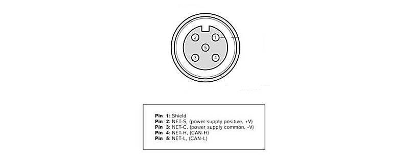
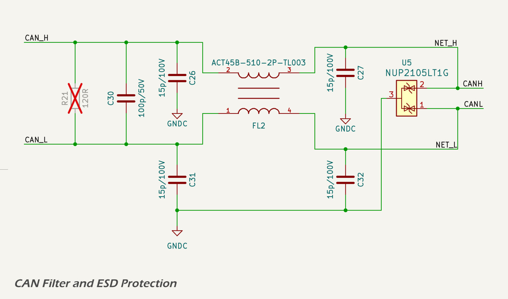
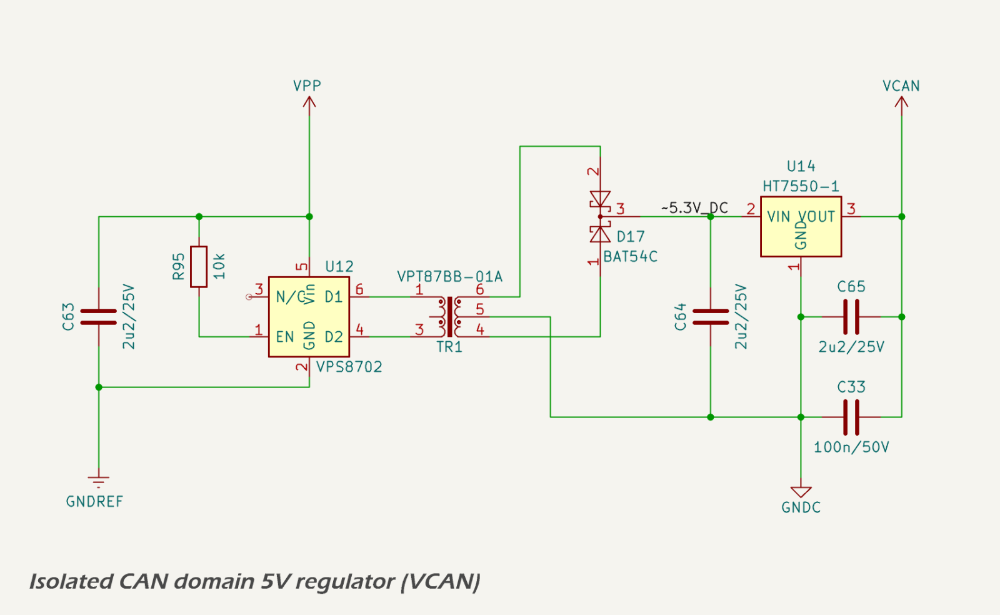
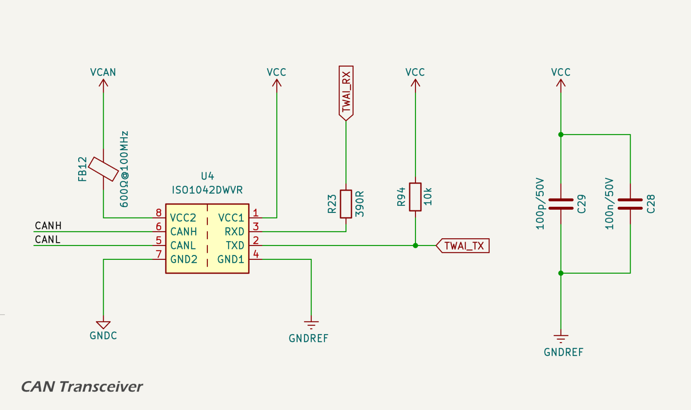
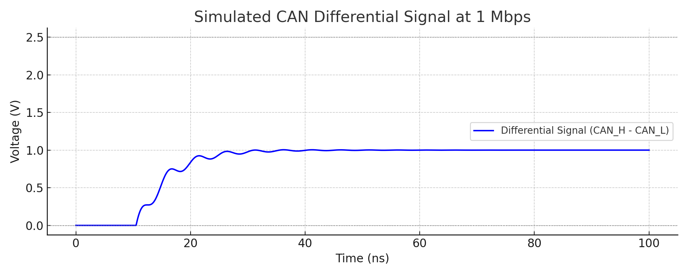
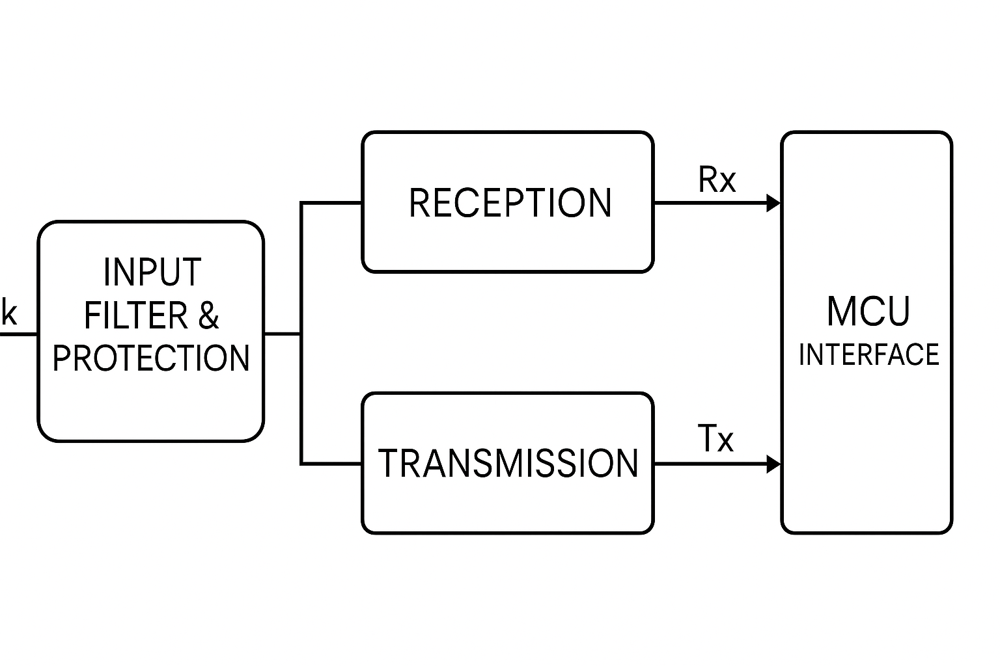

# Communications SUBSYSTEM

## CANBUS Interface

### NMEA 2000 / RV-C /CANBUS Connector

The MDD400 connects to the NMEA 2000 network via a [standard 5-pin A-coded male DeviceNet connector](https://www.maretron.com/wp-content/phpkbv95/article.php?id=443), following the physical layer defined by the NMEA 2000 micro connector specification.

The five pins are assigned as follows:

* **Pin 1 – Shield**: Connected to the cable shield (drain wire). This pin is *not* connected internally on the MDD400 device; it is left unconnected (floating) to comply with NMEA 2000 and CANBUS best practices, which require the shield to be bonded to vessel ground at a single point—typically where power is injected into the backbone.
* **Pin 2 – NET-S**: Power supply positive (+12 V nominal), typically fused and supplied by the NMEA 2000 backbone.
* **Pin 3 – NET-C**: Power supply common (0 V), forming the ground reference for the CAN transceiver and device power input.
* **Pin 4 – NET-H**: CAN high (CAN\_H), the dominant high-level differential signal on the CANBUS.
* **Pin 5 – NET-L**: CAN low (CAN\_L), the dominant low-level differential signal on the CANBUS.

The connector is sealed and keyed to ensure correct mating orientation and environmental protection. The MDD400 device incorporates onboard ESD protection, surge suppression, and filtering for all connector lines, as described in subsequent sections. The ESD protection diode used is the [TPD1E05U06](https://www.ti.com/lit/ds/symlink/tpd1e05u06.pdf).

The cable shield is routed directly to pin 1 of the connector but is *not connected* to the MDD400 ground plane. A test pad and DNP (do not populate) 0 Ω resistor are provided for bench testing or alternate grounding schemes, but are left open in production units. This ensures immunity to ground loops and preserves compliance with the NMEA 2000 recommendation of single-point shield grounding.

The circuit schematic below shows the shield and connector arrangement.

### CANBUS Signal Conditioning

The CAN interface is galvanically isolated and filtered to reduce both emissions and susceptibility to EMI. The filtering stage is shown below.

The CAN\_H and CAN\_L signals pass through the following components prior to reaching the transceiver:

* 15 pF capacitors to local CAN ground (NET-C), providing high-frequency common-mode filtering;
* a 100 pF differential capacitor across CAN\_H and CAN\_L, attenuating differential-mode noise;
* a [Murata ACT45B-510-2P-TL003](https://www.murata.com/en-us/products/productdata/8807038415390/QTN0099C.pdf) common-mode choke, used to suppress high-frequency common-mode interference;
* a [NUP2105LT1G](https://www.onsemi.com/pdf/datasheet/nup2105l-d.pdf) dual transient voltage suppression (TVS) array, providing protection against differential and common-mode voltage transients;
* and a [Texas Instruments ISO1042 CAN transceiver](https://www.ti.com/lit/ds/symlink/iso1042.pdf), which includes integrated galvanic isolation and failsafe features.

This signal conditioning network is designed following guidance from [Texas Instruments](https://www.ti.com/lit/ab/snoaaa1/snoaaa1.pdf) and [Monolithic Power Systems](https://www.monolithicpower.com/en/blog/post/from-cold-crank-to-load-dump-a-primer-on-automotive-transients), and is intended to minimise emissions and maximise immunity to electrical noise.

The CAN\_H and CAN\_L signals are routed as a tightly coupled differential pair with controlled impedance. Routing is kept short and direct between the connector, filtering components, and transceiver to minimise parasitic inductance and reduce discontinuities. Layout techniques avoid unnecessary vias or stubs and prioritise symmetry to preserve signal integrity.

These design measures support compliance with EMC standards such as [CISPR 25](https://www.diodes.com/design/support/cispr-25) and [ISO 11452-2](https://www.iso.org/standard/68557.html), which are applicable to automotive and marine CAN networks.

To maintain galvanic isolation, the CAN transceiver's isolated ground (NET-C) is physically separated from the system ground (GNDREF) using a dedicated ground plane region. A minimum clearance of 2.5–4.0 mm is maintained between the isolated and logic ground planes, consistent with IPC-2221 and marine EMC best practices. This clearance helps ensure the isolation barrier is not compromised by parasitic coupling or leakage currents, and supports the reinforced isolation rating of the ISO1042 transceiver.

### CAN Transceiver Power Supply

The ISO1042 CAN transceiver operates from an isolated 5 V supply on the CAN-side domain (VCAN), referenced to the isolated ground (GND\_C). The schematic is shown below.

Galvanic isolation between the CAN-side and logic-side domains is **recommended** by both the NMEA 2000 and ISO 11898 standards to improve EMC performance, prevent ground loops, and enhance system protection in electrically noisy environments.

* [NMEA 2000 Appendix A - Physical Layer](https://www.nmea.org/Assets/20230331%20nmea%202000%20appendix%20a%20-%20physical%20layer.pdf)
* [ISO 11898-2:2016 - High-speed CAN](https://www.iso.org/standard/66340.html)

The power supply architecture and component selection—including the transformer driver, rectifier, linear regulator, bypass capacitors, and ferrite bead—are fully detailed in the [power-supply.md](./power-supply.md) section of this design report. Please refer to that page for a complete description of the isolated power generation circuit used to supply VCAN.

All isolated-side filtering components are referenced to GND\_C, while the logic-side domain (3.3 V / GNDREF) remains electrically separated to preserve the transceiver's reinforced isolation.

### TTL I/O

The [Texas Instruments ISO1042 CAN transceiver](https://www.ti.com/lit/ds/symlink/iso1042.pdf) is powered on its logic side from the 3.3 V digital supply rail shared with the ESP32. 

Galvanic isolation of the CAN physical layer is achieved using the [ISO1042](https://www.ti.com/lit/ds/symlink/iso1042.pdf) isolated transceiver IC. This device provides 5 kVrms isolation between the controller side and the CAN side. A dedicated 5 V isolated supply, VCAN, is used to power the CAN side.

Logic-level CAN communication is implemented through the TX and RX pins:

* CAN\_TX connects to the transceiver’s TXD pin. A 10 kΩ pull-up resistor ensures a defined idle state and reduces noise susceptibility when the MCU pin is high-Z.
* CAN\_RX is connected to the transceiver’s RXD pin via a 390 Ω series resistor, which limits inrush current, dampens reflections, and protects the ESP32 input from voltage overshoot.

Neither CAN\_TX nor CAN\_RX are strapping pins on the ESP32-S3, ensuring reliable CAN bus behaviour during flashing, reset, and power-up.

<!-- ### Slope Control

The [SN65HVD234 transceiver](https://www.ti.com/lit/ds/symlink/sn65hvd234.pdf) features a slope control mechanism on pin 5 (Rs), allowing designers to reduce the signal edge rate to suppress EMI. The slew rate is controlled by an external resistor to ground, and in the MDD400 a 10 kΩ pull-down resistor (R27) is fitted, resulting in a slew rate of approximately 15 V/µs.

Although the [SN65HVD234 transceiver](https://www.ti.com/lit/ds/symlink/sn65hvd234.pdf)protocol mandates a data rate of 250 kbps, this value does not require a proportional edge rate. In differential signalling, reliable communication depends not only on bit rate but also on timing margins, signal rise/fall symmetry, and the receiver\'s ability to tolerate slower transitions. A slew rate of 15 V/µs is sufficient to support 250 kbps signalling over short drop cables (e.g. 1 m), such as those used to connect the MDD400 to the backbone. In practice, the edge rate limits the effective signalling bandwidth - not the fundamental data rate - so this setting provides ample timing margin
without compromising protocol compliance.

Using a 10 kΩ pull-down offers a well-balanced trade-off: it substantially reduces high-frequency emissions (which scale with dV/dt) while remaining compatible with the stub length and impedance environment of a typical [SN65HVD234 transceiver](https://www.ti.com/lit/ds/symlink/sn65hvd234.pdf)network. It also aligns with guidance provided by [Texas Instruments](https://www.ti.com/lit/ds/symlink/sn65hvd234.pdf), which suggests 10 kΩ as an effective value for slope control in industrial and automotive CAN installations. The use of a resistor instead of an Rs capacitor simplifies the PCB layout and guarantees stable performance over temperature and component tolerances. -->

<!-- ### Signal Integrity Simulation

A signal integrity simulation was conducted, assuming that the MDD400 is intended to connect to the [NMEA 2000](https://www.nmea.org/nmea-2000.html) network using a standard 5-pin DeviceNet A-coded male connector, with power and CAN signals provided via a short (1 m) drop cable. The [SN65HVD234 transceiver](https://www.ti.com/lit/ds/symlink/sn65hvd234.pdf)backbone is assumed to comply with the [SN65HVD234 transceiver](https://www.ti.com/lit/ds/symlink/sn65hvd234.pdf)physical layer specification \[20\], including termination via 120 Ω resistors at the bus extremities.

 -->

## Legacy Serial Interface

The MDD400 supports an optional legacy serial interface designed to receive and/or transmit data compatible with SeaTalk I (single-wire, 12 V open-drain) and NMEA 0183 (12 V single-ended, receive-only). Given the 12 V signaling levels and the lack of galvanic isolation in typical legacy marine installations, the interface was engineered to maintain signal integrity and electromagnetic compatibility (EMC) through robust input filtering, carefully managed ground domains, and multi-stage
protection.

The legacy interface accepts a single bidirectional signal line (ST_SIG), which is filtered and protected before being interfaced with the internal logic domain. SeaTalk operation uses a half-duplex scheme, sharing the line for both transmission and reception. NMEA 0183 operation is receive-only.

### Interface Conditioning and Power

Incoming power and signal lines are routed through a multi-stage filter network:

- A common-mode choke (SMCM7060-132T) suppresses high-frequency noise;
- Shunt capacitors (100 pF) to both digital and chassis ground domains provide RF filtering;
- A bi-directional TVS diode (P6SMB15CA) clamps voltage spikes up to ±15 V;
- Additional series resistance and diode clamping stages limit current and prevent latch-up.

This configuration offers substantial protection against ESD, conducted transients, and radiated EMI, satisfying CE and EN 55035 immunity requirements for the intended use case.

Internal signal buffering is provided by a two-stage transistor-based receiver. This stage isolates the MCU RX pin from the external signal domain and incorporates a voltage divider to safely shift the 12 V logic signal down to 3.3 V logic levels. The receiver is continuously active and handles both NMEA 0183 and SeaTalk receive functions.

Transmission is handled by a discrete open-collector driver controlled by the MCU TX pin and gated by a dedicated ST_EN signal. This stage mimics the behavior of legacy SeaTalk talkers by pulling the line low during a logic \'0\' and tri-stating otherwise. Series resistors and RC gate control limit EMI during transitions. An RC gate filter provides slew-rate limiting without affecting low-speed signaling (SeaTalk operates at 4800 bps).

All circuits are powered from the regulated 5 V domain (VCC), which is isolated from the external 12 V input by a pi filter and diode clamp. The entire legacy port shares a distinct ground domain (NET-C), which is joined to the main logic ground (GNDREF) via a common-mode inductor and local filtering.

If pre-compliance EMC testing indicates the SeaTalk interface as a source of excessive emissions or susceptibility, an alternative implementation using opto-isolators may be considered. This would allow complete galvanic isolation between the SeaTalk signal and the MDD400 logic domain, simplifying signal reference handling and improving immunity to ground loops or cable-borne transients. This approach would require powering the opto-isolated input side from the SeaTalk 12 V line or a derived source, and is best suited to receive-only applications such as NMEA 0183 listener modes.

### Circuit Description

#### Receiver

The input signal from the external ST_SIG line passes through diode D6A (1N4148) for reverse polarity protection and current limiting via R51. The signal is then applied to a pair of transistors (Q5A and Q5B) forming a differential receiver. These are biased by R47, R48, and R49 to provide signal translation and buffering.

The output of this stage is fed to \[U1_RX\], as 3.3 V UART-level serial data. This path is shared between NMEA 0183 and SeaTalk I operation. In both modes, the receiver operates continuously to capture serial input.

#### Transmitter

For SeaTalk I, which uses a single bidirectional wire, the MDD400 must also drive the ST_SIG line during transmission.

The transmit side employs Q6 (BC817) and Q8A (IMZ1A) as open-collector drivers, selectively enabled by Q7B and Q7A under control of the ST_EN signal. This allows the MDD400 to pull the signal line low while maintaining high impedance when not transmitting. A passive pull-up (R64) to +12 V ensures correct idle line voltage in the absence of an active transmitter.

\[U1_TX\] drives the signal logic, with R50 and R55 providing base current limiting and edge shaping.

### SeaTalk I Operation (Single Wire, RX/TX)

SeaTalk I is a single-wire bus using 12 V signaling, where idle = 12 V, logic 0 = pulled to 0 V. It requires careful coordination between transmit and receive functions. The MDD400 handles this using a half-duplex scheme:

- when not transmitting, the ST_TX line is tri-stated, and the receiver monitors incoming traffic on ST_SIG;
- to transmit, ST_EN is asserted to activate the driver circuitry, pulling ST_SIG low as needed;
- an MCU-controlled TX driver sinks current during transmission and releases the line for receive or idle;
- after transmission, the output drivers are immediately disabled to avoid contention with other devices on the bus; and
- The RX stage remains active continuously and is tolerant of slow signal edges typical of long cable runs.

Timing and contention avoidance are handled in firmware. The circuit allows for reliable operation, even on long or noisy SeaTalk I networks.

### 3.2.4 NMEA 0183 Operation (RX Only)

For NMEA 0183 sources, the MDD400 operates in receive-only mode. The external talker is typically a GPS, depth sounder, or wind instrument.
Although the NMEA standard allows for differential signaling (RS-422), most talkers in the marine environment operate in single-ended mode, and are electrically compatible with this circuit. The circuit design is also compatible with RS-422 (differential) data.

Only the receiver portion of the interface is used in this mode. The isolated, level-shifted signal is passed to \[U1_RX\]. No transmission is attempted, and the ST_EN signal remains low to ensure the transmitter remains disabled.

This configuration ensures the MDD400 is compatible with any standard NMEA 0183 talker without introducing noise or signal conflicts.

### Physical Connector

The physical interface for legacy serial signals is provided via a 3-pin header:

- Pin 1 (RED): 12 V (power)
- Pin 2 (BLACK): GND
- Pin 3 (YELLOW): SIG (SeaTalk I / NMEA 0183 signal line)

This layout allows for simple three-wire connectivity using standard SeaTalk I connector.

#### Power Isolation

In production, the SeaTalk +12 V pin is intentionally left unconnected to the MDD400 internal power supply. This avoids introducing a second power source and the associated risks of conflicting voltage domains or ground loops. As a result, the MDD400 must be powered exclusively from the [SN65HVD234 transceiver](https://www.ti.com/lit/ds/symlink/sn65hvd234.pdf)backbone, and any SeaTalk devices must receive power independently from the SeaTalk bus.

This isolation is implemented by omitting the polarity protection diode on the SeaTalk power input. For advanced configurations, populating this diode enables power input from the SeaTalk bus. Additionally, a normally
open solder jumper labeled ST_12V is provided to allow bridging the SeaTalk and [SN65HVD234 transceiver](https://www.ti.com/lit/ds/symlink/sn65hvd234.pdf)power rails. This option is intended for edge cases, such as powering a single connected SeaTalk device that is not attached to a live SeaTalk bus. Use of this jumper should be avoided in typical installations to maintain electrical isolation and CE-compliant power domain separation.

#### EMC, ESD and Ground

The legacy port is exposed via a 3-pin header (12 V, GND, SIG). In this implementation, the +12 V line is left unconnected, and the interface is powered entirely from the internal 5 V rail. The GND pin (SeaTalk shield) is connected to GNDREF through a 1 µH inductor, which provides a low-impedance signal reference path while attenuating high-frequency noise.

Although the original SeaTalk protocol uses GND as a signal return and implicit shield, this arrangement preserves CE compliance by preventing direct coupling of noisy external grounds into the device ground plane. The use of a separate shield pin was considered, but real-world installations route signal returns through the GND wire, making this unnecessary.

The input filter and grounding strategy ensure that EMC performance meets CE and FCC Class B requirements for conducted and radiated emissions. Immunity to electrostatic discharge, EFT, and surge is provided by a combination of TVS clamping, series impedance, and low-inductance layout.

In total, there are six possible wiring permutations of the three legacy interface pins (12V, GND, SIG). These are evaluated in the the table below:

*Legacy Connector Wiring Permutations*
<table border="1" cellpadding="6" cellspacing="0">
  <thead>
    <tr>
      <th>Wiring Order</th>
      <th>ST_SIG</th>
      <th>12V_IN</th>
      <th>GND</th>
      <th>Outcome</th>
      <th>Protected?</th>
    </tr>
  </thead>
  <tbody>
    <tr>
      <td>SIG, 12V, GND</td>
      <td>ST_SIG</td>
      <td>12 V</td>
      <td>GND</td>
      <td>✅ Correct connection — normal operation</td>
      <td>✅</td>
    </tr>
    <tr>
      <td>12V, SIG, GND</td>
      <td>12 V</td>
      <td>ST_SIG</td>
      <td>GND</td>
      <td>ST_SIG pulled high — D6A blocks current, input already expects 12 V</td>
      <td>✅</td>
    </tr>
    <tr>
      <td>SIG, GND, 12V</td>
      <td>ST_SIG</td>
      <td>GND</td>
      <td>12 V</td>
      <td>GND applied to 12V_IN — D8 blocks reverse current</td>
      <td>✅</td>
    </tr>
    <tr>
      <td>GND, 12V, SIG</td>
      <td>GND</td>
      <td>12 V</td>
      <td>ST_SIG</td>
      <td>GND on ST_SIG — valid electrical state (LOW), no damage</td>
      <td>✅</td>
    </tr>
    <tr>
      <td>12V, GND, SIG</td>
      <td>12 V</td>
      <td>GND</td>
      <td>ST_SIG</td>
      <td>Same as #2 — signal input sees 12 V, safely blocked by D6A</td>
      <td>✅</td>
    </tr>
    <tr>
      <td>GND, SIG, 12V</td>
      <td>GND</td>
      <td>ST_SIG</td>
      <td>12 V</td>
      <td>GND to ST_SIG — logic LOW input, 12 V on GND blocked by D8</td>
      <td>✅</td>
    </tr>
  </tbody>
</table>

All six possible wiring permutations are electrically safe. There are no failure modes resulting from any pin swap of the 3-pin legacy connector. While incorrect wiring may prevent the interface from functioning (e.g., no data received), no permanent damage will occur to the MDD400 or connected devices. This level of fault tolerance is particularly valuable for field installations and testing scenarios where connector orientation or labeling may not always be foolproof.