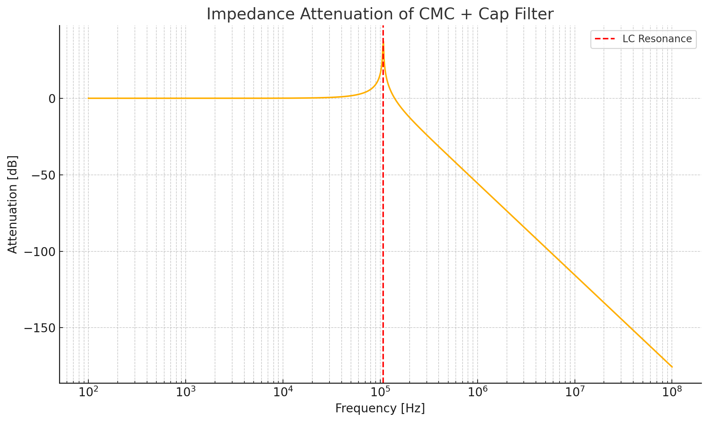
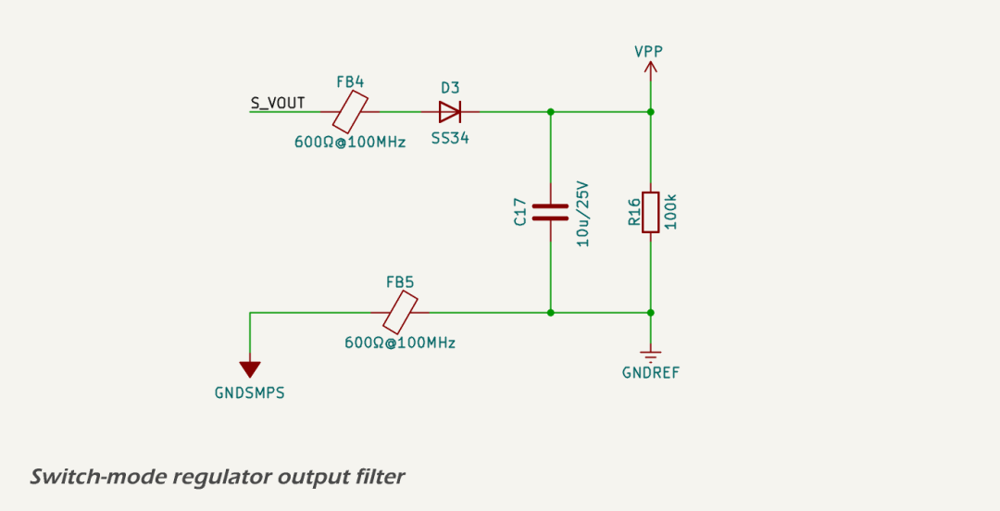
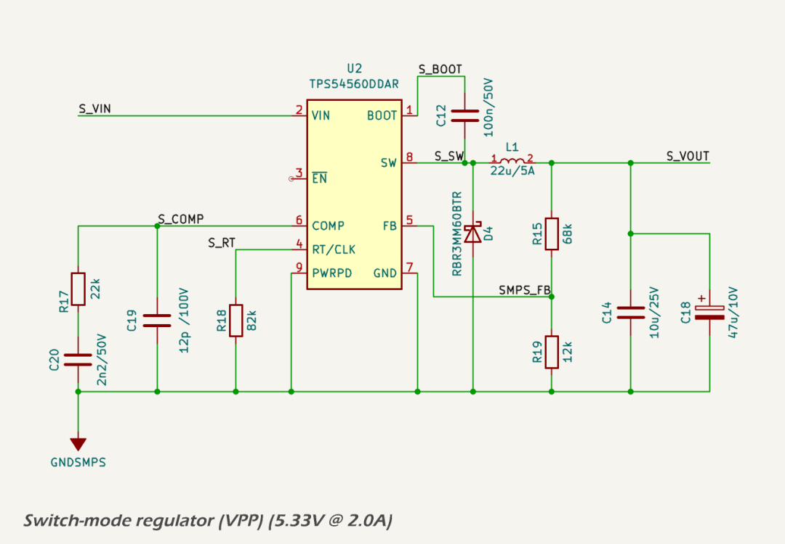
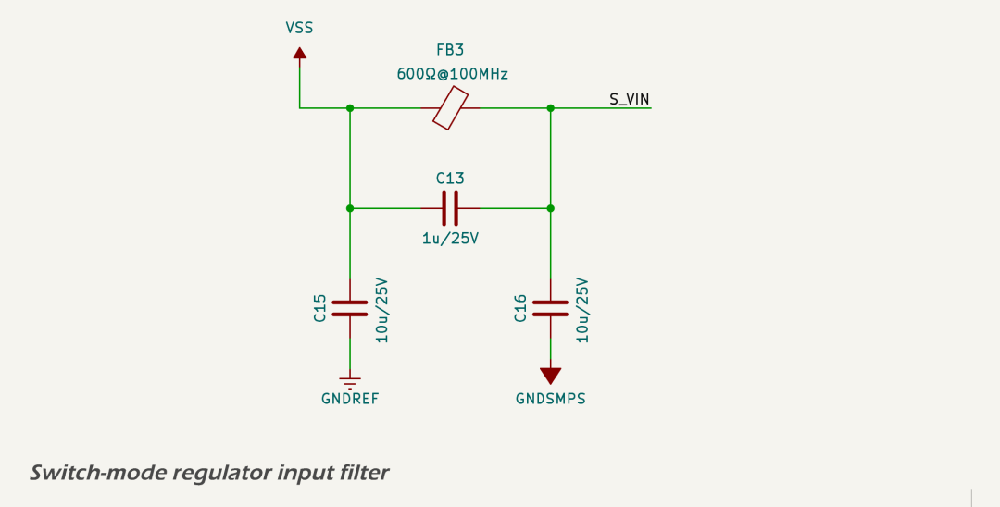

# Power Supply Subsystem

## Power Supply Protection And Filtering

### Overview And Design Criteria

The electrical environment aboard small vessels shares many characteristics with automotive systems, but with greater variation and typically less standardisation. Marine electrical systems may incorporate multiple battery banks — often with separate cranking and house systems — and are increasingly adopting lithium chemistries such as LiFePO₄. It is not uncommon for vessels to include 24 V or 48 V subsystems or to operate some loads from inverter-generated AC power.

Despite this variability, the communication and sensor networks relevant to the MDD400 are standardised to operate from nominal 12 V supplies. The [NMEA 2000](https://www.nmea.org/nmea-2000.html) backbone, as well as legacy protocols such as SeaTalk and NMEA 0183, are all 12 V-based. These systems are generally unregulated, powered by user-installed cabling, and often exposed to transients caused by inductive loads, battery switching, or alternator events. The MDD400 must tolerate these conditions while maintaining safe operation of downstream circuitry.

Designing for this environment requires careful attention to both transient suppression and steady-state fault protection. The MDD400 input protection circuit is modelled on best practices from automotive design, particularly those outlined in <a href="https://www.iso.org/standard/50925.html">ISO 7637-2</a>. While this standard is not mandatory in marine applications, it provides a useful baseline for evaluating and simulating real-world transient events.

The MDD400’s power input protection strategy is defined by the design criteria in the table below, reflecting expected conditions on small vessel 12 V systems. These criteria guided the selection and simulation of each protection stage. A coordinated arrangement of clamping, filtering, and current-limiting components has been implemented to ensure protection against common-mode and differential transients, with staged elements that absorb and suppress voltage and current surges without nuisance tripping under normal high charging voltages (up to 14.8 V). The protection stages also account for both the high peak voltages and energy content associated with load dump conditions.

<table border="1" cellpadding="6" cellspacing="0">
  <thead>
    <tr>
      <th>Protection Function</th>
      <th>Design Criteria</th>
    </tr>
  </thead>
  <tbody>
    <tr>
      <td>Reverse Polarity</td>
      <td>Survive continuous reverse connection of ±12 V No damage; automatic recovery</td>
    </tr>
    <tr>
      <td>Load Dump and Surge Clamping</td>
      <td>Survive <a href="https://www.iso.org/standard/50925.html">ISO 7637-2</a> Pulse 5b (150 V, 400 ms exponential decay) Limit to &lt; 60 V at the switching node</td>
    </tr>
    <tr>
      <td>ESD Protection</td>
      <td>Tolerate ±15 kV air discharge per <a href="https://webstore.iec.ch/en/publication/68954">IEC 61000-4-2</a></td>
    </tr>
    <tr>
      <td>Over-voltage Limiting</td>
      <td>Disconnect load above 18.5 V Reconnect below 18.5 V without latch-up</td>
    </tr>
    <tr>
      <td>Current Limiting</td>
      <td>Limit current to ~1.0 A Tolerate sustained overloads without damage</td>
    </tr>
    <tr>
      <td>EMC Filtering</td>
      <td>Suppress conducted emissions above 1 MHz; limit conducted noise to &lt; 100 mV p-p Contain radiated emissions to meet <a href="https://www.ecfr.gov/current/title-47/chapter-I/subchapter-A/part-15">FCC Part 15</a> and <a href="https://webstore.iec.ch/publication/24377">EN 55032 Class B</a> limits</td>
    </tr>
  </tbody>
</table>

These functions are implemented discretely to reduce cost, improve component availability, and allow field observability. Where appropriate, the design includes thermal protection and is engineered to fail safe under fault conditions.

The sections that follow describe each function in detail.

### Reverse Polarity Protection and Shield

The 12 V input from the [NMEA 2000](https://www.nmea.org/nmea-2000.html) connector is protected from reverse polarity using a discrete Schottky diode.

A MOSFET-based reverse protection scheme was considered but not adopted. The primary justification for using a simple diode is the presence of generous headroom in the input voltage range (nominal 12 V vs. 5 V and 3.3 V regulated rails), which makes the forward voltage drop acceptable. Diode protection offers simpler implementation, lower component cost, and greater resilience to fault modes such as latch-up or shoot-through.

The primary component is the [SS34](https://lcsc.com/datasheet/lcsc_datasheet_2310100931_MSKSEMI-SS34-MS_C2836396.pdf) (DO-214AC/SMA package), which provides reliable protection against reverse connections while introducing minimal voltage drop in normal operation:

* Maximum Reverse Voltage (VRRM): 40 V
* Average Forward Current (IF(AV)): 3.0 A
* Surge Current Rating (IFSM, 8.3 ms): 100 A
* Typical Forward Voltage Drop (VF @ 1 A): ~0.5 V
* Reverse Leakage Current: ~0.5 mA at 40 V

This approach ensures automatic recovery from incorrect wiring and protects downstream circuitry by blocking reverse current. The forward voltage drop is acceptable given the headroom available between the 12 V input and the downstream regulators.

Under reverse polarity conditions, the Schottky diode blocks current flow entirely, and no reverse current is conducted.

A TVS diode is also placed between the SHIELD pin of the NMEA 2000 connector and chassis ground. This diode is normally unpopulated and included for test and development purposes. It uses the [TPD1E05U06](https://www.ti.com/lit/ds/symlink/tpd1e05u06.pdf), a low-capacitance ESD protection diode with excellent clamping performance.

### ESD and Load Dump

The schematic below shows the full protection circuit for the NET-S input, including a primary TVS diode, PTC fuse, filtering components, and secondary clamping at the downstream side.

A [JK-mSMD075-33 resettable fuse (PTC)](https://lcsc.com/datasheet/lcsc_datasheet_2304140030_Jinrui-Electronic-Materials-Co--JK-mSMD075-33_C369169.pdf) is included downstream of the primary TVS diode to protect against sustained overloads and short-circuit faults in downstream components. The PTC is not involved in the suppression of fast transients but fulfills requirements in both NMEA and ISO marine standards that mandate overcurrent protection for device safety. Under fault conditions, it limits current by entering a high-resistance state and automatically resets once the fault is cleared. This device has a hold current of 750 mA and a trip current of approximately 1.5 A, offering effective protection for low-power marine electronics while minimizing nuisance trips.

The first line of defence against both electrostatic discharge (ESD) and high-energy surge events is a high-power transient voltage suppressor (TVS) diode. The [SM8S36CA TVS diode](https://www.smc-diodes.com/propdf/SM8S20CA%20THRU%20SM8S43CA%20N2149%20REV.-.pdf) is used at the 12 V input to clamp and absorb energy during overvoltage events. It is placed directly at the connector before any other active circuitry, allowing it to respond instantly to surge events.

This diode begins clamping at approximately 58 V and is rated for 6.6 kW peak pulse power (10/1000 µs waveform). It is bidirectional, allowing it to suppress both positive and negative transients relative to system ground. During a surge event — such as alternator load dump, battery disconnection under load, or inductive spike — the [SM8S36CA](https://www.smc-diodes.com/propdf/SM8S20CA%20THRU%20SM8S43CA%20N2149%20REV.-.pdf) diverts energy away from sensitive downstream circuits by rapidly entering avalanche breakdown.

This component was selected specifically for its compatibility with [ISO 7637-2](https://www.iso.org/standard/50925.html) Pulse 5b waveforms, including worst-case unsuppressed load dumps of up to 150 V. Simulation and test confirm that the clamped voltage at the downstream surge stopper FET remains within safe limits during these conditions.

The TVS diode also contributes to ESD protection, supplementing local filtering and layout strategies. It is capable of absorbing ±30 kV contact discharges when tested per [IEC 61000-4-2](https://webstore.iec.ch/en/publication/68954), with negligible leakage under normal operating voltages.

Simulation of the [SM8S36CA](https://www.smc-diodes.com/propdf/SM8S20CA%20THRU%20SM8S43CA%20N2149%20REV.-.pdf) response to an [ISO 7637-2](https://www.iso.org/standard/50925.html) Pulse 5b event — approximated as a 150 V exponential decay with a time constant of 80 ms — confirms that the diode clamps the downstream voltage to a maximum of 58 V throughout the transient. This provides over 40% margin relative to the 100 V absolute maximum of the surge stopper MOSFET and 65 V rating of the primary SMPS controller. The diode’s power absorption capability exceeds the energy of the test waveform, ensuring robust protection even during worst-case alternator disconnect or overvoltage conditions.

The simulated energy absorbed by the [SM8S36CA](https://www.smc-diodes.com/propdf/SM8S20CA%20THRU%20SM8S43CA%20N2149%20REV.-.pdf) during a worst-case ISO Pulse 5b event is approximately 16.7 J, well within the capabilities of this device. With a peak pulse power rating of 6600 W (10/1000 µs waveform), the diode offers ample headroom for marine surge events. This safety margin ensures long-term reliability even under repeated transient exposure.

### Over-voltage and Current Limiting

The over-voltage and current-limiting functionality is implemented using a discrete surge stopper circuit built around a P-channel MOSFET, two bipolar junction transistors (BJTs), and a high-side shunt resistor.

The over-voltage cutoff is defined by a resistive voltage divider connected to the input rail. When the divided voltage exceeds the base-emitter threshold of a monitoring PNP transistor (approximately 0.6–0.7 V), the transistor begins conducting. This pulls the gate of the P-channel MOSFET upward, switching it off and disconnecting the load. The resistor values are selected to yield a trip point of approximately 18.5 V, sufficient to protect all downstream regulators and components from accidental overvoltage conditions.

The current-limiting function is based on a 0.68 Ω high-side shunt resistor. A second PNP BJT monitors the voltage across the shunt. When the voltage drop exceeds ~0.68 V (corresponding to ~1.0 A), the transistor turns on and pulls up the MOSFET gate, disabling the load path. This mechanism protects the regulator and filter stages from sustained overcurrent events such as short circuits or excessive inrush. A pull-down resistor is used to ensure that the transistor remains off under normal conditions, preventing false triggering due to noise.

The PNP transistors used to sense current and voltage and drive the MOSFET gate have a Vce of 150 V and a maximum Ice of 600 mA, improving reliability under high dV/dt switching conditions and providing a fast turn-off transition for the MOSFET. This ensures that both over-voltage and over-current protections activate swiftly and effectively.

A snubber circuit composed of a 100 Ω resistor and 100 nF capacitor is placed across the MOSFET's drain-source terminals. This network suppresses high-frequency ringing and voltage overshoot caused by fast switching events, protecting the MOSFET and improving electromagnetic compatibility (EMC).

The system automatically recovers when the fault condition clears, ensuring seamless protection without requiring external intervention. The combination of fast over-voltage clamping and passive TVS diodes ensures that the MOSFET does not switch unnecessarily during brief or moderate surge events.

A simulated [ISO 7637-2](https://www.iso.org/standard/50925.html) Pulse 5b transient (150 V peak, 80 ms decay) was applied to the input. When the input exceeds the 18.5 V trip threshold, the gate voltage begins rising rapidly through the 4.7 Ω gate resistor and 100 nF equivalent capacitance. Once the gate voltage crosses the MOSFET’s Vgs(off) threshold (approximately –2 V), the device switches off, and the output is suppressed to near zero. The simulated response confirms that the MOSFET turns off within microseconds of the over-voltage condition, limiting downstream exposure and avoiding stress to the 42 V-rated linear regulator and other sensitive circuitry.

The circuit also incorporates hysteresis, which prevents the MOSFET from oscillating on and off near the trip point. When the MOSFET switches off due to an over-voltage event, the load is disconnected and the voltage at the upper leg of the voltage divider rises slightly, maintaining the transistor in conduction. The MOSFET only re-enables once the input voltage falls well below the trip threshold, ensuring stable operation during slow-falling or noisy input conditions.

### Analysis and Failure Mode

Each of the four onboard power regulators incorporate integrated protection features to ensure safe and reliable operation. These include short-circuit protection, thermal shutdown, and undervoltage lockout (UVLO), as detailed in the relevant section for each power domain below.

This section summarises the simulated and expected performance of each input protection element under worst-case load dump conditions. It also identifies their operating margins and expected failure modes.

*Reverse Polarity Protection*

The [SS34](https://www.onsemi.com/products/discrete-power-modules/schottky-diodes-rectifiers/ss34) Schottky diode used on each power input provides low-loss polarity protection with a typical forward voltage drop of approximately 0.5 V. The diode is rated for 3.0 A continuous forward current and can tolerate surge currents up to 100 A for 8.3 ms. In reverse polarity scenarios, the diode blocks current flow with minimal leakage (~0.5 mA at 40 V) and recovers automatically when correct polarity is restored.

To verify its suitability for transient load dump conditions, a time-series simulation was performed using the worst-case [ISO 7637-2](https://www.iso.org/standard/50925.html) Pulse 5b profile. In this scenario, the diode was modelled conducting up to 88 A peak current with a decaying profile over approximately 43 ms. The simulated energy dissipation was approximately 2.66 J, resulting in a calculated peak junction temperature of ~146 °C assuming a thermal capacitance of 0.45 J/°C and 40 °C ambient. This remains below the device’s 175 °C absolute maximum junction temperature.

The results confirm that the SS34 operates within thermal and electrical ratings even during extreme surge events. While the diode is operating close to its limit, the simulated performance under these rare transients justifies its use in this design.

*Transient Suppression (TVS Diode)*

The [SM8S36CA](https://www.smc-diodes.com/propdf/SM8S20CA%20THRU%20SM8S43CA%20N2149%20REV.-.pdf) TVS diode is placed directly at the power input connector and clamps surge events to a maximum of approximately 58 V. Simulation of [ISO 7637-2](https://www.iso.org/standard/50925.html) Pulse 5b (150 V peak, 80 ms exponential decay) confirms that the diode absorbs approximately 19.3 J of energy. Assuming a thermal capacitance of 0.16 J/°C and ambient temperature of 40 °C, the peak junction temperature is estimated at 148 °C, below the diode’s 175 °C maximum.

The PCB pad temperature beneath the diode is expected to remain under 145 °C during this event, ensuring solder joint reliability and long-term device integrity. The TVS is well suited to clamp both positive and negative transients, with high energy handling and fast response time.

*Surge Stopper Circuit (MOSFET and BJT Controller)*

The discrete surge stopper circuit incorporates an IRFR5410TR P-channel MOSFET and two PNP transistors. Under normal conditions, the MOSFET conducts to pass the filtered input voltage (V\_FILTERED) to the internal supply rail (VSS). If the input exceeds the 18.5 V trip threshold, a comparator transistor activates and pulls the MOSFET gate up, turning it off rapidly.

Simulation confirms the gate voltage rises quickly through a 100 Ω gate resistor and snubber capacitor, suppressing the output to near-zero within microseconds. The snubber prevents voltage overshoot due to inductive switching and limits dV/dt across the MOSFET. A zener diode protects the gate from excess voltage.

The circuit also includes a current limiting function via a 0.68 Ω high-side shunt resistor and BJT current sense stage. If the current exceeds approximately 1.0 A, the transistor activates and disables the MOSFET. This provides robust protection against short circuits and overloads. The circuit recovers automatically once the fault is cleared.

A pull-down resistor ensures that the gate of the overcurrent sense transistor remains low when inactive, avoiding false triggering.

Simulation of a permanent short-circuit event at the output shows the MOSFET initially conducts a 10 A pulse for under 5 µs before limiting to 0.96 A. Peak power dissipation reaches ~67 W during the spike, but steady-state dissipation drops to ~13 W, with the MOSFET temperature stabilising at ~107 °C. This is within safe limits for the IRFR5410TR, which is rated for 40 W at 25 °C ambient.

Failure modes would require extreme conditions beyond ISO 7637-2 specifications, such as:

* surge voltages >180 V sustained for over 100 ms,
* prolonged clamping driving junction temperatures above 175 °C, or
* circuit faults preventing turn-off.

These scenarios are not expected under defined operating conditions. The combined protection elements (TVS, surge stopper, current limiter, and filtering) ensure robust operation under worst-case marine transients.

*Sensitivity Analysis – Surge Voltage Tolerance*

Time-series simulations were performed for Pulse 5b events with increasing peak voltages: 150 V, 175 V, 200 V, 225 V, and 250 V. Above 175 V, the TVS junction temperature exceeds 175 °C, indicating that protection is reliable up to this point, but operation beyond that is not guaranteed without risk of failure.

*Conclusion*

The input protection circuit offers high reliability and resilience to automotive and marine surge conditions. The MOSFET gate is controlled by fast-switching discrete logic, allowing precise and early cut-off. Combined with the high-energy TVS and integrated supply protections, the circuit reliably isolates and shields downstream components during all tested fault conditions.

### EMC

The MDD400 is designed to meet both conducted and radiated electromagnetic emissions requirements for CE ([EN 55032 Class B](https://webstore.iec.ch/publication/24377)) and [FCC Part 15](https://www.ecfr.gov/current/title-47/chapter-I/subchapter-A/part-15) compliance, while ensuring robustness against electromagnetic immunity threats in line with [ISO 11452-2](https://www.iso.org/standard/43855.html) and [ISO 7637-2](https://www.iso.org/standard/50925.html). To this end, a combination of discrete filtering components and PCB layout strategies are employed to suppress emissions and protect sensitive circuitry.

#### Conducted Emissions

The primary 12 V input is filtered using a multi-stage EMI suppression network consisting of:

* a π-filter topology with 22 µF ceramic input capacitors, 10 nF mid-filter capacitor, and additional 22 µF output capacitors;
* a high-performance shielded common-mode choke (SMCM7D60-132T) rated for 1.3 A;
* a 100 mΩ sense resistor for diagnostic current monitoring; and
* a 600 Ω @ 100 MHz ferrite bead (FB3) to attenuate high-frequency common-mode noise to/from the switching regulator domain.

This network effectively attenuates conducted emissions above 1 MHz and isolates switch-mode regulator noise from reaching the vessel's 12 V supply lines. The design target was to suppress switching harmonics to < 100 mV peak-to-peak, as observed at the 12 V input under full load.

#### Radiated Emissions

Careful segregation of analog, digital, and high-current switching grounds helps reduce loop areas and suppress radiated emissions. Key measures include:

* low-inductance return paths using filled copper pours;
* edge-stitched ground planes isolating external connector regions;
* strategic placement of high-frequency capacitors near connector pins (e.g., 100 pF across CAN\_H/L); and
* controlled routing of the legacy serial line to minimize emissions.

#### CANBUS Interface Filtering

The CAN interface is galvanically isolated and filtered to reduce both emissions and susceptibility to EMI. The filtering stage is shown below:

The CAN filter includes:

* 15 pF capacitors from each CAN line to chassis ground (NET-C);
* a 100 pF differential capacitor between CAN\_H and CAN\_L;
* a high-isolation common-mode choke (ACT45B-510-2P-TL003);
* an [NUP2105L](https://www.onsemi.com/products/esd-protection/esd-suppressors/nup2105lt1g) TVS array for ESD and transient suppression.

This design approach follows the recommendations of [ISO 11898-2](https://www.iso.org/standard/63648.html) and prevents radiated noise from coupling into the NMEA 2000 network.

#### Isolated CAN Transceiver

The galvanic isolation of the CAN physical layer is achieved using the [ISO1042](https://www.ti.com/lit/ds/symlink/iso1042.pdf) isolated transceiver IC. This device provides 5 kVrms isolation between the controller side and the CAN side. A dedicated 5 V isolated supply, VCAN, is used to power the CAN side.

#### Isolated VCAN Regulator

The isolated VCAN supply is generated using a push-pull transformer driver and linear post-regulator. The schematic is shown below:

A [VPSC VPS8702 transformer driver](../assets/pdf/VPSC-VPS8702_datasheet.pdf) converts the 5.3 V input from the VPP into a high-frequency push-pull signal suitable for driving a non-center-tapped isolation transformer. The selected transformer is a 1:1 device ([VPT87BB-01A](https://lcsc.com/datasheet/lcsc_datasheet_2108142130_VPSC-VPT87BB-01A_C2846912.pdf)), rated for reinforced isolation up to 3 kV and compatible with the VPS8702 drive topology.

After rectification and filtering, the output is regulated to 5.0 V using an [HT7550-1](https://lcsc.com/datasheet/lcsc_datasheet_2506261414_UMW-Youtai-Semiconductor-Co---Ltd--HT7550-1_C347189.pdf) linear regulator. The transformer winding provides galvanic isolation, and the resulting VCAN domain is fully isolated from GNDREF. This supply powers only the CAN transceiver, helping contain any emissions or transients on the bus.

#### Grounding and Isolation Strategy

The MDD400 employs separate digital (GND) and connector/chassis (NET-C) ground domains. These are joined only at carefully controlled locations, typically through the shield of common-mode chokes or designated net-ties. This strategy minimizes ground bounce, avoids ground loops, and enhances immunity to conducted and radiated transients.

#### Wireless Subsystem (Wi-Fi and Bluetooth)

The MDD400 incorporates the Espressif [ESP32-S3](https://www.espressif.com/en/products/socs/esp32-s3/resources) microcontroller, which includes integrated Wi-Fi and Bluetooth/BLE radios. The module carries CE and FCC modular certification, having been tested to comply with [FCC Part 15](https://www.ecfr.gov/current/title-47/chapter-I/subchapter-A/part-15) Subparts C and E, EN 300 328 and EN 301 489 under the [Radio Equipment Directive (RED)](https://eur-lex.europa.eu/eli/dir/2014/53/oj). Provided the integration guidelines (antenna layout, decoupling, trace clearance) are followed — as they are in the MDD400 — no further radiated emissions testing is required at the system level.

## Power Supplies

### VSS - Unregulated Domain (12 Volt nominal)

The MDD400 is supplied from a nominal 12 V input, which serves as the master power domain for the entire system. This 12 V rail is filtered, protected against load-dump and ESD events, and regulated into three downstream voltage domains:

- 5 V SMPS: used primarily for the LCD backlight and as the intermediate supply for the 3.3 V LDO;
- 3.3 V LDO: supplies the ESP32 MCU and other digital circuitry;
- 8 V LDO: powers the optional analog wind transducer.

Protection features include:

- An over-voltage cutoff at ~18.5 V, implemented by a discrete surge stopper circuit;
- Input current limiting at ~960 mA during short-circuit or overload conditions.

Power consumption was assessed under three scenarios:

- Day – daytime use with the display backlight at 100% and wireless transmitters (Wi-Fi and Bluetooth) off;
- Night – nighttime use with display backlight reduced to 1% and wireless transmitters off;
- Peak – full daytime use with display backlight at 100% and Wi-Fi/Bluetooth active.

The table below summarises the typical and peak 12 V domain power consumption across these three operating conditions.

*Power Summary across Domains*
<table border="1" cellpadding="6" cellspacing="0">
  <thead>
    <tr>
      <th>Domain</th>
      <th>Night</th>
      <th>Day</th>
      <th>Peak</th>
    </tr>
  </thead>
  <tbody>
    <tr>
      <td>5 V SMPS (LCD only)</td>
      <td>92 mA</td>
      <td>245 mA</td>
      <td>245 mA</td>
    </tr>
    <tr>
      <td>3.3 V LDO (digital domain)</td>
      <td>329 mA</td>
      <td>328 mA</td>
      <td>542 mA</td>
    </tr>
    <tr>
      <td>8 V LDO (only with wind transducer)</td>
      <td>16 mA</td>
      <td>16 mA</td>
      <td>18 mA</td>
    </tr>
    <tr>
      <td><strong>Total current @ 12 V</strong></td>
      <td><strong>208 mA</strong></td>
      <td><strong>277 mA</strong></td>
      <td><strong>376 mA</strong></td>
    </tr>
    <tr>
      <td><strong>Power</strong></td>
      <td><strong>~2.5 W</strong></td>
      <td><strong>~3.3 W</strong></td>
      <td><strong>~4.5 W</strong></td>
    </tr>
  </tbody>
</table>

Based on these estimates, the MDD400 draws ~85 mA under night-time use and up to ~317 mA under peak conditions. This corresponds to a Load Equivalency Number (LEN) of 2–7, well within the [NMEA 2000](https://www.nmea.org/nmea-2000.html) maximum permitted value of LEN = 20. 

The RV-C specification does not impose explicit power consumption limits or standardized power budgeting mechanisms akin to the NMEA2000 specification’s LEN, so there's no inherent protocol-level enforcement to prevent excessive power draw by individual devices. System designers and integrators bear the responsibility of ensuring that the cumulative power consumption of RV-C devices does not exceed the capabilities of the RV's power distribution system.

In practice, this necessitates careful planning and consideration during the design and integration phases. Manufacturers and installers must assess the power requirements of each RV-C device and ensure that the total load remains within safe and functional limits. This approach helps maintain system stability and prevents potential issues arising from power overconsumption on the network.

If you're integrating devices like the MDD400 into an RV-C network, it's advisable to:

- review the power consumption specifications of each device.
- ensure that the RV's power distribution system can handle the cumulative load.
- consult the RV-C Layer document for any updates or recommendations regarding power management.

The design ensures compatibility with marine and RV networks and prioritises energy efficiency—an important consideration for solar-powered or battery-limited systems such as sailboats.
### VPP - Primary Power Domain (5.3 Volt)

The `VPP` rail provides a regulated 5.33 V output from the unregulated 12 V input rail `VSS` using a high-efficiency synchronous buck converter based on the [Texas Instruments TPS54560B-Q1](https://www.ti.com/lit/ds/symlink/tps54560b-q1.pdf) wide-input switching regulator. This rail supplies the serial LCD display and serves as the intermediate voltage for the 3.3 V LDO. It is designed for continuous output currents up to 1 A, with substantial thermal and electrical margin provided by the 5 A-rated controller and passive components.

A complete WEBENCH design report for this power stage is included at [smps\_design\_report.pdf](../assets/pdf/smps_design_report.pdf).

---

#### Circuit Description

The complete `VPP` regulator subsystem consists of three sections: input filter, switching regulator, and output filter. Schematics for each section are included below.

**Input Filter:**

The input filter includes bulk and high-frequency ceramic decoupling capacitors to suppress incoming noise and transients, along with a [Murata BLM31KN601SN1L](https://www.lcsc.com/datasheet/lcsc_datasheet_2209271730/Murata-Electronics-BLM31KN601SN1L_C668306.pdf) 600 Ω @ 100 MHz ferrite bead (FB3) to isolate the SMPS from the system input rail. Input bypassing is provided by a 4.7 µF X7R MLCC (C13), supported by additional bulk capacitance upstream.

**Switching Regulator Core:**

The regulator IC is configured for 600 kHz switching using an 160 kΩ timing resistor (R18). Compensation components (R17, C20, C19) were selected based on WEBENCH simulation to provide excellent phase margin (>60°) and a crossover frequency near 25 kHz. The power stage uses a [Sumida 104CDMCCDS-220MC](https://www.lcsc.com/datasheet/lcsc_datasheet_2410121804/Sumida-104CDMCCDS-220MC_C2638545.pdf) 22 µH shielded inductor with 3.5 A saturation current and 2.4 A thermal current rating.

**Output Filter:**

The output filter uses a [Kyocera AVX TCJB476M010R0070](https://datasheets.kyocera-avx.com/TCJ.pdf) 47 µF tantalum-polymer capacitor (C18) providing a well-damped ESR of \~70 mΩ, paralleled with a 10 µF X7R ceramic capacitor (C14) for high-frequency decoupling. A second ferrite bead (FB4) further suppresses switching noise before handing off to the digital logic rail. The output includes a 100 kΩ bleed resistor (R16) to prevent floating voltages during startup or shutdown.

---

#### Performance

The regulator is simulated for 5.33 V output at 1 A load with an efficiency of 93.5% at nominal 12 V input. Measured inductor ripple is approximately 245 mA (peak-to-peak), and output ripple is estimated at 18 mV, dominated by the effective ESR and layout parasitics. The control loop has a simulated phase margin of 63°, ensuring excellent transient and stability performance.

Use of a hybrid output capacitor network (tantalum + ceramic) allows for fast load response while maintaining sufficient loop damping without artificial ESR insertion. Input and output ferrite beads attenuate conducted EMI across the power and ground boundaries, improving system-level EMC.

---

#### Layout Considerations

The layout is implemented on a 4-layer PCB with dedicated ground and power planes. All SMPS components are placed to minimize the switching current loop area, with the input capacitor (C13) tightly coupled to the regulator VIN and GND pins. The power stage is built on a local copper island tied to the `GNDSMPS` net, which is isolated from the main digital ground plane (`GNDREF`) and stitched via a perimeter ring and single-point connection.

The high-frequency switching path (VIN → SW → inductor → output caps → GNDSMPS) is kept compact and shielded from signal traces. Additional isolation is provided by splitting the return path of the input and output filters to `GNDREF` and `GNDSMPS` respectively, with appropriate stitching to maintain low impedance at high frequencies.

This layout strategy minimizes radiated EMI and ground bounce while supporting clean analog performance elsewhere in the system.

<!-- ### VPP - Primary Power Domain (5.3 Volt)

The 5.3 Volt `VPP` rail is derived from the unregulated nominal 12 Volt `VSS` rail using a buck-mode switching regulator ([TPS54560B-Q1](https://www.ti.com/lit/ds/symlink/tps54560b-q1.pdf)). It provides up to 5 A peak current and serves as the intermediate supply for the 3.3 V LDO as well as directly powering the serial LCD display. The regulator offers:

- wide input range up to 60 V;
- integrated high-side MOSFET;
- thermal shutdown and current limit protection; and
- adjustable soft-start and switching frequency.

The switching frequency is set to 1.25 MHz. The output is filtered using a 22 µH power inductor and a 47 µF low-ESR ceramic capacitor, with additional bulk capacitance as required. A 600 Ω @ 100 MHz ferrite bead (FB3) on the output further suppresses high-frequency noise.

The SMPS layout closely follows Texas Instruments’ guidelines, with a compact switching loop, tight input/output capacitor placement, and careful separation of power and analog grounds. The SMPS section is isolated by local copper pours, connected to the global ground plane through a high-frequency ferrite.

Display power is gated by a P-channel MOSFET controlled via \[DISP_EN\]. This allows firmware to shut down the 5 Volt power to the display, reducing standby power or resetting the DGUS display controller if required. -->

### VCAN - Isolated CAN Transceiver Power Domain (5.0 Volt)

Galvanic isolation between the CAN-side and logic-side domains is **recommended**, and the schematic is shown below\*\* by both the [NMEA 2000](https://www.nmea.org/standards.html) and [ISO 11898](https://www.iso.org/standard/66340.html) standards to improve EMC performance, prevent ground loops, and enhance system protection in electrically noisy environments.

A galvanically isolated 5 Volt supply for the CAN transceiver is provided on the (VCAN) rail, referenced to the isolated ground (GNDCAN). This power is derived from the internal 5.3 V rail using a transformer-based isolated supply.

A [VPSC VPS8702 transformer driver](../assets/pdf/VPSC-VPS8702_datasheet.pdf) converts the 5.3 V input from the VPP into a high-frequency push-pull signal suitable for driving a non-center-tapped isolation transformer. The selected transformer is a 1:1 device ([VPT87BB-01A](https://lcsc.com/datasheet/lcsc_datasheet_2108142130_VPSC-VPT87BB-01A_C2846912.pdf)), rated for reinforced isolation up to 3 kV and compatible with the VPS8702 drive topology.

The transformer's secondary winding is connected to a full-wave rectifier using low forward voltage [Schottky diodes](https://www.diodes.com/assets/Datasheets/BAT54.pdf). The rectified output is smoothed using a combination of ceramic and bulk capacitors to provide a low-ripple DC supply.

To achieve a regulated 5.0 V output, the filtered voltage is passed through a [HT7550-1](https://lcsc.com/datasheet/lcsc_datasheet_2506261414_UMW-Youtai-Semiconductor-Co---Ltd--HT7550-1_C347189.pdf) low-dropout linear regulator. With a typical dropout voltage of approximately 100 mV, the HT7550-1 provides sufficient regulation margin from a nominal 5.3 V input to maintain a stable output under varying load conditions.

The LDO is bypassed with a 2.2 µF / 25 V ceramic capacitor and a 100 nF / 50 V ceramic capacitor placed in parallel. These are located close to the VOUT and GND pins and provide local bulk storage and high-frequency noise suppression for the ISO1042 transceiver.

Primary-side filtering on the VPS8702 input includes a 2.2 µF / 25 V ceramic capacitor placed near the VIN pin. The rectified DC output on the isolated side is filtered with a 2.2 µF / 25 V capacitor before feeding the LDO.

### VCC - Digital Logic Domain (3.3 Volt)

The 3.3 V digital logic domain is powered by an [AMS1117-3.3](http://www.advanced-monolithic.com/pdf/ds1117.pdf) low-dropout (LDO) linear regulator, using the 5 V rail as its input. This domain powers the [ESP32-S3](https://www.espressif.com/en/products/socs/esp32-s3/resources) microcontroller, CAN transceiver, I²C sensors, and analog signal conditioning stages.

Capacitive filtering on the LDO output includes:

- 10 µF local bulk capacitance;
- 100 nF decoupling capacitors placed near all major loads; and
- five 10 µF + 100 nF RC pairs at the ESP32, CAN transceiver, and op-amp stages.

The AMS1117 features internal current limiting and thermal shutdown. Under typical operating conditions, the 3.3 V rail draws approximately 405 mA, with short-term peaks up to 640 mA. These values are distributed across the subsystems as shown in Table 2.

Thermal dissipation is mitigated through extensive copper pours on all four PCB layers, all tied to the LDO output pin (Pin 2 / Tab). A 3×3 via array connects the top and bottom layers, and a soldermask opening on the bottom layer improves convective cooling. This configuration ensures safe junction temperatures under all expected load conditions. Under peak load conditions of ~640 mA, with a 5 V input and 3.3 V output, the AMS1117 dissipates approximately 1.1 W. Based on a conservative thermal resistance estimate of ~30 °C/W with good copper heatsinking, the resulting temperature rise is under 35 °C. Given a 40 °C ambient environment, the regulator operates well below its 125 °C junction temperature limit. These results confirm that the AMS1117 is adequately specified for both average and peak operating conditions in the MDD400.

*Digital Domain (3.3v) Loads*
<table border="1" cellpadding="6" cellspacing="0">
  <thead>
    <tr>
      <th>Load Component</th>
      <th>Typical Current</th>
      <th>Peak Current</th>
    </tr>
  </thead>
  <tbody>
    <tr>
      <td>ESP32-S3</td>
      <td>250 mA</td>
      <td>450 mA*</td>
    </tr>
    <tr>
      <td>Ambient light sensor (OPT3004)</td>
      <td>0.2 mA</td>
      <td>0.2 mA</td>
    </tr>
    <tr>
      <td>Dual op-amps (TLV9002IDR ×2)</td>
      <td>2.6 mA</td>
      <td>4 mA</td>
    </tr>
    <tr>
      <td>Comparator (LM393DR)</td>
      <td>1 mA</td>
      <td>1.5 mA</td>
    </tr>
    <tr>
      <td>CAN transceiver (SN65HVD234)</td>
      <td>74 mA</td>
      <td>85 mA</td>
    </tr>
    <tr>
      <td>Pull-up loads</td>
      <td>1 mA</td>
      <td>1 mA</td>
    </tr>
    <tr>
      <td><strong>Total</strong></td>
      <td><strong>329 mA</strong></td>
      <td><strong>552 mA</strong></td>
    </tr>
  </tbody>
</table>
\* *Peak current estimate reflects [ESP32-S3](https://www.espressif.com/en/products/socs/esp32-s3/resources) operation with active Wi-Fi transmission at high data rates, based on Espressif datasheet specifications.*

### VAS - Analog Sensor Domain

The 8 V supply is provided using a linear LDO ([LP2951-50DR](https://www.ti.com/lit/ds/symlink/lp2951.pdf)), supplied from the unregulated, protected 12 V rail. The regulator can be disabled if no wind transducer is connected.

To protect this output against miswiring (such as direct short to ground), a current-limiting circuit is implemented using discrete components, followed by a voltage monitor that informs the microcontroller of fault conditions.

*Load*

The optional 8 V analog rail is dedicated to powering legacy masthead wind transducers, including popular transducers from Raymarine /Autohelm and Navico (B&G, Simrad).  We studied several generations of these transducers and found them to present very similar electrical loads. We briefly discuss the Raymarine  E22078/9 and B&G 213 transducers below as a typical examples.
- Raymarine  E22078/9 - The primary load for Raymarine sensors is a [Melexis Sentron 2SA-10](https://gmw.com/wp-content/uploads/2019/02/2SA10.pdf) dual-axis Hall-effect sensor, which draws a steady supply current of approximately 16 mA. In addition, the transducer includes two TL914 dual op-amps that buffer the X/Y vane signals and provide local power conditioning for the sensor. While these op-amps and associated passive components contribute additional quiescent current, the total consumption of the wind transducer is estimated to remain below 25 mA in normal operation. The anemometer circuit, which uses an opto-interrupter with a series 560 Ω resistor, contributes transient pulses but negligible average current. Combined, the entire wind transducer system is well within the 100 mA output rating of the LP2951-50 LDO.
- B&G 213 Masthead Unit – The B&G 213 transducer operates nominally at 6.5 V and has been verified to tolerate input voltages up to 8 V. Diagnostic documentation indicates the use of analog vane signals with phase-shifted sinusoidal outputs (Red, Green, Blue) and a pulse-type wind speed output on the Violet line. Under normal operation, the B&G 213 unit draws significantly less than 100 mA, with total current estimated around 25–30 mA, consistent with its analog signal architecture and passive sensing elements. Compatibility testing confirmed stable operation of the unit at 8.0 V, with no signal distortion or thermal issues observed.

*Design*

The [LP2951](https://www.ti.com/lit/ds/symlink/lp2951.pdf) uses a resistor divider on the feedback pin (pins 6 and 7) to adjust the output to 8.0 V. It features internal current limiting, thermal shutdown, and a precision reference. The shutdown pin (pin 3) is controlled via \[WIND_EN\], allowing the 8 V rail to be disabled in firmware when the wind sensor is not in use. The regulator input is protected using a 10 Ω series resistor to limit inrush current and short-circuit stress and a 600 Ω @ 100 MHz ferrite bead is placed on the input to attenuate high-frequency conducted noise.

The output includes a low-leakage BAT54 Schottky diodeto prevent reverse current flow, and an additional ferrite bead to improve EMI suppression at the analog interface connector. Output filtering comprises a 10 µF bulk capacitor and a 100 pF high-frequency bypass capacitor, along with a feedback RC network (R17/R18 and C48) for loop stability.

The [LP295's](https://www.ti.com/lit/ds/symlink/lp2951.pdf) dropout voltage of less than 0.6 V at 100 mA ensures reliable regulation even under low input conditions, with wide tolerance to input transients thanks to the upstream protection network.

*Analysis*

Thermal analysis shows that, under maximum expected load of 50 mA, power dissipation is approximately 0.24 W (for a 4.8 V drop at 50 mA), resulting in a temperature rise of less than 15 °C on the PCB copper pour. The regulator remains well within its 125 °C junction temperature rating, even in high ambient conditions.

*Current Limiting*

The 8 V output is protected by a discrete linear current-limiting circuit. This design uses a P-channel MOSFET as a high-side pass element, driven by an NPN transistor that monitors the load current via a 12 Ω shunt resistor. When the output current exceeds 50 mA, the circuit enters a controlled current-limiting mode to protect both the device and external wiring from overheating or damage due to miswiring or short circuits.

In normal operation, the gate of the P-MOSFET is pulled down to ground through a 470 Ω resistor. With the source at 8 V and the gate at 0 V, the gate-source voltage is –8 V, ensuring the MOSFET is fully enhanced and offers minimal resistance to the load. A 7.5 V Zener diode between gate and source limits the maximum gate-source voltage to a safe level during power-up and limiting conditions.

Current flowing to the load develops a voltage across the 12 Ω shunt resistor. When the load current exceeds approximately 50 mA, the resulting voltage (~0.6 V) turns on the NPN transistor, which begins pulling the gate of the MOSFET upward via a 2.2 kΩ resistor. As the gate voltage rises toward the source, the MOSFET's conduction decreases, causing it to enter its linear region and limit the current supplied to the load. This analog feedback loop maintains the output current near the limiting threshold until the fault is removed.

A small 470 pF capacitor is connected in parallel with the sense resistor to speed up the response of the current limiter to fast transients, such as capacitive inrush or sudden short circuits. This ensures the transistor turns on promptly and the MOSFET begins throttling before significant energy is delivered to the fault. The discrete design avoids the need for sacrificial or resettable fuses, and integrates smoothly with the downstream voltage-monitoring comparator that informs the microcontroller of persistent faults.

*Undervoltage Monitoring*

The 8 V power output to the wind transducer is monitored by a comparator-based circuit that allows the microcontroller to detect fault conditions such as output undervoltage, short circuits, or regulator dropout. This enables firmware to take appropriate recovery actions and provide user feedback in the event of wiring errors or external faults.

The monitoring circuit is built around a low-power comparator with open-drain output. The inverting input of the comparator is connected directly to the 8 V output through a 12 kΩ resistor and is filtered by a 1 nF capacitor to ground. This configuration allows the inverting input to closely track the output voltage while rejecting high-frequency noise.

The non-inverting input receives a fixed reference voltage derived from the 12 V protected supply rail via a resistive divider consisting of 22 kΩ and 10 kΩ resistors. This divider establishes a threshold of approximately 3.75 V.

Under normal operating conditions, the output voltage is near 8 V, and the inverting input is well above the 3.75 V threshold. In this state, the comparator output remains low, pulled down via its open-drain output stage. If the 8 V output drops significantly — for example, due to a short circuit, overload, or MOSFET limiting action — the inverting input falls below the reference voltage. This causes the comparator to release its output, which is then pulled high via a 10 kΩ resistor. This rising edge is detected by the microcontroller as a fault condition.

The comparator output (8V_MONITOR) may be polled in firmware or used as an interrupt source. It provides a simple yet effective digital signal to indicate output health without the need for analog-to-digital conversion. Combined with the upstream current-limiting circuit, this monitor provides robust protection against user wiring errors and short-circuit events.
